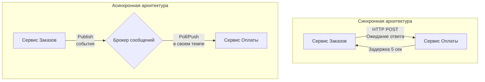

Введение в распределенные системы часто начинается с боли. Когда бэкенд-разработчик впервые выходит за рамки монолита и начинает строить микросервисы, его первый инстинкт — заменить вызовы локальных функций на синхронные HTTP или gRPC запросы. 

На первых порах это работает. Сервис `A` делает HTTP-вызов к сервису `B`, дожидается ответа и возвращает результат пользователю. Но по мере роста нагрузки, усложнения бизнес-логики и увеличения количества сервисов, эта иллюзия простоты рушится. Архитектура превращается в хрупкий карточный домик, где отказ одного узла вызывает каскадное падение всей системы.

В этом разделе мы разберем фундамент построения отказоустойчивых, масштабируемых HighLoad-систем — **асинхронное взаимодействие**. Мы пройдем путь от теории очередей до сурового продакшена с использованием Kafka, RabbitMQ, NATS и оркестраторов вроде Temporal. Но для начала давайте разберемся, почему синхронный мир так быстро перестает масштабироваться с инженерной точки зрения.

## Анатомия каскадного сбоя

Представим классическую синхронную цепочку: **API Gateway** $\rightarrow$ **Сервис Заказов** $\rightarrow$ **Сервис Склада** $\rightarrow$ **Сервис Оплаты**.

Если "Сервис Оплаты" внезапно начинает отвечать не за 50 мс, а за 5 секунд (например, из-за медленного ответа эквайринга или блокировки в БД), что происходит под капотом во всей этой цепочке?

> [!info] Под капотом
> **Смерть от исчерпания ресурсов (Resource Exhaustion)**
> В Go каждый входящий HTTP/gRPC запрос обычно обрабатывается в отдельной горутине. Горутина — это легковесный поток управления (структура `g` в рантайме Go), которая изначально занимает около 2 КБ памяти.
> 
> Когда "Сервис Оплаты" тормозит, горутины в "Сервисе Склада" и "Сервисе Заказов" блокируются в ожидании сетевого ответа. Рантайм Go паркует эти горутины в `netpoller` (в Linux это обертка над системным вызовом `epoll`). 
> 
> 1. **Память:** Количество заблокированных горутин начинает лавинообразно расти пропорционально входящему трафику (RPS). 100,000 зависших горутин — это уже гигабайты аллоцированной в куче памяти (учитывая переменные в стеке горутины, которые утекли в кучу из-за Escape Analysis).
> 2. **GC Pressure:** Сборщик мусора (GC) начинает задыхаться, пытаясь сканировать огромный граф живых объектов в памяти.
> 3. **Сетевые ресурсы:** Каждый ожидающий HTTP-запрос удерживает открытый файловый дескриптор (File Descriptor, FD) и TCP-сокет. В Linux лимит FD ограничен (ulimit), а количество эфемерных портов для исходящих соединений не бесконечно. Возникает проблема `port exhaustion`.
> 
> В итоге "Сервис Заказов", который был абсолютно здоров, падает по OOM (Out Of Memory) или начинает сыпать ошибками `too many open files`.

Синхронная архитектура создает жесткую связность (Coupling) по двум осям:
1. **Связанность во времени (Temporal Coupling):** Оба сервиса должны быть доступны в одну и ту же миллисекунду.
2. **Связанность в пространстве (Spatial Coupling):** Сервис `A` должен знать сетевой адрес (IP/DNS) сервиса `B`.

## Асинхронность как инструмент изоляции

Главная цель асинхронной архитектуры и использования брокеров сообщений — разорвать эти связи. Мы вводим промежуточное звено — **очередь (Queue)** или **лог (Log)**.

### Mechanical Sympathy: Буферизация нагрузки (Backpressure)

Посмотрим на асинхронность через призму железа. Процессор (CPU) работает на частоте в несколько гигагерц. Оперативная память работает медленнее. Диск — еще на порядки медленнее. Чтобы CPU не простаивал в ожидании данных, архитекторы железа придумали кэши (L1/L2/L3) и буферы. 

Брокер сообщений — это, по сути, огромный, распределенный по сети **буфер (L4 кэш системы)**, который позволяет сглаживать пики нагрузки (Spiky Load).

Если к вам внезапно придет в 10 раз больше пользователей (например, "Черная пятница"), синхронный сервис упадет, так как не сможет аллоцировать ресурсы CPU и RAM для мгновенной обработки всех запросов. В асинхронной системе "Сервис Заказов" просто сложит миллион сообщений в брокер. Это очень дешевая операция — быстрая сериализация (например, Protobuf) и асинхронная запись в TCP-сокет без ожидания бизнес-логики.

А "Сервис Оплаты" будет читать сообщения из брокера с той скоростью, с которой ему позволяет его БД или внешнее API. Это называется **Backpressure (Обратное давление)**. Брокер защищает консьюмера от перегрузки, так же как буферизованные каналы `chan` в Go защищают горутину-воркера от переполнения.

> [!tip] Собеседование
> **Вопрос:** Зачем нам RabbitMQ/Kafka, если в Go есть каналы (`chan`)? Почему не гонять данные между горутинами?
> **Ответ:** Каналы существуют только в оперативной памяти **одного процесса**. Если процесс (контейнер) упадет из-за `panic` или будет убит оркестратором (OOM-Killed в Kubernetes), все сообщения в канале будут безвозвратно потеряны. Брокеры сообщений обеспечивают **Durability** — данные сохраняются на диск и реплицируются между серверами. Брокер — это персистентный, распределенный канал.

## Изменение парадигмы: От Request-Driven к Event-Driven

Переход к асинхронности требует изменения ментальной модели инженера:

1. **Request-Driven (Команды):** "Сделай это прямо сейчас и скажи результат". Сервис-инициатор знает, *кто* должен выполнить работу. Это RPC-подход.
2. **Event-Driven (События):** "Произошел вот такой факт (Пользователь зарегистрировался). Кому интересно — реагируйте". Сервис-инициатор не знает и не должен знать, какие сервисы будут обрабатывать это событие (может только отправка email, а может еще и расчет скоринга + запись в Data Lake).

Это приводит нас к паттернам **Pub/Sub**, **Event Sourcing** и **CQRS**, которые мы будем глубоко разбирать в этом разделе.

> [!warning] Ловушка / Gotcha
> Асинхронность — не серебряная пуля. Она решает проблемы инфраструктурного масштабирования, но приносит колоссальные проблемы консистентности данных. 
> В асинхронном мире вы теряете распределенные транзакции ACID. Что если мы записали заказ в локальную PostgreSQL, но при отправке события в Kafka моргнула сеть? Возникает проблема Dual Write. На смену ACID приходит **Eventual Consistency** (согласованность в конечном счете) и паттерны вроде Outbox и Saga. 

## Что ждет нас в этом разделе?

Данный раздел спроектирован так, чтобы провести вас от базовой теории до настройки продакшен-решений. Вот карта нашего пути:

* **Фундамент асинхронности:** Начнем с базы. Разберем гарантии доставки (At-most/At-least/Exactly-once), стратегии ретраев, упорядочивание сообщений (Ordering) и концепцию [[8. Dead Letter Queue]]. Обязательно погрузимся в то, как сделать обработку идемпотентной.
* **Брокеры под капотом:** Мы не просто выучим API. Мы разберем внутреннюю архитектуру лидеров рынка.
    * [[1. RabbitMQ. Архитектура и концепции]]: Smart Broker / Dumb Consumer. Модель роутинга через Exchange.
    * [[1. Kafka. Архитектура и модель log based системы]]: Dumb Broker / Smart Consumer. Как Kafka использует `sendfile` (Zero-copy) и Page Cache ОС для достижения пропускной способности в миллионы сообщений в секунду.
    * [[1. NATS. Легковесный брокер]]: Когда нужна минимальная задержка (latency) и почему JetStream меняет правила игры.
* **Паттерны проектирования:** Как правильно выстроить архитектуру взаимодействия сервисов, чтобы не создать "распределенный монолит".
* **Оркестрация процессов:** Когда хореография событий превращается в хаос (Event Hell), на помощь приходят решения вроде Temporal. Разберем [[1. Что такое workflow orchestration]] и парадигму Durable Execution.
* **Практика на Go:** Напишем production-ready консьюмеры с Graceful Shutdown, настроим batch-процессинг и научимся тестировать асинхронные системы.

В следующей статье мы проведем четкую границу и разберем компромиссы двух подходов: [[2. Синхронное vs асинхронное взаимодействие]].