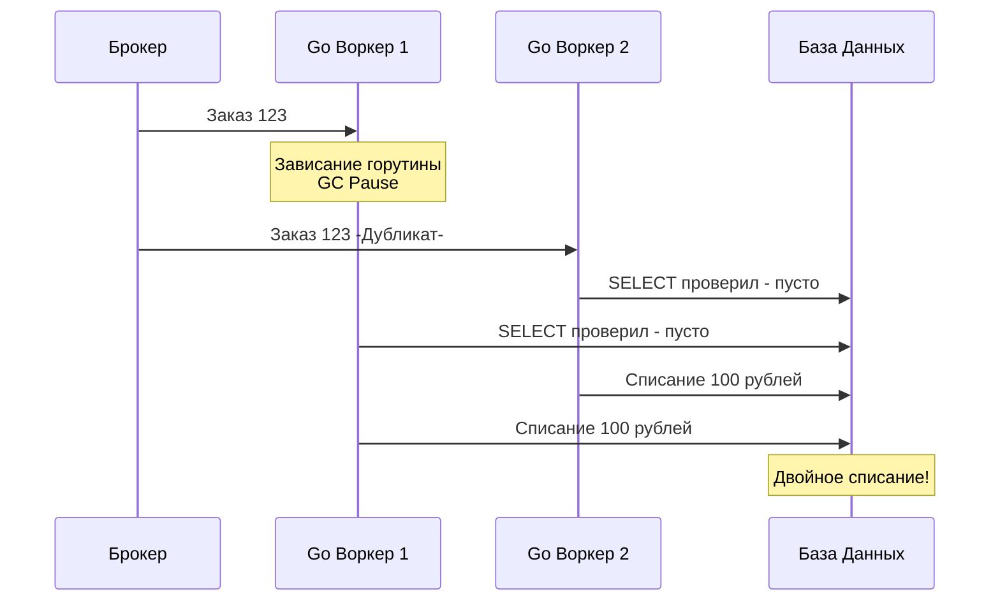

## Неизбежность двойника

На протяжении раздела "Фундамент асинхронности" мы шаг за шагом строили отказоустойчивую систему. Мы выбрали модель At-least-once ([[4. Модели доставки. At most once, at least once, exactly once]]), чтобы не терять данные. Мы добавили повторные попытки ([[9. Retry стратегии и exponential backoff]]), чтобы переживать падения базы данных. 

Но за эту надежность мы заплатили суровую цену: **наш консьюмер гарантированно будет получать дубликаты сообщений**.

Сеть может моргнуть *после* того, как вы списали деньги со счета, но *до* того, как ваш Go-сервис отправил `Ack` брокеру. Брокер решит, что вы упали, и пошлет это же сообщение о списании денег второму воркеру. Если ваша бизнес-логика просто выполнит `UPDATE balance = balance - 100`, клиент потеряет деньги, а вы — репутацию.

Единственный способ выжить в мире At-least-once — сделать все операции **идемпотентными**.

## Что такое Идемпотентность?

В математике идемпотентность — это свойство операции, при котором многократное применение функции дает тот же результат, что и однократное: $f(f(x)) = f(x)$.

В распределенных системах это означает: **обработка одного и того же сообщения 1, 2 или 100 раз приведет систему к одному и тому же конечному состоянию**.

### 1. Естественная идемпотентность (Natural Idempotency)
Некоторые операции идемпотентны по своей природе. 
* *Не идемпотентно:* Увеличить счетчик просмотров на 1 (`UPDATE views = views + 1`).
* *Идемпотентно:* Установить статус заказа в "Оплачен" (`UPDATE orders SET status = 'paid' WHERE id = 123`). Сколько бы раз вы ни выполняли этот запрос, статус останется 'paid'.

К сожалению, большинство бизнес-операций (списание средств, отправка email, создание новой сущности) естественно не идемпотентны. Их нужно делать такими искусственно.

## Механика дубликатов: Состояние гонки (Race Condition)

Самая большая ошибка при реализации идемпотентности — игнорирование параллелизма. 
Многие джуниоры пишут такой код:
1. `SELECT * FROM processed_messages WHERE msg_id = 123`
2. Если нашли $\rightarrow$ `return nil` (уже обработано).
3. Иначе $\rightarrow$ выполняем бизнес-логику.
4. `INSERT INTO processed_messages (msg_id) VALUES (123)`

> [!warning] Ловушка / Gotcha
> Этот код сломается при первой же серьезной нагрузке.
> В распределенной системе дубликат часто приходит *в тот же момент*, когда обрабатывается оригинал (например, из-за сетевого сплита, когда брокер думает, что первый консьюмер мертв, хотя он просто завис на долгой сборке мусора — GC Pause).
> Два ваших Go-воркера параллельно выполнят `SELECT`, оба увидят, что сообщения нет, оба выполнят бизнес-логику (спишут деньги) и оба попытаются сделать `INSERT`. 



## Паттерны реализации Идемпотентности

Чтобы избежать состояния гонки, проверка на дубликат и фиксация факта обработки должны быть **атомарными**.

### Паттерн 1: Idempotency Key и Уникальные Индексы (БД)

Это самый надежный способ. Продюсер (тот, кто отправляет сообщение) обязан сгенерировать уникальный идентификатор бизнес-операции — `Idempotency-Key` (часто это UUID), и передать его в заголовках (Headers) или теле сообщения.

Консьюмер использует этот ключ в связке с уникальными ограничениями (`UNIQUE CONSTRAINT`) базы данных.

**Идиоматичный Go и PostgreSQL (`ON CONFLICT`):**
Вместо связки SELECT + INSERT, мы заставляем саму СУБД разруливать параллельные запросы с помощью блокировок строк на уровне движка хранения.

```go
package consumer

import (
	"context"
	"database/sql"
	"fmt"
)

func ProcessPayment(ctx context.Context, db *sql.DB, msg Message) error {
	// Начинаем транзакцию
	tx, err := db.BeginTx(ctx, nil)
	if err != nil {
		return err
	}
	defer tx.Rollback()

	// 1. Атомарная проверка и блокировка ключа идемпотентности.
	// Если такой ключ уже есть, ON CONFLICT DO NOTHING вернет 0 затронутых строк.
	var id string
	err = tx.QueryRowContext(ctx, `
		INSERT INTO processed_events (idempotency_key, created_at)
		VALUES ($1, NOW())
		ON CONFLICT (idempotency_key) DO NOTHING
		RETURNING idempotency_key
	`, msg.IdempotencyKey).Scan(&id)

	if err != nil {
		if err == sql.ErrNoRows {
			// RETURNING ничего не вернул -> конфликт -> дубликат!
			// Мягко завершаем работу, возвращаем nil, чтобы брокер получил Ack
			return nil 
		}
		return fmt.Errorf("check idempotency: %w", err)
	}

	// 2. Безопасное выполнение бизнес-логики
	_, err = tx.ExecContext(ctx, `UPDATE balances SET amount = amount - $1 WHERE user_id = $2`, msg.Amount, msg.UserID)
	if err != nil {
		return fmt.Errorf("update balance: %w", err)
	}

	// 3. Коммит транзакции
	return tx.Commit()
}
```

> [!info] Под капотом: Транзакции и блокировки
> Когда два консьюмера одновременно пытаются сделать `INSERT ... ON CONFLICT`, база данных (PostgreSQL) захватывает блокировку (Row-level lock) на индекс. Один запрос проходит и записывает строку. Второй запрос блокируется на уровне ядра СУБД, ожидая завершения транзакции первого. Если первая транзакция успешна (Commit), второй запрос "просыпается", видит конфликт и возвращает 0 строк. Никакого состояния гонки на уровне приложения (Go) не возникает.

### Паттерн 2: Оптимистичные блокировки (Optimistic Concurrency Control)

Если вы используете Event Sourcing или обновляете сложный агрегат, вы можете опираться на версии записей.

Вместо `Idempotency-Key` сообщение содержит `ExpectedVersion`.
Ваш SQL-запрос выглядит так:
`UPDATE orders SET status = 'shipped', version = 3 WHERE id = 123 AND version = 2`

Затем в Go вы проверяете количество затронутых строк (`RowsAffected`). Если оно равно 0, это значит, что либо заказа нет, либо его версия уже изменилась (дубликат уже обработан). Это сверхбыстрый метод, не требующий создания дополнительных таблиц для ключей идемпотентности.

### Паттерн 3: Кэш (Redis SETNX)

Иногда бизнес-логика не требует транзакционной базы данных (например, отправка push-уведомлений). В таких случаях использовать PostgreSQL для дедупликации слишком "дорого" по ресурсам.

Используется Redis и атомарная команда `SETNX` (Set if Not eXists).

```go
// Псевдокод с использованием go-redis
acquired, err := redisClient.SetNX(ctx, "idemp_key:"+msg.ID, "processing", 24*time.Hour).Result()
if err != nil {
    return err // Сетевая ошибка Redis (Transient)
}
if !acquired {
    return nil // Дубликат, уже обрабатывается или обработан. Делаем Ack.
}

// Отправляем Push...
```

> [!warning] Ловушка / Gotcha
> Дедупликация через Redis не гарантирует строгую консистентность. 
> Что если консьюмер сделал `SETNX` в Redis, начал отправлять Push-уведомление через Firebase, и в этот момент его убил OOM Killer? 
> Брокер вернет сообщение в очередь (так как не было `Ack`). Другой консьюмер прочитает его, пойдет в Redis, увидит, что ключ занят, и отбросит сообщение как дубликат! Бизнес-логика так и не выполнится. 
> Поэтому для критичных данных (финансы, заказы) Idempotency Key **обязан** лежать в той же транзакционной базе данных, что и обновляемые бизнес-сущности.

## Идемпотентность и внешние API

Самый сложный сценарий на собеседованиях уровня Senior: ваш Go-сервис читает из RabbitMQ и должен сделать вызов к внешнему платежному шлюзу (например, Stripe) по HTTP. Вы не можете открыть транзакцию в Stripe и откатить её!

**Решение:** Вы обязаны пробрасывать (pass-through) ваш `Idempotency-Key` во внешнюю систему. 
Все современные платежные системы поддерживают HTTP-заголовок `Idempotency-Key`. Если вы вызовете API Stripe дважды с одним ключом, Stripe сам дедуплицирует запрос на своей стороне и вернет вам закэшированный успешный ответ от первой попытки.

> [!tip] Собеседование
> **Вопрос:** Если мы используем `Idempotency-Key` при каждом вызове Консьюмера, зачем нам вообще таблица для ключей в нашей БД? Почему нельзя просто надеяться на базу брокера или внешний API?
> **Ответ:** Брокер (как RabbitMQ) удаляет сообщение после `Ack`, он не хранит историю. Если из-за сбоя внешней системы (двойная публикация) Продюсер отправит два одинаковых сообщения с одним ключом идемпотентности (с интервалом в час), они оба придут к нам как новые. Только наша БД с `UNIQUE` индексом по ключу идемпотентности способна защитить систему от двойной обработки на длинной дистанции.

## Итог раздела

Этой статьей мы закрываем фундаментальный блок по архитектуре асинхронных систем. Мы поняли, что распределенные системы полны компромиссов:
1. За масштабируемость мы платим отказом от строгих транзакций.
2. За гарантированную доставку (At-least-once) мы платим необходимостью обрабатывать дубликаты.
3. За скорость обработки (Parallelism) мы платим отказом от строгого порядка (Partial Ordering).
4. За защиту от перегрузки мы платим настройкой Backpressure и DLQ.

Теперь, когда у нас есть прочная теоретическая база и понимание паттернов, мы готовы спуститься на уровень конкретных инструментов. В следующей статье мы начнем глубокое погружение в первый из них, разобрав его внутреннее устройство, обменники (Exchanges) и маршрутизацию: [[1. RabbitMQ. Архитектура и концепции]].