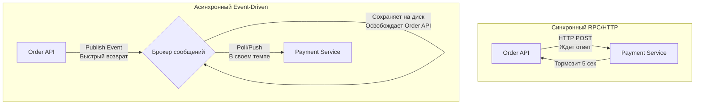

## Иллюзия локального вызова

Когда мы переходим от монолита к распределенной системе, самый большой соблазн — использовать gRPC или HTTP REST так же, как мы вызывали функции в пределах одного бинарника. Это интуитивно понятно: мы отправляем запрос (Request), дожидаемся выполнения логики на другой стороне и получаем ответ (Response). 

Такая модель называется **синхронным взаимодействием**. И до определенного предела (в терминах RPS и количества узлов) она работает отлично. Однако сеть — это не шина CPU. Сеть ненадежна, обладает непредсказуемой задержкой (latency) и подвержена разрывам (пакетам-сиротам, таймаутам).

В этой статье мы препарируем синхронный и асинхронный подходы, чтобы понять, как они влияют на рантайм Go, потребление ресурсов и общую стабильность системы.

## Синхронное взаимодействие под капотом Go

В Go синхронный сетевой вызов (будь то `net/http` клиент или gRPC-stub) спроектирован так, чтобы выглядеть блокирующим для разработчика, но быть неблокирующим для потока ОС.

```go
// Пример типичного синхронного вызова
func fetchUser(ctx context.Context, client *http.Client, userID string) (*User, error) {
    req, err := http.NewRequestWithContext(ctx, http.MethodGet, "http://user-service/api/v1/users/"+userID, nil)
    if err != nil {
        return nil, fmt.Errorf("build request: %w", err)
    }

    // Горутина "зависнет" здесь, ожидая сетевого ответа
    resp, err := client.Do(req)
    if err != nil {
        return nil, fmt.Errorf("execute request: %w", err)
    }
    defer resp.Body.Close()

    // ... парсинг ответа
}
```

Что физически происходит в рантайме Go на строке `client.Do(req)`?

1. Данные сериализуются и передаются в системный вызов ядра ОС (например, `write` в сокет).
2. Вызывается чтение из сокета (`read`). Так как данных от удаленного сервиса еще нет (сокет пуст), системный вызов вернул бы `EAGAIN` (попробовать позже).
3. Чтобы не блокировать дорогой поток ОС (структура `m`), планировщик Go отрывает текущую горутину (структуру `g`) от потока `m` и паркует её в **netpoll** (сетевой поллер, абстракция над `epoll` в Linux или `kqueue` в macOS).
4. Поток `m` берет из локальной очереди процессора (структура `p`) следующую готовую горутину и продолжает работу.
5. Когда ядро ОС получает пакеты от `user-service`, оно сигнализирует `epoll`. Рантайм Go (в частности, фоновый поток `sysmon` или другие рабочие потоки) замечает это, достает запаркованную `g` из `netpoll` и возвращает её в очередь `p` на выполнение.

> [!info] Под капотом: GC Pressure и утечки памяти
> Хотя парковка горутины в `netpoll` освобождает CPU, она **не освобождает память**. 
> Каждая запаркованная `g` удерживает свой стек (минимум 2 КБ). Если удаленный сервис начал тормозить, и у вас скопилось 100,000 ожидающих запросов, это минимум 200 МБ только на стеки. 
> Но хуже другое: все переменные, на которые ссылается эта горутина (включая те, что попали в кучу через Escape Analysis), остаются "живыми" (live objects). Когда просыпается Garbage Collector (Сборщик мусора), фаза **Mark** (пометка живых объектов) начинает занимать критически много времени, так как GC вынужден сканировать десятки тысяч приостановленных стеков и огромный граф объектов в куче. В итоге приложение начинает тратить процессорное время не на полезную работу, а на обслуживание сборщика мусора (GC CPU fraction улетает в небеса).

### Проблемы синхронного подхода

1. **Временная связность (Temporal Coupling):** Оба сервиса должны быть доступны в одну и ту же секунду. Упал один — упала бизнес-транзакция.
2. **Каскадные сбои:** Тормозящий сервис "А" заставит исчерпать лимиты подключений и памяти в сервисе "Б", который его вызывает.
3. **Ограниченная пропускная способность (Throughput):** Скорость обработки запроса равна сумме задержек всех сервисов в цепочке вызовов.

## Асинхронное взаимодействие: Разделяй и властвуй

Асинхронность вводит в архитектуру независимого посредника — **Брокер сообщений** (Message Broker) или **Очередь** (Queue). 

Теперь сервис-отправитель (Producer) не вызывает сервис-получатель (Consumer) напрямую. Он отправляет "событие" (Event) или "команду" (Command) в брокер и немедленно продолжает свою работу.



### Как это меняет работу с железом (Mechanical Sympathy)

Вместо ожидания ответа по сети, отправка сообщения в брокер — это сверхбыстрая операция. Producer устанавливает постоянное (keep-alive) TCP-соединение с брокером (например, RabbitMQ или Kafka). 
При публикации сообщения (Publish), мы просто пишем батч байт в буфер сокета. Если мы не требуем синхронного подтверждения записи на диск от всех реплик брокера прямо сейчас (настройка `acks=0` или `acks=1` в Kafka), вызов завершается за микросекунды. 

Горутина в Go не "висит" в `netpoll`. Она мгновенно освобождается, отправляет HTTP-ответ пользователю "Заказ принят в обработку" и завершается. GC счастлив — короткоживущие объекты быстро помечаются как мусор и очищаются.

> [!warning] Ловушка / Gotcha
> Переход на асинхронность ломает привычный паттерн транзакционности. 
> В синхронном мире, если gRPC вызов вернул ошибку, вы можете сделать `tx.Rollback()` в базе. В асинхронном мире вы не знаете, обработается ли сообщение успешно. Более того, запись в локальную БД и отправка сообщения в брокер — это **две разные распределенные системы**. Если БД закоммитила транзакцию, а сеть до брокера моргнула, вы потеряли бизнес-событие. Это решается паттернами вроде Transactional Outbox.

### Преимущества асинхронности

1. **Изоляция сбоев:** Если `Payment Service` упал, `Order API` этого даже не заметит. Заказы продолжат приниматься и складываться в брокер. Когда `Payment Service` поднимется, он просто дочитает накопившиеся сообщения.
2. **Амортизация нагрузки ([[6. Backpressure и контроль нагрузки]]):** Брокер выступает гигантским буфером (амортизатором). При скачке трафика в 10 раз очередь просто станет длиннее, но консьюмеры продолжат разгребать её с той максимальной скоростью, на которую способны (ограничиваясь, например, пулом подключений к своей БД). Никто не падает по OOM.
3. **Расширяемость:** Чтобы добавить новый функционал (например, отправку SMS при заказе), вам не нужно менять код `Order API`. Вы просто пишете новый сервис, который подписывается на тот же топик с событиями.

> [!tip] Собеседование
> **Вопрос:** Если асинхронность так хороша, почему мы не делаем вообще всё через брокеры сообщений (Kafka/RabbitMQ)?
> **Ответ:** За всё нужно платить. Асинхронность приносит сложнейшую проблему — **Eventual Consistency** (согласованность в конечном счете). Пользователь хочет видеть результат своего действия "здесь и сейчас", а не обновлять страницу в ожидании, пока воркеры разгребут очередь. Кроме того, брокер — это сложный инфраструктурный компонент, который тоже может упасть, добавить задержку (latency) и требует серьезного мониторинга. 
> *Правило буравчика:* Синхронные вызовы — для чтения данных (Queries). Асинхронные — для изменения состояния (Commands/Events), где немедленный ответ не критичен.

## Резюме: Синхронно или Асинхронно?

| Критерий | Синхронный подход (HTTP, gRPC) | Асинхронный подход (Очереди, Брокеры) |
| :--- | :--- | :--- |
| **Связанность** | Жесткая (Temporal & Spatial) | Слабая (Декоплинг) |
| **Масштабирование** | Ограничено самым медленным узлом | Отличное (сообщения буферизируются) |
| **Сложность отладки** | Низкая (Trace ID передается по цепочке) | Высокая (Асинхронные графы выполнения) |
| **Модель консистентности** | Строгая (ACID в пределах сессии) | Eventual Consistency |
| **Рантайм Go** | Риск исчерпания памяти и давления на GC из-за парковки тысяч горутин | Короткий цикл жизни горутин, предсказуемое поведение GC |

Асинхронное взаимодействие — это фундамент отказоустойчивых HighLoad систем. И чтобы строить такие системы, нам необходимо детально разобраться в том, какие виды брокеров существуют и какие гарантии они нам дают. В следующей статье мы рассмотрим ядро асинхронной архитектуры: [[3. Очереди сообщений. Зачем они нужны]].