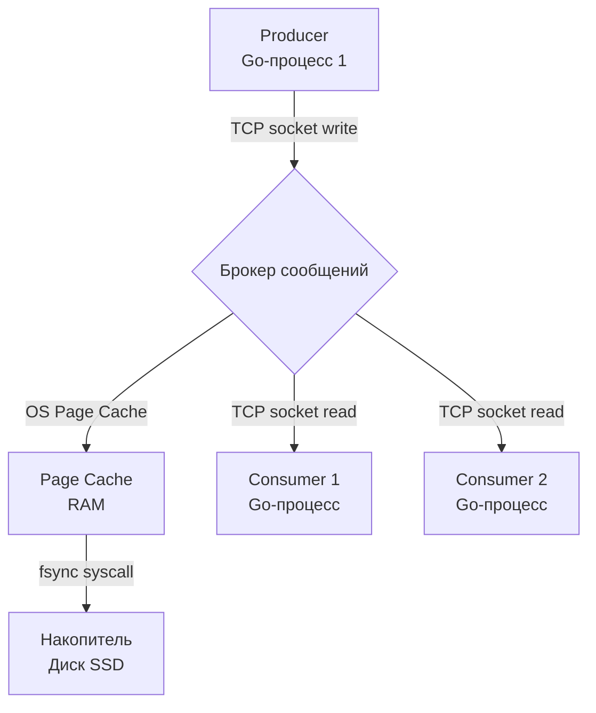

В прошлой статье мы разобрали фундаментальные отличия синхронного взаимодействия от асинхронного. Мы выяснили, что асинхронность снимает блокировки с горутин, защищает сборщик мусора от лавины короткоживущих объектов и спасает систему от каскадных сбоев. Но этот переход требует внедрения нового архитектурного компонента — **очереди сообщений** (Message Queue) или **брокера сообщений** (Message Broker).

Многие разработчики, приходящие в Go из других языков, задают вполне логичный вопрос: *«Зачем мне тащить в инфраструктуру тяжелый RabbitMQ или Kafka, если в Go есть встроенные каналы (`chan`)? Разве я не могу просто передавать задачи между горутинами?»*

Чтобы ответить на этот вопрос на уровне Senior-инженера, нам нужно заглянуть под капот как самого языка Go, так и операционной системы.

## Анатомия очереди: от `chan` к Брокеру

Любая очередь по своей сути — это структура данных, реализующая принцип **FIFO** (First In, First Out). 

> [!info] Под капотом: Как устроен Go Channel
> Когда вы пишете `make(chan Task, 100)`, рантайм Go аллоцирует в куче структуру `hchan` (можно найти в `runtime/chan.go`). 
> 
> Основные поля `hchan`:
> - `buf`: указатель на кольцевой буфер (ring buffer), где физически лежат ваши данные.
> - `qcount` и `dataqsiz`: текущее количество элементов и размер буфера.
> - `sendq` и `recvq`: очереди ожидания. Это двусвязные списки запаркованных горутин (структуры `sudog`, оборачивающие `g`), которые ждут возможности записать или прочитать данные.
> - `lock`: обычный `mutex`, который блокируется при каждой операции записи или чтения для защиты буфера от состояния гонки (Data Race) между системными потоками (`m`).
>
> Это невероятно эффективный механизм для синхронизации в памяти **одного процесса**. Передача данных занимает десятки наносекунд, так как это просто копирование памяти под мьютексом.

**Почему `hchan` не подходит для распределенных систем?**

1. **Волатильность (Отсутствие Durability):** Если ваш под в Kubernetes будет убит из-за OOM (Out Of Memory) или упадет с `panic`, структура `hchan` исчезнет из оперативной памяти навсегда. Все задачи, которые находились в кольцевом буфере, будут безвозвратно потеряны.
2. **Локальность:** Каналы не умеют передавать данные по сети (TCP/UDP).
3. **Отсутствие гарантий доставки:** Вы не можете зафиксировать факт успешной обработки (Acknowledgement). Если горутина-воркер забрала задачу из канала и упала в процессе её выполнения, задача пропадает.

Поэтому нам нужен **выделенный инфраструктурный компонент** — брокер сообщений. Это процесс (или кластер процессов), запущенный на отдельном сервере, который берет на себя роль того самого `hchan`, но добавляет к нему сеть, персистентность (запись на диск) и сложную логику маршрутизации.

## Главные функции брокеров сообщений (Зачем они нужны?)

Брокеры сообщений решают три фундаментальные задачи масштабирования бэкенда.

### 1. Буферизация и сглаживание пиков (Shock Absorber)
В реальном мире нагрузка никогда не бывает равномерной. Бывают рекламные пуши, DDoS-атаки, «Черные пятницы». 

Если консьюмеры (воркеры, пишущие в БД) способны обрабатывать 1000 RPS, а к вам пришел пик в 5000 RPS, синхронная система ляжет. Брокер сообщений выступает в роли «амортизатора». Он принимает все 5000 RPS, быстро отвечает продюсерам «принято», и складирует сообщения. Консьюмеры продолжают спокойно вытягивать задачи со скоростью 1000 RPS, не перегружая базу данных. Очередь будет расти, но система останется стабильной.

### 2. Гарантия доставки (Reliability & Acknowledgement)
Брокеры предоставляют механизм подтверждения (Ack / Nack). Когда консьюмер (ваш Go-сервис) читает сообщение из брокера, брокер не удаляет его сразу. Он помечает его как «в обработке» (unacknowledged).

Если ваш Go-сервис завершит обработку без ошибок, он отправит по сети `Ack` — и только тогда брокер удалит сообщение. Если сервис упал (TCP-соединение разорвалось) или вернул `Nack` (ошибка бизнес-логики), брокер автоматически вернет сообщение в очередь и отдаст его другому воркеру. Это гарантирует, что задача не потеряется.

### 3. Декоплинг (Decoupling) и независимое масштабирование
Вы можете масштабировать продюсеров и консьюмеров независимо. Если очередь начинает расти (консьюмеры не справляются), вы просто поднимаете в K8s еще 5 реплик пода с воркерами. Брокер сам распределит нагрузку между ними (паттерн Competing Consumers). Продюсеры об этом даже не узнают.

## Mechanical Sympathy: Память vs Диск

> [!warning] Ловушка / Gotcha
> Одно из самых частых заблуждений на Middle-собеседованиях: «Брокеры работают медленнее синхронного HTTP, потому что им нужно писать на медленный жесткий диск». 

Да, запись на диск с использованием системного вызова (например, `write` с последующим `fsync`) на порядки медленнее записи в оперативную память. Но современные брокеры (особенно Kafka) обходят эту проблему с помощью глубокого понимания архитектуры ОС Linux.

**Как достигается сверхвысокая пропускная способность:**
1. **OS Page Cache (Кэш страниц):** При отправке сообщения брокер не пишет его сразу на физический диск. Он пишет его в кэш страниц ОС (оперативная память, которой управляет ядро Linux). Для брокера эта операция происходит со скоростью RAM. Ядро Linux само, в фоновом режиме, скидывает (flush) эти грязные страницы на диск.
2. **Sequential I/O (Последовательное чтение-запись):** HDD и SSD работают медленно при *случайном* (Random I/O) доступе. Но брокеры (лог-базированные, как Kafka) пишут сообщения строго последовательно, добавляя их в конец файла (Append-only). Скорость последовательной записи на современные NVMe SSD достигает нескольких гигабайт в секунду, что превышает пропускную способность гигабитной сети!
3. **Zero-Copy (syscall sendfile):** Когда консьюмер запрашивает данные, брокер просит ядро ОС отправить данные из Page Cache напрямую в сетевой сокет консьюмера, вообще не копируя их в User Space брокера (минуя CPU и лишние аллокации).

> [!tip] Собеседование
> **Вопрос:** Если очередь RabbitMQ находится в оперативной памяти (без флага durable), чем она принципиально отличается от буферизованного Go-канала большого размера?
> **Ответ:** Во-первых, сетевым оверхедом (сериализация, TCP-пакеты, системные вызовы для I/O). Во-вторых, гарантиями отчуждаемости. Если упадет ваш сервис с Go-каналом, сообщения исчезнут. Если упадет ваш сервис-консьюмер, подключенный к RabbitMQ, сообщения останутся в брокере. В-третьих, возможностью подключать множество независимых консьюмеров и использовать сложные роутинги (Exchanges), что канал не поддерживает из коробки.

## Итог

Очередь сообщений — это не просто хранилище. Это **архитектурный балансир**. Она:
* Развязывает узлы системы в пространстве (сервисам не нужно знать IP друг друга) и во времени (им не нужно работать одновременно).
* Защищает слабую сторону (медленную базу данных) от мощной (высокого RPS на входе).
* Предоставляет строгие контракты надежности через механизмы `Ack/Nack`.

Однако, введение брокера порождает новый класс сложных инженерных проблем. Как именно брокер доставит сообщение? Отдаст ли он его строго одному воркеру? Что если сеть мигнет, и воркер обработает одно и то же сообщение дважды?

Все эти вопросы сводятся к фундаментальным математическим ограничениям распределенных систем, которые мы детально разберем в следующей статье: [[4. Модели доставки. At most once, at least once, exactly once]].