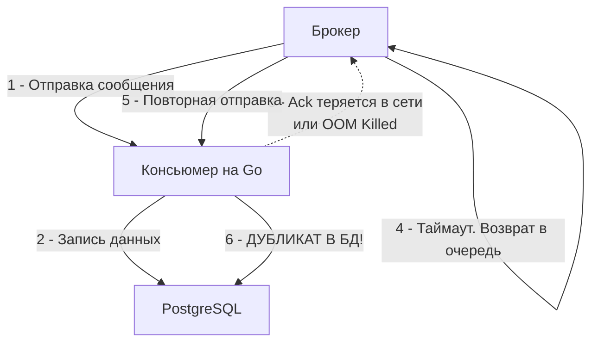

В предыдущих статьях мы установили, что асинхронное взаимодействие решает проблемы блокировок и масштабирования. Брокер берет на себя роль буфера и маршрутизатора. Но сеть — это агрессивная среда. TCP-пакеты теряются, роутеры перезагружаются, а процессы-консьюмеры падают с OOM (Out Of Memory) или `panic` прямо посреди выполнения бизнес-логики.

В таких условиях возникает главный вопрос распределенных систем: **как гарантировать, что сообщение дойдет от продюсера к консьюмеру и будет корректно обработано?** Ответ кроется в моделях доставки (Delivery Semantics). Их всего три, и выбор одной из них — это всегда компромисс между производительностью (throughput/latency) и надежностью.

## Почему доставка сообщений — это сложно?

Прежде чем разбирать модели, давайте вспомним «Задачу двух генералов» (Two Generals' Problem) — классический мысленный эксперимент, доказывающий, что в сети с ненадежным каналом связи невозможно достичь 100% консенсуса.

Когда ваш Go-сервис (Продюсер) отправляет данные в Брокер, или когда Брокер отправляет данные Консьюмеру, операция может завершиться тремя способами:
1. **Успех:** Пакет дошел, обработался, подтверждение (`Ack`) вернулось.
2. **Отказ (Failure):** Соединение было явно разорвано (например, `RST` пакет от TCP), мы точно знаем, что данные не доставлены.
3. **Таймаут (Неизвестность):** Самый страшный сценарий. Мы отправили пакет и ничего не получили в ответ. Мы не знаем, что произошло:
   * Запрос потерялся по пути к брокеру?
   * Брокер сохранил сообщение, но ответный `Ack` потерялся по пути к нам?
   * Брокер завис на сборке мусора (GC Pause) и ответит позже?

Именно из-за «Неизвестности» нам приходится выбирать, как вести себя при таймаутах.

---

## 1. At-most-once (Не более одного раза)

**Суть:** Fire and forget (Выстрелил и забыл). Сообщение будет доставлено либо один раз, либо ни разу. Дубликаты исключены, но возможна потеря данных.

**Как это работает:**
* **Продюсер:** Отправляет сообщение в TCP-сокет и не ждет подтверждения от брокера (например, `acks=0` в Kafka).
* **Консьюмер:** Читает сообщение из брокера, брокер **мгновенно** удаляет его (или сдвигает оффсет), не дожидаясь, пока консьюмер закончит бизнес-логику (Auto-Ack).

> [!info] Под капотом
> С инженерной точки зрения это самый быстрый сценарий. Нет необходимости делать дорогие системные вызовы `fsync` для синхронной записи на диск. Нет сетевого оверхеда на ожидание Ack-пакетов. CPU и сеть используются максимально эффективно. Пропускная способность может достигать миллионов сообщений в секунду на одном узле.

**Где применять:**
Сбор метрик, некритичные логи, стриминг телеметрии (IoT), где потеря 0.1% данных не исказит общую картину, а скорость важнее точности.

---

## 2. At-least-once (Не менее одного раза) — Индустриальный стандарт

**Суть:** Гарантированная доставка. Мы обещаем, что сообщение точно не потеряется, но в случае сбоев оно может быть доставлено 2, 3 или 10 раз.

Это стандартная модель работы по умолчанию для RabbitMQ, NATS JetStream и Kafka.

**Как это работает:**
1. Продюсер отправляет сообщение и ждет `Ack` от брокера. Если таймаут — продюсер отправляет сообщение заново (ретрай).
2. Брокер отдает сообщение Консьюмеру, но **не удаляет его**. Сообщение помечается как «в полете» (in-flight / unacknowledged).
3. Консьюмер выполняет бизнес-логику (например, пишет в базу данных).
4. Только после успешного коммита в БД, Консьюмер отправляет `Ack` брокеру.
5. Брокер физически удаляет сообщение.

**Анатомия дубликата:**
Проблема возникает на шаге 4. Что если сеть моргнет *сразу после* коммита в базу, но *до* отправки `Ack` брокеру?



Брокер не получил `Ack` за отведенное время (timeout). Он решает, что консьюмер умер, возвращает сообщение в очередь и отдает его другому (или этому же) воркеру. Бизнес-логика выполняется во второй раз.

> [!warning] Ловушка / Gotcha
> Вы не можете использовать At-least-once доставку без проектирования **Идемпотентных** консьюмеров. Если ваше сообщение — это «Добавить 100 рублей на счет», дубликат приведет к финансовым потерям. Ваша система обязана уметь распознавать уже обработанные сообщения. Мы детально разберем это в статье [[10. Idempotency в message processing]].

---

## 3. Exactly-once (Ровно один раз) — Святой Грааль

**Суть:** Каждое сообщение доставляется и обрабатывается строго один раз. Никаких потерь, никаких дубликатов.

**Горькая правда:** Математически доказуемо, что в чистом виде Exactly-once в распределенной системе невозможен из-за Задачи двух генералов. То, что вендоры (например, Kafka) называют Exactly-once — это на самом деле **Effectively-once** (Эффективно один раз). 

Это симуляция "ровно одного раза", построенная поверх модели "At-least-once" с использованием дедупликации на стороне инфраструктуры.

### Как достигается Effectively-once?

Для полноценного Exactly-once необходимо защитить два участка сети:

**Участок 1: Продюсер -> Брокер (Идемпотентный Продюсер)**
Если Продюсер не получил `Ack` от брокера и делает ретрай, брокер должен понять, что это не новое сообщение, а копия старого.
В Kafka это решается так: продюсеру при старте выдается `ProducerID`. Каждому сообщению присваивается `SequenceNumber` (0, 1, 2...). Брокер хранит у себя в памяти последний `SequenceNumber` для каждого `ProducerID`. Если приходит пакет с уже виденным номером — брокер принимает его, отвечает `Ack`, но не записывает в лог (дедуплицирует).

**Участок 2: Консьюмер -> База данных (Транзакционность)**
Если Консьюмер прочитал сообщение, изменил состояние в БД, но не успел сдвинуть оффсет в брокере, при рестарте он прочитает его снова.
Для решения этого используют:
1. **Распределенные транзакции (2PC):** Kafka Transactions позволяет атомарно записывать данные в выходной топик и коммитить оффсет входного топика. (Подробнее в [[6. Exactly once в Kafka]]).
2. **Хранение оффсетов в самой БД:** Вы в одной транзакции PostgreSQL обновляете баланс пользователя и записываете ID обработанного сообщения (паттерн Outbox / Inbox).

> [!tip] Собеседование
> **Вопрос:** Мы настроили Exactly-once семантику в Kafka (transactions = true, idenpotent producer = true). Значит ли это, что теперь наш HTTP API может без проблем дергать внешнюю платежную систему (Stripe/PayPal)?
> **Ответ:** Нет! Гарантии Exactly-once в Kafka работают **только внутри экосистемы Kafka** (прочитал из топика A $\rightarrow$ записал в топик B). Как только ваш консьюмер делает побочный эффект (side-effect) во внешний мир (HTTP-запрос, запись в Redis, отправка Email) — вы выпадаете из транзакционного контекста брокера. Внешний HTTP вызов может отвалиться по таймауту, и вы снова возвращаетесь в реальность At-least-once.

## Памятка по реализации в Go

Правильная обработка сообщений (At-least-once) на Go требует строгого соблюдения порядка действий и грамотной обработки ошибок.

```go
// Пример идиоматичного консьюмера (псевдокод, применимо к RabbitMQ/NATS)
func handleMessage(ctx context.Context, msg Message) {
    // 1. Десериализация (если ошибка - это Poison Message)
    var data OrderEvent
    if err := json.Unmarshal(msg.Body, &data); err != nil {
        // Логируем, отправляем в Dead Letter Queue (DLQ)
        msg.Nack(false) // false = не возвращать в основную очередь
        return
    }

    // 2. Выполнение бизнес-логики (БД, API)
    err := processOrder(ctx, data)
    if err != nil {
        if errors.Is(err, ErrTransient) {
            // Временная ошибка (Таймаут БД). Возвращаем в очередь (Retry)
            msg.Nack(true) 
        } else {
            // Фатальная ошибка (Бизнес-валидация не пройдена). В DLQ.
            msg.Nack(false)
        }
        return
    }

    // 3. Строго после УСПЕШНОГО завершения всех сайд-эффектов!
    msg.Ack()
}
```

## Итог

1. **At-most-once:** Максимальная скорость. Окно для потери данных открыто настежь.
2. **At-least-once:** Стандарт индустрии. Нет потери данных, но система должна быть готова к дубликатам.
3. **Exactly-once:** Иллюзия, достигаемая за счет жесткой транзакционности инфраструктуры и сильного падения производительности (из-за `fsync` и координации). Применима только внутри замкнутых систем (например, Kafka Streams).

Выбирая модель доставки, вы выбираете, какую инженерную проблему вы готовы решать. Но доставка — это лишь половина дела. Вторая фундаментальная проблема брокеров — это порядок, в котором сообщения приходят. В следующей статье мы разберем, почему строгая очередность убивает масштабирование: [[5. Ordering сообщений и его цена]].