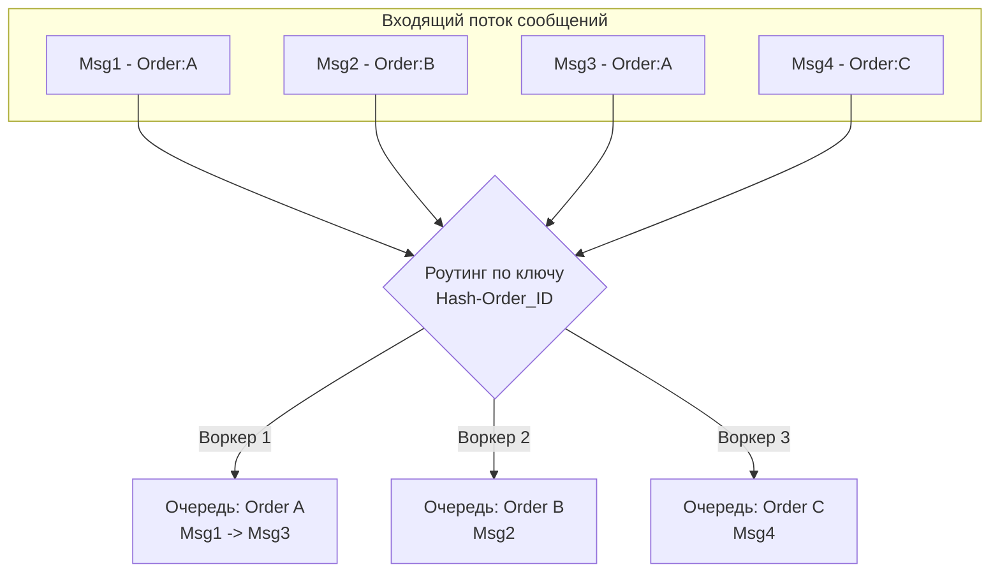

## Парадокс порядка в распределенных системах

В монолитном приложении с одной базой данных (например, PostgreSQL) порядок событий гарантируется транзакциями и блокировками строк. Если пользователь нажал кнопку «Купить», а затем «Отменить», эти два запроса выстроятся в очередь на уровне СУБД, и итоговое состояние будет консистентным.

Переходя на асинхронную архитектуру с брокерами сообщений, разработчики часто требуют того же: *«События должны обрабатываться строго в том порядке, в котором они произошли!»* Это логичное бизнес-требование является одним из самых разрушительных антипаттернов в проектировании HighLoad-систем. Строгий порядок (Strict Ordering) фундаментально противоречит идеям параллелизма, масштабируемости и отказоустойчивости.

В этой статье мы разберем, почему порядок стоит так дорого, как возникает Head-of-Line Blocking, и как лидеры рынка (Kafka и RabbitMQ) решают эту проблему через компромисс **Partial Ordering** (частичного порядка).

## Цена порядка: Head-of-Line Blocking и смерть конкурентности

Представьте классическую очередь (FIFO — First In, First Out). У вас есть 3 события для одного заказа:
1. `OrderCreated`
2. `PaymentProcessed`
3. `OrderShipped`

Если мы хотим гарантировать строгий порядок обработки (**Total/Global Ordering**), мы обязаны соблюдать два правила:
1. Очередь должна иметь только **одного консьюмера** (или один активный поток).
2. Если при обработке события 1 произошла временная ошибка (моргнула сеть к БД), мы **не имеем права** переходить к событию 2. Мы обязаны ретраить событие 1 до победного конца.

> [!info] Под капотом: Потеря Mechanical Sympathy
> Что это значит на уровне железа и рантайма Go?
> Вы разворачиваете мощный сервер на 64 ядра CPU. Ваш Go-рантайм инициализирует 64 потока операционной системы (`m`), готовых параллельно исполнять тысячи горутин (`g`). 
> Но из-за требования Global Ordering, вы запускаете консьюмер в **один поток** (одну горутину). 63 ядра вашего процессора простаивают. Кэши L1/L2 недоиспользуются. 
> 
> Более того, возникает **Head-of-Line Blocking (HOL)** — блокировка начала очереди. Если `OrderCreated` для Заказа №1 завис на таймауте базы данных на 5 секунд, то Заказ №2, Заказ №3 и Заказ №1000 будут покорно ждать эти 5 секунд, даже если они физически никак не связаны с Заказом №1 и могли бы быть обработаны прямо сейчас.

В итоге пропускная способность (Throughput) вашей системы падает до скорости обработки самого медленного сообщения. Это катастрофа для микросервисов.

## Total Order vs Partial Order

Индустрия решила эту проблему, отказавшись от тотального порядка в пользу **частичного порядка (Partial Order)**, или упорядочивания по ключу (Order by Key).

Нам не важно, в каком порядке обработаются события Заказа №1 и Заказа №2. Они независимы. Нам важно, чтобы события *внутри* Заказа №1 шли строго друг за другом.

Ключ маршрутизации (Routing Key / Partition Key) — это тот самый идентификатор сущности (например, `order_id` или `user_id`), в рамках которого мы требуем гарантий порядка.



Разберем, как этот паттерн реализован в главных брокерах.

### Подход Kafka: Партицирование (Partitioning)

Apache Kafka изначально спроектирована вокруг идеи частичного порядка. В Kafka тема (Topic) делится на шарды — **Партиции (Partitions)**. 

* Kafka гарантирует строгий порядок сообщений **только внутри одной партиции**. 
* Когда Продюсер отправляет сообщение, он указывает `Key` (например, `order_id`). Kafka берет хэш от ключа (например, `MurmurHash2(key) % num_partitions`) и всегда отправляет сообщения с одинаковым ключом в одну и ту же партицию.
* Консьюмер-группа (Consumer Group) в Kafka работает так: одна партиция всегда читается строго **одним консьюмером** (одним процессом/потоком).

Результат: События Заказа А всегда попадают в Партицию 0. События Заказа Б — в Партицию 1. Вы можете запустить 100 консьюмеров (если у вас 100 партиций), получить огромный параллелизм, но при этом события конкретного заказа никогда не обгонят друг друга. Это мы подробно разберем в [[5. Ordering и partitioning]].

### Подход RabbitMQ: Consistent Hashing Exchange

В классическом RabbitMQ очередь — это единая структура данных. Если вы подключите 5 воркеров к одной очереди, RabbitMQ начнет отдавать им сообщения по кругу (Round-Robin). Это полностью **разрушает порядок**. Воркер 1 получит `OrderCreated`, а Воркер 2 в ту же микросекунду получит `OrderShipped` и может обработать его быстрее первого!

Чтобы получить аналог партиций Kafka в RabbitMQ, используют плагин `Consistent Hash Exchange`. Он хэширует `Routing Key` сообщения и распределяет сообщения по заранее созданным *разным* очередям. К каждой такой очереди подключается строго один эксклюзивный консьюмер.

> [!warning] Ловушка / Gotcha: Изменение количества партиций
> Хэш-функция жестко привязана к количеству партиций (или очередей). Если у вас было 10 партиций, события `order_id=55` летели в партицию 3. Если вы решили отмасштабироваться и увеличили число партиций до 20, хэш `order_id=55` изменится, и новые события полетят в партицию 14. 
> 
> В этот момент гарантия порядка ломается: консьюмер партиции 14 может прочитать новое событие быстрее, чем консьюмер партиции 3 дочитает старые. Поэтому изменение числа партиций в системах со строгим Ordering — это сложнейшая миграционная процедура.

## Идиоматичный Go: Конкурентная обработка с сохранением порядка

Допустим, вы читаете одну партицию Kafka (или одну очередь RabbitMQ) в одном Go-приложении. Партиция гарантирует порядок на уровне брокера. Но как только вы вызываете в Go `go handle(msg)` для каждого сообщения, **вы ломаете порядок на уровне рантайма!**

Планировщик Go (`runtime.scheduler`) не гарантирует порядок выполнения горутин. Горутина с событием 2 может быть выполнена до горутины с событием 1.

**Как сохранить порядок, но загрузить все ядра CPU?**
Паттерн: **Dispatcher -> Sharded Worker Pool**.

Мы создаем один диспетчер, который читает брокер последовательно. Диспетчер хэширует ключ сообщения и отправляет его в определенный `channel` конкретного воркера.

```go
package main

import (
	"hash/crc32"
)

// Event - структура нашего сообщения
type Event struct {
	OrderID string
	Payload []byte
}

// ShardedPool управляет пулом воркеров
type ShardedPool struct {
	workers []chan Event
}

// NewShardedPool инициализирует pool с заданным количеством воркеров
func NewShardedPool(numWorkers int) *ShardedPool {
	pool := &ShardedPool{
		workers: make([]chan Event, numWorkers),
	}
	for i := 0; i < numWorkers; i++ {
		pool.workers[i] = make(chan Event, 100) // Буферизованный канал
		go pool.workerLoop(i, pool.workers[i])
	}
	return pool
}

// workerLoop - строго последовательный обработчик
func (p *ShardedPool) workerLoop(id int, tasks <-chan Event) {
	for msg := range tasks {
		// Здесь происходит тяжелая бизнес-логика.
		// События ОДНОГО заказа всегда будут обрабатываться ОДНОЙ горутиной строго по очереди.
		_ = process(msg)
	}
}

// Dispatch - точка входа из консьюмера Kafka/RabbitMQ
func (p *ShardedPool) Dispatch(msg Event) {
	// Хэшируем OrderID для выбора воркера
	hash := crc32.ChecksumIEEE([]byte(msg.OrderID))
	workerIndex := hash % uint32(len(p.workers))
	
	// Отправляем сообщение закрепленному вокеру
	p.workers[workerIndex] <- msg
}
```

Этот паттерн позволяет выжать максимум из многоядерных процессоров, сохраняя гарантии частичного порядка.

> [!tip] Собеседование
> **Вопрос:** Мы используем Kafka. Продюсер отправляет `MsgA` и `MsgB` с одним ключом. `MsgA` упал с сетевой ошибкой, Продюсер делает retry. Тем временем `MsgB` успешно ушел в брокер. Когда `MsgA` дойдет со второй попытки, он встанет в лог *после* `MsgB`. Порядок нарушен на стороне отправителя! Как это починить?
> **Ответ:** > 1. Установить в Kafka конфигурацию `max.in.flight.requests.per.connection = 1`. Это блокирует отправку следующих сообщений, пока не получен `Ack` за предыдущее (сильно режет throughput).
> 2. В современных версиях Kafka — включить Идемпотентного Продюсера (`enable.idempotence=true`). Kafka будет назначать каждому сообщению `Sequence Number` под капотом, и брокер сам восстановит порядок или отклонит нарушенную последовательность без блокировки окна TCP.

## Итог

1. **Global Ordering** — враг распределенных систем. Он убивает масштабируемость и порождает Head-of-Line Blocking.
2. **Partial Ordering** (по ключу) — индустриальный стандарт. Брокер (как Kafka) или слой приложения направляет связанные события в один независимый поток (партицию).
3. **Рантайм Go** не сохраняет порядок при создании горутин. Используйте хэширование ключей и направленные каналы (sharded workers) для безопасного параллелизма.

В погоне за порядком мы умышленно снижаем пропускную способность отдельных воркеров. Но что делать, если Продюсеры генерируют сообщения быстрее, чем наши упорядоченные консьюмеры могут их переварить? Очередь начнет расти до бесконечности, пока брокер не упадет по OOM или не исчерпает диск. Об этом мы поговорим в следующей статье: [[6. Backpressure и контроль нагрузки]].