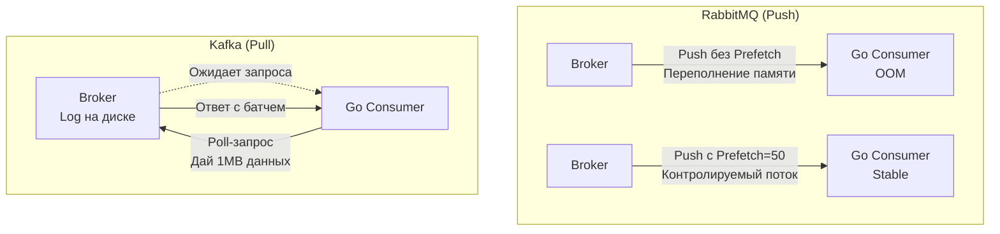

## Backpressure: Искусство говорить «Хватит»

В предыдущих статьях мы обсуждали, как брокеры сглаживают пики нагрузки, выступая в роли гигантского буфера между быстрыми Продюсерами и медленными Консьюмерами. Но что произойдет, если этот пик не спадает? Что если Продюсеры генерируют 10,000 сообщений в секунду, а ваши Консьюмеры (даже после горизонтального масштабирования) способны переварить только 2,000?

Если система не умеет сопротивляться входящей нагрузке, она умирает. Буферы переполняются, оперативная память заканчивается, и ядро ОС безжалостно убивает процессы (OOM Killer). 

Механизм, который позволяет нижестоящему узлу (Консьюмеру) подать сигнал вышестоящему (Брокеру или Продюсеру) о том, что нужно снизить скорость, называется **Backpressure (Обратное давление)**.

В этой статье мы разберем физику перегрузки, рассмотрим реализацию Backpressure на уровне рантайма Go и сравним подходы главных брокеров сообщений.

## Mechanical Sympathy: Анатомия перегрузки

Давайте посмотрим на то, как выглядит отсутствие Backpressure с точки зрения железа и рантайма Go.

Представьте типичный антипаттерн: консьюмер читает сообщения из брокера и на каждое сообщение запускает новую горутину для обработки (`go process(msg)`).

1. **Memory Bloat:** Входящий поток сети (TCP) работает на скорости гигабитов в секунду. Go мгновенно вычитывает данные и порождает 500,000 горутин. Каждая горутина — это структура `g` и стек минимум на 2 КБ. Плюс аллокации объектов бизнес-логики в куче (Escape Analysis). Память улетает за гигабайты за секунды.
2. **GC Death Spiral (Спираль смерти GC):** Когда куча стремительно растет, Сборщик мусора (Garbage Collector) начинает запускаться непрерывно. Фаза *Mark* (сканирование живых объектов) требует обхода всех 500,000 стеков. Приложение начинает тратить 90% процессорного времени (CPU) не на обработку заказов, а на работу GC.
3. **Throttling и Таймауты:** Оставшиеся 10% CPU делятся между горутинами. Запросы к БД (PostgreSQL) начинают отваливаться по `context.DeadlineExceeded`, так как горутина просто не получает процессорное время вовремя, чтобы прочитать ответ из сокета базы.
4. **OOM Killed:** Ядро Linux видит, что процесс `cgroup` (вашего Docker-контейнера) превысил лимит памяти, и отправляет сигнал `SIGKILL`. Консьюмер мертв. Сообщения, которые были в памяти, потеряны (если не было механизма Ack).

> [!info] Под капотом: TCP Window
> На самом низком уровне операционной системы Backpressure встроен прямо в протокол TCP. У каждого TCP-соединения есть `Receive Window` (окно приема) — размер буфера в ядре ОС. 
> Если ваше Go-приложение не успевает читать из сокета (`syscall read`), буфер ядра заполняется. ОС отправляет отправителю пакет с `Window Size = 0`. Отправитель физически блокируется на `syscall write`. Это аппаратный Backpressure. Проблема в том, что брокеры сообщений читают данные быстрее, чем мы их обрабатываем, перенося этот буфер из ОС в User Space (в память приложения).

## Backpressure внутри Go: Паттерны защиты

Прежде чем настраивать брокер, мы обязаны защитить сам Go-процесс. Основное правило надежного бэкенда: **Количество одновременно обрабатываемых задач должно быть строго ограничено**.

### 1. Буферизованные каналы и Worker Pool
Самый простой способ — использовать паттерн Worker Pool с буферизованным каналом. Размер пула воркеров — это ваш лимит конкурентности.

```go
package main

import (
	"context"
	"fmt"
)

// Обработчик, ограниченный 100 одновременными задачами
func startWorkerPool(ctx context.Context, concurrency int, tasks <-chan []byte) {
	for i := 0; i < concurrency; i++ {
		go func(workerID int) {
			for {
				select {
				case <-ctx.Done():
					return
				case msg := <-tasks:
					// Тяжелая работа
					_ = processMessage(msg)
				}
			}
		}(i)
	}
}
```
Если горутина, читающая из сети, попытается записать в канал `tasks`, а все 100 воркеров заняты, запись `tasks <- msg` **заблокируется**. Эта блокировка естественным образом остановит чтение новых данных из сети.

### 2. Семафоры (`x/sync/semaphore`)
Если вы не хотите использовать архитектуру каналов, а хотите вызывать функцию прямо по месту, используйте семафор:

```go
import "golang.org/x/sync/semaphore"

// Максимум 1000 одновременных процессов
var sem = semaphore.NewWeighted(1000)

func handleFromBroker(ctx context.Context, msg Message) {
	// Если лимит исчерпан, Acquire заблокирует выполнение, 
	// создавая Backpressure в сторону брокера
	if err := sem.Acquire(ctx, 1); err != nil {
		return 
	}
	defer sem.Release(1)

	go processMessage(msg)
}
```

---

## Backpressure в распределенных системах: Push vs Pull

Защитить консьюмер в памяти — это полдела. Если мы просто перестанем читать из сокета, что будет делать брокер? Ответ зависит от архитектуры брокера.

### RabbitMQ и модель Push (Проталкивание)

RabbitMQ активно "пушит" (отправляет) сообщения в открытый TCP-сокет Консьюмера так быстро, как только может. 

> [!warning] Ловушка / Gotcha
> По умолчанию RabbitMQ не имеет ограничений на отправку. Если ваш консьюмер медленный, а сеть быстрая, RabbitMQ забьет всю оперативную память вашего Go-приложения непрочитанными сообщениями, пока оно не упадет по OOM.

Чтобы включить Backpressure в RabbitMQ, мы обязаны использовать **QoS (Quality of Service)** и параметр **Prefetch Count**.

* `Prefetch Count = 50` означает: "RabbitMQ, отправь мне не более 50 сообщений и остановись. Пока я не пришлю тебе `Ack` (подтверждение обработки) хотя бы за одно из них, новые не присылай".
* Это переносит ответственность за хранение "лишних" сообщений обратно на диски RabbitMQ (где им самое место).

Но что, если сам RabbitMQ начинает переполняться? RabbitMQ включает **Memory/Disk Alarms**. Если использование RAM на сервере превышает порог (по умолчанию 40%), RabbitMQ перестает читать данные из сокетов Продюсеров. TCP Window закрывается, и горутины Продюсеров в Go блокируются при попытке `Publish`. Это классический Backpressure на всю систему.

### Kafka и модель Pull (Вытягивание)

Apache Kafka архитектурно защищена от проблемы переполнения Консьюмеров. В Kafka брокер "тупой" (Dumb Broker, Smart Consumer). Он ничего никому не пушит. 

Консьюмер в Kafka использует модель **Pull**. Ваш Go-сервис сам отправляет запрос `Poll` в Kafka: "Дай мне батч сообщений (максимум X мегабайт)". 
Пока ваш сервис обрабатывает этот батч (пишет в БД, вызывает другие API), он **не делает** новый `Poll`. Брокер просто хранит сообщения в логе на диске.



> [!tip] Собеседование
> **Вопрос:** Если в Kafka консьюмер сам решает, когда забирать данные, как брокер защищается от переполнения диска, если продюсеры пишут 10 ГБ/сек, а консьюмер упал?
> **Ответ:** Kafka защищается механизмами **Retention Policy** (хранение по времени, например, 7 дней) или **Retention Size** (хранение по размеру, например, 50 ГБ на партицию). Kafka просто начнет удалять (или сжимать - compaction) старые сообщения. В Kafka консьюмер может отстать (Consumer Lag), и это нормально, Backpressure в сторону Продюсера не возникает (если диски справляются), система просто требует мощного мониторинга метрики Lag.

## Стратегии сброса нагрузки (Load Shedding)

Иногда Backpressure недостаточен. Если очередь RabbitMQ выросла до десятков миллионов, а сообщения имеют срок годности (например, SMS-уведомление о такси, которое актуально только 5 минут), обработка старых сообщений не имеет смысла.

В таких случаях применяется **Load Shedding (Сброс нагрузки)** — осознанное удаление части трафика для спасения системы.

1. **TTL (Time To Live):** Настройка брокера. Если сообщение лежит в очереди дольше 5 минут, брокер молча удаляет его (или перекладывает в DLQ).
2. **Drop Head:** Если очередь переполнена, удаляем не новые сообщения, а самые старые (Head), так как вероятность их неактуальности выше.
3. **Graceful Degradation:** Брокер сигнализирует Продюсеру об отказе (Nack), а Продюсер (Go API) возвращает клиенту HTTP 503 (Service Unavailable) с заголовком `Retry-After`.

## Итог

1. **Без Backpressure любая асинхронная система рано или поздно упадет** из-за переполнения памяти на слабом узле (чаще всего это консьюмер, упершийся в БД).
2. **В Go** контроль нагрузки реализуется через пулы горутин с буферизованными каналами или семафоры, ограничивая количество concurrent-задач.
3. **В RabbitMQ** (Push-модель) критически важно настраивать `Prefetch Count` (QoS), иначе консьюмер захлебнется.
4. **В Kafka** (Pull-модель) Backpressure естественен: консьюмер берет паузу между вызовами `Poll`, пока не закончит обработку батча.

Мы научились управлять потоком сообщений и защищать наши сервисы от пиковых нагрузок. Но что если из-за жесткой перезагрузки сервера в ДЦ выключат питание? Как брокеры гарантируют, что ни один оплаченный заказ не исчезнет из очереди? В следующей статье мы опустимся на уровень файловой системы и разберем: [[7. Message durability и persistence]].