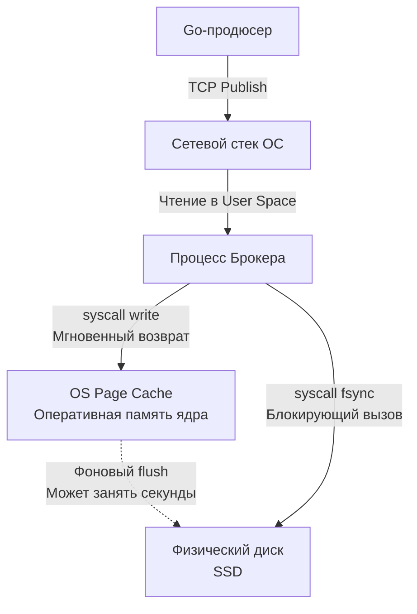

В предыдущих статьях мы обсуждали, как очереди спасают систему от перегрузки по CPU и оперативной памяти, выступая в роли эластичного буфера. Но что произойдет с этим буфером, если в дата-центре внезапно отключат питание? Или если процесс брокера будет убит `OOM Killer` (Out Of Memory)?

Если сообщения находились только в оперативной памяти (RAM), они исчезнут навсегда. Для системы обработки заказов интернет-магазина или финансового процессинга потеря хотя бы одного сообщения — это катастрофа. 

Чтобы гарантировать сохранность данных при перезагрузках и сбоях, брокеры используют механизмы **Durability** (долговечности) и **Persistence** (персистентности, записи на диск). В этой статье мы спустимся на уровень файловой системы Linux и разберем, как лидеры рынка балансируют между сохранностью данных и физическими ограничениями железа.

## Mechanical Sympathy: Иллюзия записи на диск

Многие разработчики считают, что если их Go-продюсер получил успешный ответ от брокера, значит сообщение надежно записано на жесткий диск. На самом деле, между вызовом функции записи и физическим намагничиванием пластины диска (или сохранением заряда в ячейке NAND-памяти SSD) лежит огромная пропасть.

Давайте посмотрим, как работает запись в Linux "под капотом":

1. **User Space:** Брокер (RabbitMQ, Kafka) формирует батч сообщений в своей памяти и вызывает системный вызов `write(fd, buffer)`.
2. **Kernel Space (OS Page Cache):** Ядро Linux берет эти данные и копирует их в **Page Cache** — специальную область оперативной памяти. Системный вызов `write` мгновенно возвращает успех! С точки зрения приложения данные "записаны", хотя физически они всё еще в RAM.
3. **Flusher Threads:** В фоновом режиме ядро ОС (потоки `pdflush` или `kworker`) периодически сканирует "грязные" (dirty) страницы в Page Cache и сбрасывает их на физический накопитель. 
4. **Физический диск:** Данные попадают в аппаратный кэш самого контроллера диска, и только потом — в энергонезависимую память.



Если сервер потеряет питание на этапе 3, все "грязные" страницы в Page Cache будут безвозвратно утеряны, несмотря на то, что `write` вернул успех.

### Цена команды `fsync`

Чтобы заставить ОС немедленно сбросить данные на диск и дождаться физического подтверждения от контроллера, приложение должно сделать системный вызов `fsync()`. 

Но **`fsync` — это невероятно дорогая операция**. Переключение контекста, ожидание аппаратного прерывания от диска — всё это занимает миллисекунды. Если брокер будет делать `fsync` на каждое входящее сообщение, его пропускная способность (Throughput) упадет с сотен тысяч до пары тысяч сообщений в секунду (IOPS диска).

Именно поэтому разные брокеры используют разные стратегии компромисса между производительностью и надежностью.

## Подход RabbitMQ: Избирательная персистентность

RabbitMQ проектировался во времена, когда диски (HDD) были крайне медленными, а память — дорогой. По умолчанию RabbitMQ держит сообщения в оперативной памяти (в Erlang-процессах), чтобы обеспечить минимальную задержку (Latency).

Чтобы заставить RabbitMQ сохранять сообщения на диск, вам нужно выполнить **два независимых условия**.

> [!warning] Ловушка / Gotcha
> Типичная ошибка на Middle-собеседовании:
> *«Я объявил очередь с флагом `durable: true`, почему после рестарта RabbitMQ она оказалась пустой?»*

В RabbitMQ есть четкое разделение:
1. **Durable Queue (Долговечная очередь):** Гарантирует, что сама *метаинформация* об очереди переживет рестарт сервера. Если очередь `durable: false`, после ребута она просто исчезнет вместе с биндингами. Но `durable: true` **не гарантирует** сохранность сообщений внутри неё!
2. **Persistent Message (Персистентное сообщение):** Гарантирует, что само сообщение будет записано на диск. При отправке сообщения продюсер обязан выставить свойство `Delivery Mode = 2` (в Go-клиенте `amqp091-go` это константа `amqp.Persistent`).

Только персистентное сообщение, попавшее в долговечную очередь, будет записано на диск (в специальный файл `msg_store`).

**Как RabbitMQ делает `fsync`?**
RabbitMQ не делает `fsync` на каждое сообщение. Он накапливает сообщения в буфере и периодически (каждые несколько сотен миллисекунд) сбрасывает их на диск батчем. Если вы используете Publisher Confirms (подтверждения для продюсера), брокер отправит вам `Ack` *только после того*, как вызов `fsync` успешно завершится. Поэтому отправка персистентных сообщений с подтверждениями в RabbitMQ работает ощутимо медленнее транзитных.

## Подход Kafka: Диск как фундамент

Apache Kafka полностью переворачивает парадигму. Для Kafka жесткий диск — это не "аварийное хранилище на случай сбоя", а основное и единственное место обитания данных. 

Архитектура Kafka построена вокруг концепции **Append-Only Log** (журнал, в который данные только добавляются в конец). 

> [!info] Под капотом: Zero-Copy и Page Cache в Kafka
> Поскольку Kafka всегда пишет строго последовательно (Sequential I/O), современные HDD и SSD показывают фантастическую скорость, сопоставимую с сетью. 
> Kafka написана на Java/Scala, но она сознательно избегает хранения сообщений в куче JVM, чтобы не нагружать Garbage Collector. Вместо этого она агрессивно эксплуатирует **OS Page Cache**.
> Когда консьюмер запрашивает данные, Kafka использует системный вызов `sendfile` (Zero-copy). Ядро ОС берет данные напрямую из Page Cache и копирует их в сетевой сокет, вообще не поднимая их в User Space брокера!

### Парадокс Kafka: Надежность без `fsync`

Самое шокирующее для многих инженеров: **по умолчанию Kafka не делает `fsync` для каждого сообщения!**

Kafka полагается на то, что OS Page Cache работает невероятно быстро. А гарантии надежности (Durability) достигаются не локальным сбросом на диск одной машины, а **распределенной репликацией** по сети.

В Kafka продюсер управляет надежностью через настройку `acks`:
* `acks=0`: Выстрелил и забыл. Максимальная скорость, возможна потеря данных.
* `acks=1`: Продюсер ждет подтверждения только от Leader-брокера (он записал данные в свой Page Cache, но не обязательно сделал `fsync`). Если сервер сразу после этого сгорит — данные потеряны.
* `acks=all` (или `acks=-1`): Leader получает сообщение, ждет, пока все In-Sync Replicas (ISR) скачают это сообщение по сети к себе в Page Cache, и только потом отвечает продюсеру `Ack`.

Секрет в том, что вероятность одновременного отключения питания у 3-х независимых серверов в разных стойках дата-центра стремится к нулю. Репликация в памяти 3-х серверов оказывается быстрее и надежнее, чем синхронный `fsync` на одном HDD.

## Идиоматичный Go: Как не потерять данные на стороне клиента

Выбор `acks=all` в Kafka или `Publisher Confirms` в RabbitMQ имеет серьезные последствия для вашего Go-кода. 

Когда брокер синхронизирует данные на диске или ждет репликации от других узлов, сетевой вызов задерживается (Latency растет с 1 мс до 10-50 мс). Ваша горутина будет заблокирована в ожидании ответа.

```go
// Пример для Kafka (библиотека sarama)
config := sarama.NewConfig()
// Требуем подтверждения от всех реплик для максимальной надежности
config.Producer.RequiredAcks = sarama.WaitForAll 
config.Producer.Return.Successes = true

producer, err := sarama.NewSyncProducer(brokers, config)
// ...
// Этот вызов заблокирует горутину, пока все реплики Kafka не подтвердят запись.
// При пиковой нагрузке (сотни горутин ждут диска/сети брокера) вы можете 
// получить исчерпание лимита открытых соединений или таймауты контекста.
partition, offset, err := producer.SendMessage(msg) 
```

> [!tip] Собеседование
> **Вопрос:** Вы настроили `acks=all` в Kafka. Может ли Продюсер потерять сообщение при сетевом сбое?
> **Ответ:** Да! `acks=all` гарантирует, что брокер не потеряет сообщение *после* того, как принял его. Но если сбой сети произошел *во время отправки* или *до получения Ack*, Go-продюсер не узнает, записалось ли сообщение. Именно поэтому Продюсер должен уметь делать Retry (повторные попытки), а Консьюмер должен быть Идемпотентным (чтобы не удвоить платеж при ретрае успешной записи).

## Итог

1. **Запись в сокет $\neq$ Запись на диск.** Системные вызовы ОС (`write`) буферизируют данные в RAM.
2. **RabbitMQ** позволяет тонко настраивать компромисс, делая очереди `durable` и сообщения `persistent`, заставляя брокер сбрасывать данные на диск ценой падения производительности.
3. **Kafka** достигает надежности через распределенную репликацию (`acks=all`), минимизируя дорогостоящие вызовы `fsync` и выжимая максимум из OS Page Cache.
4. Долговечность на стороне брокера всегда означает **увеличение времени ответа (Latency)** для вашего Go-приложения, к чему нужно быть готовым при расчете пулов горутин и таймаутов `context.Context`.

Мы научились доставлять сообщения, контролировать их поток и гарантировать их сохранение на жестких дисках. Но что делать, если сообщение благополучно дошло до Консьюмера, но его бизнес-логика (например, парсинг JSON) содержит фатальную ошибку, из-за которой сервис падает при каждой попытке обработки? Такие сообщения называются "ядовитыми" (Poison Pills), и для борьбы с ними существует специальный архитектурный паттерн, который мы разберем в следующей статье: [[8. Dead Letter Queue]].