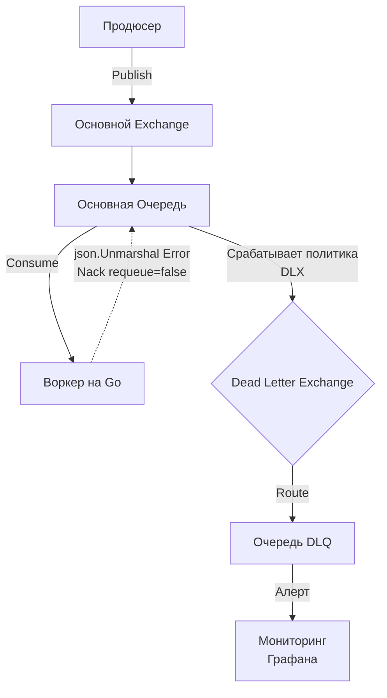

## Анатомия "Ядовитого сообщения" (Poison Pill)

В предыдущих статьях мы выстроили надежную инфраструктуру: защитились от потери данных с помощью записи на диск ([[7. Message durability и persistence]]) и настроили подтверждения доставки (At-least-once). Кажется, система стала пуленепробиваемой.

Но давайте представим тривиальную ситуацию. Ваш Go-консьюмер читает сообщения из очереди и ожидает внутри JSON поле `user_id` типа `int64`. Из-за ошибки на стороне Продюсера (например, выкатили сломанный релиз), в очередь попадает сообщение, где `user_id` — это строка `"unknown"`. 

Что произойдет, когда горутина вызовет `json.Unmarshal`? 
1. Функция вернет ошибку.
2. Добросовестный разработчик, следуя паттерну At-least-once, сделает `msg.Nack(requeue=true)` — то есть скажет брокеру "я не справился, верни сообщение в очередь".
3. Брокер мгновенно возвращает сообщение обратно.
4. Консьюмер снова его читает, снова падает на `Unmarshal`, снова делает `Nack`.

Возникает **Infinite Retry Loop (Бесконечный цикл повторов)**. Это сообщение называется **Poison Pill (Ядовитая таблетка)** или **Poison Message**.

> [!info] Под капотом: Последствия Poison Pill для железа и сети
> С точки зрения рантайма Go и ОС, этот бесконечный цикл — катастрофа. Ваша горутина начинает молотить CPU, постоянно аллоцируя память под битые JSON-структуры, нагружая Сборщик мусора (GC). 
> Сетевой интерфейс сервера забивается бесполезным трафиком: брокер и консьюмер перекидывают один и тот же TCP-пакет тысячи раз в секунду. 
> Если вы используете строгий порядок обработки (Strict Ordering, например, одну партицию в Kafka), это битое сообщение заблокирует всю партицию (Head-of-Line Blocking). Все валидные заказы, стоящие позади него, никогда не будут обработаны.

Чтобы разорвать этот порочный круг, был придуман паттерн **Dead Letter Queue (DLQ)** — очередь мертвых писем.

## Что такое DLQ и как оно работает?

**DLQ** — это просто еще одна очередь (или топик), которая выполняет роль изолятора (карантина). Сообщения, которые признаны "необрабатываемыми", перенаправляются туда для последующего ручного разбора или анализа скриптами, освобождая основную магистраль.

Сообщение может попасть в DLQ по трем основным причинам:
1. **Явный отказ (Rejection):** Консьюмер сделал `Nack` (Negative Acknowledgement) с флагом `requeue=false`.
2. **Истечение срока жизни (TTL Expired):** Сообщение пролежало в очереди дольше отведенного времени.
3. **Превышение лимита очереди (Queue Length Limit):** Очередь переполнилась, и старые сообщения вытесняются (выбрасываются с головы очереди).

### Реализация в RabbitMQ (Smart Broker)

В RabbitMQ механизм DLQ встроен прямо в ядро маршрутизации. Причем технически сообщения отправляются не в очередь, а в специальный **Dead Letter Exchange (DLX)**.

При объявлении (declare) основной очереди, вы передаете специальные аргументы (Headers):
* `x-dead-letter-exchange`: имя Exchange, куда слать трупы.
* `x-dead-letter-routing-key`: (опционально) с каким ключом маршрутизации их туда слать.



> [!warning] Ловушка / Gotcha
> Если вы настраиваете DLQ в RabbitMQ, всегда добавляйте политику TTL (Time-To-Live) или Max Length на саму *Dead Letter Queue*. Если ваш консьюмер начал массово реджектить миллионы сообщений из-за бага в БД, DLQ может переполнить диски RabbitMQ и обрушить весь кластер. DLQ тоже нужно лимитировать!

### Реализация в Kafka (Dumb Broker)

Apache Kafka — это тупой брокер (в хорошем смысле). У нее нет встроенного механизма "перемести сообщение в другой топик, если консьюмер не справился". 

В мире Kafka ответственность за DLQ полностью ложится на плечи **вашего кода в Go** (или фреймворка, вроде Kafka Connect).

Если Go-консьюмер понимает, что сообщение битое, он должен:
1. Самостоятельно отправить (сделать `Produce`) это сообщение в отдельный топик (например, `orders-dlq`).
2. Дождаться подтверждения записи в DLQ-топик.
3. **Сдвинуть оффсет (Commit Offset)** в основном топике, чтобы Kafka считала ядовитое сообщение успешно пройденным!

Если вы просто залогируете ошибку и не сделаете Commit, после рестарта консьюмера Kafka снова подсунет вам это же битое сообщение.

## Идиоматичный Go: Классификация ошибок

Чтобы правильно использовать DLQ, код должен уметь отличать временные сбои (Transient Errors) от фатальных (Fatal Errors).

* **Fatal Error (Фатальная ошибка):** Неверный формат данных, отсутствие обязательных полей, ошибка бизнес-логики (например, "пользователь забанен, перевод невозможен"). Повторная попытка *никогда* не приведет к успеху. Такие сообщения нужно **немедленно** отправлять в DLQ.
* **Transient Error (Временная ошибка):** База данных вернула таймаут, сторонний API (эквайринг) ответил HTTP 503, моргнула сеть. Здесь нужен Retry.

Вот как выглядит правильный паттерн консьюмера на Go:

```go
package consumer

import (
	"context"
	"encoding/json"
	"errors"
)

// Кастомные типы ошибок для классификации
var ErrInvalidPayload = errors.New("invalid payload")

func (w *Worker) HandleMessage(ctx context.Context, msgData []byte) error {
	var order Order
	
	// 1. Парсинг данных. Ошибка здесь — всегда Fatal.
	if err := json.Unmarshal(msgData, &order); err != nil {
		// Оборачиваем ошибку, чтобы маркер ErrInvalidPayload не потерялся
		return fmt.Errorf("%w: %v", ErrInvalidPayload, err) 
	}

	// 2. Бизнес логика (поход в БД, вызов внешнего API)
	if err := w.repo.SaveOrder(ctx, order); err != nil {
		// Допустим, repo.SaveOrder возвращает специфичные ошибки таймаутов
		return err // Это потенциально Transient ошибка
	}

	return nil
}

// Воркер-луп (пример псевдокода для RabbitMQ)
func (w *Worker) ProcessLoop(deliveries <-chan amqp.Delivery) {
	for d := range deliveries {
		err := w.HandleMessage(context.Background(), d.Body)
		
		if err == nil {
			d.Ack(false)
			continue
		}

		// Анализируем тип ошибки с помощью errors.Is
		if errors.Is(err, ErrInvalidPayload) {
			// Фатальная ошибка. Отправляем в DLQ.
			// В RabbitMQ requeue=false автоматически перебросит в DLX
			d.Nack(false, false) 
		} else {
			// Временная ошибка (например, БД лежит). 
			// Возвращаем в основную очередь (в реальности тут нужен delay).
			d.Nack(false, true)
		}
	}
}
```

> [!tip] Собеседование
> **Вопрос:** Мы настроили DLQ. В день туда падает 5-10 сообщений. Дежурный инженер раз в неделю смотрит на них, понимает, что это старые баги, и просто очищает очередь (Purge). Это нормальный процесс?
> **Ответ:** Нет, это антипаттерн "Кладбище сообщений". DLQ — это не мусорка. Появление сообщения в DLQ должно вызывать алерт уровня Critical (или Warning) в системах Observability (Prometheus/Grafana). Каждое сообщение в DLQ означает несработавшую бизнес-функцию (кто-то не получил заказ, с кого-то не списались деньги). Идеальный DLQ должен быть пустым.

## Обработка DLQ: Что делать с "мертвецами"?

Само по себе складывание сообщений в DLQ не решает бизнес-задачу, оно лишь спасает инфраструктуру. С DLQ нужно работать:

1. **Reprocessing (Повторная переработка):** Если сообщения попали в DLQ из-за бага в вашем Go-коде (который вы уже исправили хотфиксом), вы можете написать скрипт (или использовать UI брокера), чтобы перекинуть сообщения из DLQ обратно в основную очередь.
2. **Enrichment (Обогащение):** RabbitMQ при перебросе в DLX добавляет в заголовки (Headers) сообщения массив `x-death`. В нем хранится история: почему сообщение умерло, в какое время, и сколько раз это происходило. Эта метаинформация критически важна для расследования инцидентов.
3. **Dead Letter API:** В крупных архитектурах строят отдельные микросервисы, которые слушают DLQ-топики со всех систем, агрегируют их и предоставляют админ-панель для саппорта или разработчиков.

## Итог

1. **Poison Message** убивает производительность системы, вызывая бесконечные циклы переповторов и Head-of-Line Blocking.
2. **Dead Letter Queue** — это паттерн изоляции дефектных данных. В RabbitMQ он встроен в роутинг (DLX), в Kafka он реализуется на уровне кода консьюмера.
3. Идиоматичный Go-код обязан классифицировать ошибки на **Fatal** (в DLQ) и **Transient** (на повтор).

Но что делать с временными ошибками (Transient)? Если база данных лежит, возвращать сообщение обратно в очередь с помощью `Nack(requeue=true)` — плохая идея, брокер отдаст его вам в ту же миллисекунду, и вы просто устроите DDoS собственной лежащей базе. Нам нужен механизм умных задержек. Как правильно тормозить систему, мы разберем в следующей статье: [[9. Retry стратегии и exponential backoff]].