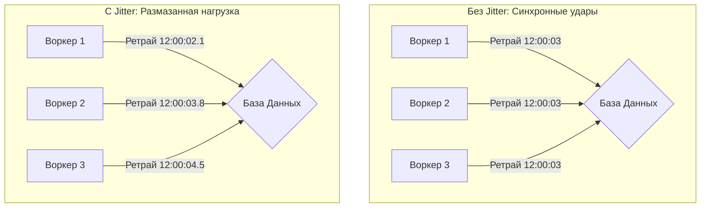

## Анатомия временного сбоя

В прошлой статье ([[8. Dead Letter Queue]]) мы разделили ошибки обработки сообщений на два лагеря: **Фатальные** (битый JSON, невалидные данные — отправляем в DLQ) и **Временные** (Transient). 

Временная ошибка означает, что инфраструктура или зависимый сервис временно недоступны. Упала сеть, база данных ушла в перезагрузку для установки обновлений, внешний API эквайринга ответил `503 Service Unavailable`. 

Главное правило распределенных систем: **всё, что может упасть, упадет; всё, что временно недоступно, рано или поздно поднимется**. Значит, сообщение нужно вернуть в очередь и попробовать снова. Этот процесс называется **Retry (Повторная попытка)**. Но если реализовать его в лоб, вы можете собственными руками убить свой же проект.

## Проблема "Гремящего стада" (Thundering Herd)

Представьте систему, где 100 Go-воркеров (горутин-консьюмеров) читают очередь заказов и пишут их в PostgreSQL. База данных моргнула: произошел failover, мастер-узел переключается на реплику. Это занимает 5 секунд.

**Наивный подход (Immediate Retry):**
1. Воркер делает запрос в БД $\rightarrow$ Ошибка.
2. Воркер делает `Nack` (Negative Ack), сообщение мгновенно возвращается в очередь.
3. Брокер мгновенно отдает сообщение обратно воркеру.
4. Воркер снова бьет в БД.

За эти 5 секунд простоя БД, 100 воркеров совершат сотни тысяч попыток подключиться к базе. Процессор (CPU) на сервере с БД, который только-только пытается загрузить ядро ОС и поднять процесс PostgreSQL, захлебывается от лавины входящих TCP-SYN пакетов. Вы создали **DDoS-атаку на собственную инфраструктуру**. База никогда не поднимется.

## Exponential Backoff (Экспоненциальная задержка)

Чтобы дать больной системе время на "выздоровление", интервал между попытками должен увеличиваться. 

Самая популярная математическая модель для этого — **Exponential Backoff**. Суть проста: с каждой неудачной попыткой время ожидания удваивается (или умножается на другой фактор), пока не достигнет заранее заданного максимума.

**Формула:**
$WaitTime = Min(InitialDelay \times Factor^{Attempt}, MaxDelay)$

*Пример (Initial=1s, Factor=2, Max=30s):*
* Попытка 1: ждем 1 секунду.
* Попытка 2: ждем 2 секунды.
* Попытка 3: ждем 4 секунды.
* Попытка 4: ждем 8 секунд.
* ...
* Попытка 7+: ждем 30 секунд (достигли лимита).

> [!warning] Ловушка / Gotcha
> Экспоненциальной задержки *недостаточно* для решения проблемы Thundering Herd!
> Если БД упала ровно в 12:00:00, все 100 воркеров упадут одновременно. Они все подождут 1 секунду и ударят в БД в 12:00:01. Снова упадут. Все вместе подождут 2 секунды и ударят в 12:00:03. 
> Вы просто растянули DDoS-атаку во времени, превратив сплошной поток запросов в синхронные, разрушительные спайки (пики) нагрузки.

## Jitter: Добавляем хаос во имя спасения

Чтобы размазать пиковую нагрузку, нам нужно рассинхронизировать воркеры. Для этого в формулу добавляют **Jitter (Джиттер)** — случайное отклонение.

Вместо того чтобы ждать ровно 4 секунды, воркер A подождет 3.1 сек, воркер B — 4.8 сек, воркер C — 2.5 сек.

Самый эффективный алгоритм, доказанный инженерами Amazon (AWS), называется **Full Jitter**:
$WaitTime = Random(0, ExponentialDelay)$



## Идиоматичный Go: Пишем правильный Retry-цикл

В Go реализация ретраев часто делается на уровне самого приложения (если мы обращаемся к внешнему API) или на уровне инфраструктуры (через брокеры, о чем ниже).

Если вы пишете ретрай в коде консьюмера, он **обязан** уважать `context.Context`, чтобы не заблокировать graceful shutdown приложения.

> [!info] Под капотом: Таймеры и утечки памяти
> Исторически (до Go 1.23) использование `time.After` в цикле `for` с `select` считалось серьезной ошибкой (Memory Leak). 
> Структура `runtime.timer` помещалась в глобальную кучу таймеров планировщика (P). Если ваша функция завершалась успешно до истечения таймера (например, ретрай удался за 1 сек, а `time.After` стоял на 30 сек), этот таймер продолжал висеть в памяти, пока не "протикает". При высоких RPS это приводило к аллокации гигабайт памяти под мертвые таймеры.
> Хотя в новых версиях Go сборщик мусора (GC) научился чистить неактивные таймеры, **золотым стандартом идиоматичного Go** остается явное управление через `time.NewTimer` и `Stop()`.

**Production-ready пример Exponential Backoff с Jitter:**

```go
package retry

import (
	"context"
	"math/rand"
	"time"
)

// Do выполняет функцию f с Exponential Backoff и Full Jitter
func Do(ctx context.Context, maxRetries int, baseDelay time.Duration, f func() error) error {
	var err error

	// Инициализируем таймер заранее. Пока ставим на 0, мы его перенастроим.
	timer := time.NewTimer(0)
	// Важно остановить таймер при выходе, чтобы не засорять хип рантайма
	defer timer.Stop()

	for attempt := 0; attempt < maxRetries; attempt++ {
		if err = f(); err == nil {
			return nil // Успех
		}

		// Если это последняя попытка, не ждем
		if attempt == maxRetries-1 {
			break
		}

		// Считаем экспоненту: Base * 2^Attempt
		expo := float64(baseDelay) * float64(uint(1)<<attempt)
		
		// Ограничиваем максимальное ожидание (например, 30 сек)
		if expo > float64(30*time.Second) {
			expo = float64(30 * time.Second)
		}

		// Добавляем Full Jitter: Random(0, Expo)
		// Используем rand.Float64(), чтобы получить разброс
		jitterDelay := time.Duration(rand.Float64() * expo)

		// Перезапускаем таймер безопасно (сброс канала, если он уже сработал)
		if !timer.Stop() {
			select {
			case <-timer.C:
			default:
			}
		}
		timer.Reset(jitterDelay)

		// Ждем либо истечения таймера, либо отмены контекста (Ctrl+C / Shutdown)
		select {
		case <-ctx.Done():
			return ctx.Err()
		case <-timer.C:
			// Таймер истек, уходим на следующий цикл
		}
	}
	return err
}
```

## Как реализовать отложенные ретраи в Брокерах?

Паттерн, описанный выше (засыпание в горутине), имеет один серьезный изъян: пока горутина спит `select { <-timer.C }`, она **не отдает сообщение обратно в очередь**.
* Сообщение висит в статусе *Unacknowledged*.
* Воркер (и его пул памяти) заблокирован. Он не может обрабатывать другие (возможно, успешные) сообщения из очереди.

Для HighLoad систем это недопустимо. Если внешняя система легла на час, все ваши консьюмеры уснут на час, и вся труба сообщений встанет. Ретраи нужно перекладывать на инфраструктуру.

### Подход RabbitMQ (Dead Letter Routing)

Исторически RabbitMQ не умел делать отложенные сообщения. Разработчики придумали гениальный хак на основе TTL (Time-To-Live) и DLX (Dead Letter Exchange).

1. Консьюмер ловит ошибку и отправляет сообщение (с помощью нового вызова `Publish`, а не `Nack`!) в специальную очередь: `retry-queue-1m`. 
2. У этой очереди нет консьюмеров. Зато у неё настроен `x-message-ttl: 60000` (1 минута) и `x-dead-letter-exchange: main-exchange`.
3. Сообщение лежит там ровно 1 минуту. Затем RabbitMQ считает его "мертвым" и автоматически перебрасывает обратно в `main-exchange`, откуда оно снова попадает к нашему консьюмеру.

Для разных задержек (1м, 5м, 15м) создаются разные очереди. 
*(Примечание: Сейчас существует официальный плагин `rabbitmq-delayed-message-exchange`, который позволяет сделать это проще, но он не подходит для огромного потока сообщений, так как нагружает Mnesia БД внутри Erlang-рантайма RabbitMQ).*

### Подход Kafka (Uber Retry Topics)

В Kafka нет ни TTL, ни DLX, ни отложенной доставки. Если вы сделаете `Sleep` в консьюмере Kafka, вы заблокируете чтение всей партиции (Ordering, привет!).

Инженеры Uber стандартизировали следующий паттерн для Kafka:
Создаются несколько независимых топиков для ретраев с разным интервалом:
* `topic-main`
* `topic-retry-10s`
* `topic-retry-1m`
* `topic-retry-10m`
* `topic-dlq`

Если воркер не смог обработать заказ из `topic-main`, он программно делает `Produce` этого же сообщения в `topic-retry-10s` и коммитит оффсет в `topic-main` (идет дальше).
Отдельная группа консьюмеров читает `topic-retry-10s`, делает `time.Sleep` (если сообщение пришло слишком рано) и обрабатывает его. Если снова фейл — перекладывает в `topic-retry-1m`.

> [!tip] Собеседование
> **Вопрос:** Мы реализовали Exponential Backoff с Jitter на 5 попыток. Но некоторые заказы все равно дублируются в БД. Почему?
> **Ответ:** Ретрай — это сознательная генерация дубликатов на уровне системы. Сеть может оборваться *после* того, как вы успешно записали данные в БД, но *до* того, как вы отправили `Ack` брокеру. Система решит, что это таймаут, и запустит алгоритм ретрая. Это приведет ко второму `Insert` в базу. Ретраи **неразлучны** с понятием Идемпотентности. Если ваши операции не идемпотентны, ретраи уничтожат консистентность данных.

## Итог

1. **Мгновенные ретраи** — это DDoS-атака на собственную инфраструктуру.
2. **Exponential Backoff** дает зависимым сервисам время на восстановление после сбоя.
3. **Jitter** ломает синхронизацию воркеров, предотвращая всплески нагрузки на старте восстановившегося сервиса.
4. В Go ретраи в памяти пишутся через `time.NewTimer` с соблюдением отмены `context.Context`.
5. Для HighLoad-систем ретраи выносятся на уровень инфраструктуры (Retry-очереди в RabbitMQ или Retry-топики в Kafka), чтобы не блокировать пулы горутин-консьюмеров.

Мы настроили мощную, самовосстанавливающуюся асинхронную систему. Она буферизирует пики, сохраняет данные на диск, обрабатывает ядовитые сообщения в DLQ и умеет ждать, если БД перегружена. 

Но, как мы выяснили, все механизмы надежности брокеров (At-least-once, Retries, Nacks) фундаментально основаны на том, что сообщения будут доставляться **повторно**. И если наша бизнес-логика к этому не готова, мы спишем деньги с клиента дважды. В следующей, критически важной статье этого раздела, мы разберем главный защитный механизм бизнес-логики: [[10. Idempotency в message processing]].