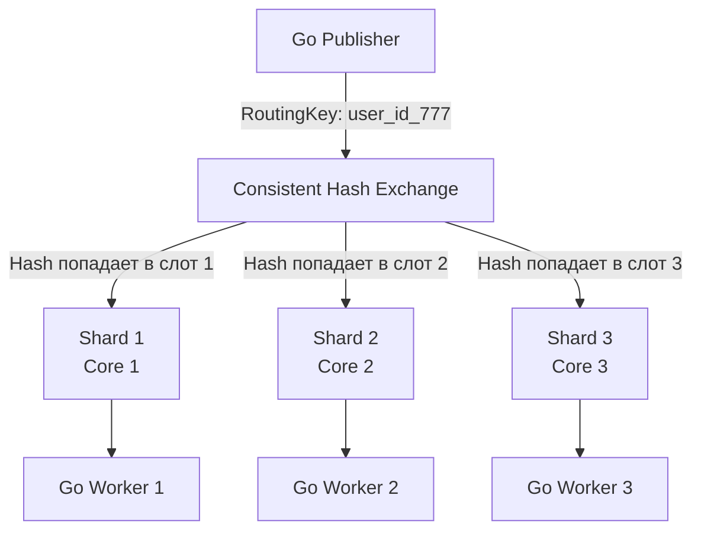

В предыдущих статьях (особенно в [[9. Cluster и HA в RabbitMQ]]) мы построили отказоустойчивый кластер, который переживет падение дата-центра. Однако надежность всегда имеет цену — и эта цена выражается в снижении производительности (Throughput) и увеличении задержек (Latency).

RabbitMQ — это невероятно гибкий "умный брокер", но его архитектура на базе Erlang/OTP имеет свои жесткие физические лимиты. Если вы попытаетесь пропустить через него миллион сообщений в секунду "в лоб", кластер просто ляжет от нехватки памяти (OOM) или исчерпания файловых дескрипторов. 

В этой, заключительной статье раздела по RabbitMQ, мы разберем, как выжать максимальный RPS (Requests Per Second) на уровне ОС, виртуальной машины BEAM (Erlang) и клиентского Go-кода.

## 1. Лимиты ОС и Mechanical Sympathy

RabbitMQ — это I/O-bound приложение. Оно держит тысячи открытых TCP-сокетов и постоянно пишет данные на диск (особенно при использовании Quorum очередей). 

### Файловые дескрипторы (File Descriptors)
В Linux всё есть файл. Каждое TCP-соединение от вашего Go-бэкенда и каждый файл на диске, где RabbitMQ хранит сообщения (или сегменты Raft-лога для Quorum), требуют файлового дескриптора. 
По умолчанию во многих дистрибутивах Linux жесткий лимит (`ulimit -n`) равен 1024. Это катастрофически мало для брокера. 

> [!warning] Ловушка / Gotcha
> Если RabbitMQ исчерпает лимит файловых дескрипторов, он не просто перестанет принимать новые соединения. Он не сможет открывать новые файлы для записи логов, что приведет к немедленной остановке кластера и деградации производительности до нуля.
> **Решение:** Для production-серверов RabbitMQ лимит дескрипторов (в `systemd` unit файле или `limits.conf`) должен быть установлен минимум в `65536`, а лучше `1048576`.

### TCP Keepalive и Heartbeats
Ваши Go-приложения могут падать (OOM, паника, жесткий рестарт пода в K8s). При жестком падении ОС не успевает отправить TCP-пакет `FIN` или `RST`. С точки зрения RabbitMQ, соединение остается "живым" (Half-open connection). Такие соединения утекают, потребляя дескрипторы и память.
На уровне AMQP-протокола есть механизм **Heartbeats** (по умолчанию 60 секунд). Библиотека `amqp091-go` отправляет пинги брокеру. Если брокер не получает пинг 2 раза подряд, он принудительно закрывает сокет. 

## 2. Тюнинг памяти: Управление потопом (Flow Control)

RabbitMQ хранит сообщения в оперативной памяти (для скорости) и сбрасывает их на диск только при необходимости. Как брокер защищает себя от Out-Of-Memory?

В Erlang реализован механизм **High Watermark**. Главный параметр в `rabbitmq.conf` — это `vm_memory_high_watermark` (по умолчанию `0.4`, то есть 40% от всей RAM сервера).

**Что происходит, когда брокер достигает этого лимита?**
Срабатывает **Global Flow Control (Глобальная блокировка потока)**.
1. Брокер блокирует *все* TCP-соединения, которые пытаются опубликовать (Publish) новые сообщения. 
2. На уровне TCP размер окна (TCP Window) сводится к нулю, и ваши Go-приложения блокируются на системном вызове `write()`.
3. Консьюмерам при этом разрешено забирать сообщения, чтобы разгрузить память.

> [!tip] Собеседование
> **Вопрос:** Можем ли мы увеличить `vm_memory_high_watermark` до `0.9` (90%), чтобы RabbitMQ использовал всю память сервера?
> **Ответ:** Категорически нет. Во-первых, Erlang Garbage Collector требует дополнительной памяти при очистке (до x2 от текущего объема). Во-вторых, операционной системе (Linux) нужна память для Page Cache, чтобы эффективно буферизировать дисковый I/O. Если отдать 90% брокеру, при пиковой нагрузке придет OOM Killer от Linux и убьет процесс RabbitMQ. Максимум для выделенного сервера — `0.6` (60%).

## 3. Архитектурный тюнинг: Очереди и Шардирование

Как мы упоминали ранее, **одна очередь — это один процесс Erlang**. Этот процесс исполняется строго последовательно на одном ядре CPU. Это фундаментальное бутылочное горлышко архитектуры Smart Broker.

Если у вас 64-ядерный сервер, а весь трафик идет через одну очередь `orders`, максимальная утилизация сервера составит `1/64` (чуть больше 1.5%). 

### Паттерн Consistent Hashing (Шардирование очередей)

Для преодоления лимита одного ядра в RabbitMQ применяется официальный плагин `rabbitmq-consistent-hash-exchange`.

Он позволяет распределять сообщения с одинаковым Routing Key по разным очередям на основе хэша от ключа маршрутизации (или хэша от кастомного заголовка). 



Такой подход позволяет линейно масштабировать throughput, добавляя новые очереди (шарды) и утилизируя все ядра CPU кластера.

## 4. Оптимизация Go-кода (Producers & Consumers)

Чтобы загрузить RabbitMQ на 100%, ваш Go-код должен быть написан с учетом механической симпатии к сети.

### Publisher: Батчинг и Асинхронные Confirms
В статье [[4. Acknowledgements и delivery guarantees]] мы узнали, что для гарантии доставки отправитель должен использовать `Publisher Confirms`. Но ждать `Ack` от брокера после *каждого* опубликованного сообщения — это убийство производительности (RTT сети + синхронизация диска = миллисекунды простоя на каждое сообщение).

Идиоматичный высокопроизводительный Go-паблишер должен использовать **асинхронное ожидание подтверждений (Asynchronous Confirms)**.

```go
package main

import (
	"context"
	"log"
	"sync"
	"time"

	amqp "[github.com/rabbitmq/amqp091-go](https://github.com/rabbitmq/amqp091-go)"
)

func publishBatchFast(ch *amqp.Channel, messages [][]byte) error {
	// Включаем режим Publisher Confirms
	err := ch.Confirm(false)
	if err != nil {
		return err
	}

	// Канал для получения подтверждений от брокера
	confirms := ch.NotifyPublish(make(chan amqp.Confirmation, len(messages)))

	var wg sync.WaitGroup
	wg.Add(1)

	// Запускаем горутину, которая асинхронно читает подтверждения
	go func() {
		defer wg.Done()
		confirmedCount := 0
		for confirmation := range confirms {
			if confirmation.Ack {
				confirmedCount++
			} else {
				log.Printf("Message Nacked by broker! DeliveryTag: %d", confirmation.DeliveryTag)
			}
			// Если дождались ответов на все сообщения - выходим
			if confirmedCount == len(messages) {
				return
			}
		}
	}()

	// В основном потоке "выстреливаем" все сообщения максимально быстро,
	// не дожидаясь ответа на каждое (Pipelining)
	for _, msg := range messages {
		err := ch.PublishWithContext(context.Background(),
			"exchange", "routing_key", false, false,
			amqp.Publishing{
				DeliveryMode: amqp.Persistent,
				Body:         msg,
			},
		)
		if err != nil {
			log.Printf("Failed to write to TCP socket: %v", err)
		}
	}

	// Ждем, пока брокер обработает и подтвердит всю пачку
	wg.Wait()
	return nil
}
```
*В таком режиме брокер группирует дисковый I/O и отправляет подтверждения пачками, что увеличивает throughput в 10-50 раз по сравнению с синхронным ожиданием.*

### Consumer: Настройка Prefetch и пулов
* **Prefetch Count:** Увеличивайте `ch.Qos(prefetchCount, 0, false)` до 500-1000 для быстрых консьюмеров. Это нивелирует RTT сети, так как сообщения всегда будут готовы в RAM вашего Go-процесса.
* **Каналы (Channels):** Никогда не расшаривайте один `amqp.Channel` между горутинами, которые делают `Publish` или `Ack`. Под капотом библиотеки стоит `sync.Mutex`, сериализующий запись фреймов в сокет. Конкуренция за этот мьютекс уничтожит производительность. Строго 1 горутина-воркер = 1 канал.

## 5. Компромиссы: Производительность vs Гарантии

Самый быстрый RabbitMQ — это тот, который ничего не пишет на диск. 

Если в вашем проекте (например, логирование пользовательских кликов, метрики, телеметрия) допустима потеря части данных при падении сервера, вы можете использовать `Transient` (неперсистентные) сообщения.
* Установите `DeliveryMode = 1 (Transient)` при публикации.
* Используйте `Classic` очереди, а не `Quorum` (Quorum всегда пишут на диск через Raft WAL, их нельзя сделать исключительно in-memory).
В таком режиме RabbitMQ способен маршрутизировать сотни тысяч сообщений в секунду на скромном железе, выступая в роли идеального in-memory роутера.

> [!info] Под капотом: Размер сообщений
> RabbitMQ оптимизирован для маленьких сообщений. Идеальный размер payload — от нескольких сотен байт до пары килобайт. 
> Если вы начнете слать через RabbitMQ сообщения по 10-50 МБ (например, Base64 картинки), Erlang VM начнет тратить огромное количество ресурсов на аллокации в LOB (Large Object Space) и сборку мусора, а сеть мгновенно захлебнется. 
> **Паттерн:** Для больших файлов используйте паттерн **Claim Check** — сохраняйте файл в S3 (MinIO), а через RabbitMQ передавайте только ссылку/ID на этот файл.

## Итог раздела по RabbitMQ

Мы закончили погружение в RabbitMQ. Подведем ключевые итоги всего раздела:
1. RabbitMQ — это **Smart Broker**, который берет маршрутизацию, фильтрацию и отслеживание статуса доставки (ACK) на себя.
2. Консьюмеры в RabbitMQ — "глупые". Они просто читают то, что им дали, и говорят "сделано" или "ошибка".
3. Классическая очередь — это 1 процесс (1 ядро CPU). Для высокой пропускной способности требуется шардирование (`Consistent Hash Exchange`).
4. Для гарантии сохранности данных используйте `Quorum Queues` + `Publisher Confirms` + `Manual Acks`.
5. Управление "ядовитыми" сообщениями реализуется через строгий контроль `QoS` (Prefetch) и паттерны `Dead Letter Exchange`.

Несмотря на всю мощь RabbitMQ, его архитектурные ограничения (Push-модель, удаление сообщений после обработки, лимиты пропускной способности одной очереди) делают его непригодным для некоторых задач Big Data и Event Sourcing. 

Для решения этих задач индустрия использует кардинально иной подход — систему, где брокер является "глупым" персистентным логом на диске, а вся логика переносится на консьюмера. Мы переходим к изучению тяжелой артиллерии распределенных систем. Наша следующая статья открывает новый раздел: [[1. Kafka. Архитектура и модель log based системы]].