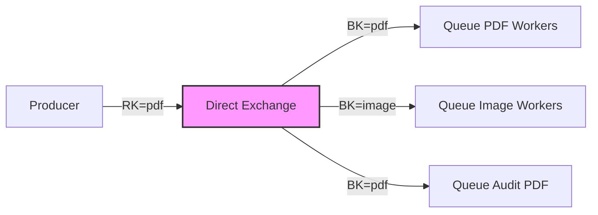
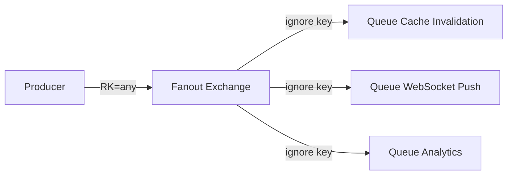
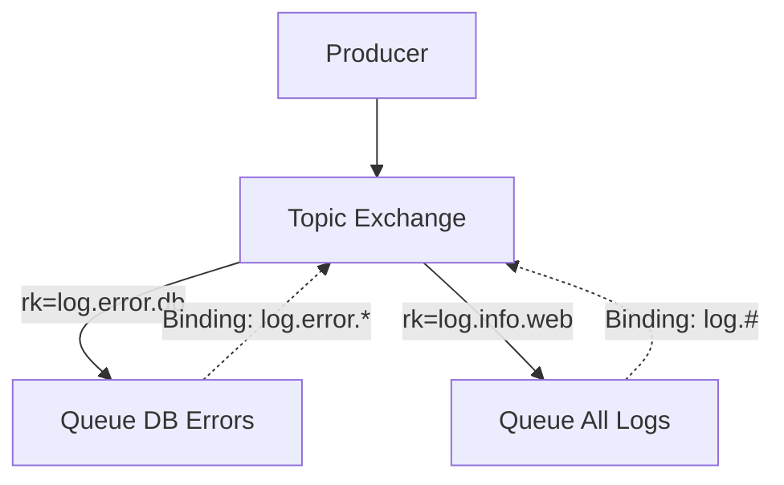

В прошлой статье [[1. RabbitMQ. Архитектура и концепции]] мы выяснили, что в RabbitMQ сообщения никогда не попадают напрямую в очередь. Они всегда публикуются в **Exchange** (Обменник). Именно обменник решает, что делать с сообщением дальше: отбросить его, положить в одну очередь или размножить на несколько.

Этот процесс называется **Маршрутизацией (Routing)**. RabbitMQ предоставляет четыре стандартных типа обменников, которые покрывают 99% архитектурных паттернов. Выбор правильного типа критически влияет на производительность и потребление ресурсов (CPU/Memory) кластером.

## Механика маршрутизации

Когда вы публикуете сообщение, вы всегда указываете два параметра:
1. Имя обменника.
2. **Routing Key (Ключ маршрутизации)** — строка, которая служит "адресом" или "тегом" сообщения.

Когда мы привязываем очередь к обменнику (создаем **Binding**), мы указываем **Binding Key**. Обменник берет *Routing Key* пришедшего сообщения, сравнивает его с *Binding Key* всех привязанных очередей и принимает решение о доставке.

> [!info] Под капотом: Erlang и копирование сообщений
> RabbitMQ написан на Erlang. Когда обменник решает, что сообщение нужно положить в 10 разных очередей, **он не копирует payload (тело) сообщения 10 раз**. 
> В памяти создается только одна копия тела сообщения, а в процессы (горутины мира Erlang), обслуживающие эти 10 очередей, передаются только ссылки (указатели) на это сообщение. Это колоссально экономит оперативную память при массовых рассылках.

---

## 1. Direct Exchange (Прямой обменник)

**Алгоритм:** Сообщение попадает в очередь, если её `Binding Key` **в точности совпадает** с `Routing Key` сообщения.


*На схеме сообщение с `Routing Key = pdf` попадет и в `Queue PDF Workers`, и в `Queue Audit PDF`, так как обе очереди имеют точное совпадение ключа привязки, а `Queue Image Workers` будет проигнорирована.*

**Особенности производительности (Mechanical Sympathy):**
Это **очень быстрый** обменник. Поиск подходящих очередей под капотом реализован через O(1) hash-map lookup в таблице маршрутизации Mnesia (внутренняя распределенная БД RabbitMQ). Нет никаких сложных вычислений регулярных выражений.

> [!warning] Ловушка / Gotcha: Дефолтный обменник
> В RabbitMQ существует предопределенный Direct Exchange без имени (пустая строка `""`). При создании любой новой очереди RabbitMQ автоматически привязывает её к этому безымянному обменнику с Binding Key, равным имени этой очереди.
> Именно поэтому новички часто думают, что публикуют "напрямую в очередь", указывая `ch.Publish("", "my_queue", ...)`. На самом деле они используют неявный Direct Exchange. В production-коде так делать не рекомендуется — всегда объявляйте свои обменники явно.

## 2. Fanout Exchange (Широковещательный обменник)

**Алгоритм:** Игнорирует `Routing Key` полностью. Просто отправляет копию (ссылку) сообщения **во все** привязанные к нему очереди.



**Когда использовать:**
Идеально для паттерна Pub/Sub (Издатель/Подписчик). Например, сервис профилей пользователей обновил аватарку. Он кидает сообщение в Fanout Exchange, а дальше оно разлетается во все сервисы, которым это интересно: кэш сбрасывается, фронтенду пушится апдейт по сокету, аналитика записывает событие.

**Производительность:**
Это **самый быстрый** тип обменника в RabbitMQ. Ему вообще не нужно тратить такты процессора на вычисление совпадений ключей. O(1) операция прохода по списку привязанных очередей.

## 3. Topic Exchange (Тематический обменник)

**Алгоритм:** Маршрутизирует сообщения на основе совпадения `Routing Key` с `Binding Key`, используя шаблоны с подстановочными знаками (wildcards). Ключи должны состоять из слов, разделенных точками (например, `user.created.eu`).

Доступно два спецсимвола:
* `*` (звездочка) — заменяет ровно **одно** слово.
* `#` (решетка) — заменяет **ноль или больше** слов.



Примеры:
* `log.error.*` поймает `log.error.db` и `log.error.auth`, но **не** поймает `log.error` (не хватает одного слова).
* `log.#` поймает `log.error.db`, `log.info`, и просто `log`.

> [!info] Под капотом: Trie (Префиксное дерево)
> Из-за наличия wildcards, RabbitMQ не может использовать простой hash-map для поиска. Для Topic Exchanges таблица маршрутизации компилируется в структуру данных **Trie** (Префиксное дерево). 
> При публикации сообщения RabbitMQ выполняет обход этого дерева. Это означает, что Topic Exchange потребляет больше CPU, чем Direct. Чем больше уровней (точек) в вашем ключе и чем больше `#` в биндингах, тем дольше длится вычисление маршрута. Старайтесь не делать ключи длиннее 3-5 сегментов.

## 4. Headers Exchange (Обменник по заголовкам)

**Алгоритм:** Игнорирует `Routing Key` (как Fanout), но вместо этого смотрит на словарь `Headers` (метаданные), прикрепленный к сообщению. Привязка очереди также содержит словарь заголовков и специальный аргумент `x-match`.

* `x-match: all` — сообщение попадет в очередь, если совпадут **все** заголовки.
* `x-match: any` — сообщение попадет в очередь, если совпадет **хотя бы один** заголовок.

**Производительность:**
Это **самый медленный** обменник. Парсинг заголовков (которые являются динамическими структурами AMQP) обходится очень дорого с точки зрения аллокаций памяти и тактов CPU.

> [!tip] Собеседование
> **Вопрос:** В каких случаях вы выберете Headers Exchange вместо Topic Exchange?
> **Ответ:** На практике Headers Exchange используется крайне редко из-за деградации производительности. Единственный валидный кейс — когда критериев маршрутизации слишком много (больше 10-15) и они опциональны, из-за чего закодировать их в одну строку `Routing Key` с точками для Topic Exchange становится невозможно или слишком запутанно. Во всех остальных случаях Topic предпочтительнее.

---

## Реализация на Go (Idiomatic Go)

Посмотрим, как правильно декларировать обменники и биндинги с использованием `amqp091-go`.
Хорошей практикой является декларация инфраструктуры при старте сервиса, чтобы гарантировать, что сообщения не улетят "в пустоту", если консьюмер еще не запустился.

```go
package main

import (
	"fmt"
	"log"

	amqp "[github.com/rabbitmq/amqp091-go](https://github.com/rabbitmq/amqp091-go)"
)

func setupInfrastructure(ch *amqp.Channel) error {
	const (
		exchangeName = "events.topic"
		queueName    = "audit_logs"
		bindingKey   = "user.#" // Ловим все события пользователей
	)

	// 1. Декларируем Topic Exchange
	// Важно: Durable = true (переживет рестарт брокера)
	err := ch.ExchangeDeclare(
		exchangeName, // name
		"topic",      // kind (direct, fanout, topic, headers)
		true,         // durable
		false,        // auto-delete (удалить когда нет биндингов)
		false,        // internal (только для других обменников)
		false,        // no-wait
		nil,          // args
	)
	if err != nil {
		return fmt.Errorf("exchange declare: %w", err)
	}

	// 2. Декларируем очередь
	q, err := ch.QueueDeclare(
		queueName,
		true,  // durable
		false, // delete when unused
		false, // exclusive (только для этого connection)
		false, // no-wait
		nil,   // args (например x-message-ttl)
	)
	if err != nil {
		return fmt.Errorf("queue declare: %w", err)
	}

	// 3. Создаем Binding между Exchange и Queue
	err = ch.QueueBind(
		q.Name,
		bindingKey,
		exchangeName,
		false, // no-wait
		nil,   // args
	)
	if err != nil {
		return fmt.Errorf("queue bind: %w", err)
	}

	return nil
}
```

## Итоги

1. **Direct** — Быстрый, для точного совпадения (RPC, конкретные задачи).
2. **Fanout** — Самый быстрый, для массовой рассылки копий всем желающим (Pub/Sub).
3. **Topic** — Умный (использует Trie под капотом), для сложной иерархической маршрутизации с wildcards `*` и `#`. Самый популярный в микросервисах.
4. **Headers** — Медленный, маршрутизация по метаданным. Использовать только в крайнем случае.

Теперь, когда мы научились распределять сообщения по нужным направлениям, пора углубиться в то, как и где они хранятся перед обработкой. В следующей статье мы разберем параметры буферов и связей: [[3. Queues и bindings]].