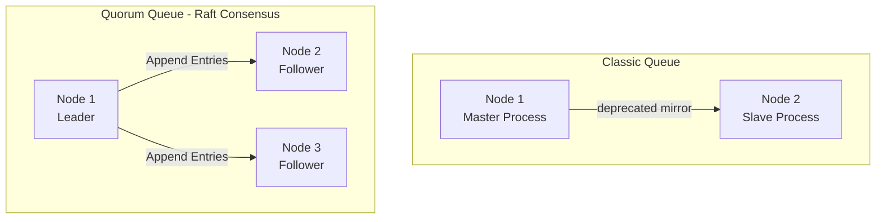

В прошлой статье [[2. Exchanges. Direct, Fanout, Topic, Headers]] мы разобрались, как RabbitMQ принимает решения о маршрутизации с помощью обменников. Теперь мы переходим к финальной точке маршрута внутри брокера — **Очередям (Queues)**, а также к клею, который связывает их с обменниками — **Привязкам (Bindings)**.

Очередь в RabbitMQ — это не просто абстрактный буфер. Это физическая сущность с выделенной памятью, процессом операционной системы (в контексте виртуальной машины Erlang) и строгими правилами управления состоянием.

## Очереди: Фундаментальные свойства

Когда вы объявляете очередь в RabbitMQ, вы должны определить её жизненный цикл. Для этого используются три основных флага:

1. **Durable (Долговечная):** Метаданные очереди сохраняются на диск. Если сервер RabbitMQ перезагрузится, очередь будет восстановлена. 
   *Важно:* Durable очередь **не гарантирует**, что сами сообщения переживут рестарт. Для этого сообщения должны публиковаться с флагом `DeliveryMode = 2 (Persistent)`.
2. **Exclusive (Эксклюзивная):** Очередь привязана к конкретному физическому TCP-соединению (`amqp.Connection`). Как только соединение закрывается (штатно или из-за обрыва сети), очередь **немедленно удаляется**, даже если в ней были сообщения. Идеально подходит для паттерна Request-Reply (RPC), где клиенту нужна временная очередь для получения ответа.
3. **Auto-delete (Автоматически удаляемая):** Очередь удаляется автоматически, когда от неё отключается *последний* Consumer (потребитель). Если к ней никто никогда не подключался, она будет жить бесконечно.

## Под капотом: Как очередь работает с железом

Чтобы писать производительный код, вы должны понимать, как RabbitMQ управляет очередями на уровне ОС.

> [!info] Под капотом: Процессы Erlang и бутылочное горлышко
> В классической архитектуре RabbitMQ **одна очередь = один процесс (актор) Erlang**. 
> Процессы Erlang легковесны, но они исполняются строго последовательно. Это означает, что **одна очередь ограничена пропускной способностью одного ядра CPU**. 
> Если вы генерируете 100 000 сообщений в секунду и пытаетесь пропихнуть их через одну очередь, RabbitMQ упрется в полку по одному ядру, а остальные 63 ядра вашего сервера будут простаивать. 
> **Решение:** Для экстремального throughput необходимо шардировать данные — создавать несколько очередей (например, через Hash Exchange плагин или вручную на уровне приложения) и поднимать консьюмеры для каждой.

### Механизм Paging (Сброс на диск)

RabbitMQ хранит сообщения в оперативной памяти для максимальной скорости. Но память не бесконечна. В RabbitMQ есть параметр `vm_memory_high_watermark` (по умолчанию 40% от RAM сервера). 

Если RabbitMQ видит, что память заканчивается (например, консьюмеры упали, а паблишеры продолжают слать данные), он начинает процесс **Paging**. Он берет сообщения из памяти и агрессивно сбрасывает их на диск, чтобы освободить RAM. 
В этот момент производительность очереди деградирует в десятки раз, так как брокер начинает тратить ресурсы на тяжелый дисковый I/O.

## Эволюция очередей: Classic vs Quorum

В современном RabbitMQ (начиная с версии 3.8+) существует жесткое разделение типов очередей:

1. **Classic Queues:** Стандартные очереди. Раньше для отказоустойчивости (High Availability) их делали зеркалируемыми (Classic Mirrored Queues). Сейчас этот подход **официально признан устаревшим (deprecated)** из-за проблем с split-brain и медленной синхронизацией.
2. **Quorum Queues:** Современный стандарт для надежных систем. Они построены на алгоритме консенсуса **Raft**. Данные реплицируются на несколько узлов кластера. Очередь доступна, пока живо большинство узлов (кворум). Они требуют больше дискового пространства и I/O (так как пишут всё в Write-Ahead Log), но гарантируют сохранность данных без сюрпризов.



## Управление поведением (Queue Arguments)

При создании очереди (`QueueDeclare`) вы можете передать словарь аргументов (`x-arguments`). Это мощнейший инструмент настройки:

* `x-message-ttl`: Время жизни сообщения (в миллисекундах). Если сообщение пролежало в очереди дольше, оно помечается как "мертвое".
* `x-max-length` и `x-max-length-bytes`: Ограничение размера очереди. Полезно для защиты от Out-Of-Memory. Если лимит превышен, старые сообщения вытесняются (drop) или уходят в DLX.
* `x-dead-letter-exchange` (DLX): Куда отправить сообщение, если оно было отвергнуто (Nack), истек TTL или очередь переполнена. Подробнее мы разберем это в статье [[7. Dead letter exchanges]].
* `x-queue-type`: Указывает тип очереди (`classic`, `quorum`, `stream`).

## Bindings: Связующее звено

**Binding (Привязка)** — это запись в таблице маршрутизации (в Mnesia DB), которая говорит обменнику: *"Если сообщение имеет такой-то Routing Key, отправь его в такую-то очередь"*.

Ключевые свойства биндингов:
1. Вы можете привязать одну очередь к **нескольким** обменникам.
2. Вы можете привязать одну очередь к одному обменнику **несколько раз** с разными Binding Keys (например, ловить и `error`, и `critical`).
3. Биндинг сам по себе не потребляет памяти (кроме пары байт в таблице маршрутизации).

> [!warning] Ловушка / Gotcha: Порядок декларации
> Если вы отправите сообщение в Exchange до того, как к нему через Binding будет привязана Queue, сообщение **исчезнет навсегда**. Брокер просто дропнет его (сработает unroutable message behavior). Всегда декларируйте топологию (Exchange -> Queue -> Bind) до начала публикации!

## Практика на Go: Декларация и настройка

Рассмотрим production-ready код создания инфраструктуры с использованием типов и аргументов:

```go
package main

import (
	"fmt"
	amqp "[github.com/rabbitmq/amqp091-go](https://github.com/rabbitmq/amqp091-go)"
)

// DeclareInfrastructure создает Exchange, Quorum очередь и связывает их
func DeclareInfrastructure(ch *amqp.Channel) error {
	const (
		exchangeName = "orders.topic"
		queueName    = "orders_processing"
		routingKey   = "order.created.#"
	)

	// 1. Декларируем Exchange
	err := ch.ExchangeDeclare(
		exchangeName,
		amqp.ExchangeTopic,
		true,  // durable
		false, // auto-delete
		false, // internal
		false, // no-wait
		nil,   // args
	)
	if err != nil {
		return fmt.Errorf("failed to declare exchange: %w", err)
	}

	// 2. Настраиваем аргументы для очереди
	args := amqp.Table{
		"x-queue-type":             "quorum", // Используем надежные Quorum Queues
		"x-dead-letter-exchange":   "orders.dlx", // Отправляем брак в DLX
		"x-message-ttl":            int32(86400000), // Сообщение живет 24 часа (в мс)
		"x-max-length":             int32(10000), // Максимум 10k сообщений (защита от переполнения)
		"x-overflow":               "reject-publish", // Если переполнена - реджектить паблишера
	}

	// 3. Декларируем очередь
	q, err := ch.QueueDeclare(
		queueName,
		true,  // durable - обязательно true для Quorum
		false, // auto-delete
		false, // exclusive
		false, // no-wait
		args,  // передаем настроенную таблицу аргументов
	)
	if err != nil {
		return fmt.Errorf("failed to declare queue: %w", err)
	}

	// 4. Связываем очередь с обменником
	err = ch.QueueBind(
		q.Name,
		routingKey,
		exchangeName,
		false, // no-wait
		nil,   // args
	)
	if err != nil {
		return fmt.Errorf("failed to bind queue: %w", err)
	}

	return nil
}
```

> [!tip] Собеседование
> **Вопрос:** Что произойдет, если два разных микросервиса попытаются задекларировать одну и ту же очередь `my_queue`, но с разными параметрами (например, один с `Durable=true`, а другой с `Durable=false`)?
> **Ответ:** RabbitMQ выдаст канальную ошибку `PRECONDITION_FAILED - inequivalent arg` и закроет канал (`amqp.Channel`), через который поступил некорректный запрос. Брокер не позволяет изменять параметры существующей очереди на лету. Очередь нужно либо удалить и создать заново, либо использовать политику (Policies) кластера для переопределения поведения.

## Итог

1. **Очередь** — это физический буфер (Erlang-процесс), производительность которого ограничена одним ядром CPU.
2. Для временных задач используйте `Exclusive` или `Auto-delete` очереди. Для надежного хранения — `Durable`.
3. Забудьте про Classic Mirrored Queues в новых проектах. Стандарт индустрии для высокой доступности — **Quorum Queues**.
4. Ограничивайте очереди с помощью `x-max-length` и `x-message-ttl`, чтобы защитить брокер от падения по памяти (OOM) и жесткого дискового Paging'а.
5. **Bindings** — это клей, без которого сообщения из Exchange просто улетят в /dev/null.

Теперь мы умеем маршрутизировать и хранить сообщения. Но как брокер узнает, что наш сервис на Go успешно обработал задачу и сообщение можно удалять из памяти? И что делать, если горутина упала с паникой во время обработки? Об этом мы подробно поговорим в следующей статье: [[4. Acknowledgements и delivery guarantees]].