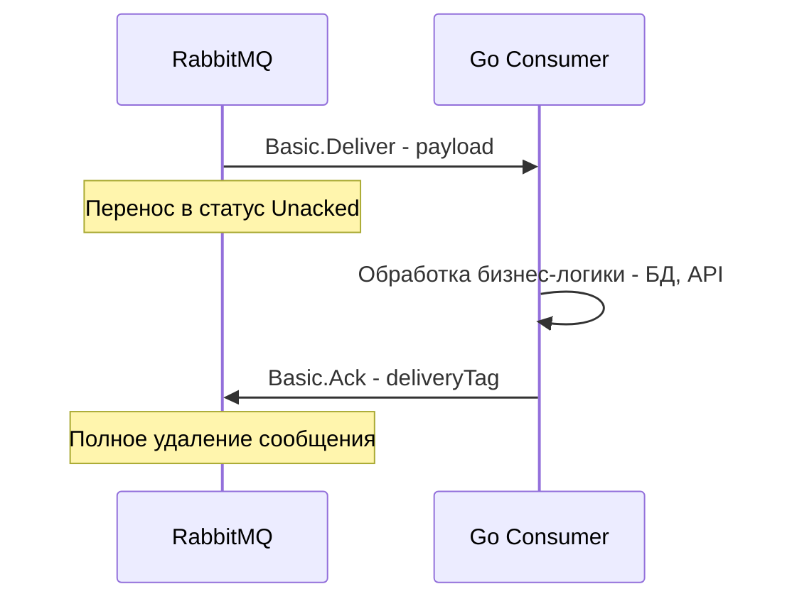
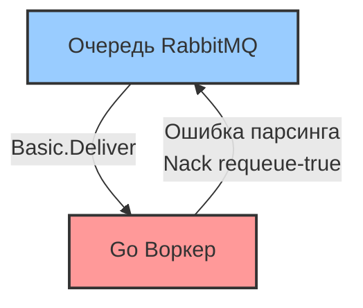

В предыдущей статье [[3. Queues и bindings]] мы разобрали, как сообщения надежно сохраняются внутри очередей RabbitMQ. Но хранение — это лишь половина дела. Главная задача брокера — передать данные консьюмеру и убедиться, что они обработаны. 

Асинхронные системы по своей природе ненадежны: сеть может моргнуть, процесс Go может упасть с `panic`, под в Kubernetes может быть убит OOM-киллером (Out Of Memory) ровно в момент вычисления бизнес-логики. Как RabbitMQ понимает, что сообщение действительно обработано и его можно удалять с диска? Для этого существует механизм **Acknowledgements (Подтверждения)**.

## Гарантии доставки (Delivery Guarantees)

Прежде чем говорить об ACK, нужно зафиксировать, какие гарантии доставки в принципе существуют в распределенных системах и что из этого поддерживает RabbitMQ.

1. **At-most-once (Не более одного раза):** Сообщение доставляется 0 или 1 раз. Возможна потеря сообщений, но дублей не бывает. (Fire-and-forget).
2. **At-least-once (Не менее одного раза):** Сообщение доставляется 1 или более раз. Потеря невозможна, но при сбоях сети возможны дубликаты. **Это золотой стандарт RabbitMQ.**
3. **Exactly-once (Строго один раз):** Священный Грааль распределенных систем. На уровне одного только брокера RabbitMQ (как и Kafka) эта гарантия **недостижима**. Брокер может послать сообщение, консьюмер его обработает, но ответный ACK потеряется в сети. Брокер отправит сообщение снова. 
   *Единственный способ добиться Exactly-once — использовать At-least-once на уровне RabbitMQ и реализовать идемпотентность на стороне консьюмера (об этом будет отдельная статья [[10. Idempotency в message processing]]).*

---

## Consumer Acknowledgements (Подтверждения подписчика)

Когда консьюмер (ваше Go-приложение) подключается к очереди и запрашивает сообщения, RabbitMQ может работать в двух режимах подтверждения.

### 1. Auto-Ack (Fire and Forget)

Если при подписке указать `autoAck: true`, RabbitMQ пометит сообщение как "удаленное" ровно в тот момент, когда **запишет его фреймы в свой исходящий TCP-буфер**. 

> [!warning] Ловушка / Gotcha: Потеря данных
> В режиме Auto-Ack брокеру абсолютно неважно, получил ли ваш Go-процесс сообщение, успел ли он его распарсить и не упал ли с паникой при записи в БД. Если приложение падает или TCP-соединение рвется, все сообщения, находившиеся в буфере сокета или в памяти приложения, **исчезают навсегда**. 
> *Никогда не используйте Auto-Ack в production для критичных бизнес-данных.*

### 2. Manual Ack (Ручное подтверждение)

В production-системах всегда используется `autoAck: false`. В этом режиме ответственность за удаление сообщения перекладывается на ваше приложение.

**Механика работы "Под капотом":**
Когда брокер отправляет сообщение, он не удаляет его из памяти (или с диска Quorum-очереди). Он переводит его во внутренний статус **Unacked** (Не подтверждено) и закрепляет за конкретным `amqp.Channel`. 



> [!info] Под капотом: State & Network Partitions
> В отличие от Kafka, где брокер ничего не знает о состоянии консьюмера (консьюмер сам двигает свой offset), **RabbitMQ хранит состояние доставки (Unacked) у себя в памяти (в Erlang-процессе очереди)**. 
> Если TCP-соединение между вашим Go-приложением и RabbitMQ внезапно рвется (таймаут, падение пода, сетевой сплит), RabbitMQ замечает закрытие сокета и **немедленно возвращает все сообщения со статусом Unacked обратно в статус Ready**, помещая их в начало очереди. Они будут доставлены первому же свободному консьюмеру.

---

## Негативные подтверждения (Nack и Reject)

Если во время обработки сообщения в Go произошла ошибка (отвалилась БД, невалидный JSON, ошибка валидации), вы не должны делать `Ack`. Вы должны явно сказать брокеру, что обработка провалилась. Для этого есть две команды:

1. `Basic.Reject` — отклонить одно конкретное сообщение.
2. `Basic.Nack` (Negative Acknowledgement) — расширение протокола от RabbitMQ, позволяющее отклонить сразу пакет сообщений (bulk).

При вызове `Nack` или `Reject` вы обязаны передать критически важный флаг: **requeue** (поместить обратно в очередь).

### Requeue = true (Осторожно, мины!)

Если вы говорите `requeue: true`, брокер вернет сообщение обратно в очередь. 
**Проблема:** Сообщение снова окажется первым в очереди, RabbitMQ снова отдаст его вашему консьюмеру, консьюмер снова упадет с ошибкой (например, из-за битого JSON) и снова сделает `Nack(requeue=true)`. 



Это классический **Poison Message Loop** (Цикл отравленного сообщения). Ваш консьюмер начнет бесконечно крутиться в цикле, потребляя 100% CPU, сжигая сеть и блокируя обработку всех остальных (валидных) сообщений в очереди.

### Requeue = false (Правильный путь)

Если ошибка детерминирована (например, инвалидный payload) или количество ретраев исчерпано, нужно делать `Nack(requeue=false)`. В этом случае сообщение будет либо удалено навсегда, либо, что более правильно, сброшено в **Dead Letter Exchange (DLX)** для последующего ручного разбора или отложенного ретрая. Подробно эту механику мы разберем в статье [[7. Dead letter exchanges]].

---

## Publisher Confirms: Как отправителю спать спокойно?

На собеседованиях часто концентрируются на консьюмерах, забывая про отправителей (Producers). 

> [!tip] Собеседование
> **Вопрос:** Вы вызываете `ch.Publish(...)` в Go, функция возвращает `err == nil`. Гарантирует ли это, что сообщение сохранено в RabbitMQ?
> **Ответ:** Нет! Функция `Publish` в библиотеке `amqp091-go` лишь синхронно пишет байты фрейма в буфер сокета операционной системы (syscall `write`). Если сервер RabbitMQ выключится через миллисекунду после этого, сообщение потеряется, а ваше приложение об этом даже не узнает.

Чтобы добиться At-least-once на стороне отправителя, нужно использовать **Publisher Confirms** (Подтверждения публикатора).

Механика:
1. Вы переводите канал в режим подтверждений: `ch.Confirm(false)`.
2. Библиотека начинает асинхронно слушать ответы от брокера.
3. Брокер присылает `Basic.Ack` отправителю **только после того**, как сообщение достигнет очередей и будет физически записано на диск (в случае Durable/Quorum очередей).

Это слегка замедляет отправку (требуется ожидание round-trip по сети и дискового I/O брокера), но является единственным способом не терять данные при публикации.

---

## Идиоматичный Go-код консьюмера с Manual Ack

Посмотрим на правильную реализацию консьюмера, который защищен от утечек памяти и корректно обрабатывает сообщения:

```go
package main

import (
	"context"
	"log"

	amqp "[github.com/rabbitmq/amqp091-go](https://github.com/rabbitmq/amqp091-go)"
)

func startConsumer(ch *amqp.Channel, queueName string) error {
	// 1. Подписываемся с autoAck: false
	msgs, err := ch.Consume(
		queueName,
		"my_go_consumer", // consumer tag
		false,            // autoAck (СТРОГО FALSE)
		false,            // exclusive
		false,            // noLocal
		false,            // noWait
		nil,              // args
	)
	if err != nil {
		return err
	}

	// 2. Читаем канал в горутине
	go func() {
		for d := range msgs {
			// Обрабатываем сообщение
			err := processBusinessLogic(d.Body)
			
			if err != nil {
				log.Printf("Error processing message: %v", err)
				// Если ошибка (например, кривой JSON) - Nack без requeue
				// Сообщение улетит в DLX (если настроено) или удалится
				_ = d.Nack(false, false) // multiple=false, requeue=false
				continue
			}

			// 3. Явный Ack при успехе
			// Важно: Ack отправляется асинхронно по тому же TCP-каналу.
			err = d.Ack(false) // multiple=false
			if err != nil {
				log.Printf("Failed to Ack message: %v", err)
				// Если Ack не прошел, значит канал скорее всего мертв,
				// при переподключении брокер выдаст это сообщение снова.
			}
		}
	}()

	return nil
}

func processBusinessLogic(data []byte) error {
	// Эмуляция тяжелой работы с БД
	return nil
}
```

> [!warning] Ловушка / Gotcha: Утечка памяти (Memory Leak) в RabbitMQ
> Самая частая проблема Junior-разработчиков: они выставили `autoAck: false`, но забыли написать `d.Ack(false)` в ветке успешного выполнения или в одном из `if err != nil { return }`. 
> 
> **Что произойдет?** Go-приложение успешно потребит сообщение, но брокер навсегда оставит его в статусе **Unacked**. Со временем счетчик Unacked дойдет до десятков или сотен тысяч. RabbitMQ исчерпает всю RAM, упрется в High Watermark, остановит публикацию всех новых сообщений (Global Flow Control) или просто упадет. Мониторинг метрики `Unacked Messages` в Grafana — обязательное условие для production.

## Итог

1. **Гарантии:** RabbitMQ обеспечивает At-least-once доставку только при использовании Manual ACKs на консьюмере и Publisher Confirms на паблишере.
2. **State:** Состояние обработки (Unacked) хранится в памяти брокера (Erlang). При обрыве соединения сообщения автоматически возвращаются в очередь (Ready).
3. **Poison Messages:** Никогда не делайте слепой `Nack(requeue=true)` при ошибках обработки. Используйте `requeue=false` и DLX, иначе убьете CPU бесконечным циклом.
4. **Утечки:** Всегда следите за тем, чтобы каждый путь выполнения (success и все ветки error) заканчивался вызовом `Ack` или `Nack`. Забытый Ack убивает кластер RabbitMQ по памяти.

Теперь мы умеем надежно забирать сообщения. Но что, если сообщений в очереди миллион, а наш Go-воркер может обрабатывать только 10 в секунду? Как не захлебнуться и не уронить память Go-приложения? Об этом мы поговорим в следующей статье: [[5. Prefetch и QoS]].