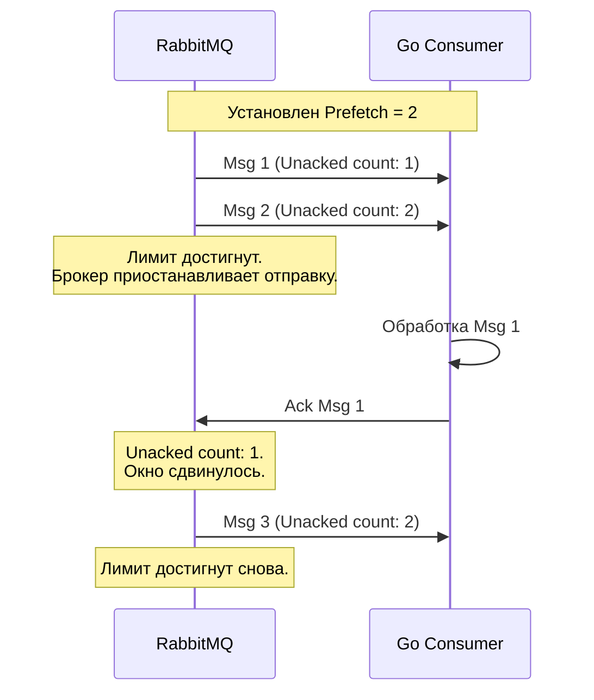

В прошлой статье [[4. Acknowledgements и delivery guarantees]] мы разобрались, как с помощью ручных подтверждений (Manual Ack) избежать потери данных. Мы научились забирать сообщение, обрабатывать его и только потом говорить брокеру: «Всё ок, удаляй». 

Но здесь кроется фундаментальная проблема архитектуры Push-систем. Что произойдет, если в очереди скопился 1 миллион сообщений (например, после ночного даунтайма БД), а вы запускаете свой Go-воркер?

## Эффект пожарного гидранта (The Firehose Problem)

По умолчанию, как только вы вызываете `ch.Consume()` без дополнительных настроек, RabbitMQ начинает выгружать сообщения в ваш консьюмер **на максимально возможной скорости сети**. Брокер не спрашивает, успеваете ли вы их обрабатывать.

**Mechanical Sympathy: Как это убивает Go-приложение?**
1. Брокер непрерывно шлет AMQP-фреймы по TCP.
2. Сетевой стек Linux на вашем сервере заполняет TCP-буфер (Receive Buffer).
3. Планировщик Go (`netpoll`) видит входящие данные, будит горутину, которая читает из сокета (`amqp091-go` background reader).
4. На каждое сообщение аллоцируется структура `amqp.Delivery` и слайс байт (payload) в куче (Heap).
5. Сообщения складываются во внутренний Go-канал, из которого читает ваш воркер.

Если ваш воркер обрабатывает 10 сообщений в секунду (тяжелые запросы в БД), а брокер пушит 10 000 сообщений в секунду, внутренний канал мгновенно заполняется. Сборщик мусора (GC) в Go сходит с ума от миллионов живых объектов в памяти. В итоге процесс гарантированно ловит **Out Of Memory (OOM) Killer** от операционной системы.

## Решение: Prefetch Count (QoS)

Чтобы защитить консьюмер и реализовать паттерн **Backpressure** (обратное давление), протокол AMQP использует механизм **QoS (Quality of Service)**, а конкретно параметр `prefetch_count`.

**Prefetch Count** — это лимит на количество **Unacknowledged (неподтвержденных)** сообщений, которые консьюмер может держать у себя одновременно. Это классический механизм *скользящего окна (sliding window)*, похожий на управление окном в TCP.



Если вы установили `prefetch_count = 100`, брокер отправит вам 100 сообщений и остановится. Как только вы сделаете `Ack` для первого сообщения, лимит освободится на 1, и брокер пришлет 101-е сообщение. Сообщения сверх лимита спокойно лежат на диске или в памяти RabbitMQ, ожидая своей очереди.

> [!info] Под капотом: Prefetch Size
> Спецификация AMQP также описывает параметр `prefetch_size` (лимит окна в мегабайтах). Однако **RabbitMQ исторически не поддерживает этот параметр** (его реализация требовала бы слишком больших накладных расходов в Erlang). Поэтому в коде мы всегда передаем `prefetch_size = 0`. Лимитирование происходит только по *количеству* сообщений.

## Как выбрать правильный Prefetch?

Выбор `prefetch_count` — это всегда компромисс между **Latency** (задержкой сети) и **Throughput** (пропускной способностью) + **Fairness** (честностью распределения).

### Стратегия 1: `Prefetch = 1` (Максимальная честность)
* **Когда использовать:** Задачи занимают значительное, но непредсказуемое время (от 1 секунды до нескольких минут). Например, ресайз изображений, генерация PDF, тяжелые ML-инференсы.
* **Плюсы:** Идеальное распределение нагрузки (Fair Dispatch). Если у вас 10 воркеров, быстрые воркеры будут забирать новые задачи, пока медленные пыхтят над тяжелым PDF. Ни одно сообщение не будет простаивать в локальном буфере занятого воркера.
* **Минусы:** Чудовищный оверхед на сеть. Воркер простаивает (ждет I/O), пока сообщение летит по сети после каждого Ack.

### Стратегия 2: `Prefetch = 100 - 1000` (Максимальная пропускная способность)
* **Когда использовать:** Обработка очень быстрая (миллисекунды). Например, кэширование, инсерты в Clickhouse, обновление метрик.
* **Плюсы:** Пока воркер обрабатывает сообщение N, сообщение N+1 уже лежит в памяти Go-процесса, готовое к моментальной обработке. Сетевая задержка (RTT) полностью нивелируется.
* **Минусы:** "Голодание" других консьюмеров. Если один воркер заберет 1000 сообщений в свой буфер и внезапно начнет тормозить, эти сообщения будут недоступны для других (свободных) воркеров, пока первый их не обработает (или пока TCP соединение не умрет).

> [!tip] Собеседование
> **Вопрос:** У нас есть очередь. Один консьюмер (prefetch=0) читает из нее данные, но медленно. Мы добавили еще 5 консьюмеров, чтобы распараллелить работу, но они простаивают, а очередь не уменьшается. В чем дело?
> **Ответ:** Первый консьюмер (с `prefetch=0` или без ограничения QoS) уже "высосал" всю очередь в свой локальный буфер (сетевой стек и память процесса). RabbitMQ считает все эти сообщения доставленными (Unacked) и привязанными к первому консьюмеру. Для брокера очередь формально пуста. Новым консьюмерам просто нечего отдавать. Решение — жесткий лимит QoS на всех консьюмерах.

## Реализация на Go: `global` flag gotcha

В клиенте `amqp091-go` метод настройки QoS выглядит так: `ch.Qos(prefetchCount, prefetchSize, global)`.

Здесь кроется важный нюанс с флагом `global`, который ведет себя в RabbitMQ не совсем так, как в чистой спецификации AMQP:
* `global = false` — лимит применяется к **каждому новому Consumer** (вызову `ch.Consume`), созданному на этом канале.
* `global = true` — лимит делится (шарится) между **всеми Consumers** на этом конкретном канале (`amqp.Channel`).

В прошлой статье мы договорились, что в Go-приложениях мы создаем **один Channel на одного Consumer** во избежание lock contention. При такой архитектуре разницы между `global = true` и `global = false` практически нет. Тем не менее, идиоматично использовать `false`.

```go
package main

import (
	"log"
	amqp "[github.com/rabbitmq/amqp091-go](https://github.com/rabbitmq/amqp091-go)"
)

func startWorker(ch *amqp.Channel, queueName string) error {
	// 1. Устанавливаем QoS ДО подписки на очередь!
	// Это критически важно. Если сделать Consume до Qos,
	// брокер успеет "выплюнуть" тысячи сообщений.
	err := ch.Qos(
		100,   // prefetch count: держим не более 100 сообщений в памяти
		0,     // prefetch size: всегда 0 в RabbitMQ
		false, // global: лимит привязан к конкретному консьюмеру
	)
	if err != nil {
		return err
	}

	// 2. Только после настройки Qos начинаем чтение
	msgs, err := ch.Consume(
		queueName,
		"",    // генерируем случайный тег
		false, // autoAck = false (обязательно при Qos!)
		false, false, false, nil,
	)
	if err != nil {
		return err
	}

	for d := range msgs {
		process(d)
		d.Ack(false)
	}
	
	return nil
}

func process(d amqp.Delivery) {
    // Бизнес-логика
}
```

> [!warning] Ловушка / Gotcha: QoS и Auto-Ack
> Настройка `QoS` работает **только в связке с ручными подтверждениями** (`autoAck = false`). 
> Если вы вызовете `ch.Consume(..., autoAck=true, ...)`, брокер будет полностью игнорировать ваши настройки Prefetch и продолжит спамить вас сообщениями на максимальной скорости. Механизм скользящего окна опирается на Ack-сигналы, а в режиме fire-and-forget их нет.

## Итог

1. **Backpressure:** Ни один production-ready консьюмер не должен работать без явно заданного `Qos()`. Иначе — OOM.
2. **Баланс:** Для тяжелых задач (секунды) ставьте `Prefetch = 1..5`. Для быстрых легковесных (миллисекунды) — `Prefetch = 100..500`.
3. **Порядок:** Вызов метода `ch.Qos()` всегда должен происходить **до** вызова `ch.Consume()`. 

Итак, мы умеем создавать очереди, настраивать надежную доставку и защищать наш сервис от потопа сообщений. Но до сих пор мы рассматривали простую маршрутизацию. Что если нам нужно перенаправлять потоки логов в разные системы в зависимости от уровня критичности, динамически создавая правила? Для этого мы переходим к изучению сложных топологий в статье [[6. Routing patterns]].