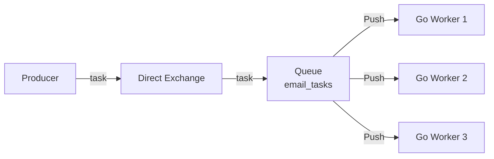
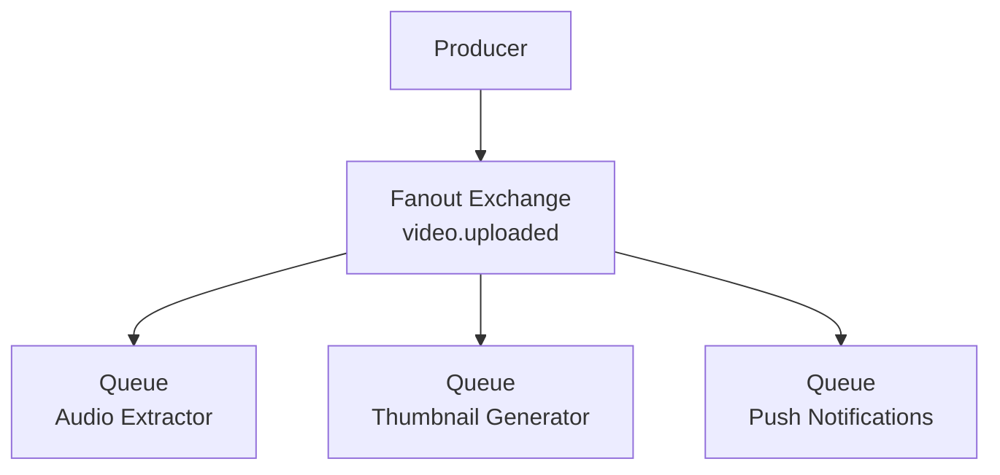
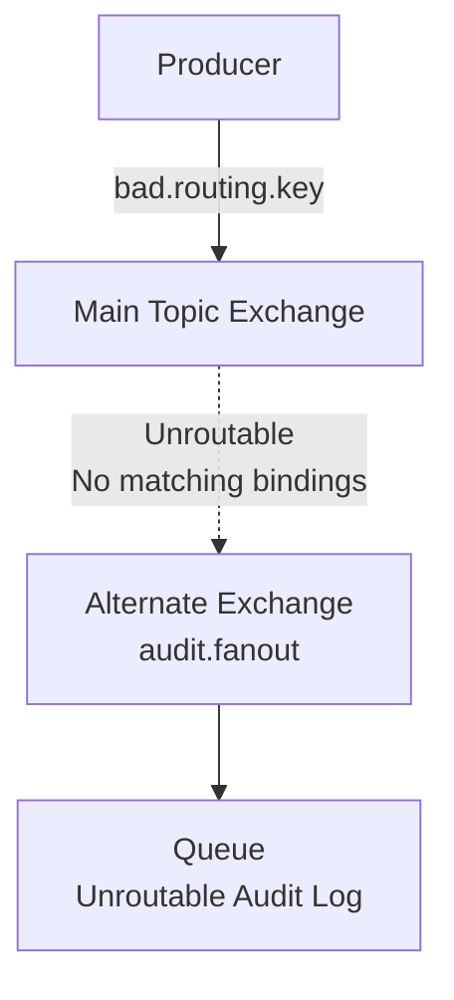

В статье [[2. Exchanges. Direct, Fanout, Topic, Headers]] мы разобрали базовые механизмы маршрутизации: как обменники принимают решения на основе Routing Key. В [[5. Prefetch и QoS]] мы настроили безопасное потребление сообщений, защитив наши Go-воркеры от OOM. 

Теперь мы объединим эти знания. В enterprise-разработке голые обменники и очереди почти не используются изолированно. Они собираются в **Топологии (Topologies)** или **Паттерны маршрутизации (Routing Patterns)**, которые решают конкретные архитектурные задачи. 

В этой статье мы разберем классические паттерны интеграции через RabbitMQ, их имплементацию и то, как они работают под капотом виртуальной машины Erlang.

---

## 1. Work Queues (Competing Consumers)

Самый базовый и частый паттерн. У вас есть один поток задач (например, отправка email), и вы хотите распараллелить его обработку между N экземплярами вашего Go-микросервиса.

**Реализация:**
Один Direct Exchange (или дефолтный безымянный обменник `""`), одна очередь и множество воркеров (Consumers), слушающих эту очередь.



**Mechanical Sympathy:**
RabbitMQ распределяет сообщения между консьюмерами по алгоритму **Round-Robin** (по кругу). Однако, это распределение зависит от параметра `prefetch_count`, который мы разбирали ранее. Если у `Worker 1` буфер Prefetch заполнен, RabbitMQ "перепрыгнет" его и отдаст задачу `Worker 2`.
С точки зрения Erlang, очередь — это один процесс (actor). Все 3 TCP-соединения воркеров взаимодействуют с этим единственным процессом, что может стать бутылочным горлышком (lock contention) при миллионах RPS.

> [!warning] Ловушка / Gotcha: Порядок сообщений (Ordering)
> В паттерне Competing Consumers **гарантия порядка обработки сообщений теряется**. 
> Даже если RabbitMQ отдаст Msg1 первому воркеру, а Msg2 — второму, второй воркер может завершить работу быстрее (или первый упадет и сделает requeue). Если для вашей бизнес-логики важен строгий порядок (например, сначала `UserCreated`, потом `UserUpdated`), этот паттерн "в лоб" применять нельзя. Потребуется хэширование Routing Key по партициям (как в Kafka), что для классического RabbitMQ реализуется через плагин `rabbitmq-consistent-hash-exchange`.

## 2. Publish / Subscribe (Broadcast)

Паттерн, при котором одно событие должно быть доставлено всем заинтересованным подсистемам. Например: загружено новое видео. Нужно: 1) извлечь аудио, 2) нарезать превью, 3) отправить push-уведомление подписчикам.

**Реализация:**
Один Fanout Exchange, к которому привязано N независимых очередей (по одной на каждую подсистему).



> [!info] Под капотом: Zero-Copy Delivery
> Новички часто думают: *"Если я отправляю файл размером 1 МБ в Fanout обменник, и у меня 10 очередей, RabbitMQ сожрет 10 МБ памяти?"*
> **Нет.** Виртуальная машина BEAM (Erlang) использует иммутабельные структуры данных. Тело сообщения (Payload) аллоцируется в общей куче (Shared Heap) ровно один раз. В процессы очередей `Q1`, `Q2`, `Q3` передаются лишь легковесные **ссылки (pointers)** на этот payload. Копирования памяти не происходит.

## 3. Content-Based Routing (Topic Tree)

Самый мощный паттерн для событийно-ориентированной архитектуры (Event-Driven Architecture). Позволяет микросервисам подписываться только на ту часть потока данных, которая им действительно нужна.

**Реализация:**
Topic Exchange и строгая конвенция именования ключей маршрутизации.
*Правильный Routing Key* должен выглядеть как иерархия: `<domain>.<entity>.<action>.<version>`.
Например: `billing.invoice.paid.v1`.

Консьюмеры используют wildcards (`*` и `#`) для биндингов:
* Сервис аудита ловит всё: `#`
* Сервис аналитики оплат ловит: `billing.invoice.paid.*`
* Сервис истории пользователя ловит все действия с инвойсами: `billing.invoice.*.v1`

**Оптимизация:**
Таблица маршрутизации для Topic Exchange хранится в распределенной БД Mnesia в виде префиксного дерева (Trie). Глубокие деревья (более 5-6 сегментов, разделенных точками) начинают потреблять ощутимое количество CPU при вычислении маршрута для каждого сообщения. Держите иерархию плоской.

## 4. Wire Tap (Прослушка / Аудит) и Alternate Exchange

Паттерн Wire Tap позволяет прозрачно "прослушивать" трафик без изменения логики отправителя и получателя. 
В RabbitMQ это элегантно реализуется через встроенный механизм **Alternate Exchange (AE)**.

**Задача:** Мы хотим логировать все сообщения, которые из-за бага в Routing Key или отсутствия биндингов не попали ни в одну очередь (unroutable messages). По умолчанию брокер их просто "роняет" (drop).

**Реализация:**
При создании основного обменника мы указываем аргумент `alternate-exchange`. Если основной обменник не находит подходящую очередь, он молча перенаправляет сообщение в AE.

```go
// Декларация основного обменника с Alternate Exchange
args := amqp.Table{
    "alternate-exchange": "audit.fanout", // Куда скидывать "сирот"
}
err := ch.ExchangeDeclare("main.topic", "topic", true, false, false, false, args)
```



> [!tip] Собеседование
> **Вопрос:** Чем Alternate Exchange отличается от Dead Letter Exchange (DLX)?
> **Ответ:** Alternate Exchange срабатывает на этапе **маршрутизации** (когда сообщение еще не попало ни в одну очередь). DLX срабатывает **внутри очереди** (когда сообщение было отвергнуто консьюмером, истек его TTL или очередь переполнилась).

## 5. Request-Reply (RPC через RabbitMQ)

Иногда нам нужен синхронный (с точки зрения бизнес-логики) ответ через асинхронный транспорт. Например, API-Gateway (Go) отправляет запрос в тяжелый Python-сервис ML-инференса и ждет результат.

**Механика AMQP RPC:**
1. Клиент создает временную (Exclusive) очередь для ответов.
2. Клиент отправляет сообщение в очередь сервера, указывая два мета-поля:
   * `ReplyTo`: имя своей временной очереди.
   * `CorrelationId`: уникальный UUID запроса.
3. Сервер обрабатывает задачу и отправляет ответ в очередь, указанную в `ReplyTo`, прикрепляя тот же `CorrelationId`.
4. Клиент получает ответ и по `CorrelationId` понимает, какую горутину разбудить.

**Mechanical Sympathy (Архитектура в Go):**
Многие новички создают новую `Exclusive` очередь на *каждый* HTTP-запрос. 
Это **фатальная ошибка**. Создание очереди в RabbitMQ — это транзакция в Mnesia кластере. Вы убьете кластер при 100 RPS.

**Правильный паттерн в Go:**
Микросервис-клиент при старте создает **одну** постоянную очередь для ответов на весь инстанс сервиса. Ответы маршрутизируются горутинам внутри памяти Go через `sync.Map` и `channels`.

### Идиоматичный Go-код RPC-Клиента

```go
package rpc

import (
	"context"
	"fmt"
	"sync"
	"time"

	"[github.com/google/uuid](https://github.com/google/uuid)"
	amqp "[github.com/rabbitmq/amqp091-go](https://github.com/rabbitmq/amqp091-go)"
)

type RPCClient struct {
	ch       *amqp.Channel
	replyQ   string
	requests sync.Map // map[string]chan []byte (CorrelationId -> channel)
}

func NewRPCClient(ch *amqp.Channel) (*RPCClient, error) {
	// 1. Создаем ОДНУ очередь для ВСЕХ ответов этого инстанса
	q, err := ch.QueueDeclare(
		"",    // Имя сгенерирует брокер
		false, // durable
		true,  // auto-delete (удалится при выключении клиента)
		true,  // exclusive
		false, nil,
	)
	if err != nil {
		return nil, err
	}

	client := &RPCClient{
		ch:     ch,
		replyQ: q.Name,
	}

	// 2. Запускаем фоновый слушатель ответов
	msgs, err := ch.Consume(q.Name, "", true, false, false, false, nil)
	if err != nil {
		return nil, err
	}

	go client.listenForReplies(msgs)

	return client, nil
}

func (c *RPCClient) listenForReplies(msgs <-chan amqp.Delivery) {
	for d := range msgs {
		// Ищем канал ожидания по CorrelationId
		if chWaitAny, ok := c.requests.LoadAndDelete(d.CorrelationId); ok {
			chWait := chWaitAny.(chan []byte)
			chWait <- d.Body // Будим ожидающую горутину
			close(chWait)
		}
	}
}

// Call - синхронный вызов для внешнего кода
func (c *RPCClient) Call(ctx context.Context, targetQueue string, payload []byte) ([]byte, error) {
	corrId := uuid.NewString()
	waitCh := make(chan []byte, 1) // Буферизированный, чтобы слушатель не заблокировался

	// Регистрируем ожидание
	c.requests.Store(corrId, waitCh)
	
	// Очистка при таймауте, чтобы не было утечек памяти в sync.Map
	defer c.requests.Delete(corrId)

	err := c.ch.PublishWithContext(ctx,
		"", targetQueue, false, false,
		amqp.Publishing{
			ContentType:   "application/json",
			CorrelationId: corrId, // Указываем ID
			ReplyTo:       c.replyQ, // Куда слать ответ
			Body:          payload,
		})
	if err != nil {
		return nil, fmt.Errorf("publish failed: %w", err)
	}

	// Ждем ответа или таймаута контекста
	select {
	case <-ctx.Done():
		return nil, ctx.Err()
	case res := <-waitCh:
		return res, nil
	}
}
```

## Итог

1. **Work Queues:** Для балансировки нагрузки. Помните, что строгий порядок сообщений не гарантируется.
2. **Pub/Sub:** Для нотификаций множества систем. Максимально эффективен по памяти благодаря механике ссылок в Erlang.
3. **Topic Routing:** База для микросервисов. Проектируйте `Routing Key` иерархически, но избегайте излишней глубины.
4. **Wire Tap & AE:** Используйте Alternate Exchange для отлова "заблудившихся" сообщений на этапе маршрутизации.
5. **RPC:** Возможен, но требует аккуратности. Никогда не создавайте очередь на каждый запрос — мультиплексируйте ответы через одну очередь и `sync.Map` в памяти Go.

Мы научились гибко маршрутизировать сообщения и ловить те, которые не нашли свой путь в очередь. Но что делать с сообщениями, которые успешно попали в очередь, но наш консьюмер не смог их обработать из-за внутренней ошибки или битого JSON? Такие сообщения не должны блокировать систему. Для управления "ядовитыми" данными мы переходим к изучению критически важного механизма в статье [[7. Dead letter exchanges]].