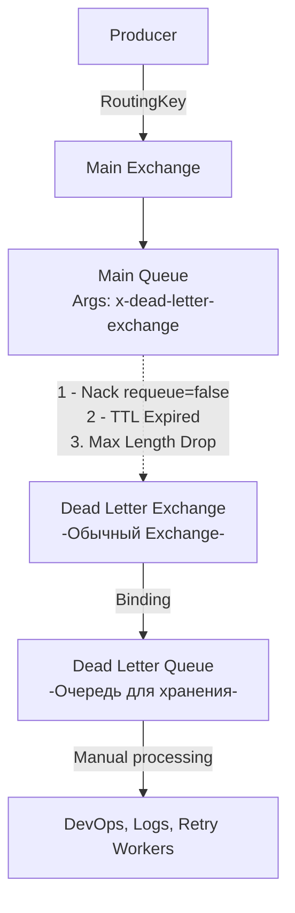

В прошлой статье [[6. Routing patterns]] мы научились строить сложные топологии и отлавливать "потерянные" сообщения на этапе маршрутизации с помощью Alternate Exchange. 

Но что происходит с сообщением, которое успешно достигло очереди, было передано вашему Go-воркеру, но воркер не смог его обработать? Например, структура JSON изменилась, обязательное поле отсутствует, или база данных отклонила транзакцию из-за нарушения уникального ключа. 

Если мы сделаем `Nack(requeue=true)`, мы получим Poison Message Loop (бесконечный цикл переотправки), который убьет CPU. Если сделаем `Nack(requeue=false)`, сообщение просто исчезнет навсегда. Для надежной enterprise-архитектуры оба варианта неприемлемы. Нам нужен механизм безопасной "парковки" бракованных данных. Этим механизмом является **Dead Letter Exchange (DLX)**.

## Что такое DLX?

**Dead Letter Exchange (Обменник мертвых писем)** — это **не** какой-то специальный тип обменника. Это абсолютно обычный обменник (Direct, Topic, Fanout), которому делегирована определенная *роль*. 

Любая очередь в RabbitMQ может быть настроена так, чтобы при "смерти" сообщения внутри этой очереди, процесс-владелец очереди автоматически публиковал это сообщение в указанный DLX.

### 3 причины "смерти" сообщения

RabbitMQ перенаправит сообщение в DLX только при наступлении одного из трех строго определенных событий:

1. **Rejected / Nacked:** Консьюмер (ваш Go-код) явно отклонил сообщение с помощью `Basic.Reject` или `Basic.Nack` с обязательным флагом `requeue = false`.
2. **TTL Expired:** У сообщения истек срок жизни (Time-To-Live). Это может быть TTL самой очереди (`x-message-ttl`) или TTL конкретного сообщения, заданный паблишером.
3. **Queue Length Limit:** Очередь переполнена (достигнут лимит `x-max-length` или `x-max-length-bytes`), и брокер настроен на вытеснение старых сообщений (поведение по умолчанию — `drop-head`). Вытесненные сообщения улетают в DLX.



> [!info] Под капотом: Очередь как Publisher
> С точки зрения архитектуры Erlang/OTP, когда наступает условие "смерти", Erlang-процесс самой очереди (Main Queue) выступает в роли внутреннего Producer-а. Он берет оригинальное сообщение, модифицирует его заголовки (добавляет метки смерти) и выполняет внутренний вызов маршрутизации в целевой DLX. Это происходит асинхронно и очень быстро, не блокируя основной поток обработки сообщений.

## Маршрутизация "мертвецов" (Routing Keys)

Когда процесс очереди отправляет сообщение в DLX, он по умолчанию **сохраняет его оригинальный Routing Key**. 

Например:
1. Сообщение было опубликовано с ключом `order.created`.
2. Оно попало в `orders_queue`.
3. Консьюмер сделал `Nack(requeue=false)`.
4. Очередь пересылает его в `orders_dlx` с ключом `order.created`.

Но часто нам нужно изменить этот ключ. Например, мы хотим сбрасывать все мертвые сообщения из десятка разных очередей в одну общую `global_dlq` через один `global_dlx`. В этом случае при настройке очереди мы можем задать аргумент `x-dead-letter-routing-key`. Если он задан, очередь "перепишет" Routing Key перед отправкой в DLX.

## Заголовок `x-death`: Анатомия трагедии

Когда RabbitMQ отправляет сообщение в DLX, он обогащает его метаданными. В разделе `Headers` сообщения появляется массив (список словарей) с ключом `x-death`. 

Каждый элемент этого массива описывает один инцидент смерти. Если сообщение ходит по кругу (что бывает при сложных схемах ретраев), массив будет расти.

Что содержит запись `x-death`:
* `reason`: Причина (`rejected`, `expired`, `maxlen`).
* `queue`: Имя очереди, в которой умерло сообщение.
* `time`: Timestamp события.
* `exchange`: Имя обменника, через который оно попало в мертвую очередь.
* `routing-keys`: Массив оригинальных ключей маршрутизации.
* `count`: Сколько раз это сообщение умирало в этой конкретной очереди по этой конкретной причине (RabbitMQ схлопывает одинаковые события, увеличивая счетчик, чтобы массив `x-death` не рос бесконечно).

> [!warning] Ловушка / Gotcha: Производительность и x-death
> В высоконагруженных системах, если сообщения начинают массово падать в DLX (например, отвалилась БД), размер заголовка `x-death` может стать проблемой. RabbitMQ тратит CPU на парсинг и сериализацию этих заголовков. Более того, при использовании Quorum Queues частые записи в DLX создают дополнительную нагрузку на Raft-консенсус (двойной I/O: чтение/удаление из основной очереди и запись в DLQ). 

## Реализация инфраструктуры на Go

Ниже показан идиоматичный, production-ready пример декларации основной очереди и её DLX/DLQ окружения.

```go
package main

import (
	"fmt"
	amqp "[github.com/rabbitmq/amqp091-go](https://github.com/rabbitmq/amqp091-go)"
)

// DeclareQueueWithDLX создает полный контур обработки с Dead Letter
func DeclareQueueWithDLX(ch *amqp.Channel) error {
	const (
		mainExchange = "events.topic"
		mainQueue    = "processing_queue"
		dlxExchange  = "events.dlx"
		dlqQueue     = "processing_dlq"
	)

	// 1. Декларируем DLX (это просто обычный Direct Exchange)
	err := ch.ExchangeDeclare(dlxExchange, amqp.ExchangeDirect, true, false, false, false, nil)
	if err != nil {
		return fmt.Errorf("declare DLX: %w", err)
	}

	// 2. Декларируем DLQ (Dead Letter Queue)
	_, err = ch.QueueDeclare(dlqQueue, true, false, false, false, nil)
	if err != nil {
		return fmt.Errorf("declare DLQ: %w", err)
	}

	// 3. Биндим DLQ к DLX. 
	// Мы будем использовать переопределенный Routing Key "dead.processing"
	err = ch.QueueBind(dlqQueue, "dead.processing", dlxExchange, false, nil)
	if err != nil {
		return fmt.Errorf("bind DLQ: %w", err)
	}

	// 4. Подготавливаем аргументы для основной очереди!
	args := amqp.Table{
		"x-queue-type":               "quorum",          // Всегда используем Quorum в проде
		"x-dead-letter-exchange":     dlxExchange,       // Куда слать трупы
		"x-dead-letter-routing-key":  "dead.processing", // Переопределяем Routing Key
	}

	// 5. Декларируем основную очередь
	q, err := ch.QueueDeclare(mainQueue, true, false, false, false, args)
	if err != nil {
		return fmt.Errorf("declare main queue: %w", err)
	}

	// 6. Биндим основную очередь к её обменнику
	err = ch.QueueBind(q.Name, "event.created", mainExchange, false, nil)
	if err != nil {
		return fmt.Errorf("bind main queue: %w", err)
	}

	return nil
}
```

> [!tip] Собеседование
> **Вопрос:** Что произойдет, если я сделаю `Nack(requeue=false)`, но забуду привязать Dead Letter Exchange к моей очереди?
> **Ответ:** Сообщение просто удалится (drop). Брокер посчитает, что вы намеренно захотели уничтожить сообщение. Никаких ошибок или warning-ов в логах RabbitMQ не будет. Настройка DLX — это ответственность архитектора инфраструктуры, брокер не заставляет вас это делать.

## Как правильно обрабатывать DLQ?

Наличие `processing_dlq` — это отлично, но что делать с сообщениями, которые туда попали? 
Архитектурно существует два подхода:

1. **Ручной разбор (Manual Triage):** В DLQ не должен подключаться никакой автоматический Consumer. DevOps или разработчик заходит в Management UI RabbitMQ (или специальный админ-интерфейс), смотрит `x-death` причину, читает payload, фиксит баг в коде и нажимает кнопку "Move messages" для возврата сообщений в основную очередь.
2. **Отложенный ретрай (Delayed Retry):** Мы можем создать консьюмера, который будет читать из DLQ, делать паузу (или проверять счетчик `x-death`) и перенаправлять сообщение обратно в основную очередь. Однако "в лоб" это делать опасно.

## Итог

1. **DLX — это паттерн безопасности.** Никогда не используйте `Nack(requeue=true)` при бизнес-ошибках. Всегда отправляйте невалидные данные в DLX.
2. **DLX — это просто Exchange.** Под капотом он работает точно так же, как любые другие обменники. Вся магия происходит на стороне Erlang-процесса исходной очереди.
3. **Метаданные `x-death`.** Обязательно логируйте их при разборе DLQ, так как там содержится полный стек-трейс путешествия сообщения по кластеру.

Концепция Dead Letter Exchange является фундаментом для построения систем автоматических повторных попыток. В следующей статье мы разберем, как скомбинировать TTL-сообщений и DLX, чтобы создать распределенный механизм экспоненциальной задержки, не блокируя основные очереди: [[8. Retry patterns в RabbitMQ]].