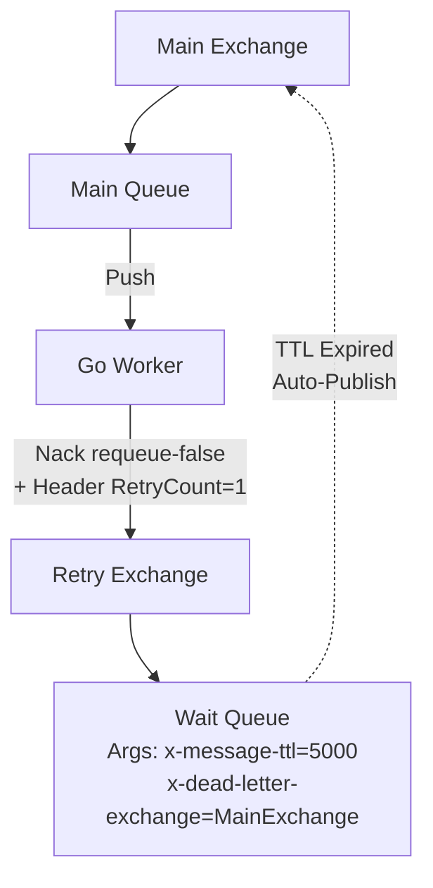

В прошлой статье [[7. Dead letter exchanges]] мы узнали, как безопасно "парковать" сообщения, обработка которых завершилась ошибкой. Мы избавились от главной угрозы асинхронных систем — **Poison Message Loop**, когда слепой `Nack(requeue=true)` заставляет воркер бесконечно переваривать битое сообщение, сжигая 100% CPU.

Но что, если ошибка была **транзитной (временной)**? 
* Упала сеть между вашим Go-сервисом и базой данных.
* Внешний HTTP API (например, платежный шлюз) ответил `429 Too Many Requests` или `503 Service Unavailable`.
* Произошел Deadlock в PostgreSQL, транзакция откатилась.

В этих случаях логично попытаться обработать сообщение снова через некоторое время. И здесь мы подходим к проектированию **Retry Patterns (Паттернов повторных попыток)** в RabbitMQ.

---

## 1. Наивный подход: Sleep в горутине (Антипаттерн)

Самая частая ошибка Junior-разработчика при встрече с `HTTP 429` — сделать `time.Sleep` прямо в горутине-воркере перед вызовом `Nack(requeue=true)` или повторным запросом.

**Mechanical Sympathy: Почему это убьет систему?**
Вспомним статью [[5. Prefetch и QoS]]. Ваш консьюмер ограничен параметром `prefetch_count` (например, 100). Если у вас 10 горутин, и все они словили `429` от внешнего API, они сделают `time.Sleep(10 * time.Second)`. 
На 10 секунд **весь ваш сервис перестанет читать из очереди**. Быстрые, валидные сообщения, которым не нужно во внешний API, застрянут заблокированными (Head-of-line blocking). Плюс, висящие `Unacked` сообщения будут потреблять оперативную память брокера.

> [!warning] Ловушка / Gotcha: Блокировка тредов ОС
> `time.Sleep` в Go не блокирует тред ОС (M в планировщике G-M-P), он просто снимает горутину (G) с контекста. Но с точки зрения RabbitMQ, вы удерживаете `amqp.Delivery` в памяти и не отдаете `Ack`. Брокер считает, что вы работаете, а вы просто спите. 
> **Правило:** Воркер должен отпустить сообщение (Ack/Nack) максимально быстро. Любые задержки (delay) должны быть реализованы **на стороне брокера**.

## 2. Паттерн: TTL + DLX (Wait Queues)

Это классический, самый надежный паттерн организации отложенных очередей в чистом RabbitMQ (без плагинов). Он строится на комбинации двух механизмов: **Time-To-Live (TTL)** и **Dead Letter Exchange (DLX)**.

**Архитектура:**
Вместо того чтобы отправлять сообщение сразу обратно в рабочую очередь, мы перекладываем его в специальную "очередь ожидания" (Wait Queue), у которой нет консьюмеров. Сообщение просто лежит там. Когда истекает его TTL, RabbitMQ (как мы помним из прошлой статьи) выталкивает его через DLX обратно в рабочую очередь.



### Проблема: Head-of-Line Blocking в RabbitMQ

В RabbitMQ можно задать TTL двумя способами:
1. На всю очередь сразу (аргумент очереди `x-message-ttl`).
2. На каждое отдельное сообщение (свойство `Expiration` при `ch.Publish`).

> [!info] Под капотом: Как RabbitMQ проверяет TTL
> Процесс очереди в Erlang не сканирует всю очередь постоянно на предмет истекших таймеров (это было бы O-N операцией и убило бы CPU). Он проверяет TTL **только у первого сообщения в очереди (на "голове")**. 
> 
> Если вы отправите Msg1 с TTL=1 час, а следом Msg2 с TTL=1 секунда в одну и ту же очередь, **Msg2 не выйдет из очереди через секунду**. Оно будет ждать целый час, пока Msg1 не умрет и не освободит проход. Это называется *Head-of-Line (HoL) Blocking*.

**Решение:** Для реализации экспоненциальной задержки (Exponential Backoff) нельзя использовать одну Wait Queue с динамическим TTL сообщений. Вы должны создать **фиксированный набор очередей ожидания**:
* `wait_q_5s` (TTL = 5000)
* `wait_q_30s` (TTL = 30000)
* `wait_q_5m` (TTL = 300000)

Ваш Go-код смотрит на номер попытки и маршрутизирует сообщение в соответствующую очередь.

## 3. Паттерн: Delayed Message Plugin

Чтобы не городить десятки очередей ожидания, разработчики RabbitMQ создали официальный плагин: `rabbitmq-delayed-message-exchange`. 

**Как это работает:**
Плагин предоставляет новый тип обменника: `x-delayed-message`. Вы публикуете в него сообщение с заголовком `x-delay: 5000` (в мс). Обменник "замораживает" сообщение у себя и маршрутизирует его в очередь *только* когда таймер истечет.


> [!info] Под капотом: Mnesia и таймеры
> В отличие от классических очередей (которые хранят данные в логах на диске или в RAM), Delayed Exchange сохраняет отложенные сообщения во внутренней встроенной СУБД RabbitMQ — **Mnesia** (в виде записей на диске). 
> Затем запускается Erlang Timer. Когда таймер срабатывает, сообщение достается из Mnesia и маршрутизируется. 
> 
> **Ограничение:** Этот плагин **не подходит** для систем, где в отложенном состоянии одновременно находятся миллионы сообщений (Mnesia не выдержит такого объема и убьет кластер по памяти/I-O). Плагин идеален для десятков тысяч сообщений с небольшими задержками (до пары дней).

## Реализация Exponential Backoff на Go (через Плагин)

Посмотрим, как выглядит идиоматичный код Go-воркера, который реализует ретраи с экспоненциальной задержкой, используя кастомный заголовок `X-Retry-Count`. 

> [!tip] Собеседование
> **Вопрос:** Почему лучше использовать свой кастомный заголовок `X-Retry-Count`, а не встроенный RabbitMQ массив `x-death`?
> **Ответ:** Во-первых, если вы переопубликовываете сообщение руками в Delayed Exchange, `x-death` не генерируется (он создается только при автоматическом DLX-переходе). Во-вторых, парсинг сложного вложенного массива `x-death` из `amqp.Table` в Go — это много аллокаций и рефлексии (медленно). Простой `int` заголовок читается за O-1.

```go
package main

import (
	"context"
	"fmt"
	"log"
	"math"

	amqp "[github.com/rabbitmq/amqp091-go](https://github.com/rabbitmq/amqp091-go)"
)

const MaxRetries = 3

// processWithRetry читает из очереди и управляет логикой ретраев
func processWithRetry(ch *amqp.Channel, d amqp.Delivery) {
	// 1. Выполняем бизнес-логику
	err := doBusinessLogic(d.Body)
	if err == nil {
		d.Ack(false)
		return
	}

	// 2. Логика провалилась. Вытаскиваем счетчик попыток из заголовков.
	retryCount := int32(0)
	if d.Headers != nil {
		if val, ok := d.Headers["x-retry-count"]; ok {
			retryCount = val.(int32)
		}
	}

	// 3. Проверяем лимит попыток
	if retryCount >= MaxRetries {
		log.Printf("Message failed permanently after %d retries. Sending to DLQ.", retryCount)
		// Nack без requeue выкинет сообщение в DLX (если он настроен на очереди)
		d.Nack(false, false) 
		return
	}

	// 4. Вычисляем задержку: 5s, 25s, 125s (экспонента)
	retryCount++
	delayMs := int64(math.Pow(5, float64(retryCount))) * 1000

	// 5. Копируем старые заголовки и добавляем новые
	headers := d.Headers
	if headers == nil {
		headers = make(amqp.Table)
	}
	headers["x-retry-count"] = retryCount
	headers["x-delay"] = delayMs // Указание для Delayed Exchange плагина

	// 6. Публикуем сообщение в Delayed Exchange
	err = ch.PublishWithContext(context.Background(),
		"my_delayed_exchange", // имя delayed обменника
		d.RoutingKey,          // сохраняем оригинальный роутинг
		false, false,
		amqp.Publishing{
			Headers:      headers,
			Body:         d.Body,
			DeliveryMode: amqp.Persistent, // Не забываем про надежность
			ContentType:  d.ContentType,
		},
	)

	if err != nil {
		log.Printf("Failed to publish retry message: %v", err)
		// Если не смогли сделать ретрай - лучше Nack, чтобы не потерять
		d.Nack(false, false) 
		return
	}

	// 7. Подтверждаем ОРИГИНАЛЬНОЕ сообщение (так как мы создали его копию в будущем)
	d.Ack(false)
}

func doBusinessLogic(payload []byte) error {
	// Эмуляция вызова внешнего API или транзакции БД
	return fmt.Errorf("temporary network error")
}
```

### Разбор кода:
1. **Асинхронность:** Мы не спим в горутине. Мы мгновенно `Ack`-аем оригинальное сообщение, освобождая буфер `prefetch` для новых сообщений.
2. **Копирование:** Мы вручную публикуем *новое* сообщение в Delayed Exchange. С точки зрения RabbitMQ — это совершенно новое сообщение (которое содержит payload старого).
3. **Защита от OOM:** `MaxRetries` защищает систему от сообщений, которые невозможно обработать в принципе.

## Итог

1. **Никаких `time.Sleep` в консьюмерах.** Это ведет к истощению пула соединений, исчерпанию QoS и отказу в обслуживании валидных сообщений.
2. **Паттерн Wait Queues (TTL + DLX)** — нативный и самый надежный способ. Требует создания отдельной очереди для каждого шага задержки из-за механики `Head-of-Line Blocking`.
3. **Delayed Message Plugin** — современный и удобный подход, но с архитектурными ограничениями на количество отложенных сообщений из-за использования внутренней Mnesia DB.

Теперь, когда наши сообщения надежно паршутизируются, не теряются при падениях (Ack/Nack) и автоматически ретраятся без блокировки системы, нам остается решить последнюю проблему. Что будет, если сервер, на котором крутится сам RabbitMQ, выйдет из строя (сгорит блок питания)? 

Чтобы обеспечить непрерывную доступность на уровне железа и инфраструктуры, в следующей статье мы разберем: [[9. Cluster и HA в RabbitMQ]].