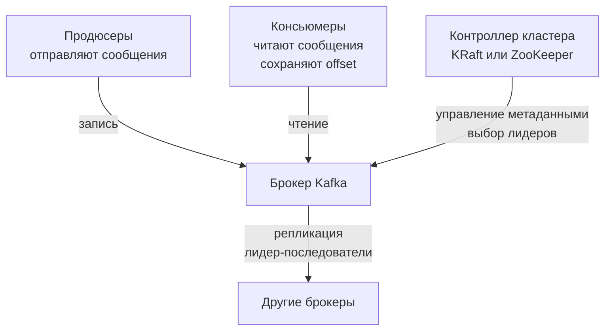
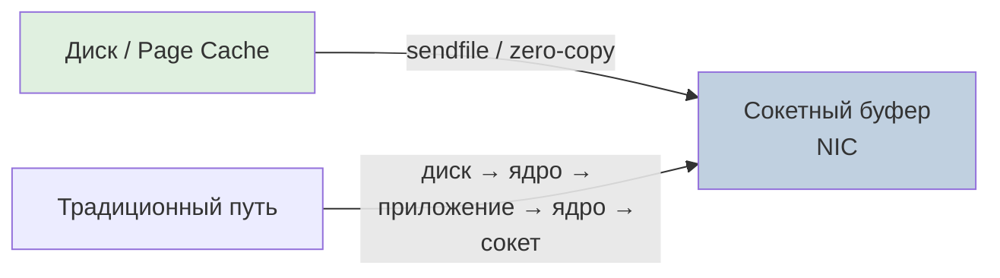

> [!NOTE]
> **Связи:** Данная статья открывает подраздел Kafka и опирается на фундамент, заложенный в [[1. Обзор раздела. Асинхронность как основа масштабирования]], [[3. Очереди сообщений. Зачем они нужны]] и [[4. Модели доставки. At most once, at least once, exactly once]].

## Введение: Kafka как распределённый commit log

Apache Kafka — это распределённая, горизонтально масштабируемая, устойчивая к сбоям система для публикации и подписки на потоки данных, которая в корне отличается от классических брокеров сообщений вроде [[1. RabbitMQ. Архитектура и концепции]]. Если RabbitMQ строился вокруг модели «умного брокера» с гибкой маршрутизацией и подтверждениями на уровне сообщений, то Kafka — это «умный продюсер и умный консьюмер с глупым, но невероятно быстрым брокером», реализующим модель распределённого **append-only commit-лога**.

Чтобы понять суть Kafka, нужно мысленно отбросить концепцию «очереди» и взглянуть на неё как на распределённый, секционированный журнал транзакций, похожий на Write-Ahead Log в базах данных. Все сообщения, отправляемые продюсерами, дописываются строго в конец этого журнала и никогда не модифицируются. Консьюмеры читают сообщения последовательно, отслеживая своё положение (offset), что перекладывает задачу управления состоянием обработки с брокера на самих потребителей.

## Философия log-based системы

Центральным примитивом Kafka является **Partition (партиция)** — логический, упорядоченный, неизменяемый лог сообщений. Каждый топик (категория потока) состоит из набора партиций, распределённых по узлам кластера.

- **Топик** — абстракция, объединяющая партиции с общей семантикой (например, `orders`, `user-events`).
- **Партиция** — физический файл (точнее, набор файлов-сегментов) на диске брокера, в который строго последовательно дописываются сообщения.
- **Offset** — монотонно возрастающий идентификатор позиции сообщения в рамках партиции. Каждая запись в партиции получает уникальный offset, который консьюмеры используют для того, чтобы знать, с какого места продолжать чтение.

Такая модель уходит корнями в принципы проектирования баз данных LSM-деревьев и WAL-сегментов. Сила log-based подхода — в колоссальной производительности на операциях последовательного ввода-вывода, минимуме накладных расходов на индексацию и возможности эффективно использовать возможности операционной системы и железа.

## Архитектура высокого уровня



Ключевые участники кластера:

- **Продюсер** — приложение, публикующее сообщения. Отвечает за выбор партиции назначения (по ключу, вручную или циклически).
- **Брокер** — отдельный узел Kafka, обслуживающий партиции.
- **Консьюмер** — приложение, читающее сообщения из партиций в рамках Consumer Group.
- **Контроллер** — специальный брокер, управляющий жизненным циклом партиций. До версии 3.5 роль контроллера обслуживал ZooKeeper, но современные деплойменты переходят на встроенный консенсус-движок **KRaft** (Kafka Raft), который убирает внешнюю зависимость и упрощает эксплуатацию.

> [!info] Под капотом
> В режиме KRaft метаданные (конфигурация топиков, лидеры партиций) хранятся и реплицируются внутри самого кластера Kafka с использованием протокола Raft, аналогичного [[14. Алгоритмы консенсуса. Raft]]. Это ускоряет выборы контроллера и повышает стабильность.

## Модель хранения под капотом

Партиция — это не один монолитный файл, а набор **сегментов** (segment), каждый из которых является обычным файлом на файловой системе (например, ext4/XFS).

Когда продюсер записывает сообщение в партицию, брокер:
1. Дописывает сообщение в конец активного сегмента.
2. Обновляет индекс смещений: временной индекс (`.timeindex`) для поиска по временным меткам и позиционный индекс (`.index`) для быстрого отображения логического offset → физическая позиция в файле.

При достижении сегментом определённого размера или времени создаётся новый сегмент. Старые сегменты подлежат удалению или уплотнению согласно политикам **Retention** и **Compaction** (см. [[8. Retention и compaction]]).

```bash
# Пример структуры партиции на диске
/var/lib/kafka/data/orders-0/
├── 00000000000000000000.log
├── 00000000000000000000.index
├── 00000000000000000000.timeindex
├── 00000000000000012345.log
├── 00000000000000012345.index
└── 00000000000000012345.timeindex
```

Благодаря неизменяемости записанных сегментов, Kafka почти полностью избегает случайного ввода-вывода. Все операции — это линейная запись в активный сегмент и последовательное чтение из файла, что идеально согласуется с механическими свойствами дисков и архитектурой систем хранения.

## Mechanical Sympathy: почему это безумно быстро

Современные диски (NVMe-накопители) показывают феноменальную скорость именно на последовательном доступе. Случайные чтения и записи срывают конвейерные механизмы предвыборки, увеличивают нагрузку на планировщик ввода-вывода и уничтожают производительность. Kafka сознательно спроектирована так, чтобы использовать только последовательный ввод-вывод.

> [!info] Под капотом  
> **Page Cache и sendfile**
>
> Kafka агрессивно полагается на страничный кеш операционной системы, а не на собственные кэши в JVM heap. Когда продюсер записывает данные, они сначала попадают в Page Cache ядра Linux, а затем асинхронно сбрасываются на диск. Когда консьюмер читает свежие данные, брокер часто отдаёт их напрямую из Page Cache, вообще не обращаясь к диску.
>
> Но настоящий шедевр — это передача данных консьюмеру через системный вызов `sendfile()`, который реализует **Zero-Copy** (нулевое копирование). Вместо классической цепочки «диск → буфер ядра → буфер приложения → сокет», `sendfile` передаёт байты из Page Cache напрямую в сокетный буфер сетевой карты, минуя промежуточные копии в userspace. Это радикально экономит CPU и пропускную способность памяти.



## Распределённая модель: лидеры, фолловеры и ISR

Каждая партиция имеет выделенного **лидера** — одного из брокеров, обслуживающего все операции чтения и записи для этой партиции. Остальные брокеры выступают **последователями** (followers), пассивно реплицирующими лог лидера. Контроллер кластера назначает лидеров и следит за состоянием реплик.

Чтобы гарантировать согласованность, Kafka вводит понятие **In-Sync Replicas (ISR)** — набор реплик, полностью синхронизированных с лидером. Продюсер может выбирать уровень подтверждения (`acks`):

- `acks=0` — не ждать подтверждения (потенциальная потеря сообщений).
- `acks=1` — ждать подтверждения только от лидера.
- `acks=all` (или `-1`) — ждать подтверждения от всех реплик в ISR, обеспечивая максимальную надёжность.

> [!tip] Собеседование
> **Вопрос:** Что произойдёт, если лидер партиции выйдет из строя?
> **Ответ:** Контроллер инициирует выборы нового лидера из числа синхронизированных последователей (ISR). Если ISR пуст, по умолчанию лидером может стать несинхронизированная реплика (что может привести к потере последних записей), но это конфигурируется через `unclean.leader.election.enable`. В безопасных системах этот параметр отключают, жертвуя доступностью в пользу консистентности.

## Консьюмеры и consumer groups

В отличие от классических очередей, где удаление сообщения после его получения ложится на брокер, Kafka хранит все сообщения на протяжении настроенного retention-периода (часы, дни или вечно), и консьюмеры сами следят за тем, что уже прочитано. Это даёт потрясающую гибкость: можно перечитать лог с начала, запустить нового потребителя, разбирающего архивные данные, или восстановить утерянное состояние обработки.

**Consumer Group** — это логическая группа консьюмеров, совместно потребляющих партиции топика. Каждая партиция в рамках группы обрабатывается ровно одним консьюмером, что гарантирует порядок обработки в пределах партиции и одновременно обеспечивает параллелизм. При перебалансировке (rebalance) партиции перераспределяются между живыми членами группы.

> [!warning] Ловушка / Gotcha
> В рамках одной Consumer Group **нельзя** назначить более одного консьюмера на партицию, но один консьюмер может обслуживать несколько партиций. Следовательно, общий параллелизм группы ограничен количеством партиций в топике. Попытка добавить консьюмеров сверх этого числа приведёт к тому, что лишние экземпляры будут простаивать без работы.

## Топология хранения и обработки в Go

Для взаимодействия с Kafka из Go сообщество использует несколько библиотек. Наиболее популярны:

- **Sarama** — зрелая библиотека, но имеет исторически высокие накладные расходы и некоторые идиоматические расхождения;
- **confluent-kafka-go** — обёртка над нативной C-библиотекой `librdkafka` (CGO), требующая компиляции с сишным тулчейном;
- **franz-go** — современный, чистый Go-клиент, спроектированный с учётом специфики рантайма (без CGO, эффективная работа с горутинами, детальная настройка under the hood).

Ниже — минимальный production-ready пример консьюмера на `franz-go`, демонстрирующий ручное управление смещениями и graceful shutdown:

```go
package main

import (
	"context"
	"fmt"
	"log"
	"os/signal"
	"syscall"

	"github.com/twmb/franz-go/pkg/kgo"
)

func main() {
	ctx, stop := signal.NotifyContext(context.Background(), syscall.SIGINT, syscall.SIGTERM)
	defer stop()

	// Клиент Kafka с группой и ручным подтверждением оффсетов
	cl, err := kgo.NewClient(
		kgo.SeedBrokers("localhost:9092"),
		kgo.ConsumerGroup("order-processors"),
		kgo.ConsumeTopics("orders"),
		kgo.DisableAutoCommit(), // включаем Exactly-once семантику через ручной commit
	)
	if err != nil {
		log.Fatalf("failed to create client: %v", err)
	}
	defer cl.Close()

	fmt.Println("Consumer started, waiting for messages...")
	for {
		fetches := cl.PollFetches(ctx)
		if fetches.IsClientClosed() {
			break
		}
		if errs := fetches.Errors(); len(errs) > 0 {
			log.Printf("fetch errors: %v", errs)
			continue
		}

		// Обработка сообщений и подтверждение только после успешной обработки
		fetches.EachPartition(func(ftp kgo.FetchTopicPartition) {
			for _, record := range ftp.Records {
				fmt.Printf("processing offset=%d key=%s val=%s\n",
					record.Offset, record.Key, record.Value)
				// Здесь — бизнес-логика
			}
			// Коммитим смещение вручную, только получив гарантию обработки
			if err := cl.CommitUncommittedOffsets(ctx); err != nil {
				log.Printf("commit failed: %v", err)
			}
		})
	}
}
```

Этот фрагмент иллюстрирует модель «лог — консьюмер управляет смещением», ключевую для понимания Kafka. Брокер не удаляет сообщения по факту коммита группы, а лишь помечает позицию, которую группа уже обработала.

## Kafka vs традиционные очереди: смена парадигмы

| Характеристика             | RabbitMQ / традиционные брокеры          | Apache Kafka                                        |
| -------------------------- | ---------------------------------------- | --------------------------------------------------- |
| Модель данных              | Очередь (удаление после обработки)       | Лог (неизменяемый журнал, retention-политики)       |
| Управление состоянием      | Брокер отслеживает подтверждения         | Консьюмер хранит offset                             |
| Порядок сообщений          | В рамках очереди                         | Строгий порядок в пределах партиции                 |
| Масштабирование обработки  | Добавление конкурирующих потребителей    | Добавление партиций и консьюмеров в группе          |
| Производительность         | Десятки тысяч сообщений/с                | Миллионы сообщений/с (последовательный IO + zero-copy) |
| Перечитывание истории      | Невозможно без дополнительной логики     | Встроено: повторное чтение с любого offset          |

> [!tip] Собеседование
> **Вопрос:** Можно ли с помощью Kafka реализовать классическую очередь заданий (work queue)?
> **Ответ:** Да, можно, но с нюансами. Для этого используется Consumer Group с одной партицией — тогда задания будут обрабатываться параллельно, но порядок в рамках конкретной задачи не гарантируется. Если нужны гарантии FIFO для отдельных задач и при этом параллелизм, ключ сообщения должен быть связан с сущностью, а число партиций — равно числу параллельных обработчиков.

## Заключение и дальнейшие шаги

Архитектура log-based системы, лежащая в основе Kafka, — это намеренный инженерный компромисс: мы жертвуем гибкой маршрутизацией и «умным брокером» ради невероятной пропускной способности, масштабируемости и способности хранить поток данных как неизменяемый источник истины. Такая модель идеально ложится на событийно-ориентированные архитектуры ([[3. Event Driven Architecture]]), Event Sourcing ([[4. Event sourcing и брокеры]]) и системы обработки потоковых данных.

Глубокое понимание того, как Kafka пишет в сегменты, использует Page Cache и sendfile, позволяет разработчику на Go создавать по-настоящему высоконагруженные конвейеры данных. В следующих статьях мы детально разберём [[2. Topics, partitions и offsets]], механизм работы продюсеров и консьюмеров [[3. Producer и consumer]], а также погрузимся в устройство хранения [[7. Kafka storage под капотом]].