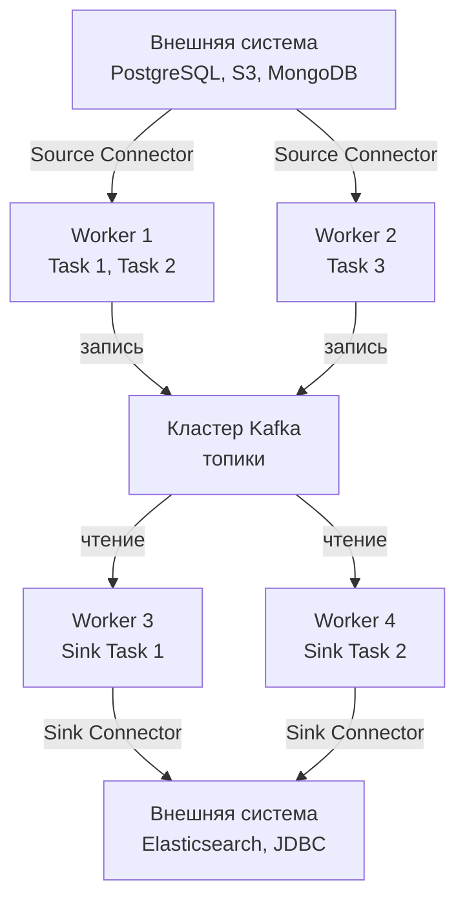
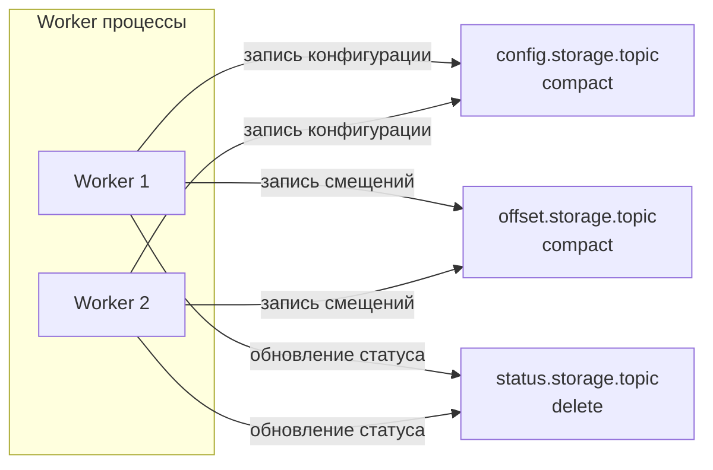

> [!NOTE]
> **Связи:** Эта статья завершает основной цикл статей о компонентах экосистемы Kafka. Мы опираемся на фундамент [[1. Kafka. Архитектура и модель log based системы]], [[3. Producer и consumer]], [[7. Kafka storage под капотом]] и [[8. Retention и compaction]], и подводим к следующим темам: [[11. Schema Registry и эволюция схем]] и [[12. Производительность Kafka]].

## Введение: интеграционная шина, а не просто топики

Kafka редко живёт в вакууме. В реальных системах данные рождаются и умирают за пределами кластера: в реляционных базах, NoSQL-хранилищах, файловых системах, других брокерах. Написание отдельных микросервисов-адаптеров (продюсеров и консьюмеров) для каждого такого стыка быстро превращается в зоопарк плохо протестированных, разнородных интеграций.

**Kafka Connect** — это фреймворк, который стандартизирует интеграцию Kafka с внешними системами. Это не отдельный продукт, а часть дистрибутива Apache Kafka (начиная с версии 0.9), работающая как масштабируемый кластер worker-процессов. Цель Connect — превратить перемещение данных между Kafka и остальным миром в конфигурационную задачу, не требующую написания кода, если только вы не разрабатываете собственный коннектор.

Для Go-разработчика Kafka Connect важен в двух ипостасях: как потребитель готовых коннекторов для интеграции с БД и как управляемый через REST API компонент, который можно автоматизировать из Go-приложений.

## Архитектура: Workers, Connectors, Tasks

Архитектурно Kafka Connect разделён на три слоя, образующих направленный граф перемещения данных от источника к приёмнику.

- **Worker** — процесс JVM, выполняющий один или несколько коннекторов и их задач. Бывает в двух режимах: `standalone` (один процесс, для разработки) и `distributed` (кластер worker'ов, для продакшена).
- **Connector** — логическая сущность, определяющая, *откуда* и *куда* копировать данные. Делится на два типа:
    - **Source Connector** — забирает данные из внешней системы и публикует их в топики Kafka.
    - **Sink Connector** — читает данные из топиков и записывает их во внешнюю систему.
- **Task** — физическая единица параллелизма. Один коннектор может порождать несколько задач, каждая из которых выполняется в отдельном потоке (в Go-терминологии — горутине) и отвечает за свой поднабор данных (например, подмножество таблиц или партиций).



### Почему разделение на Connector и Task?

Connector отвечает за мета-уровень: парсинг конфигурации, определение числа задач, мониторинг изменений схемы. Task — за реальную работу: открытие соединений, чтение/запись данных, отслеживание прогресса. Это разделение позволяет горизонтально масштабировать интеграцию: количество Task определяет максимальный параллелизм, а распределённый кластер worker'ов распределяет эти задачи между машинами.

## Под капотом: хранение конфигураций, смещений и статусов

Kafka Connect хранит всё своё состояние в **самой же Kafka**, используя три служебных топика на каждый кластер worker'ов. Имена топиков настраиваются в конфигурации worker'а.

- **`config.storage.topic`** — хранит конфигурации коннекторов и задач в формате JSON. Каждая запись имеет ключ (имя коннектора или идентификатор задачи) и значение (текущая конфигурация). Топик компактифицируется ([[8. Retention и compaction]]), чтобы всегда хранить актуальную конфигурацию, но не историю изменений.
- **`offset.storage.topic`** — Source-коннекторы хранят здесь последнее прочитанное смещение (например, LSN в PostgreSQL или смещение файла). Это критически важно для гарантий exactly-once при перезапуске: задача возобновляет чтение ровно с того места, где остановилась. Топик компактифицируется.
- **`status.storage.topic`** — хранит текущий статус каждого коннектора и задачи (RUNNING, FAILED, PAUSED). Используется для мониторинга и координации. Обычно настраивается с retention по времени, так как история состояний не нужна вечно.



### Механическая симпатия: почему Connect не изобретает велосипед

Хранение состояния в топиках — не просто "удобно". Это означает, что координация worker'ов, восстановление после сбоев и распределение задач реализуются через стандартные механизмы Kafka:

- **Групповая координация:** Worker'ы соединяются в Consumer Group ([[4. Consumer groups]]) на служебных топиках, что даёт автоматическое обнаружение живых узлов и перебалансировку задач при падении worker'а.
- **Долговечность:** Данные конфигураций и смещений реплицируются согласно фактору репликации топиков, обеспечивая сохранность даже при потере дисков worker'а.
- **Zero-copy:** При чтении данных из Kafka Sink-задачи используют тот же механизм `sendfile`, что и обычные консьюмеры, минимизируя копирование данных в userspace.

## Модели данных: Source и Sink

### Source Connector

Source-коннектор запускает задачи, которые опрашивают внешнюю систему, преобразуют записи в `SourceRecord` и отправляют их в Kafka. Ключевая проблема — отслеживание прогресса, чтобы не пропустить данные и не продублировать их. Для этого SourceTask использует `SourceTaskContext`, который позволяет атомарно сохранять offset во внешней системе и offset storage топик.

Примеры встроенных Source-коннекторов:
- **JDBC Source Connector** — читает таблицы БД, отслеживая автоинкрементный столбец или временную метку.
- **Debezium Connectors** — CDC-коннекторы для MySQL, PostgreSQL, MongoDB, читающие бинарный лог (binlog/WAL).
- **FileStream Source** — читает файл и отправляет строки в топик (для тестирования).

### Sink Connector

Sink-коннектор читает топики, преобразует записи в `SinkRecord` и вставляет/обновляет данные во внешней системе. Задачи используют обычного Kafka Consumer с ручным коммитом offset'ов: offset коммитится только после успешной записи во внешнюю систему, обеспечивая at-least-once семантику.

Примеры Sink-коннекторов:
- **JDBC Sink** — вставляет записи в таблицы (insert/upsert).
- **Elasticsearch Sink** — индексирует записи в ES.
- **S3 Sink** — сохраняет батчи в объектное хранилище в форматах Avro, Parquet, JSON.

### Converters и Transformations

На стыке систем данные проходят через цепочку трансформаций:

- **Converter** — сериализует/десериализует ключ и значение сообщения (JSON, Avro, Protobuf). При использовании Avro подключается [[11. Schema Registry и эволюция схем]].
- **Single Message Transform (SMT)** — легковесная трансформация одной записи (переименование поля, добавление заголовков, фильтрация). Выполняются на уровне Connect, не требуя написания отдельного сервиса.

## Распределённый режим и отказоустойчивость

В распределённом режиме worker'ы образуют кластер, координируемый через служебные топики. Изменение топологии выглядит так:

1. Worker регистрируется, записывая свой ephemeral ID в status-топик.
2. Worker'ы избирают "лидера группы" (как в Consumer Group), который следит за назначением задач.
3. Когда конфигурация коннектора публикуется через REST API, лидер распределяет задачи по доступным worker'ам, используя стратегию, аналогичную Sticky Assignor ([[4. Consumer groups]]), чтобы минимизировать миграцию при ребалансировке.
4. При падении worker'а его задачи перераспределяются на оставшиеся узлы, а прогресс восстанавливается из offset storage.

> [!info] Под капотом
> Протокол координации Connect очень близок к протоколу Consumer Group. Он использует Heartbeat-механизм, session timeout и max.poll.interval.ms (через `task.shutdown.graceful.timeout.ms`). Именно поэтому тюнинг этих параметров критичен: если задача надолго зависает во внешней системе, она может быть исключена из группы, и её работа будет запущена на другом worker'е, что может привести к дублированию.

## Mechanical Sympathy: влияние на ввод-вывод и CPU

Kafka Connect работает как промежуточное звено, поэтому его производительность напрямую влияет на сквозную задержку и пропускную способность интеграции. Точки внимания:

- **Batching:** Source-задачи могут накапливать записи перед отправкой в Kafka, используя `batch.size` и `linger.ms` внутреннего продюсера. Настройка этих параметров идентична тюнингу обычного продюсера ([[3. Producer и consumer]]).
- **Сетевая нагрузка:** В Sink-коннекторах данные из Kafka приходят через zero-copy на socket-буфер, но затем они всё равно копируются в userspace для десериализации и передачи во внешнюю систему. Минимизация лишних копий (например, использование Avro с бинарной десериализацией напрямую в поля структуры) улучшает пропускную способность.
- **Управление состоянием Connect:** Служебные топики сами нагружают кластер Kafka. При большом количестве коннекторов и частых обновлениях статусов топик `status.storage.topic` может расти быстро. Настройка его retention помогает избежать излишнего потребления диска.

## Интеграция с Go: управление Kafka Connect через REST API

Kafka Connect предоставляет REST API для управления коннекторами. Это означает, что Go-приложение может автоматизировать деплой и мониторинг коннекторов: часть инфраструктуры as code.

Основные эндпоинты:
- `GET /connectors` — список коннекторов.
- `POST /connectors` — создать новый коннектор (тело — JSON-конфигурация).
- `GET /connectors/{name}/status` — статус.
- `DELETE /connectors/{name}` — удалить.

Пример Go-кода для создания JDBC Source коннектора:

```go
package main

import (
	"bytes"
	"encoding/json"
	"fmt"
	"io"
	"net/http"
)

type ConnectorConfig struct {
	Name   string            `json:"name"`
	Config map[string]string `json:"config"`
}

func createConnector(connectURL string, cfg ConnectorConfig) error {
	body, err := json.Marshal(cfg)
	if err != nil {
		return fmt.Errorf("marshal config: %w", err)
	}

	resp, err := http.Post(
		connectURL+"/connectors",
		"application/json",
		bytes.NewReader(body),
	)
	if err != nil {
		return fmt.Errorf("request failed: %w", err)
	}
	defer resp.Body.Close()

	if resp.StatusCode != http.StatusCreated {
		errBody, _ := io.ReadAll(resp.Body)
		return fmt.Errorf("unexpected status %d: %s", resp.StatusCode, string(errBody))
	}
	return nil
}

func main() {
	cfg := ConnectorConfig{
		Name: "postgres-source-orders",
		Config: map[string]string{
			"connector.class":          "io.confluent.connect.jdbc.JdbcSourceConnector",
			"connection.url":           "jdbc:postgresql://localhost:5432/mydb",
			"connection.user":          "user",
			"connection.password":      "pass",
			"mode":                     "timestamp",
			"timestamp.column.name":    "updated_at",
			"table.whitelist":          "orders",
			"topic.prefix":             "pg-",
			"key.converter":            "io.confluent.connect.avro.AvroConverter",
			"value.converter":          "io.confluent.connect.avro.AvroConverter",
			"key.converter.schema.registry.url": "http://schema-registry:8081",
			"value.converter.schema.registry.url": "http://schema-registry:8081",
		},
	}
	if err := createConnector("http://connect:8083", cfg); err != nil {
		fmt.Printf("failed to create connector: %v\n", err)
		return
	}
	fmt.Println("Connector created successfully")
}
```

Таким образом, инфраструктурный Go-код может управлять жизненным циклом интеграций, не залезая в Java, а сам Kafka Connect остаётся эффективным исполнителем.

## Kafka Connect vs "написать своего консьюмера"

Частый вопрос на архитектурных обсуждениях: зачем использовать Connect, если можно просто написать Go-сервис, читающий из Kafka и пишущий в БД? Ответ кроется в зрелости и эксплуатационных качествах:

| Критерий | Kafka Connect | Кастомный Go-сервис |
| --- | --- | --- |
| Скорость старта | Готовые коннекторы, только конфигурация | Требуется разработка, тестирование |
| Exactly-once | Поддерживается в коннекторах (Debezium, JDBC sink) | Нужно реализовывать вручную, включая управление offset'ами и идемпотентность |
| Масштабирование | Автоматическое через task-и | Нужно настраивать Consumer Group, партиции |
| Схемы и Schema Registry | Встроенная поддержка Avro/Protobuf | Нужно интегрировать библиотеки |
| Мониторинг | Единый REST API, JMX | Свой экспедиент, Prometheus-экспорт |
| Обработка ошибок | Dead Letter Queue, Retry политики (начиная с Kafka 2.x) | Собственная логика |

Однако Connect ограничен моделью "переместить и минимально трансформировать". Если нужна сложная логика (агрегация, обогащение из нескольких источников, stateful-операции), лучше использовать Kafka Streams ([[9. Kafka Streams]]) или писать на Go с использованием фреймворков.

> [!tip] Собеседование
> **Вопрос:** Как гарантировать, что при сбое Sink-коннектора данные не будут потеряны и не продублируются?
> **Ответ:** Sink-коннектор использует Consumer с ручным коммитом. Offset коммитится только после успешной вставки во внешнюю систему. При крахе задача перезапускается и читает с последнего закоммиченного offset'а, получая at-least-once. Для exactly-once нужна идемпотентная вставка (например, upsert по первичному ключу) и поддержка транзакций в самом коннекторе (JDBC sink с транзакционной обёрткой).

## Заключение и дальнейшие шаги

Kafka Connect превращает Kafka из шины данных в полноценную интеграционную платформу, значительно снижая порог входа и эксплуатационные расходы. Понимание его архитектуры и того, как он использует саму Kafka для координации, позволяет архитектору принимать взвешенные решения о выносе интеграций в Connect или оставлении их в виде кастомных Go-сервисов.

В следующей статье мы рассмотрим важнейший компонент экосистемы, который решает проблему совместимости и эволюции форматов данных: [[11. Schema Registry и эволюция схем]]. Без него любая интеграция рано или поздно упрётся в хаос обратной совместимости.