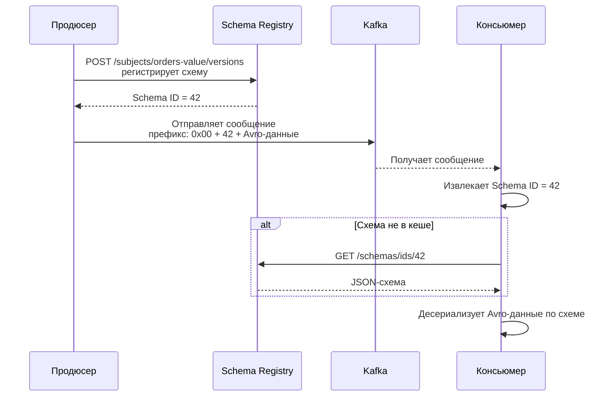
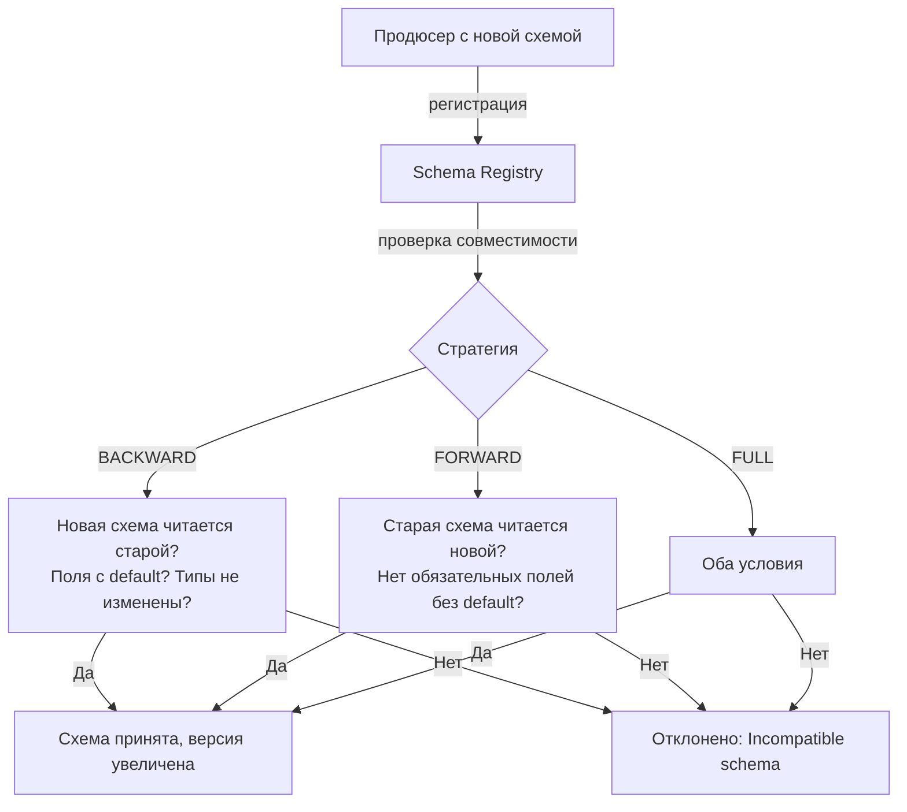

> [!NOTE]
> **Связи:** Эта статья тесно связана с [[10. Kafka Connect]], [[9. Kafka Streams]] и [[6. Exactly once в Kafka]], а также опирается на общие принципы эволюции API из раздела [[10. Проектирование API и Сетевые протоколы]] и фундамент гарантий доставки [[4. Модели доставки. At most once, at least once, exactly once]].

## Проблема невидимых контрактов

В синхронном RESTful мире изменение формата данных приводит к немедленной ошибке десериализации: контракт между клиентом и сервером проверяется в рантайме при первом же вызове. В асинхронной Kafka-экосистеме всё иначе: продюсер публикует сообщения в одном сервисе, консьюмер читает их в другом — между ними могут быть часы, дни или даже годы разницы в обновлении кода. Если продюсер начнёт записывать поле `amount` как строку вместо числа, консьюмер упадёт при попытке разбора, но узнает он об этом далеко не сразу.

Без формального управления схемами команды быстро скатываются к «гаданию по JSON»: неясно, какие поля обязательные, какие опциональные, какие типы допустимы, что означает отсутствие поля, можно ли его добавить, не ломая потребителей. Ответом на этот хаос стал **Schema Registry** — централизованный реестр схем, обеспечивающий строгую типизацию и контролируемую эволюцию контрактов в event-driven системах.

## Что такое Schema Registry

Schema Registry — это отдельный сервер, который служит единым источником истины для всех схем данных, циркулирующих в Kafka. Он живёт вне брокеров, но взаимодействует с ними через REST API и хранит своё состояние в специальном компактифицированном топике `_schemas` внутри самого же кластера Kafka. Наиболее известная реализация — **Confluent Schema Registry**, де-факто стандарт в индустрии.

Ключевые обязанности реестра:

- Хранить зарегистрированные схемы, присваивая каждой уникальный глобальный идентификатор.
- Проверять совместимость новых версий схем с предыдущими согласно заданной стратегии (эволюция без поломок).
- Обслуживать запросы продюсеров и консьюмеров на получение схемы по её идентификатору.
- Кешировать схемы для минимизации задержки.

Продюсер, отправляя сообщение, не включает в него полную схему — достаточно компактного schema ID (4 байта) в префиксе. Консьюмер извлекает этот ID и запрашивает схему из реестра, что экономит пропускную способность и дисковое пространство в логах Kafka.

## Форматы сериализации: почему Avro, а не только JSON

Schema Registry поддерживает несколько форматов, но исторически и архитектурно центральным является **Apache Avro**. Выбор не случаен:

| Критерий | JSON | Avro | Protobuf |
| --- | --- | --- | --- |
| Компактность | Текстовый, избыточный | Бинарный, сжатие полей | Бинарный, компактный |
| Схема в сообщении | Нет, полагается на внешнее знание | Требуется внешняя схема, внутри только ID | Похоже, но можно с дескриптором |
| Эволюция | Ручная, легко сломать | Встроенные правила совместимости | Строгие правила, но менее гибкие |
| Динамическая типизация | Да | Строгая статическая | Строгая статическая |
| Экосистема | Универсально | Глубокая интеграция с Hadoop, Kafka | Популярен в gRPC |

**Avro** выигрывает тем, что хранит схему отдельно от данных, а в сообщение помещает лишь идентификатор схемы и затем бинарно упакованные значения полей в порядке, заданном схемой. Это исключает дублирование метаданных в каждом сообщении, что критично для высоконагруженной потоковой передачи (тысячи и миллионы сообщений). Кроме того, Avro предоставляет развитые правила разрешения эволюции: значение по умолчанию, псевдонимы, промоции типов.

> [!info] Под капотом
> Формат Avro-сообщения с Confluent Wire Format состоит из:
> - **Magic Byte** (1 байт, всегда `0x00`).
> - **Schema ID** (4 байта, big-endian, идентификатор схемы в Registry).
> - **Avro-encoded данные**, следующие сразу за заголовком.
>
> При десериализации консьюмер считывает первый байт, убеждается в валидности, извлекает Schema ID, запрашивает схему из реестра (или локального кеша) и затем интерпретирует оставшиеся байты согласно схеме. Схема читателя и схема писателя могут различаться, но Avro-ридер автоматически разрешает поля, используя значения по умолчанию для отсутствующих и пропуская неизвестные.

## Архитектура взаимодействия



Реестр сам хранит соответствие Schema ID → схема, а также мягкое отображение «subject» (логическое имя, например `orders-value` или `orders-key`) на версии схем в этом subject'е. Subject — это область пространства имён, по которой проверяется совместимость. Обычно схема ключа и схема значения топика идут в разных subject'ах.

## Хранение схем под капотом: топик `_schemas`

Вся персистентность Schema Registry обеспечивается через **обычный топик Kafka** с именем `_schemas` (по умолчанию), который создаётся с политикой compaction. Каждая запись в этом топике имеет ключ — уникальный идентификатор схемы или версии subject-а, а значение — JSON-представление схемы или метаданных. Такое решение даёт несколько уровней надёжности:

- Схемы реплицируются синхронно/асинхронно на другие брокеры согласно фактору репликации топика.
- Compaction ([[8. Retention и compaction]]) гарантирует, что последняя версия каждой сущности никогда не будет удалена, даже при переполнении лога, а старые версии схем могут быть удалены после истечения компактификатора.
- При перезапуске Schema Registry он просто перечитывает `_schemas` с самого начала, восстанавливая все глобальные идентификаторы и маппинги в памяти.

Таким образом, Schema Registry не имеет своей базы данных; вся персистентность поручена самому брокеру, что изящно решает проблему отказоустойчивости и резервного копирования.

> [!warning] Ловушка / Gotcha
> Удаление схемы через REST API (`DELETE /subjects/...`) не удаляет данные из `_schemas`, а лишь записывает tombstone. Компактификация топика со временем уберёт старую версию, но schema ID уже занят и не переиспользуется. Это предотвращает коллизии идентификаторов, но означает, что при интенсивной регистрации/удалении идентификаторы могут быстро расти.

## Эволюция схем: правила, спасающие от поломок

Управляемая эволюция схем — главная ценность Schema Registry. Без неё ценность централизованного хранения схем резко падает. Compatibility Checker реестра автоматически отклоняет регистрацию новой версии, если она нарушает заданную стратегию совместимости. Стратегии определены в спецификации Avro и расширены в экосистеме:

- **BACKWARD** (обратная совместимость) — новая схема может быть прочитана старыми консьюмерами. Это означает: можно удалять поля с дефолтными значениями, добавлять поля только с дефолтными значениями, не менять типы существующих полей. Это самый безопасный и рекомендуемый подход: продюсер обновляется раньше консьюмеров.
- **FORWARD** (прямая совместимость) — старая схема может быть прочитана новыми консьюмерами. Применимо, когда консьюмеры обновляются раньше продюсеров. Допускает добавление полей без дефолтных значений (только опциональные), удаление полей возможно, если они не использовались новыми потребителями.
- **FULL** — обратная и прямая одновременно. Схемы полностью взаимозаменяемы. Требует максимальной дисциплины.
- **NONE** — проверка совместимости отключена. Схемы регистрируются без проверок, опасен для production.



### Примеры эволюции Avro-схем

Исходная схема:
```json
{
  "type": "record",
  "name": "Order",
  "fields": [
    {"name": "orderId", "type": "string"},
    {"name": "amount", "type": "double"},
    {"name": "currency", "type": "string", "default": "USD"}
  ]
}
```

- **Добавление поля** (BACKWARD): добавить поле `discount` с `"default": 0.0` — допустимо. Старый консьюмер, не зная о `discount`, подставит 0.0.
- **Удаление поля** (BACKWARD): удалить поле `currency` — допустимо, потому что у него есть default, и старый консьюмер его проигнорирует.
- **Изменение типа** (BACKWARD): поменять `amount` с `double` на `string` — **запрещено**, так как старый консьюмер ожидает double и не сможет десериализовать строку.
- **Удаление поля без default**: удалить `orderId` — **запрещено**, так как старый консьюмер ожидает это поле как обязательное (нет default) и упадёт.

## Mechanical Sympathy: Avro в Go

В мире Go существуют несколько библиотек для работы с Avro и Schema Registry:

- **github.com/hamba/avro** — высокопроизводительный Avro-кодер/декодер, поддерживает code generation из Avro-схем.
- **github.com/linkedin/goavro** — один из первых, но менее активен.
- **github.com/confluentinc/confluent-kafka-go** — официальная обёртка librdkafka, включает встроенную поддержку Avro и Schema Registry через CGO, что добавляет накладные расходы.

Ручная работа с Avro: сериализация начинается с получения схемы из Registry (или использования кешированного ID), затем кодирование структуры в бинарный Avro согласно схеме писателя. Пример:

```go
import (
	"context"
	"fmt"
	"log"
	"time"

	"github.com/hamba/avro/v2"
	"github.com/twmb/franz-go/pkg/kgo"
)

type Order struct {
	OrderID  string  `avro:"orderId"`
	Amount   float64 `avro:"amount"`
	Currency string  `avro:"currency"`
}

func main() {
	schema := `{"type":"record","name":"Order","fields":[
		{"name":"orderId","type":"string"},
		{"name":"amount","type":"double"},
		{"name":"currency","type":"string","default":"USD"}
	]}`

	// Парсинг схемы
	avroSchema, err := avro.Parse(schema)
	if err != nil {
		log.Fatalf("parse schema: %v", err)
	}

	// Заглушка: получение schema ID из Registry или локального кеша
	schemaID := uint32(42)

	// Сериализация
	order := Order{OrderID: "order-123", Amount: 99.99}
	avroBytes, err := avro.Marshal(avroSchema, order)
	if err != nil {
		log.Fatalf("avro marshal: %v", err)
	}

	// Префикс Confluent Wire Format: magic + 4 байта ID
	msg := make([]byte, 1+4+len(avroBytes))
	msg[0] = 0x00
	msg[1] = byte(schemaID >> 24)
	msg[2] = byte(schemaID >> 16)
	msg[3] = byte(schemaID >> 8)
	msg[4] = byte(schemaID)

	copy(msg[5:], avroBytes)

	// Отправка через продюсера
	cl, _ := kgo.NewClient(kgo.SeedBrokers("localhost:9092"))
	cl.Produce(context.Background(), &kgo.Record{
		Topic: "orders",
		Value: msg,
	}, nil)
	cl.Close()
}
```

Такой подход позволяет полностью контролировать сериализацию, избегая CGO и минимизируя накладные расходы на каждое сообщение. Особенно это критично для Go-сервисов, обрабатывающих сотни тысяч сообщений в секунду.

## Связь с Kafka Connect и Streams

Schema Registry глубоко интегрирован в экосистему:

- **Kafka Connect** ([[10. Kafka Connect]]) использует AvroConverter для автоконвертации записей из внешних систем в Avro с регистрацией схемы. Это обеспечивает сквозную типизацию от источника до приёмника без ручного кодирования.
- **Kafka Streams** ([[9. Kafka Streams]]) автоматически работает с Avro через Serdes, сериализуя/десериализуя состояние в RocksDB и топики changelog-а, гарантируя совместимость при эволюции схем даже для stateful-операций.

В Go-мире аналогичная интеграция достигается через вышеупомянутые библиотеки и ручную реализацию совместимости, однако отсутствие стандартного фреймворка требует внимательности.

> [!tip] Собеседование
> **Вопрос:** Почему Schema Registry хранит схему вне сообщений, а не внутри? В чём преимущество?
> **Ответ:** Вынос схемы в реестр и передача только schema ID (4 байта) радикально сокращает размер сообщения, особенно для множества мелких записей. Это экономит пропускную способность сети, дисковое пространство в логах Kafka и ускоряет сериализацию/десериализацию, так как продюсер и консьюмер могут кешировать распарсенные схемы локально. Кроме того, централизованное управление эволюцией схем позволяет предотвращать несовместимые изменения до того, как они сломают прод.

> [!tip] Собеседование
> **Вопрос:** Стратегия BACKWARD vs FORWARD: когда и какую выбрать?
> **Ответ:** BACKWARD используется, когда продюсеры обновляются раньше консьюмеров — типичный сценарий микросервисов: сервис-продюсер разворачивается первым, а потребители могут обновляться позже. FORWARD нужна, когда консьюмеры обновляются первыми или когда один топик читают множество независимых консьюмеров, которых сложно синхронизировать. В большинстве проектов оптимально начинать с BACKWARD, переходя на FULL по мере стабилизации.

## Заключение и дальнейшие шаги

Schema Registry — это не просто репозиторий схем, а активный страж совместимости в асинхронном мире. Он превращает непредсказуемые поломки при изменении форматов в контролируемый процесс с чёткими правилами, делая эволюцию данных безопасной и предсказуемой даже в распределённых командах.

Теперь, когда мы рассмотрели все компоненты экосистемы Kafka — от физического лога и групп потребителей до потоковых процессоров и реестра схем, — пора обратиться к последней фундаментальной теме подраздела: как измерить и максимизировать производительность всего этого великолепия. Следующая статья: [[12. Производительность Kafka]].