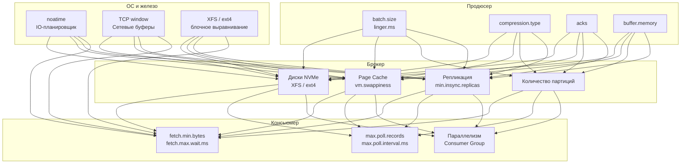

> [!NOTE]
> **Связи:** Эта статья завершает подраздел Kafka, замыкая теорию на практические рычаги управления скоростью. Мы опираемся на [[1. Kafka. Архитектура и модель log based системы]], [[2. Topics, partitions и offsets]], [[3. Producer и consumer]], [[4. Consumer groups]], [[5. Ordering и partitioning]], [[6. Exactly once в Kafka]], [[7. Kafka storage под капотом]], [[8. Retention и compaction]], [[9. Kafka Streams]], [[10. Kafka Connect]] и [[11. Schema Registry и эволюция схем]].

## Производительность как архитектурное свойство

Производительность Apache Kafka — не результат одного гениального алгоритма, а сумма десятков инженерных решений, каждое из которых выражает глубокую механическую симпатию к операционной системе и железу. Последовательная запись в сегменты, zero-copy через `sendfile`, страничный кеш вместо собственных буферов, группировка записей в батчи, асинхронный сетевой ввод-вывод — всё это работает как слаженный оркестр. Но чтобы оркестр не сфальшивил при росте нагрузки, нужно понимать, как настраивать каждый инструмент.

Производительность Kafka принято измерять по двум осям:
- **Throughput (пропускная способность):** Мбайт/с или сообщений/с, которые система способна обработать.
- **Latency (задержка):** время от отправки сообщения продюсером до его получения консьюмером (end-to-end latency), обычно измеряемое на процентилях p95, p99.

Эти оси находятся в классическом компромиссе: чем больше мы накапливаем сообщений в батчи перед отправкой, тем выше пропускная способность, но тем выше и задержка. Задача инженера — найти точку равновесия под конкретный бизнес-сценарий.

## Три уровня тюнинга

Любую проблему производительности Kafka можно локализовать на одном из трёх уровней (или на их стыках):

1. **Продюсер** — решает, как часто и какими порциями отправлять данные.
2. **Брокер** — обрабатывает запись, репликацию, хранение и выдачу данных.
3. **Консьюмер** — определяет, как быстро забирать и обрабатывать сообщения.

К ним добавляется четвёртый слой — **операционная система и железо**, на котором всё работает. Каждый уровень имеет свои параметры, и ошибка на одном может свести на нет все усилия на других.



## Продюсер: как отправить миллион сообщений и не захлебнуться

Производительность продюсера определяется настройками батчинга и сжатия. Одиночная отправка (`Send` на каждое сообщение) — гарантированный путь к посредственной производительности.

### batch.size и linger.ms

Продюсер накапливает сообщения в буферах RecordAccumulator для каждой партиции. Когда буфер для партиции достигает `batch.size` (по умолчанию 16 КБ) или истекает `linger.ms` (по умолчанию 0), батч отправляется брокеру.

- **`batch.size`** — увеличивайте до 64–512 КБ для высоконагруженных систем, особенно при включённом сжатии. Более крупные батчи лучше сжимаются, а брокер выполняет меньше операций записи на единицу данных.
- **`linger.ms`** — установите 5–20 мс, чтобы небольшая задержка наполняла батчи, не увеличивая заметно end-to-end latency. При значении 0 многие батчи будут отправляться полупустыми, снижая эффективность.

### Сжатие

Сжатие (`compression.type`: gzip, snappy, lz4, zstd) выполняется на стороне продюсера над целым батчем. Брокер хранит сжатый батч без изменений, и консьюмер получает его без перепаковки. Выбор кодека — компромисс CPU vs throughput:

| Кодек | Степень сжатия | CPU (сжатие) | Скорость |
|-------|----------------|--------------|----------|
| snappy | Среднее | Низкое | Быстро |
| lz4 | Среднее | Низкое | Очень быстро |
| zstd | Высокое | Среднее/Высокое | Зависит от уровня |

> [!info] Под капотом
> В Go-клиентах (`franz-go`) сжатие выполняется чистым Go-кодом без CGO. Рекомендуется `lz4` для наилучшего баланса скорости и компактности, особенно при использовании `sync.Pool` для переиспользования буферов сжатия.

### acks и долговечность

Параметр `acks` прямо влияет на задержку отправки:
- `acks=0` — не ждать ответа, наименьшая задержка, возможна потеря данных.
- `acks=1` — ждать подтверждения от лидера партиции. Баланс между скоростью и надёжностью.
- `acks=all` — ждать подтверждения от всех синхронизированных реплик (ISR). Максимальная долговечность ценой увеличения задержки на время репликации.

Для высокопроизводительных систем с требованиями надёжности обычно выбирают `acks=all` в сочетании с `min.insync.replicas=2` и настройкой `enable.idempotence=true` для предотвращения дубликатов.

### Параллелизм и буферы

Множество горутин, вызывающих `Produce`, могут конкурировать за RecordAccumulator. Увеличение `max.in.flight.requests.per.connection` (по умолчанию 5) позволяет отправлять несколько батчей параллельно на один брокер, не дожидаясь подтверждения предыдущего, что повышает throughput при высоких задержках сети.

`buffer.memory` (по умолчанию 32 МБ) — общий лимит памяти для буферов продюсера. Если буфер переполняется, `Send` блокируется, снижая производительность. Увеличьте до 64–256 МБ в зависимости от числа партиций и размера батчей.

## Брокер: запись, репликация, хранение

Брокер — центральное звено, и его производительность ограничена двумя физическими ресурсами: дисковой подсистемой и сетью.

### Диски и файловая система

Kafka предельно зависима от последовательного ввода-вывода. Использование **NVMe SSD** (например, AWS i3/i4i инстансы с локальными NVMe) — обязательное условие для высоких нагрузок. На HDD throughput падает в десятки раз.

Рекомендации по файловой системе:
- Предпочтительнее **XFS** — показывает лучшую производительность на больших файлах и операциях sequential write, чем ext4.
- Монтирование с опцией **`noatime`** отключает обновление времени последнего доступа к файлам, экономя метаданные операции при каждом чтении.
- Блочное выравнивание разделов по границам erase block SSD (обычно 1 МБ) предотвращает write amplification на уровне контроллера.

### Страничный кеш и управление памятью

Брокер активно использует Page Cache ядра Linux. Для производства крайне важно, чтобы операционная система не вытесняла горячие страницы Kafka из кеша. Настройте **`vm.swappiness=1`** (не 0, чтобы избежать OOM Killer при нехватке памяти), чтобы ядро агрессивно держало страничный кеш.

Внутри JVM брокера не следует выделять более 6–8 ГБ heap (для брокеров с ~30 ГБ RAM). Остальная память остаётся под Page Cache. Флаг JVM `-XX:+UseG1GC` обеспечивает предсказуемые паузы GC, особенно при большом количестве партиций.

### Количество партиций и топиков

Избыточное количество партиций — частая причина скрытой деградации:
- Каждая партиция требует открытых файловых дескрипторов (минимум 3 на сегмент: .log, .index, .timeindex). С ростом числа партиций брокер может исчерпать лимит ОС на открытые файлы (`ulimit -n`).
- При ребалансировке Consumer Group координатор обрабатывает все партиции, и с десятками тысяч партиций время ребалансировки становится значительным.
- Рекомендуемый практический максимум: **~4000 партиций на брокер**, но эта цифра зависит от доступной памяти и дисков.

### Репликация и min.insync.replicas

При `acks=all` запись считается успешной, когда её подтвердили все реплики в ISR. Параметр `min.insync.replicas` определяет, сколько реплик должно подтвердить запись. Значение `min.insync.replicas=2` (при факторе репликации 3) означает, что лидер + одна синхронная реплика обязаны подтвердить. Это повышает надёжность без значительного ухудшения задержки. Установка значения, равного фактору репликации, максимизирует долговечность, но при выходе из строя любого брокера топик становится недоступным для записи.

## Консьюмер: быстрая вычитка без потерь

Производительность консьюмера определяется тем, насколько быстро он может забирать данные и обрабатывать их.

### fetch.min.bytes и fetch.max.wait.ms

Консьюмер запрашивает данные с брокера. Чтобы избежать частых пустых запросов:
- **`fetch.min.bytes`** (по умолчанию 1) — минимальный объём данных, который брокер должен накопить перед ответом. Увеличьте до 1048576 (1 МБ) для throughput-ориентированных систем, чтобы каждый ответ приносил значимые данные.
- **`fetch.max.wait.ms`** (по умолчанию 500) — максимальное время ожидания брокером накопления `fetch.min.bytes`. Установите 100–500 мс в зависимости от требований к latency.

### max.poll.records и цикл обработки

Консьюмер за один `Poll` может получать до `max.poll.records` записей. Увеличение этого параметра до 500–2000 позволяет обрабатывать большие батчи, но требует, чтобы бизнес-логика укладывалась в `max.poll.interval.ms` (по умолчанию 5 минут), иначе консьюмер будет исключён из группы.

**Критический паттерн для Go:** не обрабатывайте сообщения синхронно внутри цикла `Poll`. Выгружайте их в worker-пул или горутины, немедленно возвращаясь к `Poll`:

```go
for {
    fetches := client.PollFetches(ctx)
    if fetches.IsClientClosed() {
        break
    }
    fetches.EachRecord(func(record *kgo.Record) {
        wg.Add(1)
        go func(r *kgo.Record) {
            defer wg.Done()
            process(r)
        }(record)
    })
    // Коммит после обработки батча — отдельный механизм
}
```

### Количество консьюмеров vs партиций

Максимальный параллелизм Consumer Group ограничен числом партиций топика. Добавление консьюмеров сверх числа партиций не повышает throughput — лишние экземпляры бездействуют. Проектируйте топики с достаточным числом партиций под ожидаемый уровень параллелизма, учитывая накладные расходы, описанные выше.

## Операционная система: невидимый фундамент

### Сеть

Брокер обслуживает множество TCP-соединений от продюсеров, консьюмеров и других брокеров (репликация). Пропускная способность сетевого интерфейса — ещё один физический лимит. На платформах вроде AWS выбирайте инстансы с гарантированной пропускной способностью (Enhanced Networking, ENA). Увеличение размеров TCP-буферов ядра через `sysctl` (`net.core.rmem_max`, `net.core.wmem_max`) может улучшить пропускную способность на высоких задержках.

### IO-планировщик

Для SSD/NVMe используйте `none` (или `noop` в старых ядрах) — планировщик без переупорядочивания, отдающий запросы напрямую в очередь устройства. Это минимизирует накладные расходы ядра на сортировку запросов, которая для NVMe бессмысленна.

### Max open files

Каждый сегмент партиции потребляет файловые дескрипторы. При большом количестве партиций стандартного лимита (1024) недостаточно. Установите `ulimit -n 100000` или выше.

## Типичные цифры

При правильной настройке на современном оборудовании (NVMe, 10+ GbE) можно ожидать:

| Сценарий | Throughput | End-to-end latency p99 |
|----------|------------|-------------------------|
| 1 продюсер, 1 консьюмер, 1 партиция | 100+ Мбайт/с | < 5 мс |
| 8 продюсеров, 8 консьюмеров, 32 партиции | 800+ Мбайт/с | < 10 мс |
| Транзакционная запись exactly-once | ~70% от базового | +2–5 мс |

## Инструменты измерения

Не тюньте вслепую. Используйте встроенные инструменты бенчмаркинга:

```bash
# Тест производительности продюсера
kafka-producer-perf-test \
  --topic perf-test \
  --num-records 10000000 \
  --record-size 1024 \
  --throughput -1 \
  --producer-props bootstrap.servers=localhost:9092 acks=all linger.ms=5 compression.type=lz4

# Тест производительности консьюмера
kafka-consumer-perf-test \
  --topic perf-test \
  --bootstrap-server localhost:9092 \
  --messages 10000000 \
  --group perf-test-group
```

Для production-мониторинга подключайте JMX-метрики брокеров через Prometheus exporter и отслеживайте ключевые показатели: `request-handler-idle-ratio`, `network-processor-idle-ratio`, `disk-write-rate`, `replication-under-replicated-partitions`.

> [!tip] Собеседование
> **Вопрос:** Какая стратегия увеличения пропускной способности эффективнее: добавление партиций или увеличение размера батча?
> **Ответ:** Зависит от узкого места. Если продюсер упирается в латентность одиночной партиции на медленном диске, помогает добавление партиций (распределение нагрузки). Если брокер простаивает, а продюсер отправляет мелкие сообщения, сначала увеличивают `batch.size` и `linger.ms`, что даёт прирост без изменения топологии. Добавление партиций также увеличивает накладные расходы брокера, поэтому начинают с тюнинга продюсера.

## Заключение

Высокая производительность Kafka — это инженерная дисциплина, а не разовый акт. Она достигается пониманием того, как батчинг и сжатие продюсера, неизменяемый лог брокера, страничный кеш и zero-copy, а также асинхронная обработка консьюмера складываются в единый конвейер. Каждый параметр — рычаг, влияющий на компромисс между пропускной способностью и задержкой.

Мы завершили подраздел Kafka, прошед путь от архитектуры лога и партиций до потоковых процессоров, схем и тюнинга производительности. Теперь мы можем перейти к другому, не менее важному брокеру экосистемы — лёгкому и высокоскоростному NATS. Следующая статья откроет подраздел [[1. NATS. Легковесный брокер]].