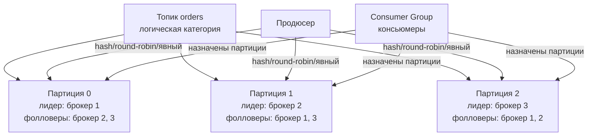

Вот фундаментальная статья, детально разбирающая `Topics`, `Partitions` и `Offsets` — ядро модели хранения и параллелизма Apache Kafka.

> [!NOTE]
> **Связи:** Данная статья продолжает тему, начатую в [[1. Kafka. Архитектура и модель log based системы]], и закладывает основу для понимания работы [[3. Producer и consumer]], [[4. Consumer groups]] и [[5. Ordering и partitioning]].

## Топики: категории бесконечного потока данных

Если смотреть на Kafka с высоты птичьего полёта, **Topic (топик)** — это просто логическая категория, к которой продюсеры публикуют сообщения, а консьюмеры подписываются на них. Вы даёте топику имя (`orders`, `user-events`, `page-views`) и с этого момента он служит точкой схождения для всего потока данных определённого типа.

Однако за этим простым фасадом скрывается фундаментальное решение: в отличие от RabbitMQ, где топик — это живой маршрутизатор с динамическими связями и правилами, в Kafka топик — это **контейнер для упорядоченных, неизменяемых логов — партиций**.

### Структура топика и его физическое воплощение

Когда вы создаёте топик, вы определяете две ключевые конфигурации:
- **Количество партиций** (`num.partitions`);
- **Фактор репликации** (`replication.factor`).

Топик не хранит сообщения сам по себе. Он представляет собой логическую группу партиций, каждая из которых является строго упорядоченным, append-only логом. Продюсер, отправляя сообщение, записывает его в конкретную партицию этого топика. Консьюмер читает из одной или нескольких партиций топика.



## Партиции: единица параллелизма и порядка

**Партиция (Partition)** — это основная единица масштабирования, отказоустойчивости и гарантии порядка в Kafka. Именно количеством партиций определяется максимальный параллелизм консьюмеров в Consumer Group: одна партиция обрабатывается не более чем одним консьюмером в рамках группы одновременно.

### Почему партиция гарантирует строгий порядок

Каждая партиция — это не просто набор сообщений, а **упорядоченный лог с монотонно возрастающим смещением (offset)**. Как только сообщение записано в партицию, его позиция и расположение относительно соседей никогда не изменяются.

Это означает, что консьюмер, читающий одну партицию, видит все сообщения строго в том порядке, в котором их записал продюсер. Но как только появляется несколько партиций, глобальный порядок сообщений в топике исчезает. Это фундаментальный компромисс: параллелизм против глобальной упорядоченности.

### Физическая структура: сегменты и файлы

Физически партиция хранится на диске брокера как директория с набором файлов-сегментов. Активный сегмент, в который идёт запись, постепенно наполняется; при достижении лимита (по размеру или времени) он закрывается и становится неизменяемым, а запись продолжается в новый сегмент.

Такое сегментирование решает сразу несколько проблем:
- **Упрощает удаление старых данных:** достаточно удалить целиком последний сегмент, не затрагивая активную запись.
- **Позволяет эффективно искать сообщения по offset-у:** для быстрого поиска используется разреженный индекс (`.index`), отображающий offset в физическую позицию внутри файла сегмента.
- **Уменьшает фрагментацию файловой системы:** файлы фиксированного размера лучше воспринимаются планировщиком ввода-вывода.

```bash
# Пример файловой структуры партиции orders-0
/var/lib/kafka/data/orders-0/
├── 00000000000000000000.log      # сегмент: сообщения с offset 0 по 12344
├── 00000000000000000000.index    # позиционный индекс
├── 00000000000000000000.timeindex # временной индекс
├── 00000000000000012345.log      # следующий сегмент: offset 12345 по ...
├── 00000000000000012345.index
└── 00000000000000012345.timeindex
```

> [!info] Под капотом  
> Внутренне Kafka использует Java-класс `LogSegment`, который опирается на `FileChannel` и `MappedByteBuffer` для прямого взаимодействия со страничным кешем ОС. При чтении свежих сообщений данные зачастую уже находятся в Page Cache ядра Linux, и брокер отдаёт их напрямую в сокет через системный вызов `sendfile`, реализуя Zero-Copy. Это превращает каждую операцию чтения из партиции в исключительно эффективное линейное копирование из памяти в сетевую карту без участия CPU в цикле копирования байт.

## Offset: «курсор» в бесконечном логе

Каждое сообщение в партиции получает уникальный, монотонно возрастающий в рамках этой партиции **Offset**. Offset — это 64-битное целое число, идентифицирующее позицию сообщения. В отличие от "приоритетов" или ID очереди, offset не позволяет удалить сообщение — он лишь указывает консьюмеру, до какого места лог уже прочитан.

### Управление смещениями и Consumer Group

Консьюмер запоминает последний обработанный offset для каждой партиции, чтобы после перезапуска или сбоя продолжить чтение ровно с того места. По умолчанию Kafka сохраняет эти смещения в служебном топике `__consumer_offsets`, который реплицируется и компактифицируется (хранит только последнее значение смещения для каждой группы-партиции).

Политика коммита бывает автоматической (по времени) либо ручной — после завершения бизнес-обработки. Именно возможность коммитить offset вручную лежит в основе [[6. Exactly once в Kafka]] и идемпотентных консьюмеров (см. [[10. Idempotency в message processing]]).

### Как консьюмер находит начальную точку

При первом подключении группы к топику консьюмер использует параметр `auto.offset.reset`:
- `earliest` — начать с самого старого доступного сообщения;
- `latest` — начать с конца, то есть получать только новые сообщения.

Если группа уже коммитила offsets, консьюмер возобновляет чтение с последнего зафиксированного смещения.

```go
// Настройка клиента franz-go с явным управлением смещениями
cl, err := kgo.NewClient(
    kgo.SeedBrokers("localhost:9092"),
    kgo.ConsumerGroup("my-group"),
    kgo.ConsumeTopics("orders"),
    kgo.DisableAutoCommit(),            // ручной контроль коммита
    kgo.ConsumeResetOffset(kgo.NewOffset().AtStart()), // earliest
)
```

## Стратегия маршрутизации: как продюсер выбирает партицию

Отправитель сообщения играет ключевую роль в том, как данные распределятся по партициям. Схема маршрутизации определяется тремя механизмами, доступными в продюсере:

1. **Ключ сообщения (key-based)**  
   Если сообщение содержит ключ, Kafka вычисляет хеш ключа (murmur2 по умолчанию) и берёт остаток от деления на количество партиций: `partition = hash(key) % num_partitions`. Это гарантирует, что все сообщения с одинаковым ключом всегда попадают в одну и ту же партицию, сохраняя относительный порядок внутри группы.

2. **Round-robin (без ключа)**  
   Если ключ отсутствует, продюсер равномерно распределяет сообщения по всем партициям без каких-либо гарантий порядка для какой-либо сущности. Это оптимально для максимизации пропускной способности.

3. **Явное указание партиции**  
   Приложение может напрямую указать номер партиции, беря на себя ответственность за логику распределения (например, хеширование на уровне бизнес-логики).

> [!warning] Ловушка / Gotcha  
> Изменение количества партиций топика ломает гарантию порядка по ключу. После добавления новых партиций хеш ключа будет указывать на другой индекс, и сообщения с одним и тем же ключом разойдутся по разным партициям. Поэтому стратегия партиционирования фиксируется на момент создания топика, и динамическое увеличение — архитектурный компромисс, требующий пересмотра логики обработки порядка.

## Механическая симпатия: как партиции взаимодействуют с железом

Каждая партиция, будучи линейным неизменяемым логом, идеально согласована с физическими свойствами современных накопителей. Последовательная запись в активный сегмент позволяет дискам (SSD/NVMe) работать на пиковой пропускной способности, эффективно заполняя erase-блоки и минимизируя усиление записи. Чтение консьюмерами с использованием `sendfile` и страничного кеша означает, что даже при тысячах потребителей данные копируются только один раз — из кеша ядра в сокетную буферную память NIC, вообще не попадая в пространство пользователя.

Именно эта синергия между неизменяемой моделью хранения, сегментированием, zero-copy и последовательным вводом-выводом позволяет брокеру обслуживать миллионы сообщений в секунду на обычном оборудовании.

## Практические выводы и подготовка к собеседованию

Понимание топиков, партиций и оффсетов необходимо для ответа на ключевые архитектурные вопросы на Middle+/Senior собеседованиях:

> [!tip] Собеседование  
> **Вопрос:** "Почему порядок сообщений в Kafka гарантируется только в рамках одной партиции, но не в рамках всего топика?"  
> **Ответ:** Потому что топик — это логическая группировка нескольких физически независимых логов (партиций), распределённых по разным брокерам. Гарантия глобального порядка потребовала бы синхронизации между партициями, что полностью убило бы параллелизм и пропускную способность. Kafka жертвует глобальным порядком ради горизонтального масштабирования.

> [!tip] Собеседование  
> **Вопрос:** "Как спроектировать систему, где критичен порядок обработки по идентификатору клиента, но требуется высокая пропускная способность?"  
> **Ответ:** Использовать ключ сообщения, равный идентификатору клиента. Все события по одному клиенту попадут в одну и ту же партицию, гарантируя строгий FIFO для него, а множество партиций обеспечивают параллельную обработку разных клиентов.

## Дальнейшие шаги

Мы разобрали физические и логические строительные блоки, на которых держится вся экосистема Kafka. Следующий шаг — рассмотрение того, как эти блоки используют продюсеры и консьюмеры для формирования потоковых конвейеров: [[3. Producer и consumer]]. Затем мы углубимся в механизмы координации потребителей в [[4. Consumer groups]] и изучим гарантии порядка в динамических условиях: [[5. Ordering и partitioning]].