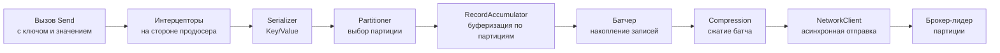
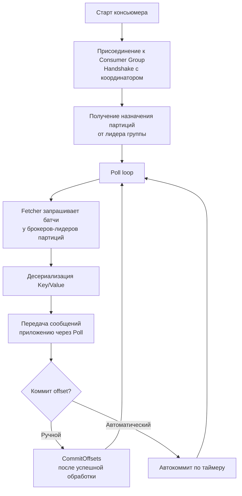

Вот фундаментальная статья, разбирающая внутреннее устройство и идиоматику работы Producer и Consumer в Kafka с фокусом на Go и механическую симпатию.

> [!NOTE]
> **Связи:** Эта статья — прямое продолжение [[2. Topics, partitions и offsets]], в котором мы рассмотрели физическую структуру лога. Теперь мы разберём, как приложения-отправители и получатели взаимодействуют с этим логом, опираясь на гарантии доставки из [[4. Модели доставки. At most once, at least once, exactly once]] и закладывая основу для групповой координации [[4. Consumer groups]].

## Две стороны одного лога

Kafka-клиент состоит из двух симметричных, но архитектурно разных сущностей: Producer и Consumer. Их объединяет общая цель — максимально эффективно передавать байты по сети, но достигается она противоположными механизмами. Продюсер агрегирует записи в пакеты, маскируя сетевые задержки; консьюмер, напротив, вытягивает готовые пакеты большими блоками, экономя CPU и пропускную способность памяти.

## Producer: от вызова `Send` до битов на проводе

Продюсер — это не просто тонкая обёртка над сокетом. Внутри каждого продюсера скрыт асинхронный конвейер, состоящий из сериализаторов, буфера записей (RecordAccumulator), батчера и сетевого клиента с неблокирующим вводом-выводом. Понимание этих слоёв принципиально для тюнинга производительности.

### Внутренний конвейер



1. **Сериализация (Serializer)** — преобразует ключ и значение в байтовые массивы. Для контроля над схемой часто используют Schema Registry ([[11. Schema Registry и эволюция схем]]).
2. **Partitioner** — определяет целевую партицию. По умолчанию: murmur2(key) % num_partitions; если ключ пуст — round-robin с липкостью к случайно выбранной партиции на короткий промежуток.
3. **RecordAccumulator** — основной буфер в оперативной памяти, который группирует записи по топикам и партициям. Каждая партиция имеет свою очередь байтовых буферов фиксированного размера (`batch.size`).
4. **Батчер** — накапливает записи в текущем открытом буфере. Когда буфер заполняется или истекает `linger.ms`, он «запечатывается» и передаётся на сжатие и отправку.
5. **Compression** — сжатие целого батча (gzip, snappy, lz4, zstd). Сжатие на стороне продюсера снижает сетевой трафик и дисковую нагрузку на брокере; брокер хранит сжатый батч как есть, и консьюмер получает его без перепаковки.
6. **NetworkClient** — асинхронный сетевой слой, отправляющий готовые батчи брокеру-лидеру каждой партиции. Использует Java NIO (в librdkafka / franz-go — аналогичный неблокирующий цикл на epoll/kqueue).

> [!info] Под капотом  
> Внутри RecordAccumulator работает пул буферов прямого доступа (DirectByteBuffer в Java, байтовые слайсы в Go), которые аллоцируются вне кучи GC, чтобы не создавать pressure на сборщик мусора. В Go-клиенте `franz-go` активно используется `sync.Pool` для переиспользования слайсов, что минимизирует аллокации и обеспечивает высокую пропускную способность.

### Mechanical Sympathy: зачем нужен `linger.ms` и `batch.size`

Системный вызов `send` (или `write`) на каждый одиночный байт — катастрофа. Мало того, что каждое сетевое сообщение несёт накладные расходы заголовков TCP/IP, так ещё и сам системный вызов стоит тысячи тактов из-за переключения контекста Ring 3 → Ring 0. Батчинг решает эту проблему в корне:

- **`batch.size`** (по умолчанию 16 КБ) — максимальный размер одного батча в памяти. Увеличение этого параметра повышает пропускную способность за счёт уменьшения числа сетевых пакетов ценой небольшого потребления памяти.
- **`linger.ms`** (по умолчанию 0) — искусственная задержка перед отправкой не полностью заполненного батча. Установка в 5–20 мс позволяет накопить больше записей в один пакет и кардинально повысить throughput при умеренном росте latency на процентилях.

Эта пара параметров — классический компромисс: пропускная способность против задержки. В высоконагруженных системах с потоковой записью `linger.ms=5` практически не добавляет задержки, но радикально улучшает эффективность использования сети.

### Идемпотентный продюсер (Idempotent Producer)

По умолчанию продюсер может доставить одно сообщение более одного раза при сбоях сети: продюсер отправляет батч, брокер записывает его, но подтверждение (ACK) теряется, и продюсер повторяет отправку. Чтобы избежать дублирования, начиная с Kafka 0.11 вводится **идемпотентный продюсер** (`enable.idempotence=true`).

При включении этой опции продюсер получает уникальный идентификатор (Producer ID) от брокера, и каждому сообщению внутри партиции присваивается монотонно возрастающий sequence number. Брокер, видя повторный sequence number, игнорирует дубликат, не записывая его в лог. Это гарантирует **exactly-once семантику на уровне одной сессии продюсера в рамках одной партиции**.

> [!warning] Ловушка / Gotcha  
> Идемпотентность продюсера спасает от дублирования, порождённого сетевыми ретраями, но она **не переживает перезапуск продюсера с потерей Producer ID**. Для сквозного exactly-once между топиками нужны транзакции (см. [[6. Exactly once в Kafka]]).

### Production-ready продюсер на Go (franz-go)

```go
package main

import (
	"context"
	"fmt"
	"log"
	"time"

	"github.com/twmb/franz-go/pkg/kgo"
)

func main() {
	cl, err := kgo.NewClient(
		kgo.SeedBrokers("localhost:9092"),
		// Включаем идемпотентность — franz-go делает это автоматически при
		// использовании транзакций или при явном указании idempotent mode.
		kgo.RequiredAcks(kgo.AllISRAcks()),
		kgo.RetryTimeout(30*time.Second),
		kgo.RecordPartitioner(kgo.StickyKeyPartitioner(nil)), // липкий по ключу
		kgo.BatchMaxBytes(1<<20), // 1 MB максимальный размер батча
	)
	if err != nil {
		log.Fatalf("failed to create client: %v", err)
	}
	defer cl.Close()

	ctx := context.Background()
	// Асинхронная запись: продьюс-рекорд не блокирует горутину
	cl.Produce(ctx, &kgo.Record{
		Topic: "orders",
		Key:   []byte("cust-12345"),
		Value: []byte(`{"order_id":"xyz","amount":250}`),
	}, func(r *kgo.Record, err error) {
		if err != nil {
			log.Printf("failed to deliver: %v", err)
			return
		}
		fmt.Printf("delivered to partition %d at offset %d\n", r.Partition, r.Offset)
	})
	// Flush перед завершением программы
	if err := cl.Flush(ctx); err != nil {
		log.Fatalf("flush failed: %v", err)
	}
}
```

## Consumer: pull-based разгрузка лога

В отличие от брокеров, которые проталкивают сообщения (push) потребителям, Kafka использует **pull-модель**. Консьюмер периодически опрашивает брокера, запрашивая следующую порцию данных. Это даёт потребителю полный контроль над темпом обработки, исключает переполнение его буферов и позволяет эффективно применять backpressure ([[6. Backpressure и контроль нагрузки]]).

### Внутренний цикл консьюмера



1. **Координатор группы** — один из брокеров, выбранный для управления Consumer Group. Он обрабатывает регистрацию, heartbeat-ы, ребалансировку.
2. **Лидер группы** — один из консьюмеров в группе, который вычисляет распределение партиций по стратегии (Range, Sticky и т.д.) и отправляет план координатору.
3. **Fetcher** — компонент, занимающийся предвыборкой (prefetch) батчей. Он может получать данные параллельно из нескольких брокеров, используя отдельные сетевые соединения.
4. **Heartbeat** — периодические сигналы (по умолчанию каждые 3 секунды), подтверждающие, что консьюмер жив. Если брокер не получает heartbeat дольше `session.timeout.ms` (по умолчанию 45 с), консьюмер считается мёртвым и запускается ребалансировка.
5. **Max.poll.interval.ms** — максимальное время между вызовами `Poll`. Если приложение зависло в обработке и не вызывает Poll дольше этого интервала, консьюмер покидает группу, вызывая ребалансировку. По умолчанию 5 минут.

> [!warning] Ловушка / Gotcha  
> В Go-консьюмере нельзя блокировать горутину, вызывающую `Poll`, на длительное время (например, синхронной записью в БД). Это приведёт к превышению `max.poll.interval.ms` и бесконечным ребалансировкам. Сообщения всегда нужно обрабатывать в отдельных горутинах или пулах, оставляя Poll-цикл быстрым и асинхронным.

### Управление смещениями: автоматический vs ручной коммит

- **Автоматический коммит** (`enable.auto.commit=true`) — консьюмер периодически фиксирует offset последнего возвращённого Poll-ом сообщения. Прост, но может привести к потере сообщений (если приложение упало после Poll, но до обработки) или к дубликатам (если обработка завершилась, но коммит не успел).
- **Ручной коммит** — приложение само решает, когда фиксировать offset. Обычно коммитят после завершения всей бизнес-логики, включая запись в БД, обеспечивая семантику at-least-once с контролируемым окном дублирования.

Для exactly-once в рамках Consumer Group часто комбинируют ручной коммит с идемпотентным обработчиком ([[4. Idempotent handlers]]), повторно проверяя, не был ли offset уже обработан.

### Производительный консьюмер на Go

```go
package main

import (
	"context"
	"fmt"
	"log"
	"os/signal"
	"sync"
	"syscall"

	"github.com/twmb/franz-go/pkg/kgo"
)

func main() {
	ctx, stop := signal.NotifyContext(context.Background(), syscall.SIGINT, syscall.SIGTERM)
	defer stop()

	cl, err := kgo.NewClient(
		kgo.SeedBrokers("localhost:9092"),
		kgo.ConsumerGroup("order-processors"),
		kgo.ConsumeTopics("orders"),
		kgo.DisableAutoCommit(),
		// Настройки heartbeats и таймаутов
		kgo.SessionTimeout(30*time.Second),
		kgo.HeartbeatInterval(3*time.Second),
	)
	if err != nil {
		log.Fatalf("failed to create client: %v", err)
	}
	defer cl.Close()

	var wg sync.WaitGroup
	fmt.Println("Consumer started, processing messages...")
	for {
		fetches := cl.PollFetches(ctx)
		if fetches.IsClientClosed() {
			break
		}
		if errs := fetches.Errors(); len(errs) > 0 {
			log.Printf("fetch errors: %v", errs)
			continue
		}

		// Обработка каждой партиции параллельно
		fetches.EachPartition(func(ftp kgo.FetchTopicPartition) {
			wg.Add(1)
			go func(ftp kgo.FetchTopicPartition) {
				defer wg.Done()
				for _, record := range ftp.Records {
					// Бизнес-логика: запись в БД, вызов других сервисов
					fmt.Printf("processed offset=%d key=%s\n", record.Offset, record.Key)
				}
				// Коммит только после успешной обработки всех записей партиции
				cl.CommitUncommittedOffsets(ctx)
			}(ftp)
		})
	}
	wg.Wait() // ожидание завершения всех обработчиков перед выходом
}
```

## Pull vs Push: почему не push?

Выбор pull-модели для Kafka — не случайность, а архитектурное решение, продиктованное механической симпатией к железу:

1. **Backpressure «из коробки».** В push-системе брокеру нужен механизм обратной связи (flow control), чтобы не перегрузить медленного консьюмера. В pull консьюмер просто запрашивает столько, сколько готов обработать.
2. **Эффективный сетевой ввод-вывод.** Консьюмер может запрашивать большие блоки данных за один вызов `poll`, получая сразу целый батч. В push-модели брокер дробил бы данные на множество мелких пакетов, теряя в пропускной способности.
3. **Zero-copy до последнего байта.** Благодаря тому, что брокер просто отдаёт сегменты лога через `sendfile`, консьюмер может читать данные напрямую из страничного кеша брокера, вообще не затрагивая приложение брокера в пространстве пользователя.

## Заключение и следующие шаги

Понимание внутреннего устройства Producer и Consumer — фундамент для построения надёжных и высокопроизводительных пайплайнов. Мы рассмотрели батчинг, сжатие, идемпотентность и pull-модель, которые напрямую опираются на возможности современных ОС: sendfile, страничный кеш и неблокирующий ввод-вывод.

Теперь, когда одиночные клиенты освоены, пора переходить к координации множества потребителей в составе Consumer Group. В следующей статье [[4. Consumer groups]] мы детально разберём ребалансировку, стратегии распределения партиций и управление жизненным циклом группы.