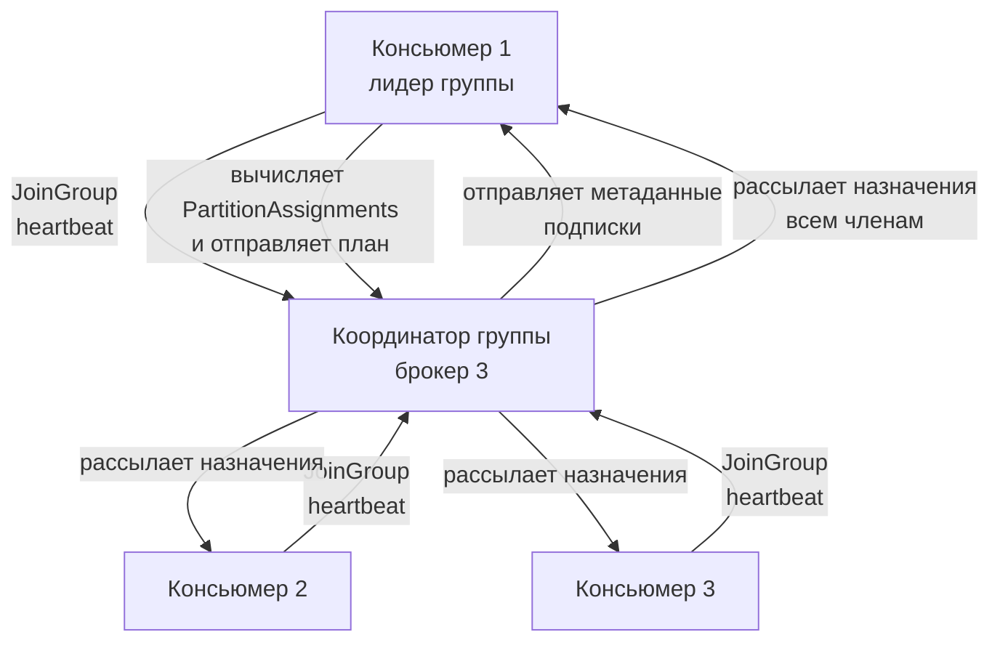
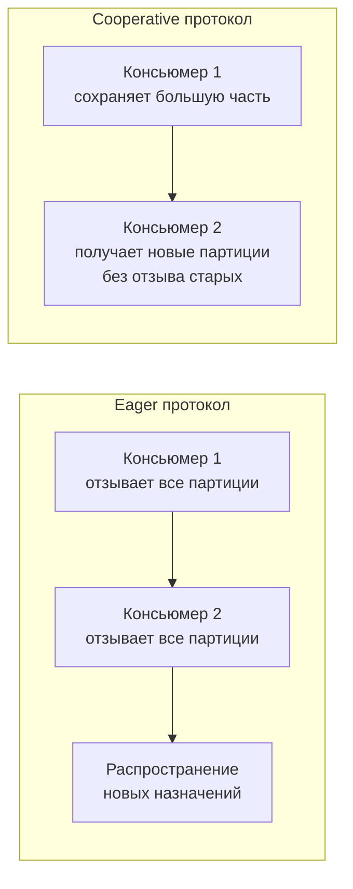

> [!NOTE]
> **Связи:** Эта статья продолжает темы, заложенные в [[2. Topics, partitions и offsets]] и [[3. Producer и consumer]]. Мы переходим от индивидуальных клиентов к координированной групповой обработке — ключевому механизму масштабирования и отказоустойчивости потребления в Kafka.

## Что такое Consumer Group и зачем она нужна

Consumer Group (потребительская группа) — это логическое объединение одного или нескольких консьюмеров, которые совместно потребляют сообщения из заданного набора топиков. Группа не является физической сущностью: это протокольная конструкция, поддерживаемая брокерами Kafka через выделенный узел-координатор.

Основное назначение группы — превратить множество независимых партиций топика в **единый логический поток** с параллельной обработкой. Каждая партиция выдаётся строго одному консьюмеру-члену группы, что гарантирует порядок в пределах партиции и одновременно обеспечивает горизонтальное масштабирование чтения.

С точки зрения системного дизайна Consumer Group реализует паттерн **Competing Consumers** поверх секционированного лога: конкуренция идёт не за отдельные сообщения, а за целые партиции. Благодаря этому устраняется необходимость в координационных блокировках на уровне отдельных сообщений и достигается очень высокая пропускная способность.

## Архитектура координации

За жизненный цикл группы отвечают два специальных компонента кластера:

- **Координатор группы (Group Coordinator)** — один из брокеров, отвечающий за конкретную группу. Он принимает Join-запросы, хранит метаданные членства и инициирует ребалансировку.
- **Лидер группы (Group Leader)** — один из консьюмеров в группе, который отвечает за вычисление плана распределения партиций и передачу его координатору.

1. Каждый консьюмер при старте находит координатора своей группы через служебный топик `__consumer_offsets`.
2. Посылает `JoinGroup` запрос со своими подписками.
3. Координатор собирает запросы, выбирает одного из консьюмеров лидером группы и передаёт ему полный список членов и их подписок.
4. Лидер, используя выбранную стратегию назначения (Partition Assignor), вычисляет, кому какие партиции принадлежат, и отсылает план назад координатору.
5. Координатор рассылает `SyncGroup` с назначениями всем членам группы — после этого начинается цикл опроса `Poll`.

> [!info] Под капотом
> Протокол Consumer Group — это серия RPC-запросов поверх бинарного протокола Kafka (Kafka wire protocol). Каждый консьюмер поддерживает постоянное TCP-соединение с координатором (heartbeat-ы и коммиты) и отдельные соединения с брокерами, содержащими назначенные ему партиции (fetch-запросы). В Go-клиентах, например `franz-go`, эти соединения управляются пулом горутин, каждая из которых обслуживает одно TCP-соединение с неблокирующим циклом чтения/записи.

## Ребалансировка: центральный механизм живучести

Ребалансировка (rebalance) — это процесс перераспределения партиций между членами группы при изменении её состава или при изменении набора партиций в топике. Она обеспечивает эластичность: при падении консьюмера его партиции переходят к оставшимся; при добавлении нового консьюмера нагрузка перераспределяется.

События, запускающие ребалансировку:
- Новый консьюмер присоединяется к группе.
- Существующий консьюмер покидает группу (штатно или по таймауту).
- Консьюмер долго не вызывает `Poll` (превышение `max.poll.interval.ms`).
- Число партиций в подписанном топике изменяется.

### Heartbeat и Session Timeout

Каждый консьюмер периодически отправляет координатору `Heartbeat`-запросы (по умолчанию каждые 3 секунды). Если координатор не получает heartbeat дольше `session.timeout.ms` (по умолчанию 45 с), консьюмер исключается из группы и инициируется ребалансировка.

Важно: heartbeat отправляются **фоновым потоком** (в Go — отдельной горутиной), поэтому они не блокируются длительной обработкой сообщений в основном цикле. Это позволяет избежать ложных исключений даже при обработке тяжёлых батчей.

### Max.poll.interval.ms — отдельный страж

Помимо heartbeat-ов, существует `max.poll.interval.ms` (по умолчанию 5 минут) — максимальное время между двумя вызовами `Poll`. Если консьюмер не вызывает Poll дольше этого интервала, он считается «зависшим» и покидает группу, даже если heartbeat-ы продолжают приходить.

> [!warning] Ловушка / Gotcha
> В Go-приложениях нельзя выполнять медленные синхронные операции внутри цикла, вызывающего `Poll` (например, транзакцию в БД с длительным ожиданием). Это может привести к превышению `max.poll.interval.ms` и бесконечным ребалансировкам. Решение: передавать полученные сообщения в worker-пул или отдельные горутины, немедленно возвращаясь к `Poll`, как показано в предыдущей статье [[3. Producer и consumer]].

## Стратегии распределения партиций (Partition Assignment Strategies)

От выбора стратегии зависит не только баланс нагрузки, но и стабильность группы. Стратегия задаётся параметром `partition.assignment.strategy` в конфигурации консьюмера.

### 1. Range Assignor (по умолчанию)

Самый простой и исторически первый алгоритм. Партиции каждого топика делятся на непрерывные диапазоны и раздаются консьюмерам.

Алгоритм: для каждого топика отдельно сортируются партиции и члены группы, затем каждый консьюмер получает непрерывный отрезок. При неравномерном числе партиций и консьюмеров возможен перекос в пользу первых членов списка.

### 2. RoundRobin Assignor

Все партиции всех топиков, на которые подписана группа, складываются в один список и поочередно распределяются между членами группы. Обеспечивает почти идеальный баланс, но не учитывает текущее «владение» при перебалансировке, из-за чего партиции сильно перетасовываются даже при незначительных изменениях в группе.

### 3. Sticky Assignor

Стратегия стремится к двум целям: равномерное распределение и максимальное сохранение существующих назначений между ребалансировками. Если консьюмер временно покидает группу и возвращается, Sticky стремится вернуть ему те же партиции. Это минимизирует накладные расходы на передачу состояния между консьюмерами.

### 4. Cooperative Sticky Assignor (инкрементальная ребалансировка)

Наиболее совершенная стратегия на сегодня. В отличие от предыдущих, которые при ребалансировке сначала отзывают **все** партиции у всех консьюмеров (полная остановка обработки — "stop-the-world"), Cooperative Sticky реализует **инкрементальную** ребалансировку: отзываются только те партиции, которые должны переехать к другому члену. Остальные продолжают обрабатываться без перерыва.

Cooperative Sticky опирается на протокол `ConsumerProtocolAssignment` с версией 2, в котором консьюмер может держать партиции во время ребалансировки и отзывать только те, что указаны в плане. Это кардинально улучшает стабильность больших групп и рекомендуется для всех production-систем.

## Статическое членство (Static Group Membership)

По умолчанию каждый перезапуск консьюмера приводит к смене его идентификатора (`member.id`), что вызывает полную ребалансировку. **Static Membership** позволяет закрепить за инстансом постоянный `group.instance.id` — строковый идентификатор, который не меняется между перезапусками.

Если консьюмер с известным `group.instance.id` временно отключается (например, при rolling restart), он может переподключиться в течение `session.timeout.ms` и сохранить свои партиции **без ребалансировки**. Это критично для стабильности stateful-потоковых приложений, хранящих локальное состояние в RocksDB (как в Kafka Streams).

## Влияние на производительность и механическая симпатия

Consumer Group — это не просто протокольная абстракция: её динамика напрямую влияет на пропускную способность всей системы.

- **Максимальный параллелизм** ограничен числом партиций. Добавление консьюмеров сверх этого числа бесполезно — лишние будут простаивать.
- **Сетевые всплески при ребалансировке.** В момент назначения новых партиций консьюмеру нужно загрузить метаданные о смещениях, найти нового лидера каждой партиции и начать fetch-цикл. Это порождает лавинообразный всплеск соединений и запросов по всему кластеру. Cooperative Sticky смягчает этот эффект, позволяя обрабатывать часть партиций в процессе ребалансировки.
- **Локальность данных и кэш.** Если консьюмер закреплён за одними и теми же партициями (благодаря Sticky или статическому членству), он дольше удерживает Page Cache брокера «тёплым» для своих смещений, и операционная система сохраняет предвыборку. Постоянные миграции партиций охлаждают кэш и снижают общую эффективность ввода-вывода.

## Практические выводы и собеседование

Consumer Group — обязательная тема на собеседованиях уровня Middle+ и Senior. Типовые вопросы:

> [!tip] Собеседование
> **Вопрос:** Что происходит с Consumer Group, если один из консьюмеров зависает (долго не вызывает `Poll`)?
> **Ответ:** По истечении `max.poll.interval.ms` (по умолчанию 5 минут) координатор исключает зависшего консьюмера из группы и инициирует ребалансировку. Его партиции перераспределяются между оставшимися членами. Heartbeat-ы при этом могут продолжать приходить — это два независимых механизма контроля живости.

> [!tip] Собеседование
> **Вопрос:** Почему не рекомендуется использовать автоматический коммит смещений в consumer group с асинхронной обработкой?
> **Ответ:** Автокоммит фиксирует offset последнего возвращённого Poll-ом сообщения, независимо от того, завершилась ли его реальная обработка. Если приложение упадёт после Poll, но до завершения бизнес-логики, сообщение будет потеряно. Поэтому при асинхронной обработке обычно используют ручной коммит после подтверждения записи в БД или идемпотентный обработчик ([[4. Idempotent handlers]]).

## Заключение и дальнейшие шаги

Consumer Groups — это сердце параллельного потребления в Kafka. Они превращают партицированный лог в масштабируемый вычислительный конвейер, где каждый консьюмер получает эксклюзивный доступ к своему сегменту данных. Грамотный выбор стратегии распределения партиций, настройка таймаутов и понимание механизмов ребалансировки позволяют строить устойчивые системы с минимальными простоями.

Теперь, когда мы освоили групповую координацию, самое время вновь обратиться к партициям с новой стороны: в [[5. Ordering и partitioning]] мы разберём, как гарантировать порядок обработки в распределённом логе и как стратегии партиционирования влияют на архитектуру консьюмеров.