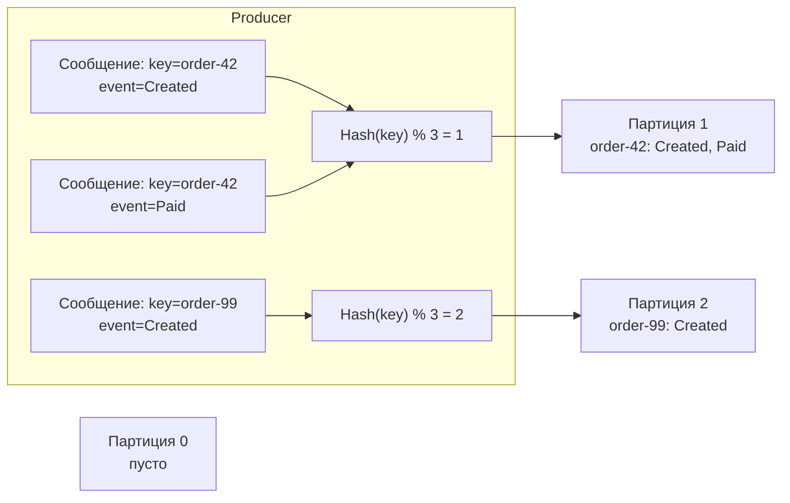

> [!NOTE]
> **Связи:** Эта статья развивает темы, начатые в [[2. Topics, partitions и offsets]] и [[4. Consumer groups]], и закладывает основу для понимания гарантий exactly-once в [[6. Exactly once в Kafka]] и паттернов [[5. Ordering и partitioning]] в распределённых системах.

## Почему упорядоченность — вызов в распределённых системах

В монолитных очередях сообщений порядок часто даётся бесплатно: один процесс пишет, другой читает — FIFO гарантирован. Но как только мы переходим к горизонтально масштабируемым, секционированным логам вроде Kafka, порядок становится осознанным инженерным выбором, тесно переплетённым с параллелизмом.

Kafka предоставляет строгий порядок **внутри одной партиции** и сознательно отказывается от глобального порядка в целом топике. Это не баг, а фундаментальный архитектурный компромисс: глобальный порядок потребовал бы тотальной синхронизации и уничтожил бы пропускную способность. Разработчик должен моделировать потоки данных так, чтобы извлекать выгоду из локального порядка и не полагаться на глобальный.

## Партиция как гарант порядка

Физически партиция — это append-only лог, хранящийся на диске в виде последовательных сегментов. Каждое новое сообщение дописывается строго в конец активного сегмента и получает монотонно возрастающий offset. Эта неизменяемая структура данных гарантирует, что консьюмер, читающий партицию последовательно, увидит сообщения именно в том порядке, в котором их записал продюсер.

Порядок внутри партиции сохраняется даже при репликации: все реплики партиции (лидер и фолловеры) хранят сообщения в одинаковой последовательности, что обеспечивает консистентность при чтении.

Таким образом, если все события, для которых критичен порядок, попадают в одну и ту же партицию, система предоставляет строгий FIFO для этой группы событий. Это фундамент, на котором строятся событийно-ориентированные микросервисы с сохранением причинно-следственных связей.

## Партиционирование как рубильник порядка

Связь между ключом сообщения и партицией — вот где рождается или умирает порядок. Продюсер направляет сообщение в конкретную партицию по одному из трёх правил:

1. **Без ключа (round-robin)** — продюсер равномерно распределяет сообщения по всем партициям топика. Любые два события, даже относящиеся к одному заказу, почти наверняка разойдутся по разным партициям и потеряют всякий гарантированный порядок.
2. **С ключом (hash-based)** — продюсер вычисляет хеш ключа (murmur2) и берёт остаток от деления на количество партиций: `partition = hash(key) % num_partitions`. Все сообщения с одинаковым ключом всегда направляются в одну и ту же партицию, гарантируя строгий порядок для этой сущности (например, `order-12345`).
3. **Явное указание партиции** — приложение-отправитель само задаёт номер партиции, полностью контролируя логику распределения.

В этой схеме события по одному заказу гарантированно упорядочены, а события разных заказов обрабатываются параллельно, не блокируя друг друга. Именно так достигается баланс между порядком и пропускной способностью.

## Ловушка изменения числа партиций

Добавление новых партиций в топик — операция, которая ломает гарантии порядка по ключу. Формула `hash(key) % N` после увеличения N начинает давать другие результаты, и сообщения с одним и тем же ключом могут «переехать» в другую партицию.

> [!warning] Ловушка / Gotcha
> Предположим, топик `orders` имел 2 партиции, и все события по заказу `order-42` шли в партицию 0. Вы добавляете третью партицию для масштабирования. Новые события по `order-42` теперь могут попасть в партицию 1 или 2. Если консьюмер обрабатывает их параллельно, относительный порядок между старыми и новыми событиями разрушается, даже если каждая партиция упорядочена сама по себе.
>
> **Решение:** Количество партиций топика должно быть заложено на этапе проектирования с запасом на будущий параллелизм. Изменение числа партиций — это архитектурный перелом, требующий пересмотра логики консьюмеров и, возможно, миграции данных.

## Упорядоченная обработка в Consumer Group

Consumer Group назначает каждую партицию строго одному консьюмеру-члену. Следовательно, порядок обработки сообщений из одной партиции автоматически сохраняется: их читает один поток выполнения, последовательно.

Однако, если консьюмер внутри себя запускает несколько горутин для параллельной обработки, порядок может быть нарушен на уровне приложения. Чтобы сохранить строгую последовательность обработки событий одной сущности, необходимо:

- Обрабатывать сообщения из одной партиции строго последовательно в одной горутине.
- Или реализовать шардирование по ключу внутри консьюмера (например, хеш от ключа → фиксированная очередь), чтобы события с одинаковым ключом попадали в одну и ту же горутину, сохраняя порядок.

При ребалансировке партиция может переехать к другому консьюмеру, но и там её сообщения будут обрабатываться последовательно. Однако если во время ребалансировки старый консьюмер ещё не завершил обработку, а новый уже начал, возможно временное дублирование сообщений (если оффсет не был закоммичен). Именно для таких случаев важны идемпотентные обработчики ([[4. Idempotent handlers]]) и транзакционная доставка ([[6. Exactly once в Kafka]]).

## Mechanical Sympathy: порядок и дисковый ввод-вывод

Почему партиция как строгий лог настолько эффективна? Современные накопители (SSD/NVMe) показывают пиковую производительность именно на последовательном доступе. Каждая партиция Kafka пишется линейно, без случайных перестановок, что идеально ложится на физическую природу носителя: минимум фрагментации, максимум загрузки каналов, эффективное использование страничного кеша.

Более того, консьюмер, читающий партицию последовательно, движется по файлу сегментам вперёд, позволяя операционной системе предвыбирать следующие блоки данных в кеш. Это даёт устойчивый throughput без провалов, даже при тысячах параллельных потребителей, читающих разные партиции.

> [!info] Под капотом
> Когда консьюмер читает партицию с большим лагом, его запросы могут уходить в старые сегменты, которые уже вытеснены из Page Cache. В этом случае брокер выполняет чтение с диска, но, благодаря линейной структуре сегмента, это всё ещё быстро — последовательное чтение с диска даже на HDD составляет сотни мегабайт в секунду.

## Сравнение с RabbitMQ и типичные собеседовательные вопросы

В RabbitMQ упорядоченность сообщений в очереди гарантируется, пока нет конкурирующих потребителей. Как только появляются competing consumers, порядок разрушается: каждый получает сообщение и обрабатывает его параллельно. Kafka переворачивает эту модель: порядок привязан к партиции, а конкуренция идёт на уровне партиций, а не отдельных сообщений.

> [!tip] Собеседование
> **Вопрос:** Как в Kafka гарантировать порядок обработки событий для одного клиента, если у вас 1000 клиентов и вы хотите обрабатывать их параллельно?
> **Ответ:** Задайте ключ сообщения равным идентификатору клиента. Все события клиента попадут в одну партицию, и их обработчик (консьюмер, которому назначена эта партиция) получит их строго по порядку. Параллелизм достигается за счёт того, что разные клиенты находятся в разных партициях, обрабатываемых разными консьюмерами.

> [!tip] Собеседование
> **Вопрос:** Почему добавление партиций в топик может сломать порядок по ключу, и как этого избежать?
> **Ответ:** Потому что хеш-функция зависит от количества партиций. При увеличении N распределение ключей меняется, и сообщения одной сущности могут уйти в другую партицию. Избежать этого можно, заложив количество партиций с запасом при проектировании, используя составные ключи с учётом всех будущих сущностей и избегая динамического увеличения партиций без миграции состояния консьюмеров.

## Заключение и следующие шаги

Упорядоченность в Kafka — это управляемый архитектурный компромисс. Вы получаете строгий порядок внутри партиции, но теряете глобальный порядок в топике. Ключ сообщения становится инструментом, который «закрепляет» причинность за сущностью, а количество партиций — рычагом, регулирующим параллелизм. Неизменяемый лог и последовательный ввод-вывод делают эту модель исключительно производительной на современном железе.

Теперь мы готовы рассмотреть самый высокий уровень гарантий доставки — exactly-once семантику, объединяющую идемпотентных продюсеров, транзакции и изолированные операции чтения-записи: [[6. Exactly once в Kafka]].