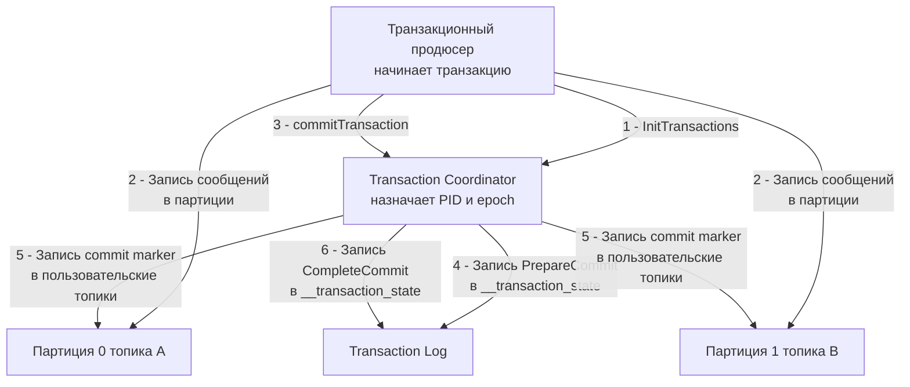

> [!NOTE]
> **Связи:** Эта статья опирается на фундамент [[4. Модели доставки. At most once, at least once, exactly once]] и [[10. Idempotency в message processing]], соединяет продюсера ([[3. Producer и consumer]]) и консьюмера ([[4. Consumer groups]]) с гарантиями порядка ([[5. Ordering и partitioning]]) и подводит к деталям хранения ([[7. Kafka storage под капотом]]).

## Три грани гарантий доставки

Прежде чем погружаться в реализацию exactly-once в Kafka, зафиксируем три классические семантики, знакомые по распределённым системам:

- **At most once** — сообщение либо доставлено один раз, либо потеряно. Самая быстрая, но ненадёжная модель: продюсер не ждёт подтверждений (`acks=0`), консьюмер коммитит offset до обработки.
- **At least once** — сообщение гарантированно доставлено, но может дублироваться. Продюсер ретраит до успеха, консьюмер коммитит offset после обработки. Это стандартный режим Kafka по умолчанию.
- **Exactly once** — сообщение обработано ровно один раз, даже при сбоях и повторах. Самая сложная семантика, требующая кооперации продюсера, брокера и консьюмера, а также идемпотентности обработчика.

В Kafka exactly-once реализуется на нескольких уровнях: **идемпотентный продюсер** гарантирует ровно одну запись в партицию; **транзакции** позволяют атомарно записать в несколько партиций и топиков, а **изолированное чтение** консьюмера отфильтровывает незавершённые транзакции.

## Идемпотентный продюсер: основа exactly-once внутри партиции

Идемпотентный продюсер (enable.idempotence=true) решает проблему дубликатов, вызванных сетевыми ретраями. Когда продюсер отправляет батч, брокер записывает его, но ACK теряется по пути — продюсер повторяет отправку, создавая дубликат. Идемпотентность предотвращает это на уровне протокола.

### Как это работает под капотом

При включении идемпотентности продюсер при инициализации получает от брокера уникальный **Producer ID (PID)** — 64-битное целое, назначаемое координатором транзакций (Transaction Coordinator). Для каждого сообщения в каждой партиции продюсер поддерживает монотонно возрастающий **sequence number**, начинающийся с 0.

Брокер, обслуживающий партицию, хранит в оперативной памяти последний принятый sequence number для каждого PID. Когда приходит батч, брокер проверяет:
- Если sequence number равен ожидаемому (последний + 1) или 0 — записать.
- Если меньше или равен последнему принятому — это дубликат, отбросить, но подтвердить успех.
- Если больше ожидаемого более чем на 1 — ошибка `OutOfOrderSequenceException`, свидетельствующая о потере промежуточных сообщений.

Таким образом, даже если продюсер повторит отправку батча несколько раз, брокер запишет его ровно один раз — в пределах одной сессии Producer ID. Эта гарантия действует **на одну партицию** и **на время жизни продюсера** (PID живёт до перезапуска продюсера или истечения срока неактивности `transactional.id.timeout.ms`).

> [!info] Под капотом
> Продюсер хранит sequence numbers в памяти, а не в логе. При перезапуске продюсера PID теряется и назначается новый, поэтому идемпотентность без транзакций не переживает крах продюсера. Для сквозной exactly-once между топиками или перезапусками нужны транзакции.

## Транзакции: атомарная запись в несколько партиций

Транзакции в Kafka расширяют идемпотентность до атомарных операций, охватывающих несколько партиций и топиков. Они позволяют гарантировать, что либо все сообщения, записанные в рамках одной транзакции, станут видимы консьюмерам, либо ни одно не станет.

Транзакционный API вводит понятие **transactional producer** и **transactional consumer**. Продюсер вызывает `beginTransaction()`, затем отправляет сообщения в один или несколько топиков, после чего вызывает `commitTransaction()` или `abortTransaction()`. Консьюмер с режимом изоляции `read_committed` увидит только сообщения из завершённых транзакций.

### Transaction Coordinator и Transaction Log

Центральную роль в транзакционной инфраструктуре играет **Transaction Coordinator** — специальный брокер, назначаемый для каждого transactional producer'а. Координатор отвечает за:
- Назначение Producer ID.
- Управление транзакционным логом (служебный топик `__transaction_state`), в котором хранятся состояния транзакций (Ongoing, PrepareCommit, PrepareAbort, CompleteCommit, CompleteAbort).
- Выдачу маркеров завершения транзакций (commit/abort markers) в пользовательские топики.



Когда транзакция коммитится, координатор сначала записывает состояние `PrepareCommit` в транзакционный лог, затем асинхронно записывает **commit marker** в каждую задействованную партицию. Эти маркеры — специальные записи без значения, указывающие, что предыдущие сообщения с данным PID закоммичены. Только после записи маркера сообщения становятся видимы для консьюмеров с `read_committed`.

Если продюсер падает до коммита, координатор по истечении `transaction.timeout.ms` прерывает транзакцию, записывая abort marker и делая сообщения невидимыми.

### Producer epoch и защита от зомби

Чтобы избежать ситуации «зомби-продюсера» (когда перезапущенный продюсер с тем же `transactional.id` пытается продолжить старую транзакцию), Kafka использует **producer epoch**. Это монотонно возрастающее число, которое координатор увеличивает при каждой инициализации транзакционного продюсера. Все сообщения и маркеры несут текущий epoch. Брокеры игнорируют записи с устаревшим epoch'ом, предотвращая вмешательство зомби.

### Транзакционный консьюмер и режимы изоляции

Консьюмеры могут читать топики в одном из двух режимов изоляции:
- **read_uncommitted** (по умолчанию) — видят все сообщения сразу, включая незакоммиченные и отменённые транзакции. Для exactly-once неприменим.
- **read_committed** — видят только сообщения, за которыми в логе партиции записан commit marker. Abort-маркеры заставляют консьюмера пропустить соответствующие сообщения. Это требует буферизации на стороне консьюмера: он накапливает сообщения, пока не встретит маркер.

```go
// Пример настройки транзакционного консьюмера в franz-go
cl, err := kgo.NewClient(
    kgo.SeedBrokers("localhost:9092"),
    kgo.ConsumerGroup("transactional-group"),
    kgo.ConsumeTopics("orders"),
    kgo.FetchIsolationLevel(kgo.ReadCommitted()),
    kgo.DisableAutoCommit(),
)
```

## Сквозной exactly-once: паттерн consume-transform-produce

Наиболее распространённый сценарий exactly-once в Kafka — потоковая обработка, где консьюмер читает из одного топика, трансформирует данные и записывает в другой. Сочетание транзакционного продюсера и режима `read_committed` позволяет обеспечить exactly-once даже при ретраях и перезапусках.

Шаги:

1. Консьюмер читает батч из входного топика.
2. Начинается транзакция.
3. Выполняется бизнес-логика (возможно, с обращением к внешним системам, которые должны поддерживать идемпотентность или транзакционную координацию — [[6. Outbox pattern]]).
4. Результат записывается в выходной топик.
5. Offset входного топика коммитится **внутри той же транзакции** (через специальный API `sendOffsetsToTransaction`).
6. Транзакция коммитится. Теперь и результат, и факт обработки становятся видимы атомарно.

> [!warning] Ловушка / Gotcha
> Exactly-once **не распространяется на внешние сайд-эффекты**. Если внутри транзакции происходит запись в PostgreSQL или вызов HTTP API, Kafka не откатит эти операции при аборте. Для этого потребуется распределённая транзакция с использованием паттернов [[8. Saga через брокеры]] или координация через [[2. Temporal. Архитектура и концепции]]. Не путайте exactly-once внутри Kafka с глобальной exactly-once всей системы.

## Производительность, механическая симпатия и подводные камни

Транзакции не бесплатны. Каждая транзакция добавляет дополнительные записи в `__transaction_state` и commit-маркеры в пользовательские топики, увеличивая трафик и нагрузку на диски. Координатор транзакций становится узким местом при большом количестве продюсеров.

На стороне консьюмера режим `read_committed` требует буферизации входящих сообщений до появления маркеров, что увеличивает потребление памяти и может добавить задержку (особенно при долгих транзакциях). В Go-приложениях с ручным управлением памятью следует мониторить размер буферов и избегать утечек при долго висящих незакоммиченных транзакциях.

С точки зрения операционной системы: commit-маркеры — это дополнительные записи в лог, нарушающие идеальную линейность последовательного ввода-вывода. Однако, так как Kafka пишет всё равно последовательно в активный сегмент, эти маркеры просто вклиниваются в поток, не вызывая случайных перемещений головок.

> [!tip] Собеседование
> **Вопрос:** Можете ли вы гарантировать exactly-once при перезапуске продюсера без использования `transactional.id`?
> **Ответ:** Нет. Идемпотентный продюсер без `transactional.id` теряет PID при перезапуске и может создать дубликаты, если ретраи отправляются после перезапуска. Для сквозного exactly-once между топиками и перезапусками обязательно использовать `transactional.id` и транзакционный API.

> [!tip] Собеседование
> **Вопрос:** Какие ограничения имеет exactly-once в Kafka при работе с внешними БД?
> **Ответ:** Exactly-once гарантируется только внутри операций, охватываемых транзакцией Kafka: чтение offset'ов и запись в выходные топики. Внешние системы (PostgreSQL, Redis) не участвуют в транзакции Kafka. Для атомарности между Kafka и БД применяют Outbox Pattern ([[6. Outbox pattern]]) или Saga ([[8. Saga через брокеры]]), либо используют Temporal ([[2. Temporal. Архитектура и концепции]]) для оркестрации распределённых транзакций.

## Заключение и дальнейшие шаги

Exactly-once в Kafka — это инженерный шедевр, построенный на трёх столпах: идемпотентном продюсере, транзакционном протоколе с координатором и изолированном чтении консьюмерами. Правильное применение этих инструментов позволяет строить конвейеры данных с гарантией отсутствия дубликатов и потерь, но требует чёткого понимания границ: exactly-once внутри кластера Kafka не равняется глобальной exactly-once всей системы.

Теперь, освоив гарантии доставки, мы готовы заглянуть под капот самого хранилища Kafka и понять, как сегменты, индексы и политики retention обеспечивают долговечность и эффективность лога: следующая статья — [[7. Kafka storage под капотом]].