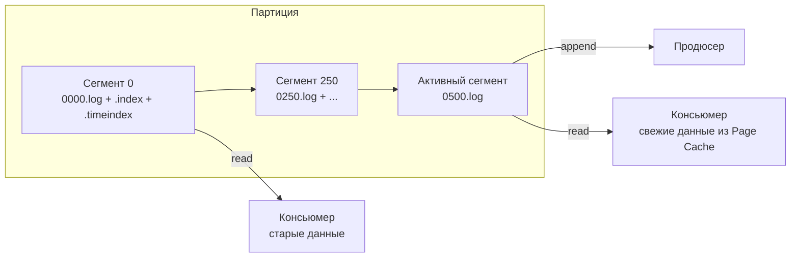
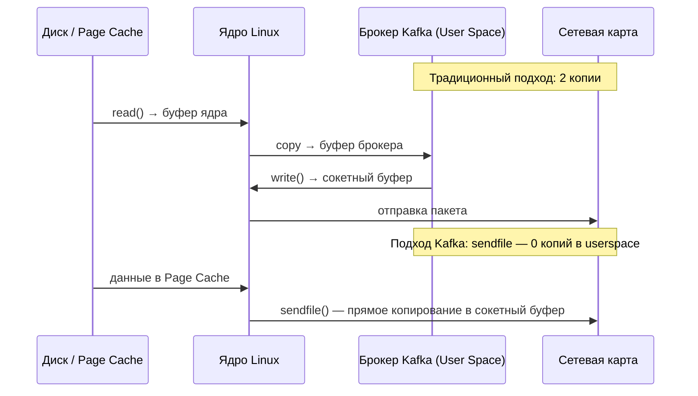

> [!NOTE]
> **Связи:** Эта статья погружает в физическое устройство хранилища, опираясь на [[1. Kafka. Архитектура и модель log based системы]], [[2. Topics, partitions и offsets]], [[7. Message durability и persistence]], а также закладывает фундамент для [[8. Retention и compaction]] и [[12. Производительность Kafka]].

## Почему понимание хранилища критично

Производительность Kafka часто описывают как «миллионы сообщений в секунду». Но это не магия, а результат глубокой механической симпатии к операционной системе и железу. Центральный элемент этой эффективности — слой хранения, спроектированный как простой, неизменяемый, последовательный лог на диске. Без пулов потоков, сложных структур данных в памяти или самодельных кэшей. Kafka буквально полагается на то, что Linux и современные накопители делают лучше всего: линейную запись и чтение крупными блоками.

## Физическая организация партиции

Логическая партиция физически представляет собой директорию на файловой системе брокера (обычно `/var/lib/kafka/data/`), внутри которой лежит набор файлов-сегментов. Каждый сегмент — это тройка файлов:

- **`.log`** — файл с самими сообщениями, записанными последовательно.
- **`.index`** — разреженный индекс, отображающий смещение (offset) в физическую позицию внутри `.log`.
- **`.timeindex`** — разреженный индекс, отображающий временную метку в offset.

Имена файлов — это offset первого сообщения в сегменте, дополненный до 20 цифр. Например:

```
/var/lib/kafka/data/orders-0/
├── 00000000000000000000.log
├── 00000000000000000000.index
├── 00000000000000000000.timeindex
├── 00000000000000000250.log
├── 00000000000000000250.index
├── 00000000000000000250.timeindex
...
```

При достижении активным сегментом лимита размера (`log.segment.bytes`, по умолчанию 1 ГБ) или времени (`log.roll.ms`, по умолчанию 7 дней) он закрывается, становится неизменяемым, и создаётся новый активный сегмент. Это простое разбиение на файлы критически важно: оно позволяет удалять старые данные целыми сегментами без фрагментации и без сканирования, что ложится в основу retention-политик ([[8. Retention и compaction]]).



## Формат данных на диске

Начиная с Kafka 0.11, сообщения хранятся в **RecordBatch** формате версии v2, который заменил старый формат записей "message set". RecordBatch — это контейнер, содержащий:

- **baseOffset** — offset первого сообщения в батче.
- **baseTimestamp** — временная метка создания батча.
- **attributes** — флаги сжатия (gzip, snappy, lz4, zstd), признак транзакционности, флаги управления (control batch, commit/abort marker).
- **crc** — контрольная сумма для целостности.
- **record count** — количество записей.
- **records** — массив отдельных записей Record.

Каждый Record содержит:
- **length** — длина сообщения.
- **attributes** — timestamp delta от базовой метки батча.
- **offset delta** — смещение относительно baseOffset.
- **key** — байтовый массив ключа.
- **value** — байтовый массив значения.
- **headers** — массив пар ключ-значение заголовков.

Брокер хранит батч как одну неделимую единицу: он не распаковывает и не модифицирует сжатые батчи, а просто дописывает их в `.log` и отдаёт консьюмерам как есть. Это означает, что сжатие на продюсере напрямую экономит не только сеть, но и дисковое пространство, и пропускную способность канала между брокером и консьюмером.

> [!info] Под капотом
> Для проверки контрольных сумм и доступа к метаданным брокер использует `FileChannel` и `MappedByteBuffer` (в Java). При чтении консьюмера зачастую не требуется даже копирование в userspace: системный вызов `sendfile` передаёт байты из страничного кеша напрямую в сокет.

## Разреженные индексы

Поскольку лог может достигать гигабайт, полный индекс всех offset'ов занял бы слишком много памяти. Kafka использует **разреженный (sparse) индекс**: запись добавляется не для каждого сообщения, а с интервалом, определяемым `log.index.interval.bytes` (по умолчанию 4096 байт).

### Offset Index

Файл `.index` содержит записи фиксированного размера (8 байт offset + 4 байта позиция). Для поиска offset'а X алгоритм:
1. Определяется сегмент, которому принадлежит X (по имени файла).
2. В `.index` бинарным поиском находится ближайшая запись с offset ≤ X.
3. От полученной физической позиции в `.log` начинается последовательное сканирование до целевого offset.

Таким образом, на поиск любой позиции требуется O(log N) по индексу и небольшое линейное сканирование внутри блока размером до `index.interval.bytes`.

### Time Index

Файл `.timeindex` устроен аналогично, но сопоставляет временные метки (timestamp) с offset'ами. Позволяет искать сообщения по времени, например, при смещении `offsetsForTimes(timestamp)`. Разреженность определяется `log.index.interval.bytes` тоже.

> [!warning] Ловушка / Gotcha
> Если консьюмер запрашивает offset по временной метке, которая приходится на середину большого несжатого батча старых версий, брокеру может потребоваться распаковать весь батч для поиска точного offset'а. В современных RecordBatch v2 с дельтами offset и timestamp это делается эффективнее, но всё ещё требует чтения с диска. Чрезмерное использование временных запросов без «горячего» кеша может нагрузить ввод-вывод.

## Путь сообщения от продюсера до диска

Когда продюсер отправляет батч, брокер-лидер выполняет следующие шаги:

1. Принять байты по сети, десериализовать заголовки запроса.
2. Проверить контрольную сумму батча.
3. Добавить батч в конец активного сегмента `.log` через `FileChannel.write` (последовательная запись).
4. Обновить позиционный и временной индексы (тоже последовательная запись).
5. Отправить ACK продюсеру (согласно `acks`, см. [[1. Kafka. Архитектура и модель log based системы]]).
6. Периодически вызвать `fsync` для обеспечения долговечности ([[7. Message durability и persistence]]).

Запись в `.log` — это чистое дописывание. Нет чтения, поиска или модификации существующих данных. Именно это делает запись в Kafka невероятно быстрой: диски прекрасно справляются с последовательной нагрузкой, а современные NVMe-накопители выдают несколько гигабайт в секунду без значительных задержек.

## Путь от диска до консьюмера: Zero-Copy и sendfile

При запросе консьюмера (`Fetch` request) брокер:

1. Определяет offset, с которого нужно читать.
2. Находит сегмент и физическую позицию через индекс.
3. Использует **`FileChannel.transferTo`** (в Java), который на Linux вызывает системный вызов `sendfile`. Эта функция копирует данные из страничного кеша (или с диска, если данных нет в кеше) напрямую в сокетный буфер, минуя промежуточный буфер в userspace.

Традиционный подход «прочитать в буфер брокера, затем записать в сокет» требовал бы двух копий (диск → буфер в userspace → сокет) и двух переключений контекста (пространство пользователя ↔ ядро). С `sendfile` данные копируются только один раз внутри ядра, а пользовательский процесс лишь инициирует передачу. Это радикально экономит CPU и пропускную способность памяти.



> [!info] Под капотом
> В Go-клиентах (например, `franz-go`) аналогичная эффективность достигается на стороне приёма сообщений: клиент использует `syscall.Read` в горутине, читающей из TCP-соединения, и получает готовые батчи в заранее аллоцированные буферы (часто из `sync.Pool`), избегая дополнительных аллокаций.

## Долговечность и стратегии fsync

По умолчанию Kafka не вызывает `fsync` на каждое сообщение; она полагается на фоновую запись грязных страниц из Page Cache на диск ядром Linux. Параметры `log.flush.interval.messages` и `log.flush.interval.ms` управляют явным сбросом, но их тюнинг требует осторожности.

- **Высокая пропускная способность** — fsync редко (или полностью отключён), риск потери нескольких сообщений при крахе ОС.
- **Максимальная надёжность** — fsync на каждое сообщение, но это резко снижает throughput из-за затрат на синхронный ввод-вывод.

Репликация в ISR (In-Sync Replicas) служит дополнительным уровнем защиты: даже если одна машина потеряет данные, синхронные реплики на других брокерах их сохранят. Поэтому типичные настройки оставляют fsync на усмотрение ядра, а надёжность обеспечивают через `acks=all` и достаточное количество реплик.

## Mechanical Sympathy: почему это работает

Современные накопители (NVMe SSD) имеют пропускную способность в несколько ГБ/с при последовательном доступе и на порядок хуже при случайном. Kafka эксплуатирует только последовательный доступ. Каждый сегмент пишется линейно; даже при чтении с лагом консьюмер читает сегмент последовательно, позволяя диску эффективно выполнять предвыборку.

Кроме того, Kafka минимизирует накладные расходы на управление памятью. Нет сложных структур на хипе, нет сборщика мусора, удерживающего сотни гигабайт данных. Всё уходит в страничный кеш ядра, который автоматически вытесняет старые холодные страницы при нехватке памяти. Брокер остаётся лёгким, что особенно ценится при эксплуатации в Kubernetes с лимитами памяти.

## Влияние Go-клиентов

Go-консьюмеры, например `franz-go`, используют асинхронный сетевой ввод-вывод с epoll/kqueue и пул горутин для приёма сообщений из нескольких брокеров. Когда брокер отправляет большой батч через `sendfile`, данные поступают в сокетный буфер ядра, и горутина Go читает их одним системным вызовом `Read`, не вовлекая лишние промежуточные буферы. Сочетание эффективного клиента и серверной zero-copy даёт впечатляющую пропускную способность на современных серверах.

## Заключение

Хранилище Kafka — это триумф простоты: неизменяемый лог, сегменты на файловой системе, разреженные индексы и полное доверие страничному кешу ОС. Никаких самодельных буферных менеджеров, никаких сложных структур в памяти — только линейная запись, линейное чтение и `sendfile`. Именно эта архитектура позволяет одному брокеру обслуживать миллионы сообщений в секунду, не превращаясь в бутылочное горлышко.

Теперь, когда мы разобрали, как данные хранятся и извлекаются, перейдём к тому, как Kafka управляет жизненным циклом этих данных: [[8. Retention и compaction]].