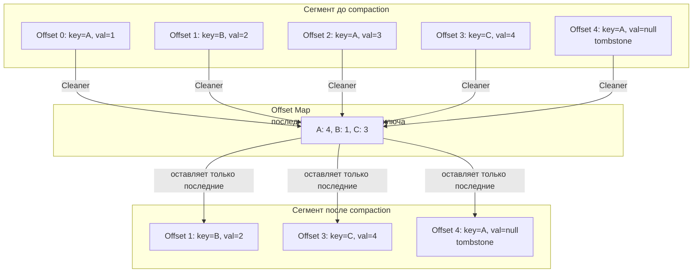

> [!NOTE]
> **Связи:** Эта статья прямо продолжает [[7. Kafka storage под капотом]], в котором мы детально разобрали сегменты и физическую организацию лога. Здесь мы рассмотрим, как Kafka управляет жизненным циклом этих сегментов через два фундаментально разных механизма: **Retention** (удаление по времени/размеру) и **Compaction** (уплотнение по ключу).

## Два взгляда на жизненный цикл данных

Apache Kafka хранит сообщения на диске, но дисковое пространство конечно. Управление жизненным циклом данных критически важно: бесконтрольно растущий лог рано или поздно исчерпает все ресурсы и остановит кластер. При этом просто удалять всё подряд нельзя — разные сценарии предъявляют противоположные требования к хранению:

- **Поток событий, журнал пользовательских действий:** нужна возможность воспроизвести поток за последние N часов/дней, а всё, что старше, можно удалить.
- **Хранилище текущего состояния (CDC, таблицы соответствий, последний снапшот):** нужно всегда иметь последнее значение для каждого ключа, а историю изменений можно отбросить.

Kafka предлагает два режима очистки — **delete** (retention) и **compact** (compaction), — и позволяет гибко комбинировать их для разных топиков через `cleanup.policy`.

## Retention: классическое удаление по времени и размеру

Это самый интуитивный и распространённый механизм. Топик с политикой `delete` хранит сообщения определённое время и/или до превышения заданного суммарного объёма, после чего старые данные безвозвратно удаляются.

### Параметры, управляющие retention

- **`retention.ms`** — максимальное время хранения сообщения в топике (по умолчанию 7 дней на уровне брокера, может переопределяться на уровне топика). Сообщения, чей timestamp старше `now - retention.ms`, становятся кандидатами на удаление.
- **`retention.bytes`** — максимальный суммарный размер всех сегментов партиции (по умолчанию `-1`, т.е. без ограничения). При превышении этого порога самые старые сегменты удаляются, даже если их возраст меньше `retention.ms`.
- **`log.retention.check.interval.ms`** — периодичность, с которой планировщик Log Manager проверяет сегменты на соответствие условиям удаления (по умолчанию 5 минут).

### Как работает удаление

Физически удаление оперирует целыми **сегментами** — файлами на диске. Активный сегмент, в который идёт запись, никогда не удаляется. Log Manager периодически проверяет закрытые сегменты:

1. Если максимальный timestamp записей в сегменте меньше `now - retention.ms`, весь сегмент помечается на удаление.
2. Если суммарный размер закрытых сегментов превысил `retention.bytes`, удаляются самые старые сегменты, пока суммарный размер не вернётся в лимит.

Удаление реализовано простым системным вызовом `unlink` (или `delete` в Java), который освобождает дисковое пространство. Это чрезвычайно дешёвая операция по сравнению с переписыванием данных.

> [!info] Под капотом
> Удаление сегментов не приводит к дефрагментации файловой системы и не требует сканирования контента. Всё, что делает брокер, — удаляет файлы `.log`, `.index` и `.timeindex` целиком. Именно поэтому retention — лёгкая операция, практически не нагружающая ввод-вывод, если не считать кратковременного обновления метаданных файловой системы.

## Compaction: уплотнение по ключу

Если retention отвечает на вопрос «как долго хранить сообщения?», то compaction — на вопрос «какое значение ключа является актуальным?». В компактифицированном топике для каждого уникального ключа сохраняется **только запись с максимальным offset-ом** (последняя по порядку записи). Все старые дубликаты ключа удаляются. Гарантируется, что в конце концов в логе останется не более одного значения на ключ, и консьюмер, читая лог с начала, увидит последнее известное состояние каждого ключа.

### Зачем нужен compaction

Основные сценарии:

- **Change Data Capture (CDC)** — захват изменений строк из БД. Каждое изменение строки (INSERT, UPDATE, DELETE) приходит в топик с ключом = первичный ключ. Compaction гарантирует, что новый консьюмер сможет восстановить полное текущее состояние, прочитав компактифицированный топик с начала, вместо того чтобы проходить всю историю изменений.
- **Хранение эталонных данных (reference data)** — например, справочники, курсы валют.
- **Служебные топики Kafka** — `__consumer_offsets` использует compaction для хранения последнего коммиченного offset'а для каждой Consumer Group и партиции.

### Как работает Log Cleaner под капотом

За compaction отвечает пул фоновых потоков — **Log Cleaner**. Его задача: переписывать старые сегменты, удаляя дублирующиеся записи и tombstone-ы.

Алгоритм:

1. Log Cleaner выбирает сегмент для очистки. Предпочтение отдаётся сегментам с наибольшим соотношением «грязных» записей (дубликатов) к общему размеру сегмента. Это контролируется параметром **`min.cleanable.dirty.ratio`** (по умолчанию 0.5). Если доля грязных записей ниже порога, очистка откладывается до накопления большего количества дубликатов, чтобы не тратить ресурсы на почти чистый лог.

2. Для выбранного сегмента Log Cleaner строит в оперативной памяти **Offset Map** — хеш-таблицу (или компактное дерево), отображающую ключ сообщения в его последний offset **в пределах этого сегмента и всех более свежих сегментов**. Таким образом, если ключ встречается несколько раз, в карте останется только наибольший offset.

3. Затем начинается «копирующая» фаза: Log Cleaner читает выбранный сегмент последовательно, и для каждой записи проверяет, присутствует ли её ключ в Offset Map и совпадает ли её offset с хранящимся максимальным. Если да — запись копируется в новый, чистый сегмент. Если нет — она пропускается (удаляется).

4. После завершения копирования старый сегмент заменяется новым, чистым сегментом, а старый файл удаляется. Активный сегмент (в который идёт запись) никогда не подвергается компактификации.



### Tombstone-записи и `delete.retention.ms`

Когда нужно сообщить, что ключ удалён, в Kafka публикуется **tombstone** — запись с ключом и `null`-значением. Это маркер «удалён». Однако tombstone не может быть удалён немедленно после компактификации: иначе консьюмер, читающий с начала, увидит старые значения и не узнает, что ключ был удалён.

Параметр **`delete.retention.ms`** (по умолчанию 24 часа) определяет, как долго tombstone хранится в логе после того, как он был обработан Log Cleaner и признан последней записью для своего ключа. По истечении этого срока при следующей очистке tombstone будет окончательно удалён, и ключ исчезнет из лога.

> [!warning] Ловушка / Gotcha
> Если консьюмер отстаёт больше, чем на `delete.retention.ms`, и tombstone уже удалён, при перемотке он увидит старые значения ключа, не узнав, что ключ был удалён. Это приводит к «воскрешению» удалённых записей в состоянии консьюмера. Чтобы избежать этого, необходимо либо гарантировать, что консьюмер не отстаёт на такие длительные периоды, либо использовать компактифицированные топики в сочетании с дополнительным механизмом синхронизации (например, снапшоты в Kafka Streams).

## Mechanical Sympathy: влияние на ввод-вывод и страничный кеш

### Retention: почти бесплатно

Удаление сегментов — это метаданные операции. Файловая система просто освобождает блоки, никакого чтения или записи данных не происходит. Страничный кеш самоочищается по мере вытеснения ненужных страниц. Нагрузка на диски минимальна.

### Compaction: тяжеловесная операция

Log Cleaner — это интенсивная фоновая работа, которая читает старые сегменты и записывает новые. Это конкурирует со штатной нагрузкой брокера (продюсеры, консьюмеры). Ключевые аспекты:

- **Чтение:** холодные сегменты, возможно, вытеснены из Page Cache в момент очистки, что приводит к физическому чтению с диска.
- **Запись:** создание новых сегментов порождает последовательную запись, что эффективно, но добавляет общий объём ввода-вывода.
- **Память:** Offset Map для каждой партиции может быть значительной (десятки мегабайт), потребляя оперативную память брокера.

Тюнинг `log.cleaner.threads` и `min.cleanable.dirty.ratio` позволяет балансировать между свежестью компактификации и нагрузкой на железо.

## Сравнение Retention и Compaction

| Характеристика                 | Retention (delete)                              | Compaction (compact)                                     |
| ------------------------------ | ----------------------------------------------- | -------------------------------------------------------- |
| Критерий очистки               | Время / размер топика                           | Последнее значение ключа                                 |
| Операция                       | Удаление целых сегментов (`unlink`)             | Переписывание сегментов с удалением дубликатов           |
| Порядок сообщений              | Сохраняется                                     | Сохраняется, но часть сообщений исчезает                 |
| Возможность воспроизвести историю | Да, за период retention                     | Нет, только последнее состояние каждого ключа            |
| Накладные расходы              | Почти нулевые                                   | Значительные (I/O, CPU, память)                          |
| Типовые сценарии               | Логирование, поток событий, аналитика           | CDC, таблицы состояний, `__consumer_offsets`             |

Допустимо комбинировать политики: `cleanup.policy=compact,delete` — топик будет одновременно удалять сообщения по времени/размеру и компактифицировать старые сегменты. Это позволяет ограничить абсолютный объём хранилища, сохраняя преимущества compaction.

## Практическое использование в Go: восстановление состояния из компактифицированного топика

Типичный паттерн для stateful-сервиса на Go: при старте консьюмер читает компактифицированный топик с `auto.offset.reset=earliest` и строит в памяти хеш-таблицу текущего состояния.

```go
// Пример: загрузка справочника курсов валют из компактифицированного топика
func loadCurrencyRates(ctx context.Context, client *kgo.Client) (map[string]float64, error) {
    rates := make(map[string]float64)
    for {
        fetches := client.PollFetches(ctx)
        if fetches.IsClientClosed() {
            break
        }
        fetches.EachRecord(func(record *kgo.Record) {
            key := string(record.Key)
            // tombstone: ключ удалён
            if record.Value == nil {
                delete(rates, key)
                return
            }
            rate, _ := strconv.ParseFloat(string(record.Value), 64)
            rates[key] = rate
        })
        // Коммитить offset имеет смысл только после построения полного состояния,
        // чтобы при перезапуске не перечитывать всё заново.
        client.CommitUncommittedOffsets(ctx)
    }
    return rates, nil
}
```

> [!tip] Собеседование
> **Вопрос:** Почему консьюмер компактифицированного топика при восстановлении состояния должен читать **весь** лог с начала, а не только последние сообщения?
> **Ответ:** Потому что compaction не даёт гарантии, что для каждого ключа есть запись в последнем сегменте. Ключ мог быть записан однократно в старом сегменте, больше не обновляться, и его значение осталось только там. После прочтения всего лога с начала консьюмер восстанавливает полное актуальное состояние. В Kafka Streams для ускорения используются локальные RocksDB с периодическими снапшотами, чтобы не перечитывать весь лог каждый раз.

## Когда Retention, а когда Compaction: правило выбора

- Если поток данных — это **непрерывный поток событий** (события кликов, логи, метрики), и вам нужна история за последний день/неделю — используйте **retention**.
- Если данные — это **изменения сущностей** (пользователи, заказы), и вам важно текущее состояние, а не история — используйте **compaction**.
- Если вам нужно и то, и другое (история изменений за период и быстрое восстановление состояния) — комбинируйте: используйте отдельный топик с retention для событий и компактифицированный топик для CDC-снапшотов. Или `compact,delete`.

## Заключение и следующие шаги

Retention и Compaction — два фундаментальных механизма, превращающих Kafka из просто «распределённого лога» в долговременное хранилище, способное обслуживать как операционную аналитику, так и постоянно актуальные таблицы состояний. Понимание их физического устройства — ключ к корректной настройке кластера и предотвращению катастрофических отставаний или потерь данных.

Теперь, когда мы разобрались с хранением, пора переходить к более высокоуровневой обработке данных прямо внутри кластера. В следующей статье мы рассмотрим [[9. Kafka Streams]] — библиотеку, которая строит потоковые топологии поверх тех самых логов, которые мы только что изучили.