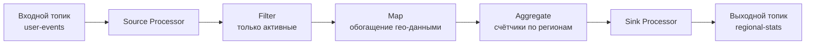

> [!NOTE]
> **Связи:** Эта статья опирается на фундамент всего подраздела Kafka: [[1. Kafka. Архитектура и модель log based системы]], [[2. Topics, partitions и offsets]], [[3. Producer и consumer]], [[4. Consumer groups]], [[5. Ordering и partitioning]], [[6. Exactly once в Kafka]], [[7. Kafka storage под капотом]] и [[8. Retention и compaction]]. Мы переходим от инфраструктуры к построению потоковых приложений, которые живут и дышат внутри этой инфраструктуры.

## Что такое Kafka Streams

**Kafka Streams** — это клиентская библиотека для построения потоковых приложений и микросервисов, работающих непосредственно с данными в Apache Kafka. В отличие от тяжёлых распределённых движков (Apache Flink, Spark Streaming), Kafka Streams не требует отдельного кластера: это обычное Java-приложение, которое масштабируется так же, как обычные консьюмеры — добавлением экземпляров в Consumer Group.

Ключевая философия: **потоковая обработка как распределённое приложение, а не как джоб в кластере**. Приложение на Kafka Streams само управляет своим жизненным циклом, состоянием, восстановлением после сбоев и перебалансировкой, используя саму же Kafka как инфраструктуру для координации и хранения.

С точки зрения Go-разработчика, понимание Kafka Streams необходимо не столько для написания кода на Java, сколько для усвоения паттернов потоковой обработки, которые затем можно воспроизвести на родном языке с помощью нативных клиентов и state store.

## Основные абстракции: граф процессоров

Kafka Streams моделирует обработку как **топологию (topology)** — направленный ациклический граф, в котором узлы являются процессорами, а рёбра — потоками данных. Топология описывает, как сообщения из одного или нескольких входных топиков проходят через цепочку операций и попадают в выходные топики.

Основные типы потоков:

- **KStream** — непрерывный поток записей, каждая запись независима. Аналогичен таблице без первичного ключа: могут быть дубликаты, все записи просто следуют одна за другой.
- **KTable** — поток изменений, где каждая запись означает обновление или удаление значения по ключу. Эквивалентно компактифицированному топику ([[8. Retention и compaction]]): новое значение по ключу заменяет старое. При агрегации KStream порождает KTable.
- **GlobalKTable** — полная реплика компактифицированного топика на все экземпляры приложения. Используется для обогащения потока данными справочников (например, справочник стран), к которым нужен доступ из любого экземпляра без перераспределения по ключу.

## Stateless и stateful операции

### Stateless (без состояния)

Каждое сообщение обрабатывается изолированно, состояние не требуется:
- `map` — преобразование один-к-одному.
- `filter` — пропустить или отбросить.
- `flatMap` — одно ко многим.
- `branch` — разделение потока на несколько ветвей по предикатам.

Эти операции лёгкие, не требуют восстановления и не создают changelog-топиков.

### Stateful (с состоянием)

Здесь обработка зависит от истории, и Kafka Streams управляет состоянием прозрачно для разработчика:

- **Агрегация (aggregate, count, reduce):** по ключу накапливается аккумулятор. Например, количество событий по каждому региону.
- **Соединения (join):** объединение нескольких потоков. `KStream-KStream` — join по временному окну, `KStream-KTable` — обогащение потока таблицей, `KStream-GlobalKTable` — обогащение без ограничений по времени.
- **Оконные операции (windowing):** группировка по ключу и временному окну, после чего агрегация.

Состояние хранится локально в embedded key-value store (по умолчанию RocksDB) и реплицируется в changelog-топик Kafka, что обеспечивает долговечность и восстановление.

## Окна: как придать времени структуру

Ключевой элемент потоковой обработки — управление окнами. Kafka Streams поддерживает несколько типов окон, радикально влияющих на потребление памяти и семантику.

- **Hopping window (скользящее окно):** фиксированный размер окна и шаг сдвига. Окна перекрываются, запись может принадлежать нескольким окнам.
- **Tumbling window (перекатывающееся окно):** частный случай hopping, где шаг равен размеру, окна не перекрываются. Проще, но менее гибко.
- **Session window (сессионное окно):** динамическое окно, которое расширяется, пока приходят сообщения с одинаковым ключом в пределах `inactivity.gap`. Идеально для пользовательских сессий.
- **Sliding window (скользящий join):** для операций соединения, где важно не абсолютное время, а разница между временными метками записей из двух потоков.

Каждое окно порождает независимый аккумулятор в хранилище состояний. Количество окон может быть огромным, и именно RocksDB обеспечивает эффективное управление этими данными без переполнения кучи JVM/Go-приложения.

## Хранение состояния: RocksDB, changelog и восстановление

В stateful-приложениях Kafka Streams управляет локальным состоянием автоматически. Факты, которые нужно знать архитектору:

- **Локальное хранилище (state store):** по умолчанию RocksDB — LSM-движок, оптимизированный под быструю запись и эффективное использование SSD. Данные хранятся в томах, привязанных к экземпляру (обычно `/var/lib/kafka-streams`). В Go-реализациях аналогами могут быть Badger, BoltDB, Pebble.

- **Changelog-топик:** все изменения в state store дублируются в отдельный топик Kafka с политикой compaction. Если экземпляр падает и перезапускается, он восстанавливает своё состояние, перечитывая changelog, как это делает консьюмер компактифицированного топика ([[8. Retention и compaction]]).

- **Ребалансировка и перемещение состояния:** при изменении числа партиций или членов группы, партиции переезжают. Kafka Streams использует протокол Sticky Assignor и, начиная с версии 2.x, инкрементальную ребалансировку (Cooperative Sticky), чтобы минимизировать простои. Состояние для мигрировавшей партиции восстанавливается на новом экземпляре из changelog-топика, а на старом — удаляется.

- **Standby-реплики:** для ускорения восстановления можно настроить `num.standby.replicas`. Тогда теневые экземпляры пассивно читают changelog и поддерживают горячую копию состояния. При сбое основного экземпляра один из standby моментально занимает его место без перечитывания лога.

> [!info] Под капотом
> RocksDB внутри использует MemTable (write buffer в оперативной памяти) и фоновую компактификацию SST-файлов. При записи данные сначала попадают в MemTable и WAL на диске, затем асинхронно сливаются в отсортированные строковые таблицы (SST). Это идеально ложится на модель Kafka Streams: быстрая аккумуляция обновлений, периодическое слияние. Страничный кеш Linux активно используется при чтении SST-файлов, а Go-аналоги Badger/Pebble работают по тем же принципам.

## Exactly-once семантика

Kafka Streams гарантирует exactly-once для операций, замыкающихся внутри экосистемы Kafka: чтение из топиков, обработку с состоянием и запись в выходные топики. Достигается это за счёт транзакционного продюсера и изолированного чтения ([[6. Exactly once в Kafka]]):

1. Приложение начинает транзакцию Kafka.
2. Внутри транзакции записываются результаты обработки в выходные топики и коммитятся оффсеты входных топиков (через `sendOffsetsToTransaction`).
3. Транзакция коммитится, и все side-эффекты становятся видны атомарно.

Это гарантирует, что даже при крахе и перезапуске одно и то же сообщение не породит дублирующихся записей. Однако, как и в любых exactly-once гарантиях Kafka, внешние сайд-эффекты (отправка email, запись в стороннюю БД) требуют дополнительных паттернов ([[6. Outbox pattern]], [[8. Saga через брокеры]], [[2. Temporal. Архитектура и концепции]]).

## Интерактивные запросы

Одно из мощных, но недооценённых свойств Kafka Streams — возможность обращаться к локальному состоянию извне через REST API. Поскольку каждое приложение владеет частью глобального состояния (шардированной по партициям), можно реализовать распределённый key-value store с миллисекундными задержками, без внешней базы данных.

При запросе клиента экземпляр либо обслуживает его локально (если ключ принадлежит его партициям), либо проксирует запрос на нужный экземпляр через механизм `StreamsMetadata`. Это классический паттерн [[5. CQRS и брокеры]], где команды обрабатываются через поток, а запросы — через интерактивные запросы к материализованным представлениям.

## Mechanical Sympathy: почему локальное состояние эффективнее удалённого

Главный инженерный выигрыш Kafka Streams — колокация вычислений и состояния на одной машине. Это резко снижает задержки (нет сетевого round-trip к внешнему хранилищу), но предъявляет требования к локальным дискам и памяти.

- **Локальный SSD/NVMe критичен:** RocksDB активно использует fsync для WAL и случайное чтение SST-файлов. На HDD throughput будет плачевным. Использование локальных NVMe-дисков (как в инстансах AWS i3) позволяет получить задержки менее миллисекунды.
- **Страничный кеш и off-heap:** RocksDB использует off-heap память для блоков кеша, минуя сборщик мусора JVM (или Go GC). Это позволяет утилизировать большие объёмы RAM без негативного влияния на паузы.
- **Сегментированность и компактификация:** changelog-топики для state store — это компактифицированные топики. Log Cleaner Kafka удаляет дублирующиеся ключи, сокращая объём данных, который необходимо перечитывать при восстановлении. Настройка `min.cleanable.dirty.ratio` и `delete.retention.ms` критична для быстрого восстановления.

## Go и потоковая обработка: альтернативы Kafka Streams

В мире Go нет официальной библиотеки Kafka Streams, но есть несколько путей реализации потоковой обработки:

### 1. Goka — библиотека, вдохновлённая Kafka Streams

[Goka](https://github.com/lovoo/goka) предоставляет похожую модель: группы, процессоры, локальное состояние в Badger (LSM-движок на Go), changelog-топики, автоматическое восстановление. Однако библиотека менее зрелая и требует аккуратного продакшен-использования.

### 2. Ручная реализация с franz-go

Можно построить потоковый процессор, используя `kgo.Client`, горутины и собственное локальное хранилище (например, Badger или Bolt). Типичный паттерн:

- Консьюмер читает входной топик, обогащает или агрегирует данные, обращаясь к локальному Badger по ключу.
- Результат пишется транзакционным продюсером в выходной топик.
- Все изменения локального хранилища дублируются в компактифицированный changelog-топик вручную (для восстановления).
- При ребалансировке партиций используется `revoke` callback, чтобы закрыть локальное хранилище, и `assign` callback, чтобы восстановить состояние из changelog.

Это даёт полный контроль, но требует написания значительного объёма шаблонного кода.

### 3. Использование внешних фреймворков

Для сложных потоковых топологий может быть оправдано использование Flink или Spark Streaming, вызываемых из Go через API, но это уводит от простоты и легковесности.

Принципиальное понимание Kafka Streams позволяет Go-разработчику принимать взвешенные архитектурные решения, а при необходимости — воспроизводить ключевые паттерны на родном языке, сохраняя механическую симпатию и используя сильные стороны экосистемы Go (горутины, низкие накладные расходы, отличные LSM-движки).

## Заключение и дальнейшие шаги

Kafka Streams — это кульминация проектирования потоковых систем на основе лога: она превращает партицированный, реплицированный журнал в платформу для stateful-обработки, сохраняя простоту и горизонтальную масштабируемость обычного консьюмера. Понимание её внутреннего устройства и компромиссов критически важно для системного архитектора, даже если реализация будет на Go.

Следующая статья в разделе Kafka — [[10. Kafka Connect]], которая расширяет экосистему за пределы кастомных приложений, предоставляя стандартизированные коннекторы для интеграции с внешними системами без написания кода.