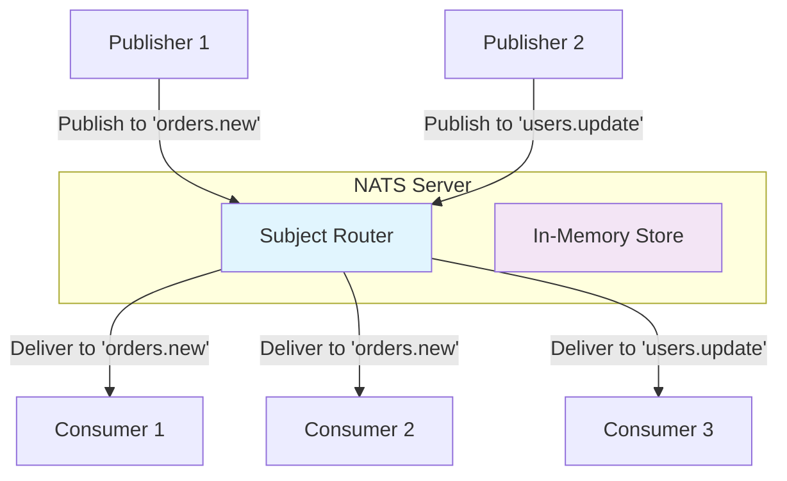

**NATS** — это легковесный, высокопроизводительный брокер сообщений, разработанный для построения распределенных систем и event-driven архитектур. В отличие от тяжеловесных решений вроде Apache Kafka или RabbitMQ, NATS фокусируется на **простоте**, **производительности** и **малом потреблении ресурсов**, что делает его идеальным выбором для микросервисных архитектур, IoT-устройств, edge-вычислений и систем с жесткими требованиями к задержкам.

### Философия и происхождение

NATS был создан Derek Collison в 2010 году (изначально как проект Apcera) и позже открыт в 2012 году. Имя происходит от "NASCAR At Television Speed", что отражает философию проекта: **максимальная скорость передачи событий в реальном времени**. NATS построен на основе **асинхронного publish-subscribe** (pub/sub) шаблона, где отправители (publishers) и получатели (subscribers) не связаны напрямую — они взаимодействуют через **subject-based routing**, что делает систему слабо связанной (loosely coupled).

### Архитектура NATS

Центральный элемент NATS — это **сервер (nats-server)**, который выступает в роли **message broker**. Он принимает сообщения от publisher'ов и рассылает их соответствующим subscriber'ам на основе **subject'ов** (аналог топиков в других системах). Архитектура NATS крайне проста и элегантна:



**Server** в NATS — это **stateless** компонент, который работает в памяти. Сообщения по умолчанию **не.persistent**, что обеспечивает минимальные задержки, но требует осторожного подхода к гарантиям доставки. Для persistent сообщений существует расширение **JetStream** (о котором будет подробнее в статье [[5. JetStream. Persistence и stream processing]]).

### Core Concepts

#### 1. Subject (Тема)

Subject — это строка, которая определяет маршрут для сообщения. Это аналог топика в Kafka или очереди в RabbitMQ, но с более гибкой системой маршрутизации. Subject может быть иерархическим:

```
orders.new
orders.completed
users.created
users.profile.updated
news.sports.football
```

Subscribers могут подписываться на конкретный subject или использовать **wildcards**:

- `*` — один уровень: `orders.*` будет матчить `orders.new`, `orders.completed`, но не `orders.new.special`
- `>` — все уровни: `news.>` будет матчить `news.sports`, `news.sports.football`, `news.tech.ai` и т.д.

#### 2. Publish-Subscribe (Pub/Sub)

Это основной паттерн взаимодействия в NATS. Publisher отправляет сообщение в определённый subject, а все подписчики на этот subject получают копию сообщения. Это **fan-out** паттерн: одно сообщение может быть получено несколькими consumer'ами.

```go
package main

import (
    "fmt"
    "log"
    "time"

    "github.com/nats-io/nats.go"
)

func main() {
    nc, err := nats.Connect(nats.DefaultURL)
    if err != nil {
        log.Fatal(err)
    }
    defer nc.Close()

    // Publisher
    err = nc.Publish("orders.new", []byte("Order #123 created"))
    if err != nil {
        log.Printf("Error publishing: %v", err)
        return
    }

    // Subscriber 1
    _, err = nc.Subscribe("orders.new", func(msg *nats.Msg) {
        fmt.Printf("Consumer 1 received: %s\n", string(msg.Data))
        msg.Ack() // Acknowledgement (если используется JetStream)
    })
    if err != nil {
        log.Fatal(err)
    }

    // Subscriber 2
    _, err = nc.Subscribe("orders.new", func(msg *nats.Msg) {
        fmt.Printf("Consumer 2 received: %s\n", string(msg.Data))
    })
    if err != nil {
        log.Fatal(err)
    }

    // Ждём немного, чтобы сообщения были обработаны
    time.Sleep(100 * time.Millisecond)
}
```

> [!info] Под капотом
> Внутри nats-server сообщения обрабатываются через **асинхронные горутины** и **каналы** Go. Каждый connection к серверу — это отдельная горутина, которая читает/пишет через `net.Conn`. Сервер использует **многопоточную обработку** (на уровне планировщика Go) для маршрутизации сообщений между subject'ами. При этом сама маршрутизация — это **in-memory lookup**, что делает её крайне быстрой.

#### 3. Request-Reply (Sync RPC over Async Transport)

NATS поддерживает также синхронный **request-reply** паттерн, который позволяет сделать RPC-вызовы поверх асинхронного транспорта. Это удобно для микросервисов, где нужно получить ответ в реальном времени.

```go
// Сервер (Responder)
_, err = nc.Subscribe("api.get.user", func(msg *nats.Msg) {
    userID := string(msg.Data)
    response := fmt.Sprintf(`{"id": "%s", "name": "John Doe"}`, userID)
    nc.Publish(msg.Reply, []byte(response)) // Отправляем ответ на временный subject
})

// Клиент (Requester)
msg, err := nc.Request("api.get.user", []byte("123"), 2*time.Second)
if err != nil {
    log.Printf("Request failed: %v", err)
    return
}
fmt.Printf("Response: %s\n", string(msg.Data))
```

### Преимущества NATS

1. **Минималистичность**: NATS сервер весит ~10MB, потребляет мало RAM и CPU.
2. **Высокая производительность**: Может обрабатывать миллионы сообщений в секунду с задержками в микросекундах.
3. **Простота деплоя**: Один бинарный файл, минимальная конфигурация.
4. **Легковесные клиенты**: Go-клиент весит ~1MB и использует только `net` пакет.
5. **Cloud Native**: NATS интегрирован с Kubernetes, поддерживает TLS, JWT-аутентификацию, NATS Streaming и JetStream.

### Устройство сообщения NATS

Сообщение в NATS — это простая структура:

```go
type Msg struct {
    Subject string   // Тема сообщения
    Reply   string   // Subject для ответа (в request-reply)
    Data    []byte   // Полезная нагрузка
    Sub     *Subscription // Подписка, которая получила сообщение
    Header  Header  // Заголовки (в новых версиях)
}
```

> [!warning] Ловушка / Gotcha
> Core NATS **не гарантирует доставку**. Если publisher отправил сообщение, а в момент отправки никто не был подписан на subject — сообщение **теряется**. Это важно понимать при проектировании систем. Для persistent доставки нужно использовать **JetStream**.

### NATS vs. другие брокеры

| Характеристика | NATS (Core) | RabbitMQ | Kafka |
|----------------|-------------|----------|-------|
| Хранилище | In-Memory | Persistent | Append-only log |
| Гарантии доставки | At-most-once | Configurable | At-least-once |
| Модель маршрутизации | Subject-based pub/sub | Exchange/Queue | Partitioned topic |
| Производительность | Очень высокая | Средняя | Высокая |
| Сложность | Минимальная | Высокая | Высокая |
| Потребление ресурсов | Минимальное | Среднее | Высокое |

### Security и аутентификация

NATS поддерживает несколько моделей безопасности:

- **Token authentication**
- **Username/Password**
- **TLS/SSL**
- **JWT-based authentication** (NATS 2.0+)

Пример безопасного подключения:

```go
nc, err := nats.Connect(nats.DefaultURL,
    nats.Token("secret-token"),
    nats.Secure(), // TLS
)
```

### Кластеризация и отказоустойчивость

NATS поддерживает кластеризацию через **leaf nodes** и **superclusters**. Однако, в отличие от Kafka, NATS по умолчанию **не.persistent** и не обеспечивает репликацию сообщений. Это компенсируется через **JetStream**, который добавляет persistent storage, репликацию и гарантии доставки.

### Performance Benchmarks

NATS демонстрирует выдающиеся результаты в бенчмарках:

- До **1M+ сообщений/сек** на одном сервере
- Задержки **< 1ms** для большинства операций
- Потребление **< 50MB RAM** при 10k активных соединений

### Когда использовать NATS

- **Microservices communication** (event bus)
- **Service mesh** (Sidecar для NATS)
- **Real-time notifications**
- **IoT и edge computing**
- **High-frequency trading** (низкие задержки)
- **Service discovery** (NATS Resolver)

### Итог

NATS — это **минималистичный**, **быстрый** и **облегченный** брокер сообщений, идеально подходящий для построения **event-driven** и **real-time** систем. Его сила — в простоте и производительности. Однако для production-систем с требованиями к **durability** и **exactly-once** доставке нужно использовать **JetStream**, который добавляет persistent возможности поверх core NATS.

В следующей статье мы рассмотрим [[2. Core NATS vs JetStream]], чтобы понять, когда и что использовать.