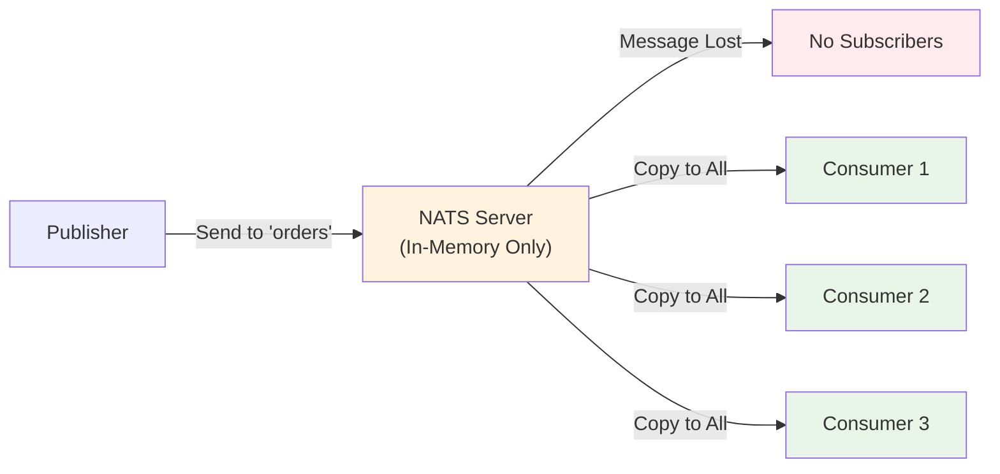
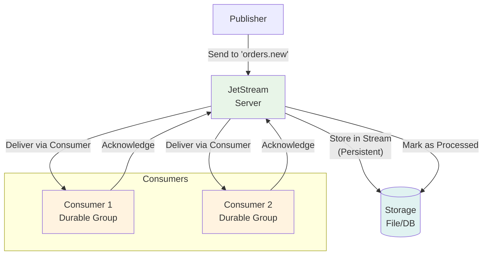

NATS — это не просто один продукт, а **экосистема** из двух основных компонентов: **Core NATS** (классический NATS) и **JetStream**. Понимание разницы между ними критично для правильного выбора инструмента под задачу. Это как сравнивать **TCP** и **HTTP**: первое — транспорт, второе — протокол прикладного уровня с дополнительными возможностями.

### Core NATS: Воздушный шар, а не реактивный двигатель

**Core NATS** — это **asynchronous message transport**. Он предоставляет только **pub/sub** и **request/reply** модели. Это **stateless**, **in-memory** брокер. Он работает как **fire-and-forget** система: сообщение отправлено — и если никто не слушает — оно потеряно.

#### Особенности Core NATS

- **No persistence**: Сообщения существуют только в памяти сервера. Если сервер упал — данные потеряны.
- **No delivery guarantees**: Нет ack/nack, retry, replay.
- **No ordering guarantees** (в рамках одного subject, если не использовать queue groups).
- **High performance**: Миллионы сообщений в секунду, задержки <1ms.
- **Minimal resource usage**: ~50MB RAM, ~10MB binary.
- **Fan-out only**: Одно сообщение может быть получено несколькими subscriber'ами, но нет "кто-то один должен обработать".

```go
// Core NATS: Fire and forget
err := nc.Publish("events.order.created", []byte("order data"))
// Если никто не подписан — сообщение потеряно
// Если подписано 3 консьюмера — каждый получит копию
```



> [!warning] Ловушка / Gotcha
> Core NATS **не гарантирует доставку**. Это **at-most-once** модель по умолчанию. Если publisher отправил сообщение в момент, когда ни один consumer не был подключен — сообщение **исчезает навсегда**. Это не баг, а фича для систем, где важна **скорость**, а не **надежность**.

### JetStream: Постоянный двигатель с GPS и автопилотом

**JetStream** — это **persistent message streaming platform**, построенный **поверх Core NATS**. Это полноценная **streaming платформа** с **durability**, **ordering**, **replay**, **consumer groups** и другими enterprise-функциями.

#### Особенности JetStream

- **Persistent storage**: Сообщения записываются на диск (или в память с retention policy).
- **Delivery guarantees**: At-least-once, Exactly-once (с deduplication window).
- **Message replay**: Возможность читать старые сообщения с определенного offset'а.
- **Consumer groups**: Pull и Push consumers, queue-like поведение.
- **Stream retention**: Time-based, size-based, count-based cleanup.
- **Replication**: RAFT-based consensus для отказоустойчивости.
- **KV и Object Storage**: Дополнительные абстракции поверх streams.

```go
// JetStream: Persistent и надежный
js, err := nc.JetStream()
if err != nil {
    log.Fatal(err)
}

// Создаем stream
stream, err := js.AddStream(&nats.StreamConfig{
    Name:      "ORDERS",
    Subjects:  []string{"orders.*"},
    Retention: nats.WorkQueuePolicy, // Удаляет сообщения после ack
})
if err != nil {
    log.Fatal(err)
}

// Публикуем сообщение
ack, err := js.Publish("orders.new", []byte("order data"))
if err != nil {
    log.Printf("Publish error: %v", err)
} else {
    fmt.Printf("Published message with ID: %s\n", ack.Sequence)
}

// Создаем consumer
cons, err := js.QueueSubscribe("orders.*", "workers", func(msg *nats.Msg) {
    fmt.Printf("Processing: %s\n", string(msg.Data))
    msg.Ack() // Подтверждение получения
}, nats.Durable("order_worker_group"))
if err != nil {
    log.Fatal(err)
}
```



> [!info] Под капотом
> JetStream использует **RAFT consensus algorithm** для обеспечения согласованности между репликами. Внутри он хранит сообщения в **append-only logs** (как Kafka), но с гораздо более легковесной архитектурой. RAFT реализован **внутри самого nats-server**, без внешних зависимостей.

### Сравнительная таблица

| Характеристика | Core NATS | JetStream |
|----------------|-----------|-----------|
| Хранение | In-Memory | Persistent (File/DB) |
| Гарантии доставки | At-most-once | At-least-once, Exactly-once |
| Message Replay | ❌ | ✅ |
| Consumer Groups | ❌ (только Queue Groups) | ✅ (Pull/Push, Durable) |
| Message Acknowledgements | ❌ | ✅ |
| Retention Policy | ❌ | ✅ (Time/Size/Count) |
| Replication | ❌ | ✅ (RAFT-based) |
| Производительность | Очень высокая | Высокая (но ниже Core) |
| Потребление ресурсов | Минимальное | Среднее+ |
| Сложность | Минимальная | Средняя |
| Использование | Real-time events, Discovery | Event sourcing, CQRS, Audit logs |

### Когда использовать Core NATS?

- **Real-time notifications**: Чат-приложения, live dashboards, monitoring alerts.
- **Service discovery**: Health checks, service status updates.
- **Event broadcasting**: Новости, спортивные события, market data.
- **Low-latency systems**: Trading, gaming, real-time analytics.
- **Simple pub/sub**: Когда потеря нескольких сообщений не критична.

```go
// Пример: Live Price Updates
nc.Publish("market.price.BTCUSD", []byte(`{"price": 43250.50}`))
// Даже если кто-то пропустил — следующая цена придет через 100ms
```

### Когда использовать JetStream?

- **Event sourcing**: Хранение всех изменений состояния.
- **Audit logs**: Требуется гарантированное хранение всех событий.
- **Task queues**: Background job processing с retry.
- **Financial transactions**: Нельзя терять транзакции.
- **CQRS**: Command и Query модели требуют надежного event log.
- **Data pipeline**: ETL процессы, где важна последовательность.

```go
// Пример: Financial Transaction Log
ack, _ := js.Publish("transactions.credit", []byte(txData))
// Сообщение гарантированно сохранено
// Можно восстановить состояние счета из лога
```

### Практические примеры использования

#### Сценарий 1: Микросервисная архитектура

```go
// Core NATS: Service-to-service heartbeats
nc.Publish("service.health.check", []byte("auth-service:alive"))

// JetStream: Business transaction log  
js.Publish("transaction.created", []byte(orderData))
```

#### Сценарий 2: Real-time Analytics

```go
// Core NATS: Live user activity stream
nc.Publish("user.activity.click", []byte(userData))

// JetStream: Aggregated metrics (must not be lost)
js.Publish("metrics.aggregated.hourly", []byte(hourlyData))
```

### Performance Considerations

- **Core NATS**: ~1M msg/sec на одном сервере, <1ms latency.
- **JetStream**: ~100K-500K msg/sec (в зависимости от persistence), ~1-10ms latency.

Разница в производительности обусловлена необходимостью **дисковых операциций**, **fsync**, **replication overhead** и **acknowledgement processing**.

> [!tip] Собеседование
> **Вопрос:** В чем разница между Queue Groups в Core NATS и Consumer Groups в JetStream?
> **Ответ:** Queue Groups — это способ load balancing между несколькими экземплярами consumer'а (одно сообщение обрабатывается только одним consumer'ом в группе), но без гарантий доставки. Consumer Groups в JetStream обеспечивают то же самое, но с persistent storage, ack/nack, replay и retry механизмами.

### Migration Path

Можно начать с Core NATS и постепенно мигрировать на JetStream:

1. Сначала использовать Core NATS для low-critical events.
2. Ввести JetStream для critical business events.
3. Постепенно переносить важные потоки в JetStream.
4. Использовать оба параллельно, пока не будет полного перехода.

### Итог

- **Core NATS** — это **transport layer** для **fast, ephemeral** сообщений.
- **JetStream** — это **application layer** с **durability, ordering, replay**.
- Выбор зависит от **business requirements**: скорость vs надежность.
- Они **дополняют**, а не **заменяют** друг друга.
- В современных системах часто используется **гибридный подход**.

В следующей статье мы рассмотрим [[3. Subject based routing]], чтобы понять, как NATS маршрутизирует сообщения по сравнению с другими брокерами.