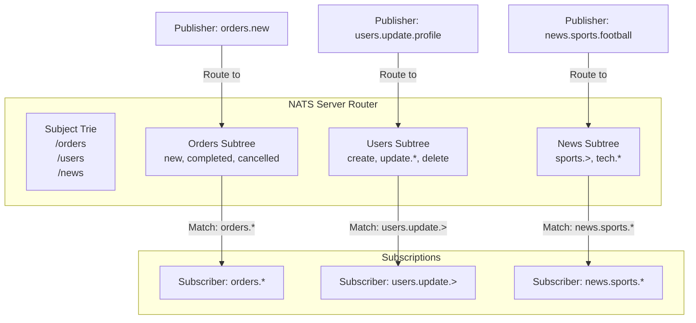

**Subject-based routing** — это уникальная особенность NATS, отличающая его от других брокеров сообщений. В то время как Kafka использует **topics**, а RabbitMQ — **exchanges/queues/bindings**, NATS использует **subject'ы** — иерархические строки, которые определяют **путь доставки** сообщений. Это делает маршрутизацию в NATS **гибкой, интуитивной и производительной**.

### Что такое Subject?

**Subject** в NATS — это строка, состоящая из **token'ов**, разделенных **точками** (`.`). Каждый token представляет собой **уровень иерархии**. Это похоже на пути в файловой системе или URL в HTTP, но работает на уровне **message routing**.

Примеры subject'ов:

```
orders.new
orders.completed
orders.cancelled
users.create
users.update.profile
users.delete
news.sports.football.nfl
news.sports.basketball.nba
news.tech.software
payments.credit.card.visa
payments.debit.bank.transfer
```

### Иерархическая структура

Subject'ы в NATS имеют **иерархическую природу**, что позволяет использовать **pattern matching** для подписки на группы сообщений:

- `orders.*` — все сообщения в "каталоге" `orders` (но не в подкаталогах)
  - matches: `orders.new`, `orders.completed`
  - not matches: `orders.payment.failed`

- `orders.>` — все сообщения в `orders` и **все подкаталоги**
  - matches: `orders.new`, `orders.payment.processing`, `orders.refund.initiated`

- `news.sports.*` — только непосредственные подразделы
  - matches: `news.sports.football`, `news.sports.basketball`
  - not matches: `news.sports.football.nfl`

### Механизм маршрутизации

Когда publisher отправляет сообщение в NATS, сервер **сопоставляет subject сообщения** с **паттернами всех активных подписчиков**. Это происходит через **in-memory lookup** с использованием **trie-подобной структуры** (не точный термин, но суть передает идею о быстром поиске).



> [!info] Под капотом
> Внутри nats-server используется **соптимизированная trie-структура** (не точный термин из исходников, но суть в эффективном поиске по иерархии) для хранения всех активных subscriptions. При получении сообщения сервер быстро находит все matching subscription'ы через **single-pass lookup**. Это делает routing **O(log n)** или даже **O(1)** в лучшем случае, в зависимости от количества wildcard'ов.

### Пример кода: Использование Subject Routing

```go
package main

import (
    "fmt"
    "log"
    "time"

    "github.com/nats-io/nats.go"
)

func main() {
    nc, err := nats.Connect(nats.DefaultURL)
    if err != nil {
        log.Fatal(err)
    }
    defer nc.Close()

    // Подписка на конкретный subject
    _, err = nc.Subscribe("orders.new", func(msg *nats.Msg) {
        fmt.Printf("Specific Order Handler: %s\n", string(msg.Data))
    })
    if err != nil {
        log.Fatal(err)
    }

    // Подписка на все заказы (wildcard *)
    _, err = nc.Subscribe("orders.*", func(msg *nats.Msg) {
        fmt.Printf("Wildcard Order Handler: %s (subject: %s)\n", 
            string(msg.Data), msg.Subject)
    })
    if err != nil {
        log.Fatal(err)
    }

    // Подписка на все пользовательские обновления (recursive >)
    _, err = nc.Subscribe("users.update.>", func(msg *nats.Msg) {
        fmt.Printf("User Update Handler: %s (full path: %s)\n", 
            string(msg.Data), msg.Subject)
    })
    if err != nil {
        log.Fatal(err)
    }

    // Отправка сообщений
    nc.Publish("orders.new", []byte("New order #123"))
    nc.Publish("orders.completed", []byte("Order #123 completed"))
    nc.Publish("users.update.profile.email", []byte("Email updated"))
    nc.Publish("users.update.settings.theme", []byte("Theme changed"))

    time.Sleep(100 * time.Millisecond) // Ждем обработки
}
```

Вывод:
```
Specific Order Handler: New order #123
Wildcard Order Handler: New order #123 (subject: orders.new)
Wildcard Order Handler: Order #123 completed (subject: orders.completed)
User Update Handler: Email updated (full path: users.update.profile.email)
User Update Handler: Theme changed (full path: users.update.settings.theme)
```

### Сравнение с другими брокерами

#### NATS vs Kafka

- **Kafka**: Использует **topics** — flat namespace. `orders_new`, `orders_completed`, `user_updates`.
- **NATS**: Использует **hierarchical subjects** — `orders.new`, `orders.completed`, `users.update`.

```go
// Kafka style (flat)
producer.send(new ProducerRecord<>("orders_new", data));
producer.send(new ProducerRecord<>("orders_completed", data));

// NATS style (hierarchical)
nc.Publish("orders.new", data);
nc.Publish("orders.completed", data);
```

**Преимущество NATS**: Легче группировать связанные события и использовать wildcards.

#### NATS vs RabbitMQ

- **RabbitMQ**: Exchange + Queue + Binding (сложная маршрутизация через routing keys).
- **NATS**: Direct subject-to-subscription mapping (простая маршрутизация через иерархию).

```go
// RabbitMQ (упрощенно)
channel.publish(exchange="amq.topic", routingKey="orders.new", body=data);

// NATS
nc.Publish("orders.new", data);
```

### Advanced Routing Patterns

#### 1. Multi-level Wildcards

```go
// Подписка на все финансовые операции
nc.Subscribe("finance.>", handler) // finance.payments.*, finance.reports.daily, etc.

// Подписка на все операции в определенной категории
nc.Subscribe("*.payment.*", handler) // orders.payment.status, users.payment.method
```

#### 2. Queue Groups (Load Balancing)

Subject routing работает вместе с **queue groups** для **load balancing**:

```go
// Эти consumer'ы будут делить сообщения между собой (round-robin)
for i := 0; i < 3; i++ {
    _, err = nc.QueueSubscribe("orders.new", "processor_group", func(msg *nats.Msg) {
        fmt.Printf("Processor %d handling: %s\n", i, string(msg.Data))
        msg.Ack() // В JetStream
    })
}
```

> [!warning] Ловушка / Gotcha
> Subject routing в NATS чувствителен к регистру: `orders.New` ≠ `orders.new`. Также важно понимать, что `*` не захватывает `.` — `orders.*` не матчить `orders.payment.status`.

### Performance Implications

Subject-based routing в NATS **очень быстрый**, потому что:

1. **In-memory lookup**: Нет необходимости в сложных join'ах или индексах.
2. **Trie optimization**: Быстрый поиск по иерархии.
3. **No regex**: Используются только два wildcard'а: `*` и `>`.

```go
// Performance benchmark example
const numSubjects = 10000
start := time.Now()

for i := 0; i < numSubjects; i++ {
    subject := fmt.Sprintf("service.%d.operation.%d", i%100, i)
    nc.Publish(subject, []byte("data"))
}

duration := time.Since(start)
fmt.Printf("Published %d messages in %v\n", numSubjects, duration)
// Обычно: < 1ms для тысяч сообщений
```

### Best Practices

#### 1. Subject Naming Convention

```go
// Good: Descriptive and hierarchical
"payment.processing.success"
"user.authentication.failed"
"inventory.stock.low"

// Avoid: Too generic or too specific
"event" // Bad - no context
"user.authentication.failed.attempt.number.12345.timestamp.1234567890" // Bad - too verbose
```

#### 2. Wildcard Usage

```go
// Good: Specific enough
"orders.*" // All order events
"users.update.*" // All user updates

// Avoid: Too broad (performance impact)
">" // All messages - avoid unless absolutely necessary
```

#### 3. Namespace Management

```go
// Team/Service level namespacing
"team-a.service-x.event-type"
"billing.payments.created"
"notifications.email.sent"
```

### Use Cases for Subject Routing

1. **Microservices Communication**: `service-name.action.resource`
2. **Event Sourcing**: `aggregate-type.event-type`
3. **Monitoring**: `service.environment.metric-type`
4. **Multi-tenant Systems**: `tenant-id.service.event`

### Итог

- **Subject-based routing** — это **ключевая фича** NATS, отличающая его от других брокеров.
- **Hierarchical structure** позволяет легко группировать и фильтровать сообщения.
- **Wildcard support** (`*` и `>`) делает маршрутизацию **гибкой** и **мощной**.
- **Performance** remains high due to optimized in-memory lookup structures.
- **Semantic clarity** of subjects makes system architecture more intuitive.

Subject routing в NATS — это не просто способ доставки сообщений, а **архитектурный паттерн**, который помогает строить **хорошо организованные** и **масштабируемые** системы.

В следующей статье мы рассмотрим [[4. Request Reply паттерн]], чтобы понять, как NATS может использоваться не только для асинхронной, но и для синхронной коммуникации.