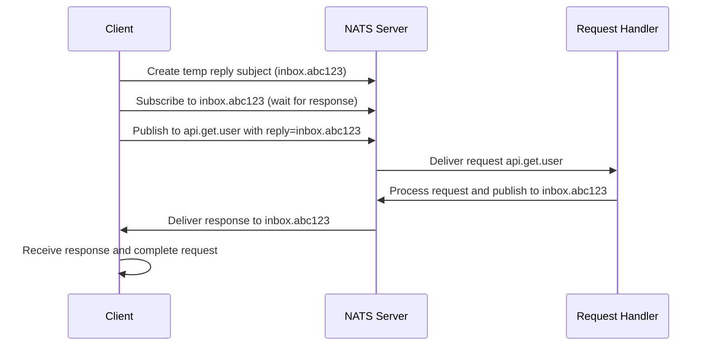

**Request-Reply** (или **Request-Response**) — это паттерн коммуникации, при котором **клиент отправляет запрос и ожидает ответа**. В отличие от **pub/sub**, где отправитель не ожидает ответа, Request-Reply создает **синхронную точку взаимодействия** поверх **асинхронного транспорта**. NATS реализует этот паттерн **эффективно и надежно**, делая его мощным инструментом для **микросервисной архитектуры**.

### Как работает Request-Reply в NATS

Ключевая идея NATS Request-Reply — **асинхронный транспорт для синхронных вызовов**. Вот как это работает:

1. **Клиент** создает **временный reply subject** (обычно UUID или timestamp-based).
2. **Клиент** подписывается на этот **reply subject** и **ожидает ответ**.
3. **Клиент** отправляет **request** на **request subject**, указывая **reply subject** в заголовке.
4. **Сервер** получает запрос, обрабатывает его, и **отправляет ответ** на **указанный reply subject**.
5. **Клиент** получает ответ и **завершает ожидание**.



### Пример реализации

#### Basic Request-Reply

```go
package main

import (
    "encoding/json"
    "fmt"
    "log"
    "time"

    "github.com/nats-io/nats.go"
)

type User struct {
    ID       string `json:"id"`
    Name     string `json:"name"`
    Email    string `json:"email"`
    Created  string `json:"created_at"`
}

func main() {
    nc, err := nats.Connect(nats.DefaultURL)
    if err != nil {
        log.Fatal(err)
    }
    defer nc.Close()

    // Запускаем "сервер" (обработчик запросов)
    go startUserServer(nc)

    // Делаем запросы
    makeRequests(nc)
}

func startUserServer(nc *nats.Conn) {
    // Подписываемся на запросы
    _, err := nc.Subscribe("api.get.user", func(msg *nats.Msg) {
        userID := string(msg.Data)
        
        // Имитация обработки запроса
        user := User{
            ID:      userID,
            Name:    "John Doe",
            Email:   "john@example.com",
            Created: time.Now().Format(time.RFC3339),
        }
        
        // Отправляем ответ на указанный reply subject
        response, _ := json.Marshal(user)
        err := nc.Publish(msg.Reply, response)
        if err != nil {
            log.Printf("Failed to send reply: %v", err)
        }
    })
    if err != nil {
        log.Fatal(err)
    }
    
    fmt.Println("User server started...")
    select {} // Keep server running
}

func makeRequests(nc *nats.Conn) {
    // Делаем несколько запросов
    for i := 1; i <= 3; i++ {
        userID := fmt.Sprintf("user-%d", i)
        
        // Выполняем запрос
        resp, err := nc.Request("api.get.user", []byte(userID), 2*time.Second)
        if err != nil {
            log.Printf("Request failed: %v", err)
            continue
        }
        
        var user User
        if err := json.Unmarshal(resp.Data, &user); err != nil {
            log.Printf("Failed to parse response: %v", err)
            continue
        }
        
        fmt.Printf("Received user: %+v\n", user)
    }
}
```

### Timeout и Error Handling

Важной частью Request-Reply является **обработка таймаутов** и **ошибок**:

```go
func robustRequestExample(nc *nats.Conn) {
    userID := "test-user"
    
    // Устанавливаем таймаут
    resp, err := nc.Request("api.get.user", []byte(userID), 5*time.Second)
    if err != nil {
        switch err {
        case nats.ErrTimeout:
            log.Printf("Request timeout after 5 seconds")
        case nats.ErrNoResponders:
            log.Printf("No service available to handle request")
        default:
            log.Printf("Request failed: %v", err)
        }
        return
    }
    
    fmt.Printf("Success: %s\n", string(resp.Data))
}
```

### Concurrent Requests

NATS позволяет выполнять **параллельные запросы** благодаря **асинхронной природе** underlying transport:

```go
func concurrentRequests(nc *nats.Conn) {
    const numRequests = 10
    responses := make(chan *nats.Msg, numRequests)
    errors := make(chan error, numRequests)

    // Отправляем параллельные запросы
    for i := 0; i < numRequests; i++ {
        go func(requestID int) {
            resp, err := nc.Request(
                "api.get.user", 
                []byte(fmt.Sprintf("user-%d", requestID)), 
                3*time.Second,
            )
            
            if err != nil {
                errors <- err
                return
            }
            
            responses <- resp
        }(i)
    }

    // Собираем результаты
    for i := 0; i < numRequests; i++ {
        select {
        case resp := <-responses:
            fmt.Printf("Got response: %s\n", string(resp.Data))
        case err := <-errors:
            fmt.Printf("Got error: %v\n", err)
        }
    }
}
```

### Request-Reply vs HTTP

| Характеристика | HTTP Request | NATS Request-Reply |
|----------------|--------------|-------------------|
| Транспорт | TCP | TCP (NATS protocol) |
| Connection reuse | HTTP/1.1 keep-alive, HTTP/2 | Persistent NATS connection |
| Load balancing | Client-side LB, Proxy | NATS server handles routing |
| Service discovery | DNS, Service Mesh | Subject-based routing |
| Serialization | JSON/XML over HTTP | Any format over NATS |
| Performance | Higher overhead | Lower overhead |
| Circuit breaking | External libraries | Built-in NATS features |

```go
// HTTP Request
resp, err := http.Get("http://user-service/api/user/123")

// NATS Request-Reply
resp, err := nc.Request("api.get.user", []byte("123"), 2*time.Second)
```

### Advanced Pattern: Request-Reply с Middleware

Можно добавить **middleware-логику** (logging, metrics, auth):

```go
func createAuthenticatedRequestHandler(next nats.MsgHandler) nats.MsgHandler {
    return func(msg *nats.Msg) {
        // Проверяем аутентификацию
        if !isValidToken(getTokenFromHeaders(msg.Header)) {
            nc.Publish(msg.Reply, []byte(`{"error": "unauthorized"}`))
            return
        }
        
        // Логируем начало обработки
        start := time.Now()
        fmt.Printf("Processing request: %s\n", msg.Subject)
        
        // Вызываем оригинальный обработчик
        next(msg)
        
        // Логируем время выполнения
        duration := time.Since(start)
        fmt.Printf("Request processed in %v\n", duration)
    }
}

// Использование
_, err = nc.Subscribe("api.get.user", 
    createAuthenticatedRequestHandler(userHandler))
```

### Request-Reply с Context

Для более продвинутого управления жизненным циклом запросов можно использовать **context**:

```go
import (
    "context"
    "time"
)

func requestWithContext(ctx context.Context, nc *nats.Conn, subject string, data []byte) (*nats.Msg, error) {
    // Создаем канал для результата
    result := make(chan struct {
        msg *nats.Msg
        err error
    }, 1)
    
    // Запускаем запрос в горутине
    go func() {
        msg, err := nc.Request(subject, data, 30*time.Second)
        result <- struct {
            msg *nats.Msg
            err error
        }{msg, err}
    }()
    
    // Ждем результат или отмену контекста
    select {
    case res := <-result:
        return res.msg, res.err
    case <-ctx.Done():
        return nil, ctx.Err()
    }
}
```

### Performance Considerations

Request-Reply в NATS имеет **низкое время отклика** по сравнению с HTTP:

```go
func benchmarkRequestReply() {
    nc, _ := nats.Connect(nats.DefaultURL)
    
    // Warm up
    for i := 0; i < 100; i++ {
        nc.Request("api.ping", []byte("ping"), time.Second)
    }
    
    // Benchmark
    start := time.Now()
    const requests = 10000
    
    for i := 0; i < requests; i++ {
        nc.Request("api.ping", []byte("ping"), time.Second)
    }
    
    duration := time.Since(start)
    avgLatency := duration.Nanoseconds() / int64(requests)
    
    fmt.Printf("Total: %v, Avg latency: %dns per request\n", duration, avgLatency)
    // Обычно: <100μs per request (vs ~1-10ms for HTTP)
}
```

> [!info] Под капотом
> Внутри NATS использует **асинхронные горутины** и **каналы** для обработки Request-Reply. Каждый `Request` создает **временную подписку**, отправляет сообщение, и **ожидает ответ** через канал. Это позволяет **множественным запросам** выполняться **параллельно** без блокировки.

### Ограничения и Best Practices

#### 1. Не используйте для high-throughput операций

Request-Reply подходит для **low-latency, synchronous operations**, но **не для high-volume batch processing**.

#### 2. Обработка ошибок

Всегда проверяйте `nats.ErrTimeout`, `nats.ErrNoResponders`, и другие специфичные ошибки.

#### 3. Service Discovery

Вместо жестко закодированных subject'ов используйте **шаблоны именования**:

```go
// Хорошо: Семантически понятные subject'ы
"service.users.api.get"
"service.orders.api.create"

// Плохо: Жестко закодированные имена
"get_user_by_id_123"
"service_abc_def_ghi"
```

### Когда использовать Request-Reply

- **Synchronous microservice calls** (когда нужен immediate response)
- **Service discovery** (health checks, configuration retrieval)
- **Real-time data fetching** (current state, cached data)
- **Command/query separation** (CQRS commands that return confirmation)

> [!tip] Собеседование
> **Вопрос:** В чем разница между Request-Reply в NATS и обычным HTTP REST API?
> **Ответ:** NATS Request-Reply работает поверх **асинхронного транспорта** (pub/sub), в то время как HTTP — **синхронный протокол**. NATS обеспечивает **lower latency**, **better integration** с event-driven архитектурой, **built-in service discovery** через subject'ы, и **better performance** для internal service-to-service communication.

### Итог

Request-Reply в NATS — это **гибкий и эффективный способ** организации **синхронной коммуникации** между сервисами. Это позволяет использовать **асинхронный брокер** для **синхронных вызовов**, получая преимущества **низкой задержки**, **встроенной маршрутизации** и **интеграции** с event-driven архитектурой.

В следующей статье мы рассмотрим [[5. JetStream. Persistence и stream processing]], чтобы понять, как NATS может использоваться для **persistent message processing** и **streaming аналитики**.