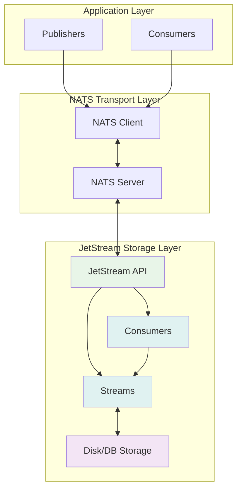

**JetStream** — это **persistent streaming platform**, встроенный в NATS, который добавляет **durability**, **ordering**, **replay**, **consumer groups** и **stream processing** к lightweight NATS транспорту. Это делает NATS полноценной альтернативой таким системам, как Apache Kafka, RabbitMQ Streams и AWS Kinesis, но с **гораздо меньшей сложностью и большей производительностью**.

### Архитектура JetStream

JetStream строится **поверх Core NATS**, используя его транспорт, но добавляя **persistent storage layer**. Основные компоненты:



### Основные концепции JetStream

#### 1. Stream (Поток)

**Stream** — это **persistent log** сообщений, аналогичный Kafka topic. Он может хранить сообщения на **диске** или в **памяти** с различными политиками **retention**.

```go
js, err := nc.JetStream()
if err != nil {
    log.Fatal(err)
}

// Создаем stream
stream, err := js.AddStream(&nats.StreamConfig{
    Name:      "ORDERS",
    Subjects:  []string{"orders.*"},        // Subject'ы, которые будут сохраняться
    Retention: nats.WorkQueuePolicy,       // Удалять после обработки
    MaxAge:    7 * 24 * time.Hour,         // Хранить 7 дней
    MaxBytes:  100 * 1024 * 1024,         // Максимум 100MB
    Storage:   nats.FileStorage,           // File-based storage
    Replicas:  3,                          // 3 реплики для отказоустойчивости
})
if err != nil {
    log.Fatal(err)
}
```

> [!info] Под капотом
> Внутри JetStream использует **append-only log** (как Kafka) для хранения сообщений. Каждое сообщение получает **sequence number**, который гарантирует **ordering**. Storage может быть **file-based** (по умолчанию) или **memory-based** для максимальной производительности.

#### 2. Message Structure в JetStream

```go
type Msg struct {
    Subject      string // Subject сообщения
    Reply        string // Reply subject для ответов
    Data         []byte // Payload
    Header       Header // Заголовки (в новых версиях)
    Sequence     uint64 // Sequence number в stream
    Time         time.Time // Время получения
    Stream       string // Имя stream'a
    Duplicates   bool   // Признак дубликата
}
```

#### 3. Consumer (Потребитель)

**Consumer** — это entity, которая **читает** сообщения из stream'а. JetStream поддерживает **push** и **pull** consumers, **durable** и **ephemeral** consumers, **ordered** и **filtered** consumers.

```go
// Push consumer (сервер отправляет сообщения)
pushCons, err := js.Subscribe("orders.*", func(msg *nats.Msg) {
    fmt.Printf("Processing order: %s\n", string(msg.Data))
    msg.Ack() // Подтверждение получения
}, nats.Durable("order_processor")) // Durable consumer
if err != nil {
    log.Fatal(err)
}

// Pull consumer (клиент сам забирает сообщения)
pullCons, err := js.PullSubscribe("orders.*", "batch_processor")
if err != nil {
    log.Fatal(err)
}

// Батчевая обработка
msgs, err := pullCons.Fetch(10, nats.MaxWait(5*time.Second))
if err != nil {
    log.Printf("Fetch error: %v", err)
    return
}

for _, msg := range msgs {
    processOrder(msg)
    msg.Ack()
}
```

### Типы Consumers

#### 1. Push Consumers

Push consumers получают сообщения **автоматически** от сервера. Подходят для **real-time processing**.

```go
// Async push consumer
_, err = js.Subscribe("orders.new", func(msg *nats.Msg) {
    // Обработка в фоне
    go processOrderAsync(msg)
    msg.Ack()
}, nats.Durable("async_order_processor"))
```

#### 2. Pull Consumers

Pull consumers **сами запрашивают** сообщения. Подходят для **batch processing** и **rate limiting**.

```go
// Pull consumer с контролем скорости
cons, err := js.PullSubscribe("orders.*", "batch_processor")
if err != nil {
    log.Fatal(err)
}

for {
    // Забираем до 10 сообщений
    msgs, err := cons.Fetch(10, nats.MaxWait(10*time.Second))
    if err != nil {
        if err == nats.ErrTimeout {
            continue // Нет сообщений
        }
        log.Printf("Fetch error: %v", err)
        break
    }
    
    // Обрабатываем batch
    for _, msg := range msgs {
        processOrder(msg)
        msg.Ack()
    }
}
```

### Stream Policies

#### 1. Limits Policy (По умолчанию)

Хранит сообщения до достижения лимитов (size, count, age).

```go
stream, err := js.AddStream(&nats.StreamConfig{
    Name:     "LOGS",
    Subjects: []string{"logs.*"},
    Retention: nats.LimitsPolicy,
    MaxMsgs:  100000,        // Максимум 100K сообщений
    MaxBytes: 10 * 1024 * 1024, // 10MB
    MaxAge:   24 * time.Hour,    // 24 часа
})
```

#### 2. Interest Policy

Хранит сообщения, **пока они нужны** consumer'ам.

```go
stream, err := js.AddStream(&nats.StreamConfig{
    Name:      "TEMP_EVENTS",
    Subjects:  []string{"temp.*"},
    Retention: nats.InterestPolicy, // Удалять после ack всех consumers
})
```

#### 3. Work Queue Policy

Хранит сообщения до **первого ack** (аналог очереди).

```go
stream, err := js.AddStream(&nats.StreamConfig{
    Name:      "TASK_QUEUE",
    Subjects:  []string{"tasks.*"},
    Retention: nats.WorkQueuePolicy, // Удалять после первого ack
})
```

### Message Deduplication

JetStream поддерживает **deduplication window** для предотвращения дубликатов:

```go
// Stream с deduplication
stream, err := js.AddStream(&nats.StreamConfig{
    Name:     "ORDERS",
    Subjects: []string{"orders.*"},
    // Окно дедупликации 2 минуты
    DuplicateWindow: 2 * time.Minute,
})
if err != nil {
    log.Fatal(err)
}

// Публикация с deduplication key
msg := nats.NewMsg("orders.new")
msg.Data = []byte("order data")
msg.Header.Set(nats.MsgIdHdr, "ORDER-12345") // Deduplication key

ack, err := js.PublishMsg(msg)
if err != nil {
    log.Printf("Publish error: %v", err)
} else {
    fmt.Printf("Message published with sequence: %d\n", ack.Sequence)
}
```

> [!warning] Ловушка / Gotcha
> Message deduplication работает **только в пределах duplicate window**. Если сообщение с тем же ID придет через 5 минут, а окно 2 минуты — дедупликация не сработает.

### Consumer Configuration

#### 1. Durable Consumers

Сохраняют **offset** между перезапусками:

```go
// Durable consumer (offset сохраняется)
_, err = js.Subscribe("orders.*", func(msg *nats.Msg) {
    processOrder(msg)
    msg.Ack()
}, nats.Durable("order_processor"), // Имя durable consumer'а
   nats.ManualAck()) // Ручное подтверждение
```

#### 2. Ephemeral Consumers

Не сохраняют offset:

```go
// Ephemeral consumer (offset теряется при перезапуске)
_, err = js.Subscribe("orders.*", func(msg *nats.Msg) {
    processOrder(msg)
    msg.Ack()
}, nats.ManualAck())
```

### Advanced Stream Processing

#### 1. Stream Filtering

Consumer может фильтровать сообщения:

```go
// Consumer только для определенных subject'ов
cons, err := js.Subscribe("orders.new", func(msg *nats.Msg) {
    // Обрабатываем только заказы
    processOrder(msg)
    msg.Ack()
}, nats.Durable("new_orders_only"))
```

#### 2. Multiple Consumers per Stream

Один stream может иметь **множество consumer'ов**:

```go
// Consumer для аудита
js.Subscribe("orders.*", auditHandler, nats.Durable("audit_consumer"))

// Consumer для уведомлений
js.Subscribe("orders.new", notificationHandler, nats.Durable("notification_consumer"))

// Consumer для обработки
js.Subscribe("orders.*", processingHandler, nats.Durable("processing_consumer"))
```

#### 3. Consumer Groups (Queue Groups)

Для load balancing:

```go
// Несколько экземпляров одного consumer'а
for i := 0; i < 3; i++ {
    go func(instanceID int) {
        _, err := js.Subscribe("orders.*", func(msg *nats.Msg) {
            fmt.Printf("Instance %d processing: %s\n", instanceID, msg.Subject)
            processOrder(msg)
            msg.Ack()
        }, nats.Durable("order_workers")) // Одинаковое имя = queue group
        if err != nil {
            log.Printf("Worker %d error: %v", instanceID, err)
        }
    }(i)
}
```

### Performance и Tuning

#### 1. File vs Memory Storage

```go
// Memory storage (выше производительность, но без durability)
stream, err := js.AddStream(&nats.StreamConfig{
    Name:    "HIGH_PERF_TEMP",
    Storage: nats.MemoryStorage, // Только в памяти
})

// File storage (durability, чуть ниже производительность)
stream, err := js.AddStream(&nats.StreamConfig{
    Name:    "PERSISTENT_LOGS", 
    Storage: nats.FileStorage, // На диск
})
```

#### 2. Compression

JetStream поддерживает compression:

```go
stream, err := js.AddStream(&nats.StreamConfig{
    Name:       "COMPRESSED_STREAM",
    Subjects:   []string{"logs.*"},
    Compression: nats.S2Compression, // Использует S2 compression
})
```

### Monitoring и Observability

JetStream предоставляет rich metrics:

```go
// Получение информации о stream
info, err := js.StreamInfo("ORDERS")
if err != nil {
    log.Printf("Stream info error: %v", err)
    return
}

fmt.Printf("Messages: %d, Bytes: %d, First: %v, Last: %v\n",
    info.State.Messages,
    info.State.Bytes,
    info.State.FirstTime,
    info.State.LastTime,
)

// Получение информации о consumer
consInfo, err := js.ConsumerInfo("ORDERS", "order_processor")
if err != nil {
    log.Printf("Consumer info error: %v", err)
    return
}

fmt.Printf("Pending: %d, Ack Floor: %d\n",
    consInfo.NumPending,
    consInfo.AckFloor.Consumer,
)
```

> [!tip] Собеседование
> **Вопрос:** В чем разница между NATS Core и JetStream в контексте message ordering?
> **Ответ:** NATS Core не гарантирует ordering (at-most-once delivery). JetStream гарантирует ordering в пределах одного subject через sequence numbers и RAFT consensus для distributed ordering.

### Использование в Production

#### 1. Service Mesh Integration

JetStream может использоваться как **event backbone** для service mesh:

```go
// Service registration через JetStream
js.Publish("service.register", []byte(serviceInfoJSON))

// Health checks
js.Publish("service.heartbeat", []byte(healthStatusJSON))
```

#### 2. Event Sourcing

Perfect fit для event sourcing:

```go
// Сохранение события
event := Event{
    Type: "UserCreated",
    Data: userData,
    Version: 1,
}

js.Publish("user.events", mustEncode(event))
```

#### 3. CQRS Implementation

Separation of Commands and Queries:

```go
// Command stream
js.Publish("commands.create.user", commandData)

// Event stream  
js.Publish("events.user.created", eventData)
```

### Итог

JetStream — это **мощная streaming platform**, которая превращает NATS из **lightweight message broker** в **full-featured event streaming platform**. Он обеспечивает:

- **Durability** через persistent storage
- **Ordering** через sequence numbers
- **Replay** через consumer offset tracking
- **Scalability** через consumer groups
- **Performance** через optimized storage engine
- **Reliability** через RAFT consensus

JetStream делает NATS конкурентноспособным к Kafka, но с **гораздо меньшей сложностью** и **лучшей интеграцией** с NATS ecosystem.

В следующей статье мы рассмотрим [[6. NATS vs Kafka vs RabbitMQ]], чтобы понять, когда и какой брокер использовать.