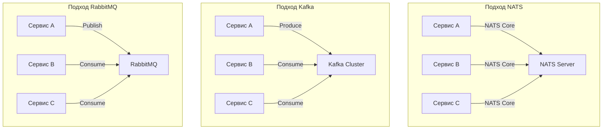

Выбор между NATS, Kafka и RabbitMQ — это **архитектурное решение**, которое напрямую влияет на **производительность**, **сложность**, **стоимость владения** и **эксплуатационные характеристики** всей распределённой системы. Все три брокера решают задачу **асинхронной коммуникации**, но используют **разные подходы**, **разные гарантии** и предназначены для **разных сценариев использования**.

### Сравнительная таблица

| Характеристика | NATS (Core) | NATS (JetStream) | RabbitMQ | Kafka |
|----------------|-------------|------------------|----------|-------|
| Модель маршрутизации | Subject-based pub/sub | Subject-based streams | Exchange/Queue/Binding | Topic-based partitions |
| Хранение | В памяти | Постоянное/В памяти | Постоянное | Append-only log |
| Гарантии доставки | At-most-once | At-least-once, Exactly-once | Настраиваемые | At-least-once |
| Упорядочивание | Без гарантий | Упорядочивание в рамках партиции | Упорядочивание в очереди | Упорядочивание в рамках партиции |
| Производительность | Очень высокая | Высокая | Средняя | Высокая |
| Потребление ресурсов | Минимальное | Среднее | Среднее+ | Высокое |
| Сложность развёртывания | Минимальная | Низкая | Средняя | Высокая |
| Очереди | Queue Groups | Consumer Groups | Встроенные | Партиции |
| Поддержка стриминга | Ограниченная | Встроенная | ❌ | Отличная |
| Язык реализации | Go | Go | Erlang | Java/Scala |

### Подробное сравнение по брокерам

#### 1. NATS (Core)

**Когда использовать:**
- **Обмен сообщениями в реальном времени** (чат, live-обновления)
- **Service discovery** и health checks
- **Коммуникация с низкой задержкой** (<1 мс)
- **Трансляция событий** (где потеря нескольких сообщений не критична)

```go
// NATS Core: Простой pub/sub
nc.Publish("live.prices", []byte("BTC: $43250"))
nc.Subscribe("live.prices", func(msg *nats.Msg) {
    updatePrice(string(msg.Data))
})
```

**Преимущества:**
- **Минимальное потребление ресурсов**: ~50 МБ RAM, бинарник ~10 МБ
- **Экстремально высокая скорость**: задержка <1 мс, миллионы сообщений в секунду
- **Простота развёртывания**: один бинарный файл, минимальная конфигурация
- **Лёгкие клиенты**: Go-клиент ~1 МБ, только стандартная библиотека `net`

**Недостатки:**
- **Отсутствие персистентности**: потеря сообщений при перезапуске сервера
- **Нет гарантий доставки**: модель fire-and-forget
- **Ограниченное упорядочивание**: нет гарантий порядка сообщений

#### 2. NATS JetStream

**Когда использовать:**
- **Event sourcing** и аудит-логи
- **Реализация CQRS**
- **Очереди задач** с retry-логикой
- **Стриминг данных** с гарантиями доставки

```go
// JetStream: Персистентные сообщения
js.Publish("transactions.log", []byte(transactionData))

// Consumer с сохранением состояния
js.Subscribe("transactions.log", func(msg *nats.Msg) {
    processTransaction(msg)
    msg.Ack() // Подтверждение обработки
}, nats.Durable("tx_processor"))
```

**Преимущества:**
- **Персистентность**: сообщения сохраняются на диск
- **Гарантии доставки**: at-least-once, поддержка exactly-once через дедупликацию
- **Replay сообщений**: чтение с любого оффсета
- **Consumer groups**: встроенный load balancing
- **Консистентность уровня RAID**: репликация на основе RAFT

**Недостатки:**
- **Более высокое потребление ресурсов**: больше RAM/диска по сравнению с Core NATS
- **Увеличенная сложность**: больше опций конфигурации
- **Кривая обучения**: необходимо понимать концепции Stream/Consumer

#### 3. RabbitMQ

**Когда использовать:**
- **Enterprise-месседжинг** со сложной маршрутизацией
- **Транзакционная обработка** сообщений
- **Приоритизация сообщений** и TTL
- **Требования к совместимости с AMQP**

```go
// RabbitMQ: Сложная маршрутизация
channel.ExchangeDeclare("orders", "topic", true, false, false, false, nil)
channel.Publish("orders", "order.created", false, false, amqp.Publishing{
    Body: []byte(orderData),
})
```

**Преимущества:**
- **Гибкая маршрутизация**: exchanges типов direct, fanout, topic, headers
- **Подтверждения доставки**: надёжные гарантии доставки сообщений
- **Dead letter queues**: встроенная обработка "отравленных" сообщений
- **Приоритетные очереди**: возможность приоритизации сообщений
- **Веб-интерфейс управления**: богатый UI для администрирования

**Недостатки:**
- **Требователен к ресурсам**: высокое потребление памяти и CPU
- **Сложная установка**: требует Erlang VM
- **Более медленный**: более высокая задержка по сравнению с NATS
- **Операционная сложность**: больше компонентов для управления

#### 4. Apache Kafka

**Когда использовать:**
- **Big data пайплайны** и аналитика
- **Агрегация логов** в реальном времени
- **Event streaming** в масштабе
- **Долгосрочное хранение** событий

```go
// Kafka: Партиционированный стриминг
producer.send(new ProducerRecord<>("orders", "partition-key", orderData))

consumer.subscribe(Collections.singletonList("orders"))
for {
    records := consumer.poll(Duration.ofMillis(100))
    for record := range records {
        processOrder(record.value())
    }
}
```

**Преимущества:**
- **Высокая пропускная способность**: миллионы сообщений в секунду
- **Горизонтальное масштабирование**: простое партиционирование
- **Стрим-процессинг**: Kafka Streams, KSQL
- **Долгосрочное хранение**: настраиваемые политики хранения
- **Exactly-once семантика**: через идемпотентных продюсеров

**Недостатки:**
- **Высокая операционная сложность**: ZooKeeper, множество сервисов
- **Требователен к ресурсам**: высокое потребление диска и памяти
- **Крутая кривая обучения**: сложные концепции (партиции, оффсеты и т.д.)
- **Не подходит для request-reply**: лучше только для pub/sub

### Сравнение производительности

```go
// NATS Core: ~1M сообщений/сек, задержка <1 мс
func benchmarkNATSCore() {
    // Очень быстрая маршрутизация в памяти
    nc.Publish("test.subject", []byte("data"))
}

// NATS JetStream: ~100K-500K сообщений/сек, задержка ~1-10 мс
func benchmarkNATSJetStream() {
    // Персистентность, но всё ещё очень быстро
    js.Publish("test.stream", []byte("data"))
}

// RabbitMQ: ~50K-100K сообщений/сек, задержка ~10-100 мс
func benchmarkRabbitMQ() {
    // Накладные расходы AMQP, персистентность
    channel.Publish("", "queue", false, false, amqp.Publishing{...})
}

// Kafka: ~1M+ сообщений/сек, задержка ~5-50 мс
func benchmarkKafka() {
    // Высокая пропускная способность, но большая задержка для мелких сообщений
    producer.send(record)
}
```

### Архитектурные паттерны

#### 1. Коммуникация микросервисов



#### 2. Event Sourcing

| Решение | Подходит | Причина |
|---------|----------|---------|
| NATS JetStream | ✅ Отлично | Встроенные стримы, персистентность, replay |
| Kafka | ✅ Отлично | Создан для event logs, высокая пропускная способность |
| RabbitMQ | ⚠️ Условно | Возможно, но требует очередей на агрегат |

#### 3. Request-Reply

| Решение | Подходит | Причина |
|---------|----------|---------|
| NATS | ✅ Отлично | Встроенный паттерн request-reply |
| Kafka | ❌ Плохо | Не предназначен для синхронной коммуникации |
| RabbitMQ | ✅ Хорошо | Поддерживает паттерн RPC |

### Потребление ресурсов

```bash
# Потребление памяти (типичные развёртывания)
NATS Core:        ~50 МБ на сервер
NATS JetStream:   ~100-500 МБ на сервер (зависит от хранилища)
RabbitMQ:         ~1-2 ГБ на сервер (накладные расходы Erlang)
Kafka:            ~2-8 ГБ на брокер (накладные расходы JVM)

# Потребление диска (для персистентных сценариев)
NATS JetStream:   Эффективные append-only логи
RabbitMQ:         Индексы сообщений, очереди на диске
Kafka:            Высокооптимизированные сегментные файлы
```

> [!info] Под капотом
> Разница в потреблении ресурсов объясняется **архитектурой рантайма**. NATS написан на Go и использует **легковесные горутины** для обработки соединений, в то время как RabbitMQ работает на **Erlang VM** (BEAM), а Kafka — на **JVM**. Это добавляет накладные расходы на сборку мусора и управление памятью, но даёт преимущества в виде зрелых экосистем и инструментов.

### Операционная сложность

| Аспект | NATS | RabbitMQ | Kafka |
|--------|------|----------|-------|
| Установка | Один бинарник | Сложная (Erlang) | Множество сервисов |
| Конфигурация | Минимальная | Расширенная | Расширенная |
| Мониторинг | Простые метрики | Богатый UI + метрики | Сложные метрики |
| Масштабирование | Простое | Умеренное | Сложное |
| Бэкап/Восстановление | Простое копирование файлов | Сложное | Сложное |

### Рекомендации по выбору

#### Выбирайте NATS, когда:
- Нужна **минимальная задержка** (<1 мс)
- **Service mesh** или коммуникация между микросервисами
- **Приложения реального времени** (гейминг, чат, live-обновления)
- **Простое развёртывание** и **низкое потребление ресурсов**
- **Паттерны request-reply** поверх асинхронного транспорта

#### Выбирайте NATS JetStream, когда:
- Нужна **персистентность** с простотой NATS
- **Event sourcing** или **аудит-логи**
- **Стрим-процессинг** в экосистеме NATS
- **Гибридный подход** (часть сообщений персистентна, часть — нет)

#### Выбирайте RabbitMQ, когда:
- **Сложная маршрутизация** (множество exchanges)
- **Enterprise-фичи** (приоритетные очереди, TTL, DLQ)
- **Требуется совместимость с AMQP**
- **Транзакционная обработка** сообщений

#### Выбирайте Kafka, когда:
- **Big data пайплайны** и аналитика
- **Высокая пропускная способность** (миллионы сообщений/сек)
- **Долгосрочное хранение** и replay событий
- **Стрим-процессинг** (Kafka Streams)
- **Архитектура с горизонтальным масштабированием**

### Сценарии миграции

#### NATS → Kafka (при росте сложности)
```go
// До: NATS простой pub/sub
nc.Publish("events", data)

// После: Kafka с партиционированием
producer.send(new ProducerRecord<>("events", partitionKey, data))
```

#### RabbitMQ → NATS (для повышения производительности)
```go
// До: RabbitMQ exchange binding
channel.Publish("exchange", "routing.key", false, false, msg)

// После: NATS subject routing
nc.Publish("routing.key", data)
```

> [!tip] Собеседование
> **Вопрос:** В чём ключевое архитектурное отличие подхода NATS от подхода Kafka к хранению сообщений?
> **Ответ:** NATS (даже JetStream) использует **subject-based routing** с in-memory lookup и опциональной персистентностью, тогда как Kafka изначально построена как **distributed commit log** с партиционированием и репликацией на уровне дисковых сегментов. NATS оптимизирован для **скорости и простоты**, Kafka — для **масштаба и долговечности**.

### Итог

- **NATS Core**: Максимальная **простота** и **производительность** для **сценариев реального времени**.
- **NATS JetStream**: Золотая середина между **простотой NATS** и **гарантиями доставки** уровня enterprise.
- **RabbitMQ**: **Enterprise-возможности** и **гибкая маршрутизация** ценой **операционной сложности**.
- **Kafka**: **Масштабируемость** и **персистентность** для **big data** и **аналитики**.

Выбор зависит от **архитектурных требований**: если нужна **скорость** и **простота** — NATS. Если **масштаб** и **аналитика** — Kafka. Если **enterprise-фичи** — RabbitMQ. Часто в одной системе используется **комбинация** брокеров под разные задачи.

В следующей статье мы рассмотрим [[7. Когда выбирать NATS]], чтобы понять, какие конкретные сценарии лучше всего подходят для NATS и его экосистемы.