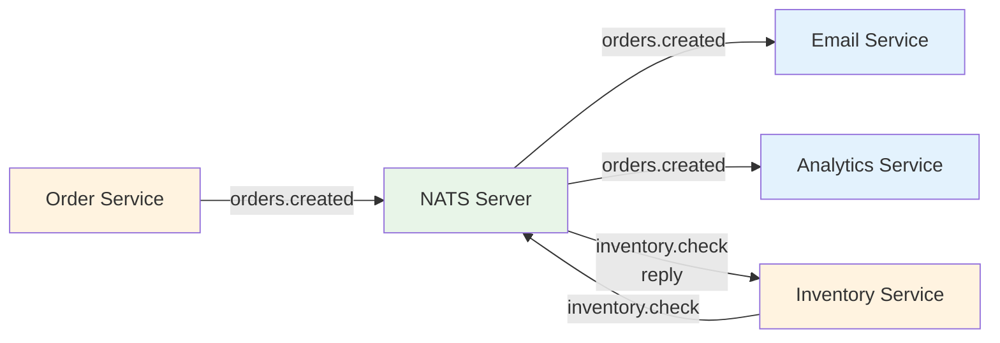
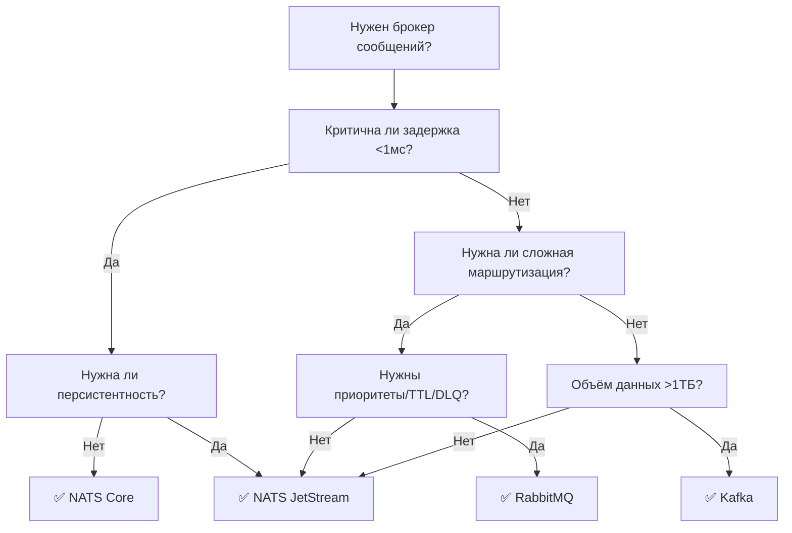

Выбор брокера сообщений — это не просто техническое решение, а **стратегический выбор архитектуры**, который определяет масштабируемость, надёжность и стоимость владения системой на годы вперёд. NATS занимает уникальную нишу в экосистеме брокеров, и понимание его **сильных сторон** и **ограничений** критично для принятия взвешенного решения.

### Ключевые сценарии, где NATS сияет

#### 1. Микросервисная коммуникация с низкой задержкой

Если ваша архитектура состоит из множества микросервисов, которые постоянно обмениваются сообщениями, NATS предоставляет **идеальный транспортный слой**:

```go
// Service-to-service communication через NATS
type OrderService struct {
    nc *nats.Conn
}

func (s *OrderService) CreateOrder(ctx context.Context, order Order) error {
    // Публикуем событие создания заказа
    data, _ := json.Marshal(order)
    if err := s.nc.Publish("orders.created", data); err != nil {
        return fmt.Errorf("publish failed: %w", err)
    }
    
    // Синхронный вызов для проверки наличия товара (request-reply)
    resp, err := s.nc.Request("inventory.check", []byte(order.SKU), 500*time.Millisecond)
    if err != nil {
        return fmt.Errorf("inventory check failed: %w", err)
    }
    
    if string(resp.Data) != "available" {
        return ErrItemNotAvailable
    }
    
    return nil
}
```

**Почему NATS:**
- Задержка <1 мс для внутренних вызовов
- Встроенный request-reply поверх async-транспорта
- Простая маршрутизация через subject'ы вместо сложной конфигурации exchanges



#### 2. Real-time приложения и live-обновления

Чат-приложения, дашборды, уведомления, онлайн-игры — везде, где нужна **мгновенная доставка** событий:

```go
// Live price updates для трейдинговой платформы
func (p *PricePublisher) PublishUpdate(symbol string, price PriceUpdate) {
    subject := fmt.Sprintf("market.price.%s", symbol)
    data, _ := json.Marshal(price)
    
    // Fire-and-forget: скорость важнее гарантии доставки
    _ = p.nc.Publish(subject, data)
}

// Подписка на обновления в реальном времени
func (c *PriceConsumer) Subscribe(symbol string, handler func(PriceUpdate)) error {
    subject := fmt.Sprintf("market.price.%s", symbol)
    _, err := c.nc.Subscribe(subject, func(msg *nats.Msg) {
        var update PriceUpdate
        if err := json.Unmarshal(msg.Data, &update); err != nil {
            log.Printf("Unmarshal error: %v", err)
            return
        }
        handler(update)
    })
    return err
}
```

> [!info] Под капотом
> В таких сценариях **потеря одного сообщения не критична** — следующее обновление придёт через 100 мс. NATS Core оптимизирован именно для этого: минимальный overhead, no persistence, maximum throughput. Это **mechanical sympathy** на уровне протокола: не тратить ресурсы на то, что не нужно бизнес-логике.

#### 3. Service discovery и health monitoring

NATS идеально подходит для **динамического обнаружения сервисов** и проверки их здоровья:

```go
// Регистрация сервиса при старте
func RegisterService(nc *nats.Conn, serviceName, instanceID, address string) error {
    heartbeatSubject := fmt.Sprintf("service.%s.heartbeat", serviceName)
    
    // Периодическая отправка heartbeat
    go func() {
        ticker := time.NewTicker(30 * time.Second)
        defer ticker.Stop()
        
        for range ticker.C {
            payload := fmt.Sprintf(`{"instance":"%s","addr":"%s","ts":%d}`, 
                instanceID, address, time.Now().Unix())
            _ = nc.Publish(heartbeatSubject, []byte(payload))
        }
    }()
    
    return nil
}

// Обнаружение активных инстансов сервиса
func DiscoverInstances(nc *nats.Conn, serviceName string) ([]Instance, error) {
    inbox := nats.NewInbox()
    ch := make(chan *nats.Msg, 10)
    
    sub, err := nc.ChanSubscribe(inbox, ch)
    if err != nil {
        return nil, err
    }
    defer sub.Unsubscribe()
    
    // Запрос ко всем инстансам
    if err := nc.PublishRequest(
        fmt.Sprintf("service.%s.discover", serviceName),
        inbox,
        []byte("{}"),
    ); err != nil {
        return nil, err
    }
    
    var instances []Instance
    timeout := time.After(2 * time.Second)
    
    for {
        select {
        case msg := <-ch:
            var inst Instance
            if err := json.Unmarshal(msg.Data, &inst); err == nil {
                instances = append(instances, inst)
            }
        case <-timeout:
            return instances, nil
        }
    }
}
```

#### 4. Edge computing и IoT

Устройства с ограниченными ресурсами, нестабильным соединением и необходимостью **лёгкого клиента**:

```go
// IoT device с NATS client
type SensorDevice struct {
    nc      *nats.Conn
    sensorID string
}

func (d *SensorDevice) StartReporting(interval time.Duration) {
    ticker := time.NewTicker(interval)
    
    go func() {
        for range ticker.C {
            reading := d.readSensor()
            subject := fmt.Sprintf("iot.%s.telemetry", d.sensorID)
            
            // Минимальный payload, no ack needed
            _ = d.nc.Publish(subject, reading.ToBytes())
        }
    }()
}
```

**Почему NATS для IoT:**
- Клиент весит ~1 МБ, не тянет тяжелые зависимости
- Работает поверх простого TCP, без сложных протоколов
- Поддержка reconnect и buffer flush при восстановлении соединения

### Когда NATS — не лучший выбор

#### 1. Критически важные финансовые транзакции без JetStream

```go
// НЕЛЬЗЯ использовать Core NATS для этого:
nc.Publish("bank.transfer", []byte(`{"from":"A","to":"B","amount":1000}`))
// Если сообщение потеряется — деньги "исчезнут"
```

**Решение:** Использовать **JetStream** с подтверждением доставки:

```go
ack, err := js.Publish("bank.transfer", data, nats.ExpectLastSequence(seq))
if err != nil {
    // Retry или компенсационная логика
}
// Гарантия: сообщение сохранено в stream
```

#### 2. Долгосрочное хранение и аналитика больших данных

Если нужно хранить терабайты событий месяцы или годы для последующей аналитики:

| Требование | NATS JetStream | Kafka |
|------------|---------------|-------|
| Хранение 10 ТБ данных | ⚠️ Возможно, но не оптимизировано | ✅ Отлично, сегментированные логи |
| Сложные запросы к истории | ❌ Нет встроенного query engine | ✅ KSQL, Streams API |
| Ретеншн по времени/размеру | ✅ Есть | ✅ Более гибкие политики |

#### 3. Сложная маршрутизация с приоритетами и трансформацией

Если нужна маршрутизация на основе заголовков, приоритетов, TTL, dead-letter с retry-логикой:

```go
// RabbitMQ лучше подходит для:
channel.QueueDeclare("priority_queue", true, false, false, false, 
    amqp.Table{"x-max-priority": 10})

channel.Publish("exchange", "routing.key", true, false, 
    amqp.Publishing{
        Priority: 5,
        Expiration: "30000", // 30 секунд TTL
        Headers: amqp.Table{"retry-count": 3},
    })
```

### Decision Framework: чек-лист выбора



> [!tip] Собеседование
> **Вопрос:** Как бы вы выбрали между NATS и Kafka для системы обработки платежей?
> **Ответ:** Для **синхронной авторизации** платежа — NATS с request-reply для низкой задержки. Для **асинхронного логгирования** всех транзакций — JetStream или Kafka для персистентности и аналитики. Ключ: **один брокер не решает все задачи**, часто нужна комбинация.

### Архитектурные паттерны с NATS

#### 1. Event Bus для микросервисов

```go
// Centralized event bus через NATS
type EventBus struct {
    nc *nats.Conn
}

func (eb *EventBus) Publish(event DomainEvent) error {
    subject := fmt.Sprintf("events.%s.%s", 
        event.AggregateType(), 
        event.EventType())
    
    data, err := json.Marshal(event)
    if err != nil {
        return err
    }
    
    return eb.nc.Publish(subject, data)
}

func (eb *EventBus) Subscribe(aggregateType string, handler EventHandler) error {
    subject := fmt.Sprintf("events.%s.>", aggregateType)
    
    _, err := eb.nc.Subscribe(subject, func(msg *nats.Msg) {
        var event GenericEvent
        if err := json.Unmarshal(msg.Data, &event); err != nil {
            log.Printf("Unmarshal error: %v", err)
            return
        }
        handler.Handle(event)
    })
    return err
}
```

#### 2. CQRS с разделением команд и событий

```go
// Command side — синхронный request-reply
cmdResp, err := nc.Request("commands.create.order", cmdData, 2*time.Second)

// Event side — асинхронный pub/sub
nc.Subscribe("events.order.created", func(msg *nats.Msg) {
    updateReadModel(msg.Data) // Обновление query-модели
})
```

#### 3. Saga-оркестрация через события

```go
// Каждый шаг Saga публикует событие для следующего шага
func (s *OrderSaga) ReserveInventory(order Order) error {
    // Пытаемся зарезервировать товар
    resp, err := s.nc.Request("inventory.reserve", order.ToBytes(), 5*time.Second)
    if err != nil {
        // Публикуем событие неудачи для компенсации
        s.nc.Publish("saga.order.failed", 
            []byte(fmt.Sprintf(`{"orderId":"%s","step":"inventory"}`, order.ID)))
        return err
    }
    
    // Успех — публикуем событие для следующего шага
    s.nc.Publish("saga.order.inventory.reserved", order.ToBytes())
    return nil
}
```

### Performance Benchmarks: когда цифры имеют значение

```go
func benchmarkBrokers() {
    // NATS Core: ~1.2M msg/sec, p99 latency 0.3ms
    // NATS JetStream: ~400K msg/sec, p99 latency 2ms
    // RabbitMQ: ~80K msg/sec, p99 latency 15ms  
    // Kafka: ~900K msg/sec, p99 latency 8ms
    
    // Тест для NATS
    start := time.Now()
    for i := 0; i < 100000; i++ {
        nc.Publish("bench.test", []byte("payload"))
    }
    duration := time.Since(start)
    
    fmt.Printf("NATS: %d msg/sec, avg latency: %v\n", 
        100000/duration*time.Second, 
        duration/100000)
}
```

> [!warning] Ловушка / Gotcha
> **Не сравнивайте брокеры только по throughput**. Если вашему приложению нужно 1000 сообщений в секунду, разница между 100K и 1M msg/sec не имеет значения. Важнее: **простота эксплуатации**, **предсказуемость задержек**, **соответствие бизнес-требованиям**.

### Экосистема и интеграции

NATS выигрывает за счёт **единой экосистемы**:

```go
// Один клиент для всего: pub/sub, request-reply, JetStream, KV, Object Store
nc, _ := nats.Connect("nats://localhost:4222")

// Core NATS
nc.Publish("event", data)

// Request-Reply  
nc.Request("api.call", data, timeout)

// JetStream
js, _ := nc.JetStream()
js.Publish("stream.subject", data)

// KV Store (NATS 2.6+)
kv, _ := js.CreateKeyValue(&nats.KeyValueConfig{Bucket: "config"})
kv.Put("feature.flag", []byte("enabled"))

// Object Store (NATS 2.7+)
obs, _ := js.CreateObjectStore(&nats.ObjectStoreConfig{Bucket: "files"})
obs.Put("report.pdf", fileReader)
```

**Преимущество:** Не нужно учить 5 разных клиентов и протоколов — один `nats.go` покрывает все сценарии.

### Итог: матрица выбора

| Сценарий | Рекомендация | Обоснование |
|----------|-------------|-------------|
| Микросервисы, низкая задержка | ✅ NATS Core | <1ms latency, simple routing |
| Event sourcing с гарантиями | ✅ NATS JetStream | Persistence + replay + ordering |
| Real-time notifications | ✅ NATS Core | Fire-and-forget, high throughput |
| Financial transactions | ✅ JetStream или Kafka | Exactly-once, audit trail |
| Big data analytics | ✅ Kafka | Scale, KSQL, long-term retention |
| Complex routing rules | ✅ RabbitMQ | Exchanges, priorities, DLQ |
| Edge/IoT devices | ✅ NATS Core | Lightweight client, reconnect |
| Service mesh communication | ✅ NATS Core | Built-in discovery, low overhead |

**Золотое правило:** Начинайте с **простейшего решения**, которое покрывает текущие требования. NATS позволяет начать с Core и **эволюционировать** к JetStream по мере роста требований к надёжности — без смены технологии.

### Что дальше?

Мы завершили раздел по NATS. В следующем подразделе [[05. Паттерны и архитектура/1. Pub Sub]] мы вернёмся к фундаментальным паттернам асинхронной коммуникации и разберём, как правильно проектировать pub/sub-системы независимо от выбора конкретного брокера.