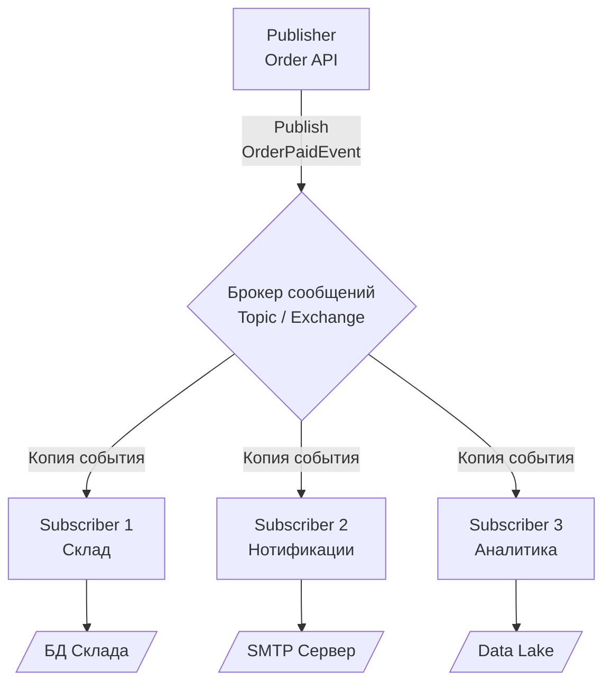

## От команд к событиям: Эволюция связности

До этого момента мы рассматривали брокеры сообщений преимущественно как трубы для передачи задач от одного сервиса к другому. «Возьми этот заказ и спиши деньги» — это императивный подход, паттерн отправки команд. Но когда система разрастается до десятков микросервисов, прямая маршрутизация превращается в архитектурный кошмар.

Представьте: пользователь успешно оформляет заказ. В классической императивной модели Сервис Заказов должен отправить команды в:
1. Сервис Нотификаций (отправить Email).
2. Сервис Аналитики (обновить дашборд).
3. Сервис Склада (зарезервировать товар).
4. Сервис Лояльности (начислить кэшбек).

Каждое новое требование бизнеса заставляет вас модифицировать код Сервиса Заказов, добавляя туда вызовы новых API или отправку новых сообщений в новые очереди. Это жесткая связность (Tight Coupling), которая убивает скорость разработки.

Чтобы разорвать эту связь, архитекторы используют фундаментальный паттерн распределенных систем — **Publish-Subscribe (Pub/Sub, Издатель-Подписчик)**.

## Анатомия Pub/Sub

В модели Pub/Sub Сервис Заказов (Publisher) больше не отдает команды. Он просто кричит в пространство (брокер): «Произошел факт: Заказ №123 оплачен!». Ему абсолютно все равно, кто это услышит и что с этим сделает.

Заинтересованные сервисы (Subscribers) сами подписываются на этот тип событий. Когда событие происходит, брокер доставляет копию этого события каждому подписчику независимо.



Это основа архитектуры, управляемой событиями ([[3. Event Driven Architecture]]). Вы можете добавлять новые сервисы (например, Сервис Антифрода), просто подписав их на существующий поток событий, не меняя ни строчки кода в Сервисе Заказов.

## Mechanical Sympathy: Как Pub/Sub работает под капотом

На логическом уровне Pub/Sub выглядит одинаково везде. Но на физическом уровне (RAM, Диск, CPU) разные брокеры реализуют размножение сообщений (Fan-out) принципиально по-разному. Разница колоссальна, и Senior-инженер обязан ее понимать.

### Подход RabbitMQ: Размножение очередей

В RabbitMQ паттерн Pub/Sub реализуется через Exchange типа `fanout` или `topic` (подробнее в [[2. Exchanges. Direct, Fanout, Topic, Headers]]).

Когда вы публикуете одно сообщение в Fanout Exchange, к которому привязаны 3 разные очереди (по одной для Склада, Нотификаций и Аналитики), RabbitMQ берет это сообщение и **маршрутизирует его в 3 независимые очереди**.

> [!info] Под капотом: Erlang и ссылки
> Физически копирует ли RabbitMQ payload (тело сообщения) в оперативной памяти 3 раза? 
> Ядро RabbitMQ (написанное на Erlang) достаточно умно. Само тело сообщения хранится в памяти (и на диске, если оно `persistent`) в единственном экземпляре в специальном хранилище (`msg_store`). А вот в сами очереди (структуры данных) кладутся **ссылки (индексы)** на это сообщение.
> Однако, каждая очередь имеет свой собственный накладной расход на метаданные, свои процессы Erlang-акторов и свой I/O цикл. Если у вас 100 подписчиков (Fan-out 100), нагрузка на процессор брокера при маршрутизации возрастет кратно. Вы упретесь в CPU.

### Подход Kafka: Разделяемый лог и указатели

В Apache Kafka нет очередей в классическом понимании и нет маршрутизации копий. Kafka использует концепцию разделяемого лога (Append-only Log), описанную в [[1. Kafka. Архитектура и модель log based системы]].

Когда Продюсер отправляет `OrderPaidEvent`, Kafka пишет эти байты на диск строго один раз (последовательно). 

Каждый Subscriber в терминах Kafka — это отдельная Consumer Group (см. [[4. Consumer groups]]). Подписчики просто читают один и тот же файл с диска, каждый отслеживая свой собственный указатель (Offset). 

> [!tip] Собеседование
> **Вопрос:** Мы проектируем систему IoT. У нас 1 сенсор генерирует события, и 500 разных микросервисов должны получать каждое событие. Что выбрать: RabbitMQ (Fanout) или Kafka?
> **Ответ:** Kafka. В RabbitMQ 500 подписчиков означают создание 500 очередей. Маршрутизация (Fan-out) каждого сообщения в 500 очередей создаст огромную нагрузку на CPU брокера (алгоритмическая сложность $O(N)$ от числа подписчиков). В Kafka сообщение пишется на диск 1 раз ($O(1)$). Все 500 подписчиков будут просто читать один и тот же файл из OS Page Cache с использованием `sendfile` (Zero-copy). Это работает в сотни раз эффективнее.

## Идиоматичный Go: Проектирование контрактов в Pub/Sub

В распределенном Pub/Sub сообщение — это **API**. Если в HTTP-запросе вы меняете структуру ответа, вы можете сломать одного конкретного клиента. В Pub/Sub, изменив структуру публикуемого JSON-события, вы можете одновременно «убить» 10 независимых микросервисов, о существовании половины из которых вы даже не подозревали.

**Правило: События должны быть независимыми (Self-Contained).**

Антипаттерн (Fat Event):
```go
type OrderCreatedEvent struct {
    OrderID  string `json:"order_id"`
    // Вы тащите в событие всю структуру базы данных
    Customer User   `json:"customer_details"` 
    Items    []Item `json:"items"`
}
```
*Проблема:* Если Сервис Пользователей изменит логику хранения `User`, вам придется менять контракт `OrderCreatedEvent`, перекомпилировать и деплоить всех подписчиков.

Антипаттерн (Thin Event):
```go
type OrderCreatedEvent struct {
    OrderID string `json:"order_id"`
}
```
*Проблема:* Сервису Нотификаций нужен email клиента, Сервису Аналитики — сумма заказа. Получив такой "худой" ивент, 10 микросервисов одновременно пойдут по HTTP в Сервис Заказов за деталями (Thundering Herd), устраивая локальный DDoS.

**Золотая середина (Event-Carried State Transfer):**
Событие должно содержать ровно те данные, которые описывают произошедший факт и контекст, достаточный для большинства подписчиков, но не более того.

```go
type OrderCreatedEvent struct {
    EventID   string    `json:"event_id"`   // Для идемпотентности
    Timestamp time.Time `json:"timestamp"`
    OrderID   string    `json:"order_id"`
    UserID    string    `json:"user_id"`    // Только ID, не весь объект
    Total     int64     `json:"total_amount_cents"`
}
```

## Ловушки (Gotchas) паттерна Pub/Sub

1. **Проблема нового подписчика (Catch-up problem):**
   Если вы добавляете Сервис Аналитики спустя год работы системы, как ему получить исторические данные? 
   В RabbitMQ сообщения удаляются после прочтения. Новый подписчик (новая очередь) получит только события, произошедшие *после* его создания.
   В Kafka сообщения хранятся заданное время (Retention). Новый подписчик может настроить `auto.offset.reset = earliest` и вычитать весь лог за последний месяц (или за все время, если настроен Log Compaction), восстановив свое состояние.

2. **Отсутствие обратной связи:**
   В Pub/Sub Publisher не знает, кто обработал событие и успешно ли оно завершилось. Если бизнес-процесс требует подтверждения (например, "вернуть статус клиенту только когда склад подтвердил бронь"), чистый Pub/Sub не подойдет. Вам потребуется паттерн Choreography/Saga или оркестратор, но об этом позже.

## Итог

1. **Pub/Sub (Издатель-Подписчик)** — это паттерн для слабого связывания (Decoupling) и размножения (Fan-out) событий.
2. В **RabbitMQ** он реализуется через маршрутизацию копий ссылок в разные очереди (сильная нагрузка на CPU при большом Fan-out).
3. В **Kafka** он реализуется через независимые Consumer Groups, читающие один лог (максимальная производительность при огромном Fan-out).
4. Основная сложность Pub/Sub — строгий контроль версионирования контрактов (схем данных), так как продюсер не знает своих потребителей.

Pub/Sub идеально подходит для оповещения системы о произошедших фактах. Но что если нам нужно не оповестить всех, а гарантировать, что конкретную тяжелую задачу (например, генерацию отчета) выполнит строго один свободный воркер, а остальные проигнорируют? Для этой задачи используется другой фундаментальный паттерн, который мы разберем далее: [[2. Work Queue]].