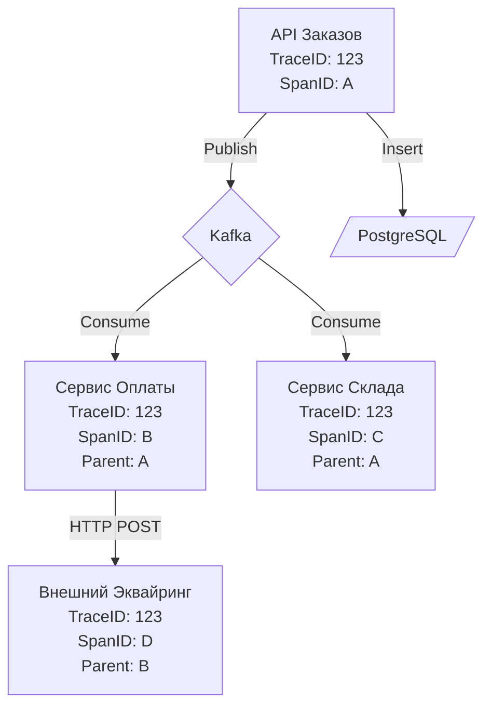

Распределенные системы, построенные на базе событийно-ориентированной архитектуры (EDA), приносят потрясающую масштабируемость. Но когда дело доходит до отладки, они превращаются в сущий кошмар. 

Представьте: пользователь нажимает кнопку "Оформить заказ". Запрос попадает в `API Gateway`, который публикует событие в Kafka. Его вычитывают `Сервис Склада` и `Сервис Оплаты`. `Сервис Оплаты` шлет запрос в эквайринг, получает ответ и публикует новое событие, которое читает `Сервис Нотификаций`. 
Вдруг пользователь жалуется: *"Мой заказ завис, письмо не пришло"*. 

В монолите вы бы просто открыли логи по `order_id` и прочитали весь стек вызовов (Stack Trace) сверху вниз. В асинхронных микросервисах логи размазаны по пяти разным серверам. Попытка связать их обычным `grep` по логам обречена на провал, потому что один и тот же `order_id` может обрабатываться конкурентно десятками воркеров, а сеть может задерживать события на минуты.

Чтобы вернуть контроль над хаосом, индустрия стандартизировала подход **Distributed Tracing (Распределенная трассировка)**. В этой статье мы разберем, как трассировка работает под капотом, как она интегрируется в рантайм Go и как правильно пробрасывать контекст через брокеры сообщений.

## Анатомия Распределенной Трассировки

Трассировка базируется на двух фундаментальных понятиях:
1. **Trace (Трейс):** Полный граф выполнения бизнес-процесса от начала до конца. Идентифицируется уникальным `TraceID` (обычно 16 байт / 32 hex-символа).
2. **Span (Спан):** Единица работы внутри трейса (например, один HTTP-запрос, один SQL-запрос или обработка одного сообщения из Kafka). Каждый спан имеет свой `SpanID` (8 байт), время начала, длительность и `ParentSpanID` (ссылку на родительский спан, кто его вызвал).

Собранные вместе, спаны формируют ориентированный ациклический граф (DAG), который визуализируется в виде каскада (Waterfall) в системах вроде Jaeger, Zipkin или Grafana Tempo.



## Context Propagation: Магия проброса

Чтобы Сервис Оплаты узнал, что он является частью трейса `123`, `API Заказов` должно как-то передать ему этот идентификатор. Этот процесс называется **Пробросом контекста (Context Propagation)**.

В 2019 году W3C утвердил стандарт **Trace Context**, который положил конец зоопарку проприетарных заголовков. Стандарт обязывает передавать метаданные через строго определенный HTTP-заголовок (или мета-заголовок в брокере):
`traceparent: 00-0af7651916cd43dd8448eb211c80319c-b7ad6b7169203331-01`

Формат `traceparent`: `[version]-[trace-id]-[parent-span-id]-[trace-flags]`.

### Сравнение с другими языками
В Java, C# или Python контекст запроса часто привязан к потоку выполнения операционной системы (ThreadLocal-переменные). Это удобно для разработчика (не нужно передавать контекст руками), но ломается при асинхронном программировании, когда поток переиспользуется пулом.
В Go нет ThreadLocal. Рантайм Go агрессивно перекидывает горутины (`g`) между потоками (`m`). Поэтому в Go контекст пробрасывается **явно** через интерфейс `context.Context`. Это идеальный паттерн для трассировки.

> [!info] Под капотом: context.Context в Go
> Структура `context` — это иммутабельное дерево. Когда вы вызываете библиотеку OpenTelemetry (OTEL) для старта спана `tracer.Start(ctx, "name")`, OTEL создает новый объект Span, кладет его в новый `valueCtx` (обертка над переданным `ctx`) и возвращает этот новый контекст. Все вложенные функции, принимающие этот `ctx`, смогут извлечь текущий `Span` и узнать его `TraceID`. 

### Как пробросить TraceID через Брокер?

Брокеры сообщений не используют HTTP. Но современные брокеры поддерживают концепцию **Headers (Заголовков) / Properties**, которая позволяет прикреплять метаданные к сообщению без изменения самого бизнес-пейлоада (JSON/Protobuf).

* **RabbitMQ:** Поддерживает структуру `Headers` (map) внутри `amqp.Publishing`.
* **Kafka:** Начиная с версии 0.11, протокол Kafka поддерживает `Record Headers` на уровне формата сообщений на диске (Zero-copy этому не мешает).

## Идиоматичный Go: Интеграция OpenTelemetry

Рассмотрим, как правильно инструментировать Продюсер и Консьюмер в Kafka с использованием стандарта OpenTelemetry (OTEL).

### 1. Сторона Продюсера (Inject)

Наша задача: взять `context.Context`, в котором уже есть текущий Span (например, созданный HTTP-мидлварью), и **внедрить (Inject)** его в заголовки Kafka перед отправкой.

```go
package tracing

import (
	"context"

	"[github.com/IBM/sarama](https://github.com/IBM/sarama)"
	"go.opentelemetry.io/otel"
	"go.opentelemetry.io/otel/propagation"
	"go.opentelemetry.io/otel/trace"
)

// MapCarrier - адаптер для заголовков Kafka, чтобы OTEL мог в них писать
type kafkaCarrier struct {
	msg *sarama.ProducerMessage
}

func (c kafkaCarrier) Get(key string) string { return "" } // При Inject чтение не нужно
func (c kafkaCarrier) Set(key string, value string) {
	c.msg.Headers = append(c.msg.Headers, sarama.RecordHeader{
		Key:   []byte(key),
		Value: []byte(value),
	})
}
func (c kafkaCarrier) Keys() []string { return nil }

func PublishWithTrace(ctx context.Context, producer sarama.SyncProducer, msg *sarama.ProducerMessage) error {
	tracer := otel.Tracer("my-kafka-producer")
	
	// 1. Создаем Span отправки сообщения (Kind: Producer)
	ctx, span := tracer.Start(ctx, "kafka.produce", trace.WithSpanKind(trace.SpanKindProducer))
	defer span.End()

	// 2. Внедряем TraceID из context в заголовки Kafka
	propagator := otel.GetTextMapPropagator()
	propagator.Inject(ctx, kafkaCarrier{msg: msg})

	// 3. Физическая отправка (в реальности здесь еще перехват ошибок для span.RecordError)
	_, _, err := producer.SendMessage(msg)
	if err != nil {
		span.RecordError(err)
	}
	return err
}
```

### 2. Сторона Консьюмера (Extract)

Наша задача: прочитать байты заголовков из Kafka, **извлечь (Extract)** из них `TraceID` и создать новый Span, который станет логическим продолжением распределенного графа.

```go
package tracing

import (
	"context"

	"[github.com/IBM/sarama](https://github.com/IBM/sarama)"
	"go.opentelemetry.io/otel"
	"go.opentelemetry.io/otel/propagation"
	"go.opentelemetry.io/otel/trace"
)

// Адаптер для чтения
type kafkaExtractCarrier struct {
	headers []*sarama.RecordHeader
}

func (c kafkaExtractCarrier) Get(key string) string {
	for _, h := range c.headers {
		if string(h.Key) == key {
			return string(h.Value)
		}
	}
	return ""
}
func (c kafkaExtractCarrier) Set(key string, value string) {}
func (c kafkaExtractCarrier) Keys() []string {
	keys := make([]string, len(c.headers))
	for i, h := range c.headers {
		keys[i] = string(h.Key)
	}
	return keys
}

func ConsumeWithTrace(ctx context.Context, msg *sarama.ConsumerMessage, businessLogic func(context.Context) error) error {
	// 1. Извлекаем TraceContext из заголовков Kafka
	propagator := otel.GetTextMapPropagator()
	extractedCtx := propagator.Extract(ctx, kafkaExtractCarrier{headers: msg.Headers})

	// 2. Стартуем Span Консьюмера, используя извлеченный контекст
	tracer := otel.Tracer("my-kafka-consumer")
	logicCtx, span := tracer.Start(extractedCtx, "kafka.consume", trace.WithSpanKind(trace.SpanKindConsumer))
	defer span.End()

	// 3. Передаем новый контекст в бизнес-логику!
	err := businessLogic(logicCtx)
	if err != nil {
		span.RecordError(err)
	}
	return err
}
```

> [!warning] Ловушка / Gotcha: Потеря контекста внутри горутин
> Самая частая ошибка разработчиков в Go при работе с асинхронными воркерами:
> ```go
> func handle(ctx context.Context, msg Message) {
>     // АНТИПАТТЕРН: Вы создаете новую горутину и передаете туда context.Background(),
>     // или вообще не передаете ctx! Связь трейса обрывается навсегда.
>     go doHeavyWork(context.Background()) 
> }
> ```
> Вы **обязаны** пробрасывать `ctx` во все внутренние вызовы, БД-запросы и новые горутины (с учетом таймаутов, возможно, используя `context.WithoutCancel(ctx)`, если горутина должна пережить родительский HTTP-запрос, но сохранить TraceID).

## Высший пилотаж: Batch Processing и Span Links

В статье [[5. Batch processing сообщений]] мы обсуждали, что чтение по одному сообщению убивает пропускную способность. Консьюмер должен читать батчами (например, по 500 сообщений) и делать один `INSERT` в БД.

Но как быть с трассировкой? 
500 сообщений пришли из **500 разных трейсов** (разные HTTP-запросы пользователей). Вы не можете создать один Span, у которого 500 `ParentSpanID`. Стандарт W3C допускает только одного родителя.

Для этой задачи в OpenTelemetry существует концепция **Links (Ссылки)**.

1. Консьюмер читает батч из 500 сообщений.
2. Консьюмер создает абсолютно **новый**, независимый корневой Span для процесса обработки батча.
3. Консьюмер извлекает `TraceContext` из каждого сообщения и добавляет их в свой новый Span в виде `Links`.

```go
// Пример (Псевдокод для концепции)
var links []trace.Link
for _, msg := range batch {
    ctx := extractContext(msg)
    links = append(links, trace.Link{SpanContext: trace.SpanContextFromContext(ctx)})
}

// Создаем Span, связывающий множество трейсов
batchCtx, span := tracer.Start(context.Background(), "batch_insert", trace.WithLinks(links...))
defer span.End()

// ... выполняем батч-запрос
```
В Jaeger этот спан будет отображаться как отдельный процесс, но из любого родительского трейса пользователя можно будет провалиться по ссылке в этот батч-спан и посмотреть, сколько времени заняла физическая запись в базу.

## Цена наблюдаемости (Mechanical Sympathy)

Трассировка не бесплатна. Каждая генерация UUID (TraceID), каждая аллокация структуры Span, каждая фиксация времени (syscall `clock_gettime`) отнимает процессорные такты. Плюс, собранные спаны нужно отправлять по сети в Jaeger/Tempo.

> [!tip] Собеседование
> **Вопрос:** Если у нас 100 000 RPS, полное включение OpenTelemetry убьет CPU серверов и забьет сеть мониторинга. Как этого избежать?
> **Ответ:** Использовать **Сэмплирование (Sampling)**.
> Существует два вида:
> 1. **Head-Based Sampling:** Продюсер (на входе) бросает монетку и решает, например, трейсить только 1% запросов. Этот флаг (`sampled=1`) пробрасывается до конца, и все последующие сервисы тоже трейсят этот запрос. Это экономит ресурсы, но мы можем пропустить редкие ошибки.
> 2. **Tail-Based Sampling:** Все сервисы генерируют спаны и отправляют их в локальный OTEL Collector (в оперативной памяти). Коллектор ждет завершения трейса и принимает решение: если трейс прошел успешно и быстро — удаляем его из памяти (дропаем). Если трейс содержит ошибки (HTTP 500) или аномальные задержки — отправляем в Jaeger. Это дает идеальную видимость ошибок без перегрузки хранилища.

## Итог раздела "Паттерны и архитектура"

Мы завершили огромный архитектурный блок. Мы прошли путь от простых очередей к сложным паттернам:
1. Научились развязывать системы через **Pub/Sub** и масштабировать воркеры через **Work Queue**.
2. Погрузились в мир **Event Driven Architecture**, поняли концепции **Event Sourcing** и **CQRS**.
3. Решили фундаментальную проблему двойной записи (Dual Write) связкой паттернов **Outbox** и **Inbox**.
4. Построили распределенные транзакции на базе **Саги (Saga)** и сравнили Хореографию с Оркестрацией.
5. И, наконец, научились отлаживать всю эту асинхронную магию с помощью **OpenTelemetry**.

Но как мы выяснили в статье про Оркестрацию, писать свой надежный Оркестратор бизнес-процессов на Go с конечными автоматами, таймерами, поллингом базы и ретраями — это колоссальный труд, не имеющий прямого отношения к вашему бизнесу. 

Для решения проблем сложных распределенных Саг (сотни шагов, ожидание днями, компенсации) индустрия создала отдельный класс систем — движки Оркестрации. В следующем разделе мы начнем изучать концепцию и флагмана этого направления. Переходим к: [[1. Что такое workflow orchestration]].