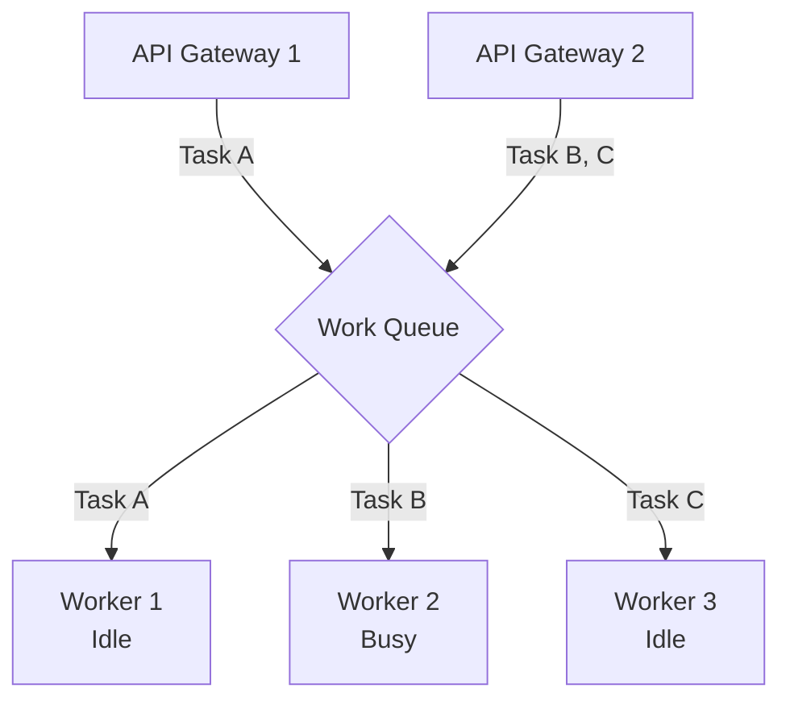

В прошлой статье ([[1. Pub Sub]]) мы рассматривали сценарии, когда одно событие должно быть доставлено всем заинтересованным сервисам для параллельной реакции. Но что делать, если ваша задача — не уведомить систему, а выполнить тяжелую работу, которую **нельзя** дублировать?

Например: вам нужно сгенерировать PDF-отчет на 500 страниц, сжать видеофайлы, загруженные пользователем, или отправить SMS с одноразовым кодом (OTP). Если вы отправите эту задачу через Pub/Sub, все 10 ваших реплик Сервиса Нотификаций получат событие, и пользователь получит 10 одинаковых SMS. Это финансовые потери и крах UX.

Здесь на сцену выходит паттерн **Work Queue (Очередь задач)**, также известный как **Task Queue** или паттерн **Competing Consumers (Конкурирующие потребители)**.

## Анатомия паттерна Work Queue

Суть паттерна предельно проста: у вас есть одна логическая очередь задач и множество воркеров (потребителей), которые "соревнуются" за задачи из этой очереди. 

Главный контракт паттерна: **каждое сообщение из очереди должно быть успешно обработано строго одним воркером**.



Горизонтальное масштабирование здесь достигается тривиально: если очередь начинает расти (Producer-ы генерируют задачи быстрее, чем Consumer-ы их разгребают), вы просто поднимаете в Kubernetes еще 5 подов с вашим Go-приложением. Брокер автоматически распределит новые задачи между новыми воркерами.

## Mechanical Sympathy: Локальные vs Распределенные очереди

Если вы пишете на Go, ваша первая мысль: *«Зачем мне RabbitMQ? Я могу сделать очередь задач на обычном буферизованном канале `chan Task` и пуле горутин!»*

Действительно, локальный Worker Pool на каналах работает в памяти текущего процесса.
* **Локальная очередь (Go `chan`):** Сверхбыстрая (десятки наносекунд). Передача данных — это просто копирование указателя под мьютексом внутри рантайма Go. Структуры `sudog` перекидывают горутины (`g`) между потоками ОС (`m`) через локальные очереди планировщика (`p`).
* **Распределенная очередь (RabbitMQ):** Дорогая. Сообщение должно быть сериализовано (JSON/Protobuf), отправлено через системный вызов `write` в сетевой стек ядра, пройти по TCP до брокера, быть сохраненным на диске (`fsync`), и только потом отправлено консьюмеру через `read`. Это миллисекунды (в $10^5$ раз медленнее!).

**Но почему мы платим эту цену?**
1. **Volatile Memory:** Если ваш Go-процесс с локальным каналом падает (OOM Killer, аппаратный сбой), все невыполненные задачи в `chan` исчезают навсегда. Распределенный брокер хранит задачи на диске независимо от воркеров.
2. **Справедливая балансировка:** Один процесс ограничен ядрами одного физического сервера. Распределенная очередь позволяет балансировать CPU-bound задачи (например, кодирование видео) на сотни серверов.

## Справедливое распределение (Fair Dispatch)

Представьте ситуацию: у нас есть тяжелые задачи (отчеты по 10 секунд) и легкие (по 100 мс). Если мы используем RabbitMQ и подключаем к нему два воркера, RabbitMQ по умолчанию использует алгоритм **Round-robin** — он раздает задачи строго по очереди: 1-му, 2-му, 1-му, 2-му.

> [!warning] Ловушка / Gotcha
> Что произойдет, если все четные задачи окажутся тяжелыми, а нечетные — легкими?
> RabbitMQ "вслепую" отправит 50 тяжелых задач Воркеру 2 и 50 легких Воркеру 1. Воркер 1 выполнит свои 50 задач за 5 секунд и будет простаивать. А Воркер 2 будет "потеть" над своими задачами 500 секунд, держа их в оперативной памяти (Unacknowledged). 
> Это приводит к перекосу ресурсов и Head-of-Line Blocking на уровне конкретного потребителя.

### Решение: Prefetch Count (QoS)

Чтобы сделать распределение "справедливым", мы обязаны использовать механизм `QoS` (Quality of Service), который мы будем подробно изучать в [[5. Prefetch и QoS]]. 

В коде консьюмера мы устанавливаем `Prefetch Count = 1` (или равным размеру пула локальных горутин). Это говорит брокеру: *«Не давай мне новую задачу, пока я не пришлю тебе `Ack` (подтверждение) за предыдущую»*. 
В этом случае задачи хранятся в брокере, и как только любой из воркеров освобождается, он забирает следующую задачу. Балансировка становится идеальной.

## Реализация паттернов Work Queue в разных брокерах

В мире Message Brokers нет единого стандарта. RabbitMQ и Kafka реализуют Work Queue абсолютно разными механизмами, и незнание этих отличий — классическая причина провала архитектуры.

### RabbitMQ (Нативная очередь)
RabbitMQ создан для паттерна Work Queue. Вы создаете одну логическую очередь (Queue), и подключаете к ней N консьюмеров. RabbitMQ сам управляет блокировками и раздачей сообщений (через Push-модель). Если воркер отвалился (TCP-соединение разорвано), RabbitMQ мгновенно забирает у него все `Unacknowledged` сообщения и передает их живым воркерам.

### Apache Kafka (Consumer Groups)
Kafka — это лог, а не очередь. Там нельзя просто "взять задачу и удалить ее". 
В Kafka паттерн Work Queue реализуется через **Consumer Groups** (подробнее в [[4. Consumer groups]]). 
Все воркеры объединяются в одну группу (с одинаковым `group.id`). Kafka распределяет партиции (Partitions) топика между воркерами в группе.

> [!tip] Собеседование
> **Вопрос:** Мы используем Kafka. У нас 10 партиций в топике. Мы видим, что задачи копятся (Lag растет), и решаем поднять количество воркеров в Kubernetes (HPA) с 10 до 20. Ускорит ли это обработку?
> **Ответ:** НЕТ! В Kafka один воркер (в рамках группы) может читать несколько партиций, но **одну партицию не могут читать два воркера из одной группы одновременно**. Если у вас 10 партиций и 20 воркеров, 10 воркеров будут простаивать (Idle), не получая ни одного сообщения. Чтобы масштабировать Work Queue в Kafka, вам нужно увеличивать количество партиций!

## Идиоматичный Go: Соединяем локальный и распределенный пулы

Senior-паттерн при работе с очередями в Go — это комбинация распределенной Work Queue (брокер) и локального Worker Pool (горутины). 

Нельзя запускать `go handle(msg)` на каждое входящее сообщение, иначе вы уроните базу данных количеством открытых коннектов (см. проблему Thundering Herd).

**Правило: Prefetch Count должен быть строго равен размеру вашего локального Worker Pool!**

```go
package worker

import (
	"context"
	"log"

	amqp "[github.com/rabbitmq/amqp091-go](https://github.com/rabbitmq/amqp091-go)"
)

// WorkQueueConsumer управляет чтением из RabbitMQ и локальным пулом
type WorkQueueConsumer struct {
	poolSize int
}

func (c *WorkQueueConsumer) Start(ctx context.Context, ch *amqp.Channel, queueName string) error {
	// 1. Критически важно: Синхронизируем QoS с размером пула горутин!
	// Если poolSize=10, мы не возьмем из сети 11-ю задачу, пока не закончим одну из 10.
	err := ch.Qos(
		c.poolSize, // prefetch count
		0,          // prefetch size
		false,      // global
	)
	if err != nil {
		return err
	}

	msgs, err := ch.Consume(
		queueName,
		"",    // consumer name
		false, // auto-ack (ОБЯЗАТЕЛЬНО FALSE для Work Queue!)
		false, // exclusive
		false, // no-local
		false, // no-wait
		nil,   // args
	)
	if err != nil {
		return err
	}

	// 2. Создаем локальный канал для балансировки между горутинами
	// Буфер не нужен, так как QoS уже ограничивает нас
	tasks := make(chan amqp.Delivery)

	// 3. Запускаем фиксированный Worker Pool
	for i := 0; i < c.poolSize; i++ {
		go c.workerLoop(ctx, tasks, i)
	}

	// 4. Диспетчер: читает из сети и отдает локальным воркерам
	for {
		select {
		case <-ctx.Done():
			log.Println("Shutting down dispatcher...")
			return nil
		case msg, ok := <-msgs:
			if !ok {
				return nil // Канал закрыт
			}
			// Блокируется, если все вокеры заняты. 
			// Из-за QoS=poolSize блокировки здесь почти не будет, 
			// но это защищает нас от утечек.
			tasks <- msg 
		}
	}
}

func (c *WorkQueueConsumer) workerLoop(ctx context.Context, tasks <-chan amqp.Delivery, id int) {
	for {
		select {
		case <-ctx.Done():
			return
		case msg := <-tasks:
			// Имитация тяжелой работы
			err := processHeavyTask(ctx, msg.Body)
			
			if err != nil {
				log.Printf("Worker %d failed: %v", id, err)
				// Возвращаем задачу в очередь для другого воркера
				msg.Nack(false, true)
			} else {
				// Успех. Только теперь диспетчер сможет вычитать новую задачу
				msg.Ack(false)
			}
		}
	}
}
```

## Итог

1. **Work Queue** используется для масштабирования тяжелых вычислительных или I/O задач, где сообщение должно быть обработано ровно один раз.
2. Для честного распределения (Fair Dispatch) и защиты памяти Go-процесса необходимо жестко связывать **Prefetch Count** брокера и размер пула горутин.
3. Разные брокеры требуют разного подхода к масштабированию: в RabbitMQ мы просто добавляем консьюмеры к очереди, в Kafka — мы обязаны следить за балансом `Количество Воркеров <= Количество Партиций`.

Work Queue и Pub/Sub — это низкоуровневые строительные блоки асинхронного мира. Но когда мы начинаем строить на их базе сложные бизнес-процессы микросервисов, мы переходим на уровень архитектурных парадигм. В следующей статье мы поднимемся на уровень выше и рассмотрим глобальную концепцию: [[3. Event Driven Architecture]].