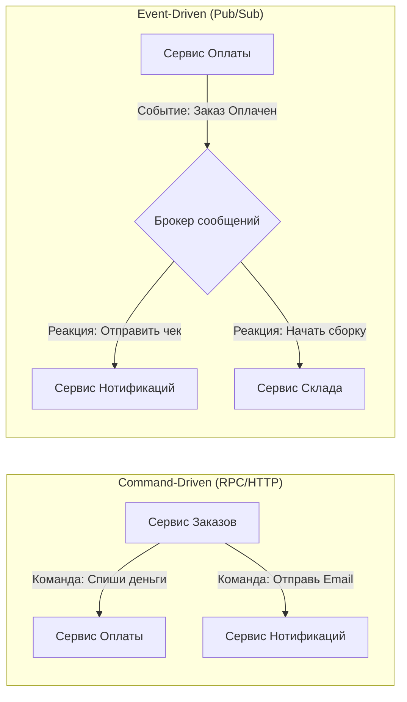

В предыдущих статьях мы разобрали технические паттерны маршрутизации: как размножить сообщение на всех ([[1. Pub Sub]]) и как сбалансировать тяжелую задачу между свободными воркерами ([[2. Work Queue]]). Это фундаментальные строительные блоки. Но когда вы используете эти блоки повсеместно, ваша система претерпевает глобальный архитектурный сдвиг. 

Вы перестаете строить систему из сервисов, которые "вызывают" друг друга, и начинаете строить систему из сервисов, которые "реагируют" на факты. Этот архитектурный стиль называется **Event-Driven Architecture (EDA, Событийно-ориентированная архитектура)**.

В этой статье мы разберем парадигму EDA, классификацию событий, влияние на рантайм Go и главные ловушки, которые ждут разработчика при переходе от синхронного монолита к асинхронной хореографии.

## Сдвиг парадигмы: Команды vs События

Главное отличие классической SOA (Service-Oriented Architecture) или синхронных микросервисов от EDA кроется в семантике взаимодействия.

**Команда (Command)** — это императивное указание.
* *Смысл:* "Сделай вот это".
* *Связанность:* Отправитель обязан знать, кто исполнитель, как к нему обратиться (IP/DNS) и какой у него контракт.
* *Пример:* `POST /api/v1/emails/send` (Сервис Заказов приказывает Сервису Нотификаций отправить письмо).

**Событие (Event)** — это констатация факта.
* *Смысл:* "Произошло вот это" (всегда в прошедшем времени).
* *Связанность:* Отправитель не имеет ни малейшего понятия, кто будет слушать это событие и что они с ним сделают. Он просто фиксирует факт в брокере.
* *Пример:* `OrderPaidEvent` (Сервис Оплаты сообщает брокеру, что заказ оплачен).



В EDA логика "что должно произойти после оплаты" перемещается из Сервиса Оплаты (оркестрация) в сами зависимые сервисы (хореография).

## Mechanical Sympathy: Ресурсы и Latency в EDA

Давайте посмотрим на EDA глазами железа и планировщика Go (`runtime.scheduler`).

В синхронном Command-Driven подходе обработчик HTTP-запроса в `Сервисе Заказов` выглядит так:
1. Вызов `Сервиса Оплаты` (gRPC). Горутина паркуется в `netpoll`. Ждем 200мс.
2. Вызов `Сервиса Нотификаций` (HTTP). Горутина снова в `netpoll`. Ждем 100мс.

**Итог:** Пользователь ждет 300мс. Горутина `g` (со всем ее стеком и объектами в хипе) живет 300мс, создавая давление на Сборщик Мусора (GC). Если `Сервис Нотификаций` начнет отвечать за 5 секунд, ваши горутины скопятся, память утечет, и `Сервис Заказов` упадет по OOM.

В Event-Driven подходе (через брокер вроде Kafka или NATS JetStream):
1. Вызов локальной БД: Транзакция "Заказ создан". (10мс).
2. Запись в TCP-сокет брокера: `OrderCreatedEvent` (1-2мс).
3. Возврат `HTTP 201 Created` пользователю.

**Итог:** Горутина живет 12мс. Она мгновенно отдает ресурсы процессора (`m` и `p`) другим запросам. Стек очищается. GC работает короткими, дешевыми фазами. I/O-bound ожидание (работа других сервисов) полностью исключено из критического пути (Critical Path) ответа пользователю. Система способна держать в десятки раз больший RPS на том же самом железе.

## Анатомия Событий: Что мы кладем в Payload?

В EDA существует три фундаментальных типа событий. Выбор неправильного типа — самая частая ошибка при проектировании.

### 1. Event Notification (Уведомление о событии)
Самое "тонкое" (Thin) событие. Оно содержит только идентификатор сущности и тип действия.
* *Смысл:* "Изменился профиль пользователя ID=42".
* *Плюс:* Минимальный размер, легко передавать по сети, нет риска утечки PII (Personal Identifiable Information).
* *Минус:* Если подписчику нужны данные (какое именно поле профиля изменилось?), он вынужден делать синхронный HTTP-запрос к источнику. При массовых событиях это порождает "Гремящее стадо" (Thundering Herd), убивающее источник.

### 2. Event-Carried State Transfer (Передача состояния)
"Толстое" (Fat) событие. Оно содержит *все* данные, которые могут понадобиться подписчикам.
* *Смысл:* "Изменился профиль ID=42. Вот его новое имя, email и адрес".
* *Плюс:* Полный decoupling. Подписчикам вообще не нужно делать синхронные запросы к источнику. Они могут кэшировать эти данные в своих локальных БД (паттерн Materialized View).
* *Минус:* Дублирование данных. Если в профиле 150 полей, вы гоняете огромные JSON-объекты по сети. Сложность поддержки контрактов.

```go
// Пример Event-Carried State Transfer в Go
type UserProfileUpdatedEvent struct {
    EventID     string    `json:"event_id"`
    OccurredAt  time.Time `json:"occurred_at"`
    UserID      int64     `json:"user_id"`
    // Данные для локального кэширования в других микросервисах
    NewEmail    string    `json:"new_email"`
    NewTier     string    `json:"new_tier"`
}
```

### 3. Domain Event (Доменное событие)
Событие, которое имеет самостоятельный бизнес-смысл в терминах предметной области (DDD - Domain-Driven Design).
* *Смысл:* Не "Обновлена таблица `users`", а "Пользователь повысил статус до VIP".
Это самый правильный подход для построения сложной бизнес-логики в микросервисах.

## Теневая сторона EDA: Хаос и Консистентность

Если EDA так хороша для железа и масштабирования, почему не все системы построены на ней?

> [!warning] Ловушка / Gotcha: Event Hell (Хаос хореографии)
> В EDA нет единого центра управления (Оркестратора). Процесс оформления заказа размазан по 10 независимым сервисам, которые перекидываются событиями.
> Если бизнес приходит с вопросом: "А почему у нас заказ №555 завис в статусе В_Обработке и не отправлен?", найти ответ становится невероятно сложно. Вы должны собрать логи со всех 10 сервисов и восстановить цепочку событий. Без внедрения распределенной трассировки (OpenTelemetry), которую мы обсудим в [[10. Distributed tracing в async системах]], поддержка EDA превращается в ад.

### Проблема Dual Write (Двойная запись)

Это самый популярный вопрос на System Design секциях для Senior Go Engineer.

Вы реализуете `Сервис Заказов`. Вам нужно:
1. Сохранить заказ в PostgreSQL.
2. Отправить `OrderCreatedEvent` в Kafka.

```go
// АНТИПАТТЕРН!
func (s *Service) CreateOrder(ctx context.Context, req OrderReq) error {
    // 1. Сохраняем в БД
    order := s.db.Save(req) 
    
    // 2. Публикуем событие
    // ЧТО ЕСЛИ ЗДЕСЬ УПАДЕТ СЕТЬ ИЛИ KAFKA ВЕРНЕТ ТАЙМАУТ?
    err := s.kafka.Publish("orders", order.ToEvent()) 
    if err != nil {
        // Мы не можем просто вернуть ошибку. Транзакция в БД уже закоммичена!
        // Возникает рассинхронизация: Заказ есть в БД, но другие сервисы о нем не знают.
        return err 
    }
    return nil
}
```

Нельзя атомарно (в рамках ACID-транзакции) обновить две разные распределенные системы (PostgreSQL и Kafka). Эта проблема разрушает Event-Driven архитектуру. 

Для её решения придуманы специальные архитектурные паттерны: **Transactional Outbox**, который мы детально разберем в статье [[6. Outbox pattern]], и **Event Sourcing**, где брокер сам становится базой данных.

> [!tip] Собеседование
> **Вопрос:** Если мы используем Event-Driven Architecture и все сервисы кэшируют данные у себя (Event-Carried State Transfer), что произойдет, если брокер ляжет на 5 минут?
> **Ответ:** Система продолжит частично работать! Сервис Заказов сможет принимать новые заказы (складывая события в локальный Outbox или получая ошибку публикации, но сохраняя в локальную БД). А Сервис Склада сможет отвечать на GET-запросы пользователей, так как у него есть локальная реплика данных (хоть и слегка устаревшая). Это называется **Availability over Consistency** (Теорема CAP). В синхронной системе (Command-driven) падение одного критичного сервиса ведет к полному отказу (Downtime). В EDA мы получаем деградацию, но не полное падение. На смену строгой консистентности (ACID) приходит **Eventual Consistency** (Согласованность в конечном счете).

## Итог

1. **EDA** меняет вектор контроля: от императивного (вызов) к реактивному (подписка).
2. **Производительность:** EDA освобождает горутины в Go от I/O-блокировок на сетевых вызовах, радикально снижая потребление памяти и давление на GC.
3. **Типы событий:** Выбирайте "Толстые" события (Event-Carried State Transfer), чтобы минимизировать обратные вызовы к вашему API, но будьте готовы к Eventual Consistency.
4. **Сложность:** Вы меняете проблемы масштабируемости железа на проблемы консистентности данных и распределенной отладки.

Развивая идею событий, некоторые архитекторы задают радикальный вопрос: *«Если события описывают всё, что произошло в системе, зачем нам вообще классическая реляционная база данных, хранящая только "текущее" состояние?»* Этот вопрос приводит нас к одному из самых мощных и сложных паттернов в инженерии, который мы разберем в следующей статье: [[4. Event sourcing и брокеры]].