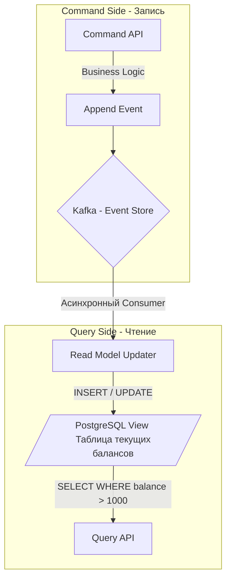

В прошлой статье мы погрузились в хаос и красоту [[3. Event Driven Architecture]]. Мы выяснили, что главной головной болью асинхронного мира является проблема **Dual Write (Двойной записи)**: как атомарно сохранить новое состояние сущности в локальную базу данных (например, PostgreSQL) и отправить уведомление об этом в брокер сообщений (Kafka/RabbitMQ)? 

Что если я скажу вам, что эта проблема существует только потому, что мы мыслим категориями «текущего состояния»? 

Что если мы **вообще перестанем хранить текущее состояние** в базе данных, а вместо этого будем хранить только историю того, как мы к этому состоянию пришли? Эта радикальная смена парадигмы называется **Event Sourcing (Порождение событий)**, и брокеры сообщений играют в ней роль первой скрипки.

## Иллюзия текущего состояния (CRUD vs Event Sourcing)

Классический бэкенд построен на парадигме CRUD (Create, Read, Update, Delete). База данных хранит слепок реальности на данный момент.

Представьте банковский счет. В CRUD-модели при переводе денег вы делаете:
```sql
UPDATE accounts SET balance = balance - 100 WHERE id = 42;
```
Старое значение баланса безвозвратно уничтожено (затерто). Если через год клиент спросит: "А почему у меня такой баланс?", вы не сможете ответить, опираясь только на таблицу `accounts`. Вам придется строить сбоку костыли в виде таблиц аудита (`audit_logs`), которые часто расходятся с реальностью.

**Event Sourcing** работает иначе. Вдохновленный бухгалтерскими книгами (Ledgers), он запрещает операции `UPDATE` и `DELETE`. Существует только `INSERT`. 

Состояние системы — это производная (функция свертки) от всех событий, произошедших с момента создания.

**Поток событий (Event Stream) для счета №42:**
1. `AccountCreated { InitBalance: 0 }`
2. `MoneyDeposited { Amount: 500 }`
3. `MoneyWithdrawn { Amount: 100 }`

Текущий баланс (400) **не хранится нигде**. Он вычисляется (Rehydration / Rebuilding) в оперативной памяти Go-сервиса путем последовательного применения этих трех событий.

## Брокер как База Данных (Идеальный Match)

Для реализации Event Sourcing нам нужен **Event Store (Хранилище событий)**. Это хранилище должно обладать тремя свойствами:
1. Строгий порядок событий (Ordering).
2. Иммутабельность (Append-only лог).
3. Возможность подписки на новые события (Pub/Sub).

Именно поэтому **Apache Kafka** является идеальным техническим фундаментом для Event Sourcing (гораздо лучшим, чем реляционные СУБД). 

Вспомним [[1. Kafka. Архитектура и модель log based системы]]. Kafka — это и есть распределенный Append-only лог. Если мы установим в топике Kafka `retention.bytes = -1` и `retention.ms = -1` (хранить вечно), топик превращается в полноценную базу данных. Партиция Kafka выступает гарантом строгого порядка событий для конкретного агрегата (если использовать ID агрегата как Partition Key).

> [!warning] Ловушка / Gotcha: RabbitMQ не подходит
> RabbitMQ — это транзитный брокер (Smart Broker). Его философия: "доставил — удалил". Если вы попытаетесь построить Event Sourcing на RabbitMQ, вам придется дублировать события в отдельную БД (например, EventStoreDB или PostgreSQL), что моментально возвращает вас к проблеме Dual Write!

## Анатомия Агрегата в Go

Давайте посмотрим, как концепция Event Sourcing элегантно ложится на идиоматичный Go-код.

Мы создаем Доменную сущность (Aggregate Root). У нее есть внутреннее состояние, но оно никогда не мутируется напрямую извне. Изменение состояния происходит только через функцию `Apply()`, которая принимает доменное событие.

```go
package domain

import (
	"errors"
	"fmt"
)

// Aggregate: Банковский счет
type Account struct {
	ID      string
	Balance int64
	Version int // Важно для оптимистичных блокировок
}

// Базовый интерфейс события
type Event interface {
	EventType() string
}

// Конкретные события
type AccountCreated struct { AccountID string }
func (e AccountCreated) EventType() string { return "AccountCreated" }

type MoneyDeposited struct { Amount int64 }
func (e MoneyDeposited) EventType() string { return "MoneyDeposited" }

type MoneyWithdrawn struct { Amount int64 }
func (e MoneyWithdrawn) EventType() string { return "MoneyWithdrawn" }

// Apply: Единственный способ изменить состояние агрегата
func (a *Account) Apply(event Event) {
	switch e := event.(type) {
	case AccountCreated:
		a.ID = e.AccountID
		a.Balance = 0
	case MoneyDeposited:
		a.Balance += e.Amount
	case MoneyWithdrawn:
		a.Balance -= e.Amount
	}
	a.Version++
}

// LoadFromHistory: Восстановление состояния из лога (Rehydration)
func NewAccountFromHistory(events []Event) *Account {
	account := &Account{}
	for _, e := range events {
		account.Apply(e) // O-n сложность
	}
	return account
}

// Бизнес-логика (Commands)
// Она проверяет инварианты и ГЕНЕРИРУЕТ новые события, если всё ок.
func (a *Account) Withdraw(amount int64) (Event, error) {
	if a.Balance < amount {
		return nil, errors.New("insufficient funds")
	}
	// Мы не меняем a.Balance здесь! Мы только создаем факт.
	return MoneyWithdrawn{Amount: amount}, nil
}
```

> [!info] Под капотом: Mechanical Sympathy и Escape Analysis
> Восстановление агрегата (`NewAccountFromHistory`) требует прохода по массиву событий. С точки зрения железа, если массив `events` лежит в непрерывном блоке памяти, CPU загрузит его в кэш-линию L1 и выполнит регидратацию миллионов событий за микросекунды (Cache Locality). 
> Однако, в Go передача интерфейсов (`[]Event`) часто приводит к аллокациям в куче (Escape Analysis фейлится, так как рантайму нужна таблица виртуальных методов itab). При очень длинных историях событий это создаст давление на GC. На критических путях HighLoad систем часто используют кодогенерацию или `union`-подобные структуры на базе слайсов байт вместо массивов интерфейсов.

## Решение проблемы Dual Write

Event Sourcing решает проблему двойной записи самым радикальным образом: **запись остается только одна**.

Поток выполнения:
1. API получает команду (HTTP POST).
2. Go-сервис вычитывает всю историю событий агрегата из брокера (Kafka) в оперативную память.
3. Сервис восстанавливает состояние (Rehydration).
4. Сервис выполняет бизнес-проверки.
5. Сервис **записывает новое событие в Kafka**.
6. Возвращает пользователю HTTP 200 OK.

Всё. Нет никакой локальной базы данных, которую нужно обновлять синхронно. Брокер сообщений *и есть* база данных.

## Темная сторона: Как читать данные? (Введение в CQRS)

У Event Sourcing есть один фатальный недостаток. 

Представьте, что бизнес просит: *"Выведи мне список всех счетов, где баланс больше 1000 долларов"*.
В PostgreSQL вы бы написали `SELECT * FROM accounts WHERE balance > 1000`.

В Event Sourcing у вас нет столбца `balance`. У вас есть только терабайтный лог транзакций в Kafka. Чтобы выполнить этот запрос, вам придется вычитать **весь лог с самого начала времен**, восстановить в памяти **каждый** счет, проверить его баланс и отфильтровать. Это $O(N)$ по времени и объему памяти, где $N$ — все события в системе. Это убьет ваш сервис.

Для решения этой проблемы Event Sourcing всегда (в 100% случаев) применяется вместе с паттерном **CQRS (Command Query Responsibility Segregation)**.



Мы разделяем систему на "Писателя" (работает через события и Kafka) и "Читателя". 
Асинхронный фоновый воркер на Go (Consumer) читает события из Kafka и строит **Материализованное представление (Read Model / Projection)** в обычной реляционной БД (или ElasticSearch, или Redis). Эта БД спроектирована исключительно для сверхбыстрого чтения и фильтрации.

> [!tip] Собеседование
> **Вопрос:** В Евросоюзе действует закон GDPR (Право на забвение). Если пользователь требует удалить все свои данные, как вы это сделаете в Event Sourcing, где главное правило — "Append-only, ничего удалять нельзя"?
> **Ответ:** Это классический архитектурный парадокс. Решается паттерном **Crypto-Shredding (Криптографическое уничтожение)**. Продюсер шифрует PII (Personal Identifiable Information) пользователя симметричным ключом перед отправкой события в лог. Ключ сохраняется в отдельной строгой Key-Value БД (Vault). Когда пользователь запрашивает удаление, вы просто удаляете *ключ* из Vault. События в иммутабельном логе остаются, но расшифровать их больше невозможно — они превращаются в криптографический мусор. Закон GDPR считает это легитимным удалением.

## Оптимизация: Snapshotting (Снапшоты)

Если счет живет 10 лет, у него могут накопиться сотни тысяч транзакций. Читать их все из Kafka при каждой операции записи (`Withdraw`) становится слишком дорого по CPU и сети.

Для оптимизации используется механизм **Snapshots (Снимков состояния)**. Раз в N событий (например, каждые 1000 событий) система сериализует текущее восстановленное состояние агрегата и сохраняет его в отдельный топик Kafka (или в Redis/S3) с указанием версии.

При следующем запросе сервис:
1. Загружает последний Snapshot (Баланс 5000 на версии 1000).
2. Запрашивает из Event Store только те события, которые произошли *после* версии 1000.
3. Докручивает (Apply) эти несколько новых событий поверх снапшота.

## Итог

1. **Event Sourcing** отказывается от хранения текущего состояния в пользу хранения иммутабельной истории фактов (Append-only лог).
2. **Брокеры (Kafka)** выступают в роли идеальной базы данных (Event Store) благодаря последовательному I/O, OS Page Cache и гарантиям упорядочивания в партициях.
3. **Dual Write полностью исчезает**, так как единственной транзакционной операцией становится добавление (Append) нового факта в брокер.
4. **Сложность:** Паттерн требует сложного версионирования контрактов (Schema Evolution) и порождает Eventual Consistency, так как чтение данных осуществляется через асинхронные Read-модели.

Мы вплотную подошли к необходимости разделить операции изменения состояния и запросов данных. Невозможно построить эффективный Event Sourcing без правильной архитектуры чтения. В следующей статье мы детально разберем вторую половину этого дуэта: [[5. CQRS и брокеры]].