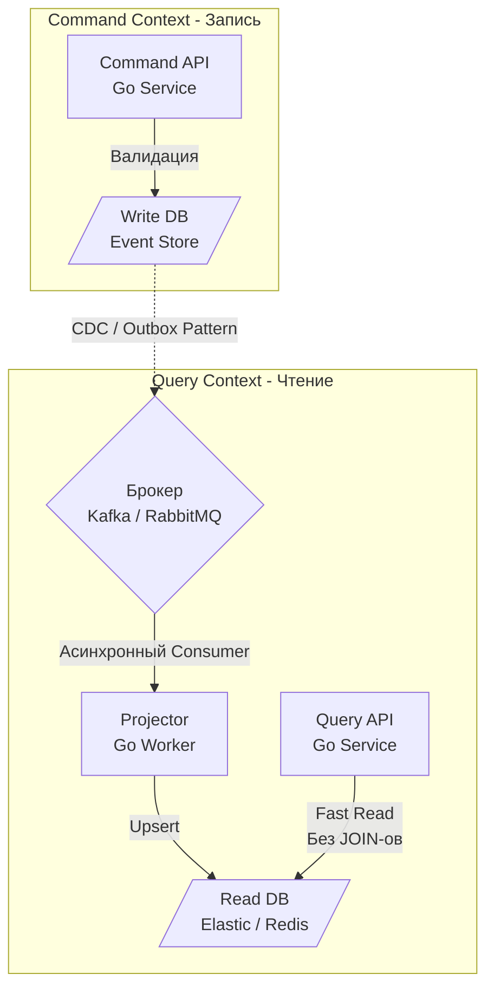

В статье [[4. Event sourcing и брокеры]] мы столкнулись с фундаментальным парадоксом архитектуры: база данных, идеально оптимизированная для сверхбыстрой записи (Append-only лог), абсолютно не пригодна для сложных выборок, агрегаций и поиска. 

Если вы попытаетесь сделать полнотекстовый поиск по истории событий в Kafka, вы положите кластер. Если вы попробуете сделать JOIN пяти таблиц в нормализованной реляционной БД на каждый чих пользователя, вы упретесь в лимиты CPU и дискового I/O базы данных.

Для построения высоконагруженных систем, где соотношение чтений к записям часто составляет 100:1 (пользователи чаще смотрят каталог, чем покупают), индустрия выработала паттерн **CQRS (Command Query Responsibility Segregation — Разделение ответственности команд и запросов)**. В этой статье мы разберем, как брокеры сообщений выступают кровеносной системой этого паттерна.

## Анатомия CQRS

Традиционная архитектура (CRUD) использует одну и ту же модель данных (DMO — Data Model Object) и одну и ту же базу данных как для записи, так и для чтения. 

**CQRS ломает этот стереотип.** Паттерн утверждает: модель, которая проверяет бизнес-правила и меняет состояние (Команда), и модель, которая отдает данные пользователю (Запрос), должны быть **физически и логически разделены**.

1. **Command Side (Сторона Записи):** * Получает команды (например, `CreateOrder`).
   * Содержит сложную бизнес-логику и инварианты.
   * Оптимизирована для высокой пропускной способности записи (High Write Throughput). Почти не имеет индексов.
   * База данных: PostgreSQL (нормализованная), EventStoreDB или Apache Kafka.
2. **Query Side (Сторона Чтения):**
   * Получает запросы (например, `GetOrderHistory`).
   * Не содержит никакой бизнес-логики.
   * Оптимизирована для сверхнизкой задержки чтения (Low Read Latency). Данные максимально денормализованы ("плоские" таблицы), индексы построены под конкретные экраны UI.
   * База данных: Elasticsearch, Redis, MongoDB, ClickHouse или отдельные View в PostgreSQL.

## Роль брокера: Мост между мирами

Как данные попадают из базы для записи в базу для чтения? Через асинхронную проекцию (Projection). И здесь брокер сообщений (Kafka, RabbitMQ, NATS) становится критическим узлом.



Процесс "Проектор" (Projector) — это ваш Go-консьюмер, который подписывается на события изменения состояния из брокера, трансформирует их (собирает нужный JSON) и записывает в базу для чтения.

> [!info] Под капотом: Mechanical Sympathy и Дисковый I/O
> Почему CRUD-базы начинают "тормозить" под нагрузкой? Это конфликт аппаратных профилей.
> * **Запись:** Требует обновления B-Tree индексов. Это вызывает разбиение страниц памяти (Page Splits), инвалидацию кэша ОС (Page Cache) и синхронный сброс WAL (Write-Ahead Log) на диск через `fsync`.
> * **Чтение:** Хочет, чтобы данные непрерывно лежали в оперативной памяти (Buffer Pool) и кэше L1/L2 процессора. 
> 
> Когда вы пишете в таблицу с 10 индексами, вы заставляете диск совершать дорогостоящий Random I/O, вытесняя из кэша полезные данные для чтения. 
> **CQRS изолирует эти нагрузки на уровне железа.** Write-сервер может иметь быстрые NVMe SSD без избытка RAM (индексов почти нет). Read-сервер может иметь терабайты оперативной памяти для кэширования агрегаций и работать вообще без дорогих дисков (если это Redis).

## Идиоматичный Go: Проектор и Идемпотентность

Проектор (Projector) — это классический консьюмер. И, как мы выяснили в [[10. Idempotency в message processing]], он будет получать дубликаты событий. 

Если событие — это `OrderTotalUpdated { NewTotal: 500, Version: 4 }`, как правильно обновить Read-модель в PostgreSQL (или MongoDB), чтобы дубликаты или нарушение порядка сообщений (Ordering) не сломали наши данные?

Используем паттерн **Optimistic Concurrency Control (Оптимистичные блокировки)** на стороне Read DB. Для этого мы **обязаны** передавать версию агрегата в событии.

```go
package projector

import (
	"context"
	"database/sql"
	"fmt"
)

// Обработчик события из брокера
func (p *OrderProjector) HandleOrderUpdated(ctx context.Context, event OrderUpdatedEvent) error {
	// В CQRS Read-модель часто предельно плоская, чтобы избежать JOIN
	query := `
		INSERT INTO read_orders_view (order_id, status, total, version)
		VALUES ($1, $2, $3, $4)
		ON CONFLICT (order_id) DO UPDATE 
		SET 
			status = EXCLUDED.status,
			total = EXCLUDED.total,
			version = EXCLUDED.version
		-- КРИТИЧЕСКИ ВАЖНО: Защита от дубликатов и нарушения порядка!
		-- Мы обновляем строку ТОЛЬКО если пришедшее событие новее текущего.
		WHERE read_orders_view.version < EXCLUDED.version
	`

	res, err := p.db.ExecContext(ctx, query, event.OrderID, event.Status, event.Total, event.Version)
	if err != nil {
		return fmt.Errorf("upsert read model: %w", err)
	}

	rowsAffected, _ := res.RowsAffected()
	if rowsAffected == 0 {
		// Событие проигнорировано. 
		// Это либо дубликат (версии равны), либо старое сообщение (нарушен порядок в брокере).
		p.logger.Debug("Event ignored due to older or duplicate version", "order_id", event.OrderID)
	}

	return nil // Возвращаем nil, чтобы консьюмер сделал Ack брокеру
}
```

## Главная боль CQRS: Eventual Consistency

Когда вы разделяете базу на две через асинхронный брокер, вы получаете **Согласованность в конечном счете (Eventual Consistency)**. 

Задержка (Lag) между тем, как данные попали в Write DB, и тем, как Проектор обновил Read DB, может составлять от 50 миллисекунд до нескольких минут (при высоких нагрузках).

> [!warning] Ловушка / Gotcha: Проблема Read Your Own Writes
> Пользователь добавляет товар в корзину (Command API $\rightarrow$ Write DB $\rightarrow$ HTTP 200 OK).
> UI мгновенно делает редирект на страницу корзины (Query API $\rightarrow$ Read DB).
> Но проектор еще не успел обработать событие в Kafka! Пользователь видит **пустую корзину** и в панике нажимает кнопку "Добавить" еще пять раз.

### Как решать эту проблему (Вопросы с собеседований Senior+)

На интервью вас обязательно спросят, как сгладить UX в CQRS. Вот классические инженерные решения:

1. **Optimistic UI (Оптимистичный интерфейс):** Клиентское приложение (JS/Mobile) само локально добавляет товар в кэш и отрисовывает его, не дожидаясь ответа от Query API. Если спустя время бэкенд возвращает ошибку, UI "откатывает" визуальное состояние.
2. **Polling с версионированием:** Command API возвращает `Version` или `Revision ID` измененной сущности (например, `Revision: 5`). Query API принимает эту версию как параметр: `GET /cart?min_revision=5`. Если Read DB имеет только 4-ю версию, Query API заблокирует запрос (через `time.Sleep` и retry-loop под капотом, или Long Polling) до тех пор, пока Проектор не догонит нужную версию.
3. **WebSockets / Server-Sent Events:** Command API просто принимает задачу (`HTTP 202 Accepted`). Пользователь видит лоадер. Когда Проектор успешно обновляет Read DB, он отправляет событие через WebSocket в браузер: "Корзина обновлена, перерисовывай".

## Суперсила CQRS: Перестройка моделей (Rebuilding)

Главная архитектурная прелесть связки CQRS + Event Store (через Kafka) — это возможность путешествовать во времени и исправлять исторические ошибки.

Представьте, что бизнес требует новую фичу: *"Сделайте дашборд, который показывает средний чек пользователей в разрезе городов за последние 5 лет"*.

В CRUD-системе, если вы исторически не сохраняли "город" в момент покупки, вы не сможете это сделать. В CQRS с Event Sourcing вы делаете следующее:
1. Создаете новую БД для чтения (например, таблицу в ClickHouse).
2. Пишете новый Go-консьюмер (Новый Проектор).
3. Натравливаете его на топик Kafka с параметром `auto.offset.reset = earliest` (читать с самого первого сообщения).
4. За несколько часов Проектор "переварит" 5-летнюю историю компании на скорости миллионов событий в секунду и наполнит ClickHouse идеальными, готовыми агрегациями.
5. Вы просто переключаете Query API на новую БД. Zero downtime.

## Итог

1. **CQRS** физически разделяет потоки на Запись (команды, валидация) и Чтение (быстрая отдача данных без JOIN-ов).
2. **Брокер сообщений** — это транспорт, который доставляет события об изменениях из Write-модели в Read-модель.
3. Оптимизация на уровне **аппаратных профилей** позволяет использовать NVMe диски для быстрых записей (Append-only) и огромные пулы RAM для чтений (Redis/Elastic).
4. Главный компромисс — **Eventual Consistency**. Бэкенд-инженер обязан проектировать API и взаимодействовать с Frontend-разработчиками для обхода задержек репликации.

Мы описали идеальную картину: Command API пишет в базу и шлет событие в брокер, а Проектор это читает. Но мы намеренно опустили "слона в комнате". Как именно Command API может надежно, не теряя данных и не ломая транзакции, записать бизнес-сущность в Postgres и одновременно отправить уведомление в Kafka? Это технически невозможно сделать атомарно. 

Для решения этой фундаментальной проблемы двойной записи существует архитектурный спасательный круг, который мы детально разберем в следующей статье: [[6. Outbox pattern]].