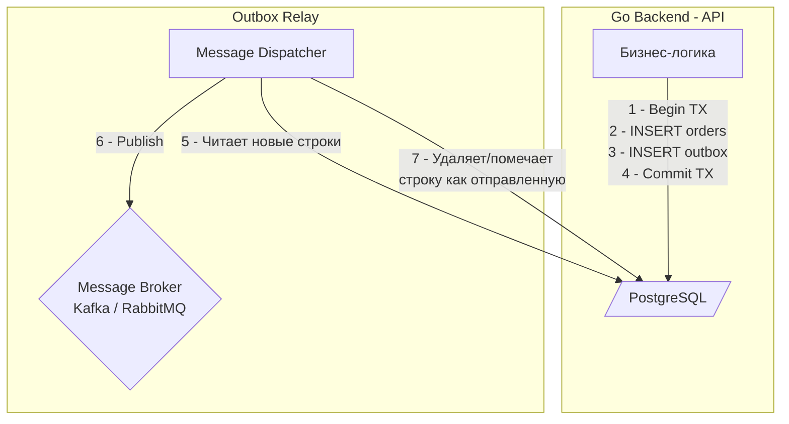

## Проклятие двойной записи (Dual Write)

В статьях [[3. Event Driven Architecture]] и [[5. CQRS и брокеры]] мы выяснили, что асинхронный мир требует от нас рассылать уведомления (события) обо всем, что происходит в системе. Классический сценарий: пользователь создает заказ, мы должны сохранить его в базу данных (PostgreSQL) и отправить событие `OrderCreatedEvent` в брокер сообщений (Kafka или RabbitMQ), чтобы Сервис Склада начал сборку.

Звучит тривиально. Как это пишет джуниор на Go?

```go
func (s *Service) CreateOrder(ctx context.Context, req OrderRequest) error {
	// 1. Начинаем транзакцию в БД
	tx, _ := s.db.BeginTx(ctx, nil)
	
	// 2. Сохраняем бизнес-сущность
	_ = saveOrderToDB(tx, req)
	
	// 3. Отправляем событие в брокер
	err := s.kafka.Publish("orders", req.ToEvent())
	if err != nil {
		tx.Rollback() // Откатываем БД, если брокер недоступен
		return err
	}
	
	// 4. Коммитим БД
	return tx.Commit() 
}
```

> [!warning] Ловушка / Gotcha
> Этот код — бомба замедленного действия. Он падает жертвой проблемы **Dual Write**.
> Что произойдет, если `s.kafka.Publish` отработал успешно (брокер принял сообщение), но на этапе `tx.Commit()` база данных вернула ошибку (например, моргнула сеть, или сработал `UNIQUE` constraint)?
> 
> База данных откатится. Заказа в системе не существует. Но событие `OrderCreatedEvent` **уже улетело в Kafka**. Сервис Склада радостно соберет посылку для заказа, которого нет в базе! Ваша система пришла в абсолютно неконсистентное состояние.

Вы не можете объединить PostgreSQL и Kafka в одну ACID-транзакцию без использования громоздкого протокола 2PC (Two-Phase Commit), который убьет производительность всей системы.

Решение этой фундаментальной проблемы — паттерн **Transactional Outbox (Исходящие сообщения)**.

## Анатомия паттерна Outbox

Суть паттерна гениально проста: мы используем ACID-свойства нашей реляционной базы данных (PostgreSQL/MySQL), чтобы гарантировать атомарность.

Вместо того чтобы писать напрямую в брокер, мы создаем в базе данных дополнительную таблицу — `outbox` (исходящие ящики).

В рамках **одной транзакции** базы данных мы делаем два действия:
1. Записываем изменения бизнес-сущности (таблица `orders`).
2. Записываем само событие (JSON payload) в таблицу `outbox`.

Если транзакция коммитится успешно — у нас есть и заказ, и событие в базе. Если откатывается — нет ни того, ни другого. Атомарность достигнута! 

После этого в игру вступает отдельный асинхронный процесс — **Relay (Релей / Диспетчер)**, который читает таблицу `outbox` и перекладывает события в брокер.



## Идиоматичный Go: Реализация записи (Command Side)

Реализация на стороне API максимально прозрачна. Мы просто пишем в две таблицы в одной транзакции.

```go
package domain

import (
	"context"
	"database/sql"
	"encoding/json"
	"fmt"
	"time"
)

// OutboxMessage - структура для нашей исходящей таблицы
type OutboxMessage struct {
	ID        string
	Topic     string
	Payload   []byte
	CreatedAt time.Time
}

func (s *OrderService) CreateOrder(ctx context.Context, order Order) error {
	tx, err := s.db.BeginTx(ctx, nil)
	if err != nil {
		return err
	}
	defer tx.Rollback()

	// 1. Сохраняем заказ
	_, err = tx.ExecContext(ctx, "INSERT INTO orders (id, total) VALUES ($1, $2)", order.ID, order.Total)
	if err != nil {
		return fmt.Errorf("insert order: %w", err)
	}

	// 2. Формируем событие
	event := map[string]any{"event": "OrderCreated", "order_id": order.ID}
	payload, _ := json.Marshal(event)

	// 3. Сохраняем событие в Outbox
	_, err = tx.ExecContext(ctx, `
		INSERT INTO outbox (id, topic, payload, created_at) 
		VALUES (gen_random_uuid(), 'orders_topic', $1, NOW())
	`, payload)
	if err != nil {
		return fmt.Errorf("insert outbox: %w", err)
	}

	// Атомарный коммит! Если успешно - событие гарантированно отправится.
	return tx.Commit()
}
```

## Механизмы Relay (Доставка из базы в брокер)

Записать в `outbox` — это половина дела. Как теперь эффективно и надежно вытащить данные оттуда и положить в брокер? Есть два основных подхода.

### Подход 1: Polling Publisher (Опрос БД)

Мы запускаем отдельную горутину (или CronJob), которая раз в N миллисекунд делает `SELECT` из таблицы `outbox`.

> [!warning] Ловушка / Gotcha: Блокировки в Polling
> Если вы запустите несколько экземпляров Relay (для отказоустойчивости) и они одновременно сделают `SELECT * FROM outbox WHERE status = 'pending'`, они прочитают одни и те же строки и отправят в Kafka лютые дубликаты.

Чтобы безопасно читать таблицу в несколько потоков, необходимо использовать механизм PostgreSQL **`FOR UPDATE SKIP LOCKED`**. Он блокирует прочитанные строки для других транзакций, а если строка уже заблокирована кем-то другим — просто пропускает её.

```sql
-- Идеальный SQL-запрос для Polling Relay в PostgreSQL
BEGIN;

WITH cte AS (
    SELECT id FROM outbox
    WHERE status = 'pending'
    ORDER BY created_at ASC
    LIMIT 100
    FOR UPDATE SKIP LOCKED -- Магия конкурентного доступа!
)
UPDATE outbox SET status = 'processing'
WHERE id IN (SELECT id FROM cte)
RETURNING id, topic, payload;

-- Отправляем в Kafka (в коде Go)

-- Если Kafka ответила успехом:
DELETE FROM outbox WHERE id IN (...);
COMMIT;
```

*Минусы Polling:* Высокая нагрузка на базу данных из-за постоянных `SELECT` (даже когда сообщений нет). Задержка (Latency) между коммитом заказа и отправкой события равна интервалу поллинга.

### Подход 2: Transaction Log Tailing (CDC) — Индустриальный стандарт

Для HighLoad систем поллинг неприменим. Вместо этого используют **Change Data Capture (CDC)**.

> [!info] Под капотом: Mechanical Sympathy и PostgreSQL WAL
> Как работает CDC на уровне ядра СУБД? Любая современная БД пишет все изменения сначала в Write-Ahead Log (WAL) на диске. Это сверхбыстрый append-only журнал.
> Инструменты CDC (например, **Debezium**, написанный на базе Kafka Connect) подключаются к PostgreSQL по протоколу логической репликации. Debezium притворяется еще одной репликой PostgreSQL! 
> Ядро Postgres само (асинхронно, не блокируя основную транзакцию!) отправляет (Push) поток изменений WAL в Debezium. Debezium парсит этот лог, видит `INSERT` в таблицу `outbox` и мгновенно перекладывает JSON-событие в Kafka.

*Плюсы CDC:*
1. Нулевая нагрузка на CPU и диски базы данных от `SELECT`-ов.
2. Мгновенная доставка (Latency измеряется миллисекундами).
3. Полностью внешний процесс — вашему Go-коду вообще не нужно знать про отправку событий. Вы просто пишете в таблицу `outbox` и забываете.

> [!tip] Собеседование
> **Вопрос:** Если мы используем Debezium (CDC) для паттерна Outbox, гарантирует ли это нам Exactly-once доставку событий в Kafka?
> **Ответ:** Нет! Debezium (и любой CDC) гарантирует семантику **At-least-once**. Если Debezium успешно запишет батч в Kafka, но упадет до того, как закоммитит свой LSN (Log Sequence Number) обратно в PostgreSQL, после рестарта он прочитает тот же кусок WAL снова и отправит дубликаты. Ваш микросервис-консьюмер **обязан** быть идемпотентным (см. [[10. Idempotency в message processing]]).

## Очистка Outbox-таблицы

Таблица `outbox` имеет тенденцию расти бесконечно, превращаясь в "мусорку" уже отправленных событий. Если её не чистить, `INSERT` начнет деградировать из-за роста индексов и распухания таблицы (Table Bloat в Postgres).

Как с этим бороться:
1. **Жесткое удаление (Hard Delete):** Polling Relay делает `DELETE FROM outbox WHERE id = X` сразу после успешного `Publish`.
2. **Фоновый сборщик мусора (Background Cron):** CDC (Debezium) не удаляет строки. Поэтому нужен отдельный фоновый Go-воркер, который раз в час выполняет `DELETE FROM outbox WHERE created_at < NOW() - INTERVAL '1 day'`.
3. **Партицирование:** В сверхнагруженных базах используют Table Partitioning по дням и просто делают `DROP TABLE outbox_2024_05_01` — это освобождает диск мгновенно (Zero I/O operation), в отличие от `DELETE`, который порождает новые записи в WAL.

## Итог

1. **Dual Write** (запись в БД и брокер) без 2PC — антипаттерн, ведущий к потери консистентности.
2. **Outbox Pattern** решает проблему, используя локальную ACID транзакцию реляционной БД для сохранения сущности и события вместе.
3. Доставка в брокер выполняется отдельным процессом (Relay).
4. Простые решения используют **Polling** (обязательно с `FOR UPDATE SKIP LOCKED`).
5. HighLoad архитектуры используют **CDC (Debezium)** для чтения из WAL базы данных без блокировок.

Мы научились безопасно и консистентно *отправлять* сообщения в асинхронный мир, не боясь падения сети или базы. Но на принимающей стороне (у Консьюмера) есть зеркальная проблема: как гарантированно обработать сообщение ровно один раз, если брокер постоянно сыплет дубликатами? Защитный барьер на стороне приема обеспечивает паттерн-побратим, который мы разберем в следующей статье: [[7. Inbox pattern]].