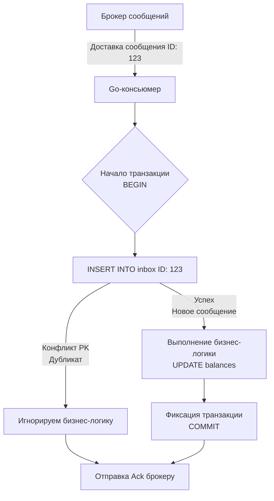

В прошлой статье ([[6. Outbox pattern]]) мы решили фундаментальную проблему на стороне отправителя: как гарантированно сохранить данные в базу и отправить событие в брокер, не став жертвой частичного сбоя (Dual Write). Outbox дает нам железобетонную гарантию **At-least-once доставки** от Продюсера до брокера.

Но как мы помним из статьи [[4. Модели доставки. At most once, at least once, exactly once]], семантика At-least-once означает, что наш Консьюмер неизбежно столкнется с дубликатами. Сеть может оборваться на этапе отправки `Ack`, брокер может пережить failover, или сам Консьюмер может упасть по OOM сразу после записи в БД, но до подтверждения сообщения.

Чтобы не списать деньги с клиента дважды, мы обязаны сделать Консьюмер идемпотентным ([[10. Idempotency в message processing]]). И если Outbox — это меч для надежной отправки, то **Inbox Pattern (Входящие сообщения)** — это наш щит для надежного приема. 

Вместе эти два паттерна формируют "Святой Грааль" распределенных систем: **Effectively-once processing (Эффективная обработка ровно один раз)** на уровне приложения.

## Анатомия паттерна Inbox

Суть паттерна Inbox симметрична паттерну Outbox: мы используем локальные ACID-транзакции реляционной БД (PostgreSQL/MySQL), чтобы атомарно объединить проверку на дубликат и выполнение бизнес-логики.

Вместо того чтобы размазывать логику дедупликации по бизнес-таблицам (добавляя колонки `last_processed_msg_id` к каждому агрегату), мы выделяем специальную инфраструктурную таблицу — `inbox` (входящие ящики).

**Алгоритм работы консьюмера:**
1. Получаем сообщение из брокера (RabbitMQ/Kafka).
2. Открываем транзакцию в БД (`BEGIN`).
3. Пытаемся записать ID сообщения в таблицу `inbox`.
4. **Ветвление:**
   * Если база возвращает ошибку уникальности (Unique Constraint Violation) — это дубликат! Сообщение уже было обработано. Мы прерываем выполнение, делаем `ROLLBACK` транзакции (или просто ничего не делаем, если использовали `ON CONFLICT DO NOTHING`), и самое важное — **возвращаем `Ack` брокеру**, чтобы он отстал от нас.
   * Если запись прошла успешно, мы находимся внутри защищенной транзакции.
5. Выполняем бизнес-логику (например, `UPDATE balances`).
6. Фиксируем транзакцию (`COMMIT`).
7. Отправляем `Ack` брокеру.



> [!info] Под капотом: Mechanical Sympathy и состояния гонки
> Что произойдет, если брокер сойдет с ума и отправит два абсолютно одинаковых сообщения двум разным Go-воркерам *одновременно*? 
> На уровне рантайма Go обе горутины параллельно дойдут до шага `INSERT INTO inbox`. 
> Ядро PostgreSQL при обработке `INSERT` обращается к B-Tree индексу первичного ключа. Первая транзакция, успевшая захватить блокировку строки (Row-level lock) или страницы индекса, запишет значение `123`. 
> Вторая транзакция попытается записать то же значение и **будет заблокирована** на уровне ядра ОС/СУБД, ожидая завершения первой транзакции. Как только первая сделает `COMMIT`, вторая мгновенно "проснется", получит ошибку `duplicate key value violates unique constraint` и безопасно завершит работу. Состояние гонки (Race Condition) математически исключено архитектурой СУБД.

## Идиоматичный Go: Реализация Inbox

Для реализации нам потребуется таблица:
```sql
CREATE TABLE inbox (
    message_id UUID PRIMARY KEY,
    topic VARCHAR(255) NOT NULL,
    processed_at TIMESTAMP WITH TIME ZONE DEFAULT NOW()
);
```

Код на Go должен строго соблюдать границы транзакции и правильно обрабатывать конфликты. Мы будем использовать конструкцию `ON CONFLICT DO NOTHING`, которая позволяет избежать "грязных" ошибок транзакции и элегантно обработать дубликат.

```go
package consumer

import (
	"context"
	"database/sql"
	"fmt"
)

// Message - абстрактное входящее сообщение
type Message struct {
	ID      string
	Topic   string
	Payload []byte
}

type OrderProcessor struct {
	db *sql.DB
}

// ProcessMessage вызывается воркер-пулом на каждое сообщение
func (p *OrderProcessor) ProcessMessage(ctx context.Context, msg Message) error {
	tx, err := p.db.BeginTx(ctx, nil)
	if err != nil {
		return fmt.Errorf("begin tx: %w", err)
	}
	// Гарантируем откат в случае паники или ошибки
	defer tx.Rollback() 

	// 1. Атомарная проверка Inbox (Дедупликация)
	// RETURNING message_id вернет значение только если произошел реальный INSERT
	var insertedID string
	err = tx.QueryRowContext(ctx, `
		INSERT INTO inbox (message_id, topic) 
		VALUES ($1, $2) 
		ON CONFLICT (message_id) DO NOTHING 
		RETURNING message_id
	`, msg.ID, msg.Topic).Scan(&insertedID)

	if err != nil {
		if err == sql.ErrNoRows {
			// Это дубликат! Строка не была вставлена.
			// Возвращаем nil, чтобы консьюмер сделал msg.Ack() и удалил его из брокера
			return nil 
		}
		return fmt.Errorf("inbox check failed: %w", err)
	}

	// 2. Выполнение бизнес-логики (безопасно, мы знаем, что мы первые)
	err = p.applyBusinessLogic(ctx, tx, msg.Payload)
	if err != nil {
		// Ошибка бизнес-логики (например, нет денег на счету)
		// Возвращаем ошибку. Консьюмер сделает Nack/DLQ.
		return fmt.Errorf("business logic failed: %w", err)
	}

	// 3. Коммит транзакции
	if err := tx.Commit(); err != nil {
		return fmt.Errorf("commit tx: %w", err)
	}

	return nil
}

func (p *OrderProcessor) applyBusinessLogic(ctx context.Context, tx *sql.Tx, payload []byte) error {
	// Здесь выполняются UPDATE/INSERT бизнес-сущностей, 
	// строго используя переданный *sql.Tx
	return nil
}
```

> [!warning] Ловушка / Gotcha: Чужой `Tx`
> Классическая ошибка Middle-разработчиков: передать внутрь `applyBusinessLogic` не саму транзакцию `tx`, а пул соединений `p.db` (или случайно использовать его внутри). В этом случае `INSERT` в `inbox` и бизнес-апдейты произойдут в **разных** транзакциях. Если бизнес-апдейт упадет, `inbox` может остаться закоммиченным (или наоборот), навсегда "отравив" это сообщение (оно будет считаться обработанным, хотя бизнес-логика не выполнилась). В Go всегда явно пробрасывайте `*sql.Tx` по стеку вызовов!

## Архитектурные нюансы Inbox

### 1. Переполнение таблицы Inbox (Table Bloat)
Таблица `inbox` растет на каждую успешно обработанную транзакцию. В HighLoad системах она будет пухнуть на миллионы записей в день. Поскольку нам нужны эти данные только для защиты от дубликатов на коротком интервале времени (пока брокер не получит `Ack`), хранить их вечно не нужно.

Решения:
* **Background Cleanup:** Фоновый процесс (CronJob) на Go, который делает `DELETE FROM inbox WHERE processed_at < NOW() - INTERVAL '7 days'`. 
* **Time-To-Live (TTL) в БД:** Некоторые БД поддерживают TTL из коробки. В PostgreSQL это обычно решается через Table Partitioning (партиции по дням) и жесткий `DROP TABLE` старых партиций.

### 2. Масштабирование: Вынос Inbox в Redis
Если нагрузка на чтение/запись настолько высока, что PostgreSQL становится узким местом, разработчики часто пытаются вынести Inbox в Redis (используя команду `SETNX`).

**Почему это опасно?**
Как только вы выносите Inbox из той же БД, где лежат ваши бизнес-данные (PostgreSQL), вы теряете ACID транзакцию. 
1. Сделали `SETNX` в Redis (успех).
2. Делаем `UPDATE` в Postgres $\rightarrow$ Ошибка сети.
3. Сообщение возвращается в очередь брокера.
4. При повторной попытке Redis скажет "Дубликат!", и сообщение будет отброшено. Деньги не спишутся, статус заказа "зависнет".

Выносить Inbox в Redis можно **только** для тех сервисов, которые не имеют локальной транзакционной базы (например, сервис отправки Email или генерации метрик). Для финтеха, e-commerce и работы со стейтом — Inbox должен жить строго в той же СУБД, что и бизнес-таблицы.

### 3. Middleware подход в Go
В крупных проектах логика Inbox выносится на уровень инфраструктурного кода. Вы можете написать декоратор (Middleware) для ваших консьюмеров, который принимает интерфейс обработчика, сам открывает транзакцию, проверяет Inbox, вызывает обработчик, передавая ему `*sql.Tx`, и сам делает коммит. Это избавляет разработчиков продуктовых команд от написания инфраструктурного бойлерплейта в каждом хендлере.

## Итог

1. **Inbox Pattern** — это механизм дедупликации сообщений на стороне потребителя с использованием локальной транзакции базы данных.
2. Связка **Outbox (на стороне отправки) + Inbox (на стороне приема)** гарантирует, что бизнес-событие будет доставлено и обработано **Effectively-once**, несмотря на любые сбои сети, брокера или подов Kubernetes.
3. В Go реализация требует строгого контроля за объектом `*sql.Tx` и правильной обработки ошибок (особенно маскировки ошибки уникальности, чтобы позволить консьюмеру сделать `Ack`).

Теперь, когда наши сервисы могут надежно общаться друг с другом без потери данных и дубликатов, мы готовы решать главную проблему распределенных микросервисов: как реализовать длинную транзакцию (например, оплатить $\rightarrow$ зарезервировать склад $\rightarrow$ отправить товар), которая затрагивает несколько независимых баз данных? На помощь приходит паттерн распределенных транзакций, который мы детально разберем в следующей статье: [[8. Saga через брокеры]].