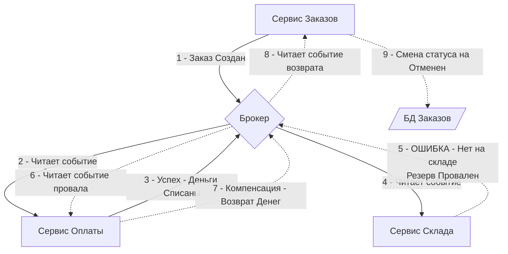

Распределенные системы разрушают самую удобную абстракцию, к которой привыкли бэкенд-разработчики — транзакционность (ACID). 

В монолите с единой базой данных (например, PostgreSQL) процесс оформления заказа выглядит тривиально: вы открываете транзакцию `BEGIN`, списываете деньги со счета пользователя, резервируете товар на складе, меняете статус заказа и делаете `COMMIT`. Если на любом из этапов происходит ошибка (нет денег, нет товара, моргнула сеть), вы вызываете `ROLLBACK`, и база данных гарантированно откатывает все изменения. Система остается в абсолютно консистентном состоянии.

При переходе на микросервисную архитектуру данные размазываются по независимым базам данных. Вы больше не можете сделать один `COMMIT` для `Сервиса Оплаты` и `Сервиса Склада`. Попытки решить эту проблему через протоколы двухфазного коммита (2PC) провалились в HighLoad-индустрии из-за колоссальных блокировок, взаимных дедлоков и деградации пропускной способности.

Для решения проблемы распределенных бизнес-транзакций был создан паттерн **Saga**. В этой статье мы разберем классическую реализацию Саги на базе брокеров сообщений (Choreography), её влияние на рантайм Go и фундаментальные уязвимости.

## Что такое Saga?

**Saga** — это цепочка локальных транзакций. Каждый микросервис в рамках Саги выполняет свою собственную локальную ACID-транзакцию в своей базе данных и публикует событие в брокер (Kafka/RabbitMQ). Это событие запускает следующую локальную транзакцию в следующем микросервисе.

Главное отличие Саги от ACID-транзакции: **если один из шагов завершается ошибкой, Сага запускает компенсирующие транзакции (Compensating Transactions) в обратном порядке**, чтобы отменить работу, сделанную на предыдущих шагах.

### Прямой ход и Компенсация

Представьте покупку билета:
1. `Заказ`: Создать заказ в статусе PENDING (Локальная транзакция 1).
2. `Оплата`: Списать деньги (Локальная транзакция 2).
3. `Склад`: Зарезервировать билет (Локальная транзакция 3 — **ОШИБКА, билетов нет**).

Поскольку протокола 2PC нет, деньги в шаге 2 *уже физически списаны*, и транзакция в базе `Сервиса Оплаты` уже закоммичена.
Запускается фаза компенсации:
4. `Оплата`: **Вернуть деньги** (Компенсирующая транзакция 2).
5. `Заказ`: Перевести заказ в статус CANCELED (Компенсирующая транзакция 1).

## Сага через Хореографию (Choreography)

В хореографической Саге нет единого центра управления (Оркестратора). Сервисы не вызывают друг друга напрямую. Они просто слушают события из брокера и реагируют на них. Это развитие идей Event-Driven Architecture.



> [!info] Под капотом: Mechanical Sympathy хореографии
> Почему хореография позволяет держать огромный RPS? 
> Если бы мы использовали синхронный HTTP/gRPC для Саги, горутина в `Сервисе Заказов` висела бы в `netpoll`, ожидая ответа от Оплаты и Склада. При задержке на Складе в 5 секунд, у вас скопились бы тысячи запаркованных структур `g`, исчерпав память и пул TCP-соединений.
> 
> В хореографической Саге `Сервис Заказов` делает `INSERT` в свою БД (со статус PENDING), публикует событие в брокер (через паттерн [[6. Outbox pattern]]) и **мгновенно завершает HTTP-запрос (HTTP 202 Accepted)**. Горутина освобождается за 5 миллисекунд. Процессорные потоки (`m`) возвращаются в пул рантайма Go. Ожидание результата происходит "вне процессора" — в дисковых логах брокера сообщений.

## Анатомия Изоляции (Чего лишена Saga)

Свойства ACID состоят из Атомарности, Консистентности, Изоляции и Долговечности. Сага обеспечивает Атомарность (в конечном счете) и Долговечность. **Но Сага полностью лишена Изоляции (Isolation).**

Это означает, что другие транзакции (или пользователи) могут видеть промежуточные состояния Саги до ее завершения. Это классическая аномалия **Dirty Read (Грязное чтение)**.

Если `Сервис Оплаты` списал деньги, но `Сервис Склада` еще не ответил, баланс пользователя в базе данных *уже уменьшился*. Если пользователь в эту секунду запросит свой баланс, он увидит списание, хотя Сага может откатиться через пару секунд!

### Семантические блокировки (Semantic Locks)
Чтобы бороться с отсутствием изоляции, в паттерне Сага применяют семантические блокировки. Вместо того чтобы сразу удалять/списывать ресурс, мы меняем его статус, показывая системе, что ресурс "заблокирован" текущим бизнес-процессом.

Вместо `UPDATE balance = balance - 100`:
Мы добавляем таблицу `holds` (холдирование средств).
Баланс пользователя делится на `available_balance` и `held_balance`. До успешного завершения всей Саги деньги лежат в `held_balance`.

## Практика на Go: Обработка компенсаций

Писать код для хореографической Саги сложно, потому что ваш микросервис превращается в набор разрозненных Event Handlers. 

Главное инженерное правило Саги: **Компенсирующие транзакции не имеют права на фатальную ошибку.**
Если обычная транзакция может упасть (нет денег), то компенсация (возврат денег) обязана завершиться успешно. Если база данных легла — компенсация должна ретраиться до бесконечности (Exponential Backoff). 

```go
package saga

import (
	"context"
	"database/sql"
	"fmt"
)

// Обработчик события провала из брокера (Склад ответил отказом)
func (h *PaymentHandler) HandleInventoryFailed(ctx context.Context, event InventoryFailedEvent) error {
	// 1. Дедупликация (Idempotency) КРИТИЧЕСКИ ВАЖНА для компенсаций!
	// Если мы применим компенсацию дважды, мы начислим клиенту лишние деньги.
	// Подробнее в статье [[10. Idempotency в message processing]]
	
	tx, err := h.db.BeginTx(ctx, nil)
	if err != nil {
		return fmt.Errorf("begin tx: %w", err)
	}
	defer tx.Rollback()

	// 2. Выполняем компенсирующую логику (освобождаем холд)
	// Важно: мы не делаем UPDATE balance = balance + X слепо. 
	// Мы ищем конкретную транзакцию Саги по SagaID.
	res, err := tx.ExecContext(ctx, `
		UPDATE payments 
		SET status = 'REFUNDED' 
		WHERE saga_id = $1 AND status = 'COMPLETED'
	`, event.SagaID)
	if err != nil {
		return fmt.Errorf("refund payment: %w", err) // Транзиентная ошибка (сеть/БД), брокер сделает ретрай
	}

	rows, _ := res.RowsAffected()
	if rows == 0 {
		// Ловушка: Компенсация пришла раньше или дубликат.
		h.logger.Warn("Refund target not found or already refunded", "saga_id", event.SagaID)
		return nil // Ack брокеру, чтобы не зациклить
	}

	// 3. Отправляем событие о том, что компенсация успешна (Outbox Pattern)
	outboxEvent := PaymentRefundedEvent{SagaID: event.SagaID}
	_ = h.outbox.SaveWithinTx(ctx, tx, "payments", outboxEvent)

	return tx.Commit()
}
```

> [!warning] Ловушка / Gotcha: Event Hell
> В хореографической Саге нет места, где можно посмотреть статус всего бизнес-процесса "Оформление заказа". Логика размазана по коду 5-10 микросервисов. 
> Если бизнес приходит к вам и спрашивает: *"Почему заказ №123 завис?"*, вам придется вручную прочесывать логи в Kibana/Grafana по `SagaID` (Trace ID), чтобы понять, какой сервис не отправил ответное событие. 
> Кроме того, появляются циклические зависимости: Сервис A слушает Сервис B, который слушает Сервис C, который слушает Сервис A. При добавлении нового шага в процесс (например, "Начислить бонусные баллы") вам придется менять код во множестве существующих сервисов.

> [!tip] Собеседование
> **Вопрос:** Что делать, если компенсирующая транзакция содержит ошибку в коде (например, NullPointerException) и падает при каждом ретрае?
> **Ответ:** Это худший кошмар Саги. Если компенсация попала в Dead Letter Queue (DLQ), система осталась в неконсистентном состоянии навсегда (деньги списаны, билета нет). 
> Это нельзя решить автоматически. Необходимо настраивать Critical Alerts на DLQ для компенсирующих топиков. Дежурный инженер (SRE) должен вручную поправить состояние в базе данных или выкатить хотфикс кода и перепрогнать события из DLQ. Именно поэтому код компенсаций должен быть предельно простым и покрыт тестами на 100%.

## Итог

1. **Saga** — это единственный масштабируемый паттерн для реализации распределенных транзакций в микросервисах.
2. Вместо `ROLLBACK` используются **Компенсирующие транзакции**, отменяющие эффект предыдущих действий.
3. **Choreography (Хореография)** реализует Сагу через брокеры сообщений (Pub/Sub). Сервисы максимально независимы друг от друга.
4. Отсутствие ACID-изоляции заставляет нас проектировать базы данных с использованием семантических блокировок (статусы PENDING, холдирование).
5. Главный минус Хореографии — **невидимость процесса**.

Хореография отлично работает, когда в бизнес-процессе 2-3 участника (шага). Но когда процесс становится сложным (например, выдача ипотеки, включающая 15 микросервисов, ветвления `if-else` и таймауты ожидания ответа от пользователя), управление через брокеры превращается в неуправляемый хаос. 

Для сложных Саг индустрия использует принципиально иной подход — вынесение логики процесса в единый центр. В следующей статье мы разберем противостояние подходов и выясним, когда пора отказываться от хореографии: [[9. Message choreography vs orchestration]].