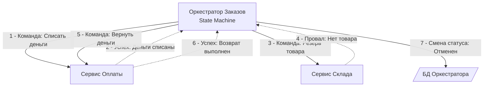

В прошлой статье ([[8. Saga через брокеры]]) мы реализовали распределенную бизнес-транзакцию, опираясь на паттерн **Хореографии (Choreography)**. Микросервисы общались друг с другом исключительно через публикацию событий в брокер, не зная о существовании друг друга. 

Это прекрасно работает для простых процессов (2-3 шага). Но когда ваш бизнес-процесс превращается в многоэтапный флоу — например, выдача ипотеки с 15 шагами, ветвлениями, таймаутами на ожидание сканов документов от пользователя и сложными компенсациями — хореография превращается в неуправляемый хаос, известный как **Event Hell (Событийный ад)**.

В этой статье мы поставим точку в архитектурных паттернах очередей, столкнув лбами Хореографию и **Оркестрацию (Orchestration)**. Мы разберем физическую цену каждого подхода и поймем, когда децентрализация начинает вредить.

## Суть Оркестрации

В **Оркестрации** появляется выделенный микросервис — **Оркестратор (Оркестратор Саги / Process Manager)**. 

Оркестратор играет роль дирижера. Он знает *весь* бизнес-процесс от начала до конца. Вместо того чтобы сервисы реагировали на факты друг друга, Оркестратор явно отсылает им **Команды** (через паттерн Request-Reply) и ждет от них **События-Ответы** об успехе или провале.



В этой модели Сервис Оплаты и Сервис Склада становятся предельно "тупыми" воркерами. Они понятия не имеют, в каком контексте их вызывают. Им пришла команда — они сделали работу — отчитались. 

## Mechanical Sympathy: Цена централизации

Переход от Хореографии к Оркестрации радикально меняет профиль нагрузки на железо и сеть.

### 1. Сетевые прыжки (Network Hops) и Latency
* **Хореография:** `Оплата` публикует событие $\rightarrow$ Брокер $\rightarrow$ `Склад` читает. **(1 сетевой прыжок через брокер)**.
* **Оркестрация:** `Оплата` завершила работу $\rightarrow$ Публикует ответ в Брокер $\rightarrow$ `Оркестратор` читает ответ $\rightarrow$ Сохраняет стейт в БД $\rightarrow$ Публикует команду в Брокер $\rightarrow$ `Склад` читает. **(2 сетевых прыжка + 1 I/O БД)**.

Оркестрация всегда увеличивает задержку бизнес-процесса (End-to-End Latency).

### 2. Узкое место БД (Database Bottleneck)
Оркестратор — это конечный автомат (State Machine). Чтобы пережить падение собственного пода в Kubernetes, Оркестратор обязан сохранять состояние бизнес-процесса (какой шаг сейчас выполняется) в свою базу данных *при каждом переходе*.
Если ваш процесс состоит из 10 шагов, Оркестратор сделает 10 транзакционных `UPDATE` в свою БД (обычно PostgreSQL). На 10 000 заказов в секунду это 100 000 `UPDATE`/sec — колоссальная нагрузка на дисковую подсистему и кэши (Buffer Pool) одного конкретного сервера БД. 

> [!warning] Ловушка / Gotcha: Бог-Монолит (God Service)
> Со временем Оркестратор имеет тенденцию втягивать в себя не только управление потоком (Control Flow), но и саму бизнес-логику. Разработчикам становится лень выносить логику в отдельные сервисы, и они пишут её прямо в обработчиках Оркестратора. Ваш элегантный микросервисный кландшафт превращается в **Распределенный Монолит**, где Оркестратор становится единой точкой отказа (SPOF) и узким местом разработки (Bottle-neck).

## Идиоматичный Go: Как выглядит Оркестратор под капотом

Реализация Оркестратора на Go — это классический паттерн **State Machine (Конечный автомат)**. Состояние Саги должно быть надежно персистировано.

Для связи мы используем брокер. Оркестратор публикует команды, используя паттерн [[6. Outbox pattern]], чтобы гарантировать атомарность смены состояния и отправки команды.

```go
package orchestrator

import (
	"context"
	"database/sql"
	"fmt"
)

// Состояния нашего бизнес-процесса
const (
	StatePending         = "PENDING"
	StateAwaitingPayment = "AWAITING_PAYMENT"
	StateAwaitingStock   = "AWAITING_STOCK"
	StateCompleted       = "COMPLETED"
	StateCompensating    = "COMPENSATING"
	StateFailed          = "FAILED"
)

type OrderSaga struct {
	OrderID string
	State   string
}

// Обработчик ответа от Сервиса Оплаты
func (o *Orchestrator) HandlePaymentResult(ctx context.Context, msg PaymentResultMessage) error {
	tx, _ := o.db.BeginTx(ctx, nil)
	defer tx.Rollback()

	// 1. Блокируем стейт Саги для обновления (защита от гонок при конкурентных ответах)
	var saga OrderSaga
	err := tx.QueryRow(`SELECT order_id, state FROM sagas WHERE order_id = $1 FOR UPDATE`, msg.OrderID).Scan(&saga.OrderID, &saga.State)
	if err != nil {
		return err // Обработка ошибок БД
	}

	// 2. State Machine Logic
	if saga.State != StateAwaitingPayment {
		// Идемпотентность! Либо дубликат ответа, либо нарушен порядок.
		return nil 
	}

	if msg.Success {
		// Успех -> Переходим к следующему шагу
		_, _ = tx.Exec(`UPDATE sagas SET state = $1 WHERE order_id = $2`, StateAwaitingStock, saga.OrderID)
		
		// Отправляем команду складу через Outbox
		o.outbox.Save(tx, "inventory.commands", ReserveCommand{OrderID: saga.OrderID})
	} else {
		// Провал -> Переходим в статус провала (компенсировать пока нечего, так как оплата не прошла)
		_, _ = tx.Exec(`UPDATE sagas SET state = $1 WHERE order_id = $2`, StateFailed, saga.OrderID)
	}

	return tx.Commit()
}
```

> [!info] Под капотом: Таймауты и зависания
> В Хореографии, если сервис умер, процесс просто зависает навечно. В Оркестрации мы можем (и обязаны) управлять таймаутами. 
> Рантайм Go не может держать `time.After` на месяц ожидания. Для долгоживущих процессов (Long-Running Processes) Оркестратор использует планировщики задач (например, отдельную таблицу `timeouts` в БД). Фоновый Go-воркер периодически сканирует её: *"Так, Сага №123 висит в статусе AWAITING_STOCK уже 10 минут. Вызываем компенсацию!"*.

## Битва подходов: Хореография vs Оркестрация

Не существует "правильного" ответа. Выбор зависит от сложности домена.

| Критерий | Хореография (События) | Оркестрация (Команды) |
| :--- | :--- | :--- |
| **Связность (Coupling)** | Минимальная. Сервисы не знают друг друга. | Высокая. Оркестратор знает контракты всех воркеров. |
| **Наблюдаемость** | Низкая. Нужно собирать трейсы по всем сервисам. | Идеальная. Текущий статус всегда лежит в БД Оркестратора. |
| **Управление ошибками** | Сложное. Компенсации размазаны по системе. | Простое. Логика отката описана в одном месте. |
| **Узкое место (Bottleneck)**| Брокер сообщений. | База данных Оркестратора. |
| **Подходит для...** | Простых процессов (до 3-4 шагов), интеграции независимых доменов. | Сложных процессов (много шагов, таймауты, ветвления `if-else`). |

> [!tip] Собеседование
> **Вопрос:** Можем ли мы смешивать Хореографию и Оркестрацию в одном проекте?
> **Ответ:** Да, это **Индустриальный стандарт**. Правило звучит так: используйте Оркестрацию *внутри* ограниченного контекста (Bounded Context), где вам нужен строгий контроль над бизнес-транзакцией (например, процесс "Сборка корзины и Оплата"). Но для оповещения других контекстов (например, "Маркетинг" или "Аналитика") используйте Хореографию (Pub/Sub из [[1. Pub Sub]]). Оркестратор завершит свою Сагу и просто выстрелит финальным `OrderCompletedEvent` для всех остальных.

## Итог раздела "Паттерны и архитектура"

Мы прошли огромный путь:
1. Выяснили, как развязывать сервисы через **Pub/Sub** и балансировать нагрузку через **Work Queue**.
2. Перешли к реактивной парадигме **Event Driven Architecture** и узнали её главную уязвимость — Dual Write.
3. Разобрали **Event Sourcing** как радикальный способ хранения стейта и **CQRS** для разделения нагрузки чтения и записи.
4. Научились безопасно взаимодействовать с брокерами с помощью **Outbox** и **Inbox** паттернов.
5. И, наконец, связали микросервисы в единые бизнес-процессы через **Saga (Хореография и Оркестрация)**.

Но писать кастомный Оркестратор на Go (с конечными автоматами, таблицами стейта, таймерами, поллингом и обработкой ретраев) — это изобретение велосипеда, которое отнимет у команды месяцы работы. 

Индустрия давно поняла эту боль. Существуют специализированные движки, которые берут на себя всю грязную работу по управлению распределенным состоянием, позволяя вам писать распределенные Саги так же просто, как локальный синхронный код на Go. В следующем разделе мы переходим к тяжелой артиллерии. Добро пожаловать в мир движков оркестрации: [[1. Что такое workflow orchestration]].