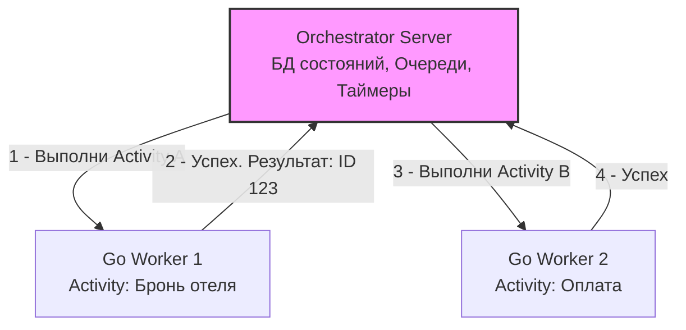

До сих пор мы рассматривали асинхронное взаимодействие микросервисов через очереди и брокеры сообщений (RabbitMQ, Kafka, NATS). Брокеры отлично справляются с доставкой событий (Event-Driven Architecture) и балансировкой нагрузки (Work Queues). 

Но когда мы начинаем строить сложные, многошаговые бизнес-процессы поверх очередей, мы сталкиваемся с фундаментальной проблемой распределенных систем — **управлением состоянием длительных транзакций**. 

В этом разделе мы переходим от паттернов передачи сообщений к **Оркестрации процессов (Workflow Orchestration)**.

## Проблема распределенной транзакции

Представьте классический процесс бронирования тура (Booking):
1. Забронировать авиабилет.
2. Забронировать отель.
3. Списать деньги с карты клиента.

В монолите это решается локальной ACID-транзакцией в PostgreSQL. В микросервисной архитектуре это три разных сервиса и три разных базы данных. Если на шаге 3 (списание денег) происходит отказ — у клиента нет денег, банк отклонил операцию. Что делать с уже забронированными билетом и отелем? Их нужно отменить (выполнить компенсирующие транзакции).

Если реализовывать эту логику на голых очередях сообщений (через паттерны хореографии, которые мы частично упоминали в [[8. Saga через брокеры]] и подробно разберем в [[4. Оркестрация vs хореография]]), ваша архитектура быстро превратится во "флиппер" (Pinball Architecture). Сообщения летают между сервисами, логика размазана по десяткам консьюмеров, и ни один разработчик не может, взглянув в код, сказать: *"А как вообще работает процесс бронирования от начала и до конца?"*

## Что такое Workflow Orchestration?

**Workflow Orchestration (Оркестрация рабочих процессов)** — это архитектурный паттерн и класс инфраструктурного ПО, который позволяет описывать сложные бизнес-процессы как единый, централизованный поток управления (код или конфигурацию), устойчивый к любым сбоям инфраструктуры.

Вместо того чтобы сервисы реагировали на события друг друга в хаотичном порядке, появляется **Оркестратор (Orchestrator)** — центральный дирижер, который говорит: 
- *"Сервис Авиабилетов, выполни бронь"*. 
- Дожидается ответа. 
- *"Сервис Отелей, твоя очередь"*.

### Главная суперсила: Durable Execution (Надежное выполнение)

Ключевая концепция современных оркестраторов (таких как Temporal, о котором мы будем говорить детально) — это **Durable Execution**.

В обычном Go-приложении, если вы запустили функцию и в середине её выполнения сервер выдернули из розетки или процесс был убит OOM-киллером, состояние функции (локальные переменные, стек вызовов) исчезнет навсегда. 

Системы оркестрации создают иллюзию того, что **ваша Go-функция работает вечно и не может упасть из-за сбоя железа**. Вы можете написать `time.Sleep(30 * 24 * time.Hour)` прямо в коде, сервер может перезагружаться сотни раз за этот месяц, кластер Kubernetes может переехать в другой дата-центр, но ровно через 30 дней ваша функция проснется на новом узле и продолжит выполнение со следующей строчки кода, сохранив значения всех переменных.

> [!info] Под капотом: Event Sourcing и Replay
> Как достигается эта "магия" бессмертных функций? Через паттерн Event Sourcing (Порождение событий).
> Оркестратор не делает дамп оперативной памяти вашего Go-процесса. Вместо этого он записывает в свою надежную базу данных (обычно PostgreSQL или Cassandra) **каждое действие**, которое совершает ваш Workflow (запуск таймера, вызов внешнего сервиса).
> 
> Когда Go-воркер падает и перезапускается, оркестратор отправляет ему эту историю событий. Воркер запускает вашу функцию с самого начала, но при вызове уже выполненных шагов он не делает реальных сетевых запросов, а берет готовые результаты из истории. Этот процесс называется **Replay (Воспроизведение)**. Функция "перематывается" до того места, где она упала, и продолжает работу.

## Основные компоненты оркестратора

Современный оркестратор всегда состоит из двух частей:

1. **Сервер оркестрации (Control Plane):** Кластер, хранящий состояние процессов, историю событий, таймеры и очереди задач. Он сам ничего не вычисляет и не выполняет бизнес-логику.
2. **Workers (Data Plane):** Ваши Go-приложения (воркеры). Они подключаются к серверу оркестратора (обычно по gRPC), запрашивают задачи, выполняют ваш код и возвращают результат серверу.

## Разделение логики: Workflow и Activity

Чтобы механизм Replay работал корректно, код в оркестраторах строго делится на два типа:

### 1. Workflow (Оркестратор)
Это код, который описывает **порядок** действий. Здесь находятся `if`, `for`, `switch` и вызовы `Sleep`. 
* **Правило:** Код Workflow должен быть 100% идемпотентным и детерминированным. Он не имеет права ходить в сеть, писать в БД или трогать файловую систему.

### 2. Activity (Действие)
Это полезная бизнес-нагрузка. Поход в REST API, SQL-запрос, генерация PDF, отправка email.
* **Механика:** Activity может падать, таймаутить и ретраиться. Сервер оркестратора гарантирует, что Activity будет выполнена (согласно настроенным политикам retry), и только после успешного завершения результат будет записан в историю и передан в Workflow.

## Mechanical Sympathy: Накладные расходы

Никакая абстракция не дается бесплатно. За "бессмертные" функции приходится платить интенсивным вводом-выводом (IO).

Когда ваш Workflow вызывает Activity, происходит следующее:
1. Go-воркер сериализует аргументы и по gRPC отправляет команду серверу: *"Запланируй Activity X"*.
2. Сервер открывает транзакцию в БД, пишет событие `ActivityTaskScheduled`, коммитит, кладет задачу во внутреннюю очередь.
3. Сервер отдает задачу свободному Go-воркеру (возможно, другому инстансу).
4. Воркер выполняет HTTP-запрос (например, к платежному шлюзу).
5. Воркер сериализует ответ и по gRPC шлет серверу: *"Activity X завершена, вот результат"*.
6. Сервер открывает транзакцию, пишет событие `ActivityTaskCompleted`, коммитит.
7. Сервер будит Workflow-воркер, чтобы тот продолжил работу.

На один простой вызов стороннего API оркестратор генерирует несколько сетевых прыжков (gRPC) и несколько синхронных записей в дисковую БД. 
Поэтому **Оркестраторы не подходят для High-Frequency Trading или систем реального времени**. Их стихия — надежность, а не микросекундные задержки.

> [!warning] Ловушка / Gotcha: Детерминизм в Go
> Самая частая причина падения распределенных процессов (Non-Deterministic Error) при написании на Go — нарушение правила детерминизма внутри кода Workflow.
> Так как Workflow может быть перезапущен (Replay) на другом сервере через день после падения, он должен, получая те же входные данные из истории, идти ровно по тем же веткам `if/else`.
> 
> **В коде Workflow СТРОГО ЗАПРЕЩЕНО:**
> * Вызывать `time.Now()` (нужно использовать специальный `workflow.Now(ctx)`).
> * Генерировать случайные числа через `rand.Int()` или UUID.
> * Использовать нативные горутины `go func()` (планировщик оркестратора должен контролировать все потоки выполнения, используются `workflow.Go`).
> * Итерироваться по стандартным мапам Go (`range map`), так как порядок ключей в Go рандомизирован при каждом запуске!

> [!tip] Собеседование
> **Вопрос:** Мы пишем сервис создания отчетов. Отчет генерируется 10 часов. Как вы спроектируете отказоустойчивость?
> **Ответ:** Использовать брокеры очередей (RabbitMQ/Kafka) здесь опасно, так как мы упремся в таймауты доставки (Ack timeouts). Здесь идеально подходит Workflow Orchestration. Мы запускаем Workflow, который вызывает Activity генерации отчета. Оркестратор "замораживает" состояние Workflow на эти 10 часов. Если сервер с Activity упадет на 9-м часе, оркестратор, согласно настроенной `RetryPolicy`, просто перекинет эту задачу на другой воркер, а Workflow продолжит дожидаться результата, не потребляя процессорное время.

## Итог

1. **Workflow Orchestration** решает проблему управления состоянием и обработки ошибок (компенсаций) в распределенных системах и микросервисах.
2. Вместо хаоса событий (хореографии) мы получаем строгий, читаемый в коде процесс (оркестрацию).
3. **Durable Execution** обеспечивает "бессмертие" кода за счет паттерна Event Sourcing и воспроизведения истории (Replay) при падениях.
4. **Ограничения:** Код Workflow должен быть абсолютно детерминированным. За надежность мы платим накладными расходами на БД-транзакции и gRPC-вызовы под капотом оркестратора.

Поняв фундамент надежного выполнения, мы можем переходить к изучению индустриального стандарта в мире Go — оркестратору Temporal. В следующей статье мы разберем его устройство "под капотом": [[2. Temporal. Архитектура и концепции]].