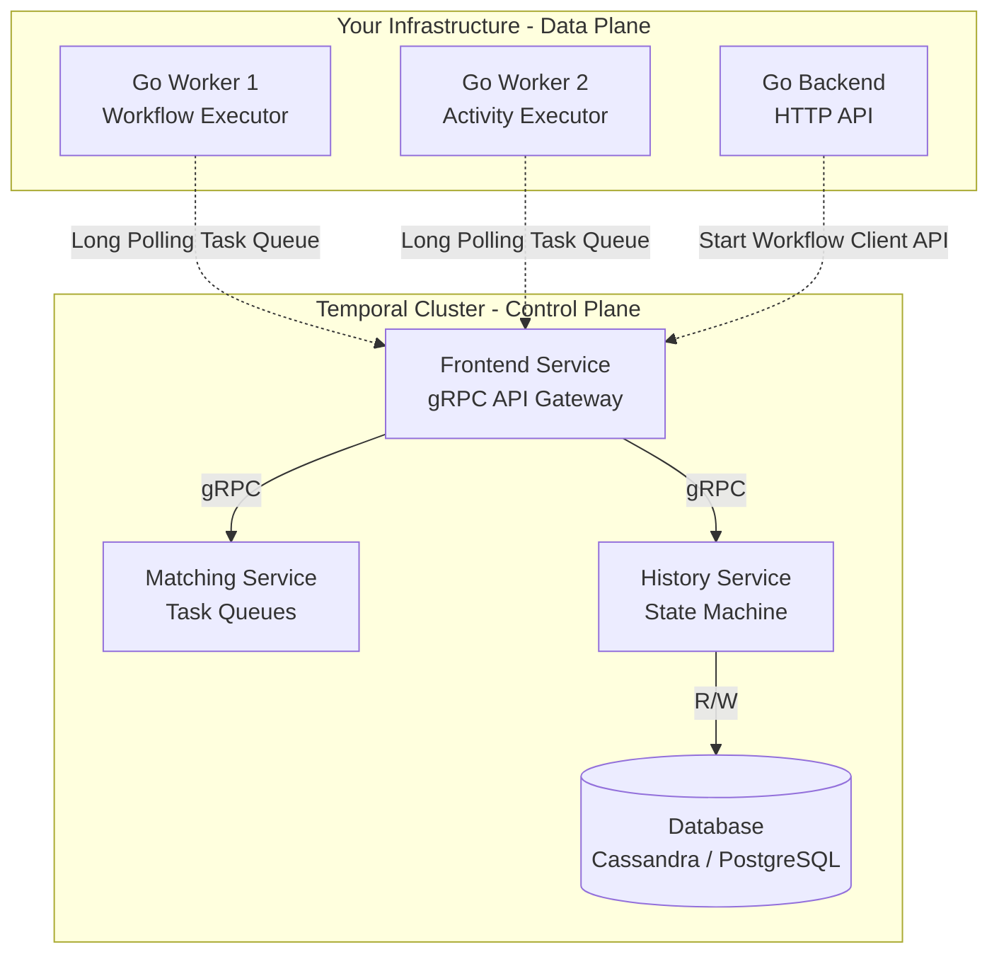

В прошлой статье [[1. Что такое workflow orchestration]] мы разобрали фундаментальную проблему распределенных транзакций и выяснили, как паттерн Event Sourcing позволяет создавать "бессмертные" функции (Durable Execution). 

Теперь мы переходим к изучению **Temporal** — индустриального стандарта оркестрации, написанного на Go (изначально созданного в недрах Uber под названием Cadence, а затем выделившегося в отдельный open-source проект).

Чтобы писать эффективный и надежный код под Temporal, необходимо четко понимать его архитектуру: кто и где выполняет код, как компоненты общаются между собой и почему Temporal не падает при перезагрузке серверов.

## Разделение Control Plane и Data Plane

Главное заблуждение новичков: *"Temporal Server будет запускать мой Go-код"*. 
**Это не так.** Temporal реализует строгую изоляцию между инфраструктурой (Control Plane) и бизнес-логикой (Data Plane).

### 1. Temporal Cluster (Control Plane)
Это серверная часть, которую вы разворачиваете в Kubernetes или используете как SaaS (Temporal Cloud). Кластер **ничего не знает о вашем коде**, не загружает ваши бинарники и не исполняет бизнес-логику. Его задача — хранить состояние, управлять очередями (Task Queues) и обеспечивать надежность таймеров.

Кластер состоит из 4 ключевых микросервисов:
* **Frontend Service:** Входной шлюз. Принимает все gRPC-вызовы от воркеров и клиентов. Осуществляет аутентификацию, rate limiting и маршрутизацию запросов.
* **History Service:** "Мозг" кластера. Управляет конечными автоматами (state machines) для каждого запущенного Workflow. Именно он реализует Event Sourcing, записывая каждое изменение состояния в базу данных (PostgreSQL, Cassandra или MySQL).
* **Matching Service:** Управляет **Task Queues** (Очередями задач). Это умный балансировщик, который принимает задачи от History Service и отдает их свободным Go-воркерам через механизм Long Polling.
* **Worker Service:** Внутренний сервис кластера для выполнения служебных фоновых задач (например, архивация старых записей или удаление удаленных неймспейсов).

### 2. Workers (Data Plane)
Это **ваши** Go-приложения. Вы компилируете их, деплоите в свою инфраструктуру и масштабируете так, как вам нужно.
Воркер — это процесс, который подключается к Frontend Service кластера Temporal по gRPC, открывает долгоживущее соединение (Long Polling) и говорит: *"Я умею выполнять Workflow 'CreateOrder' и Activity 'ChargeCard'. Дай мне работу"*.



> [!info] Под капотом: gRPC и Long Polling
> В отличие от RabbitMQ, где брокер активно "пушит" сообщения консьюмеру (Push-модель), Temporal использует модель **Pull через gRPC Long Polling**. 
> Ваш Go-воркер отправляет запрос `PollWorkflowTaskQueue`. Если задач нет, Frontend Service не закрывает соединение сразу, а "подвешивает" его на ~60 секунд. Как только Matching Service видит новую задачу, он мгновенно отдает её по этому открытому соединению. Это нивелирует сетевые задержки, типичные для обычного Polling'а, и не перегружает сеть бесконечными запросами.

## Фундаментальные абстракции: Workflow и Activity

Чтобы движок Event Sourcing (Replay) мог восстанавливать состояние, код строго разделяется на две категории.

### 1. Workflow (Оркестратор)
Это описание бизнес-процесса. Код Workflow определяет порядок действий, условия (if/else), циклы и таймеры.
**Главное правило: Workflow обязан быть абсолютно детерминированным.**
Если Workflow запустить 100 раз с одинаковыми входными аргументами, он должен пройти по одним и тем же веткам кода и выдать одинаковый результат.

Из-за этого в коде Workflow **СТРОГО ЗАПРЕЩЕНО**:
* Ходить в сеть (HTTP, gRPC, DB).
* Читать/писать файлы.
* Использовать `time.Now()` (время будет разным при Replay).
* Использовать генераторы случайных чисел (`rand`).
* Использовать нативные горутины `go func()` (планировщик Go недетерминирован).
* Итерироваться по `map` (порядок обхода ключей в Go рандомизирован).

> [!tip] Собеседование
> **Вопрос:** Если в Workflow нельзя использовать `go func()` и `time.Sleep()`, как мне запустить две задачи параллельно или подождать неделю?
> **Ответ:** Temporal Go SDK предоставляет детерминированные обертки. Вместо `time.Sleep` используется `workflow.Sleep(ctx, duration)`. Вместо `go func()` — `workflow.Go(ctx, func)`. Вместо `time.Now()` — `workflow.Now(ctx)`. Под капотом эти вызовы не блокируют тред ОС, а отправляют команду в кластер Temporal и приостанавливают выполнение (yield) вашей "корутины".

### 2. Activity (Рабочая лошадка)
Это любой недетерминированный код, который взаимодействует с реальным миром: запись в БД, вызов стороннего API, скачивание файла.
* Activity может падать (например, из-за сетевого сбоя).
* Temporal автоматически повторяет (Retry) упавшие Activity согласно настроенной `RetryPolicy`.
* Результат выполнения Activity (или финальная ошибка) записывается в History Service и возвращается в Workflow.

## Анатомия вызова (Mechanical Sympathy)

Что реально происходит "под капотом" на уровне сети и БД, когда вы пишете в коде Workflow одну строчку: `workflow.ExecuteActivity(ctx, SendEmail, args)`?

1. **Go-воркер:** Запоминает, что нужно выполнить Activity, и приостанавливает выполнение Workflow.
2. **gRPC:** Воркер отправляет в кластер Temporal команду: `ScheduleActivityTaskCommand`.
3. **History Service:** Открывает транзакцию в БД, записывает событие `ActivityTaskScheduled`, коммитит.
4. **Matching Service:** Кладет эту задачу во внутреннюю очередь (в памяти).
5. **Go-воркер 2 (Activity Worker):** Забирает задачу через Long Polling.
6. **Go-воркер 2:** Выполняет вашу Go-функцию `SendEmail` (делает HTTP-запрос).
7. **gRPC:** Возвращает результат в кластер: `RespondActivityTaskCompleted`.
8. **History Service:** Открывает транзакцию, записывает событие `ActivityTaskCompleted`.
9. **Matching Service:** Создает задачу для Workflow-воркера, чтобы тот "проснулся" и продолжил выполнение со следующей строчки.

*Одна строчка кода генерирует минимум 4 сетевых gRPC-прыжка и 2 записи в БД кластера.* Это плата за абсолютную отказоустойчивость.

## Идиоматичный пример на Go

Посмотрим, как выглядит production-ready структура простого процесса:

```go
package app

import (
	"context"
	"time"

	"go.temporal.io/sdk/temporal"
	"go.temporal.io/sdk/workflow"
	"go.temporal.io/sdk/activity"
)

// 1. Описание Activity (Недетерминированный код)
func SendWelcomeEmailActivity(ctx context.Context, email string) error {
	// Здесь можно ходить в сеть, БД, использовать time.Now()
	// Если вернем ошибку, Temporal автоматически сделает retry
	return sendEmailViaAPI(email)
}

// 2. Описание Workflow (Детерминированный код)
func UserOnboardingWorkflow(ctx workflow.Context, email string) (string, error) {
	// Настраиваем политики ретраев для Activity
	ao := workflow.ActivityOptions{
		StartToCloseTimeout: 10 * time.Second,
		RetryPolicy: &temporal.RetryPolicy{
			InitialInterval:    time.Second,
			BackoffCoefficient: 2.0,
			MaximumAttempts:    5,
		},
	}
	
	// Применяем опции к контексту
	ctx = workflow.WithActivityOptions(ctx, ao)

	// Запускаем Activity.
	// ПОД КАПОТОМ: Воркер отправит команду в кластер и "успокоится".
	// Когда Activity выполнится (возможно на другом сервере),
	// этот код "проснется" и пойдет дальше.
	var result string
	err := workflow.ExecuteActivity(ctx, SendWelcomeEmailActivity, email).Get(ctx, &result)
	if err != nil {
		return "", err
	}

	// Детерминированный sleep на 3 дня.
	// Сервер не заблокирует горутину, процесс освободит CPU и память.
	err = workflow.Sleep(ctx, 3*24*time.Hour)
	if err != nil {
		return "", err
	}

	return "Onboarding Complete", nil
}
```

> [!warning] Ловушка / Gotcha: Глобальные переменные
> Никогда не храните состояние Workflow в глобальных переменных Go (уровня пакета). 
> Один Go-воркер может одновременно выполнять (каруселить) тысячи инстансов вашего Workflow. Если один инстанс запишет что-то в глобальную переменную, он сломает выполнение всех остальных инстансов, и вы получите невоспроизводимые плавающие баги (Race Conditions). Состояние должно храниться только в локальных переменных внутри функции Workflow.

## Итог

1. **Temporal** — это платформа, разделяющая Control Plane (Кластер Temporal, хранящий стейт) и Data Plane (Ваши Go-воркеры, выполняющие логику).
2. Общение между воркерами и кластером происходит по **gRPC** с использованием **Long Polling**.
3. **Workflow** — оркестратор. Строго детерминирован, не имеет права ходить во внешний мир.
4. **Activity** — исполнитель. Любой грязный код, взаимодействующий с инфраструктурой.
5. За надежность (Durable Execution) мы платим высокими накладными расходами на БД и сеть под капотом, поэтому Temporal не используется для low-latency микротранзакций.

Мы разобрали архитектуру и синтаксис. Но самое интересное — как именно Temporal умудряется "перематывать" выполнение Go-кода, если функция упала где-то посередине? Как реализуется тот самый Event Sourcing на уровне SDK? Ответы на эти вопросы мы разберем в следующей статье: [[3. Durable execution]].