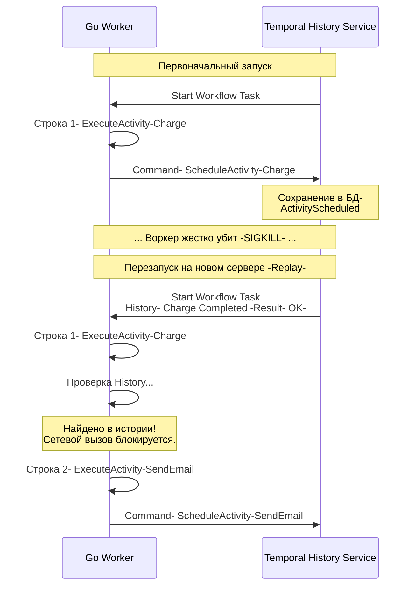

В прошлой статье [[2. Temporal. Архитектура и концепции]] мы разделили оркестратор на Control Plane (кластер Temporal) и Data Plane (наши Go-воркеры). Мы узнали, что Workflow не имеет права ходить в сеть напрямую, а должен делегировать эту работу Activity.

Теперь пришло время заглянуть под капот главной киллер-фичи современных оркестраторов — **Durable Execution (Надежное выполнение)**. Как именно Temporal добивается того, что наша Go-функция может выполняться месяцами, переживая десятки перезагрузок серверов, деплоев и сетевых сбоев, не теряя ни байта из своих локальных переменных?

## Event Sourcing вместо дампов памяти

Интуитивный подход к "заморозке" процесса — это сделать дамп его оперативной памяти (snapshot) и сохранить на диск, как это делает ОС при гибернации. 
Однако в распределенных системах этот подход не работает: дамп памяти слишком тяжелый, он жестко привязан к архитектуре процессора и версии бинарника. Вы не сможете сделать дамп на ARM-сервере и поднять его на x86, или обновить версию Go-компилятора.

Поэтому Temporal использует архитектурный паттерн **Event Sourcing (Порождение событий)**.

Вместо сохранения *состояния* (переменных в RAM), кластер Temporal сохраняет *историю действий*, которые привели к этому состоянию. База данных Temporal (Cassandra/PostgreSQL) работает как append-only лог (журнал).

### Механика Replay (Воспроизведение)

Когда ваш Go-воркер падает посреди выполнения Workflow (например, пришел OOM-killer), кластер понимает, что соединение с воркером разорвано. Кластер ждет, пока появится любой другой свободный воркер с таким же кодом, и отправляет ему задачу на выполнение, прикрепляя к ней **всю историю событий** этого Workflow.

Новый воркер начинает выполнять вашу функцию Workflow **с самой первой строчки**, с самого начала. Этот процесс называется **Replay**.

Алгоритм Replay внутри Go SDK:
1. Выполняется строчка кода.
2. Если строчка вызывает инфраструктурную команду (например, запуск Activity или запуск Таймера), SDK ставит выполнение на паузу и **заглядывает во входящую Историю (History)**.
3. Если в Истории записано, что эта Activity *уже была успешно выполнена* в прошлом, SDK **не делает реального сетевого вызова**. Он просто берет результат (JSON-ответ) из Истории, десериализует его в Go-переменную и мгновенно переходит к следующей строчке кода.
4. Если в Истории этой команды нет, значит Replay "догнал" реальное время. SDK отправляет команду в кластер Temporal (Control Plane) и блокирует горутину, ожидая результата.



## Mechanical Sympathy: Планировщик внутри Планировщика

Как это реализовано на уровне рантайма Go? Мы знаем, что Workflow должен блокироваться при ожидании Activity, но при этом воркер не должен тратить ресурсы (CPU и память), если ожидание длится 30 дней.

> [!info] Под капотом: Coroutine Scheduler
> Temporal Go SDK реализует собственный кооперативный планировщик поверх стандартных горутин Go. 
> Когда вы вызываете `workflow.Sleep(ctx, ...)` или `workflow.ExecuteActivity(...)`, под капотом вызывается функция `coroutine.Yield()`. 
> Ваш код "отдает" управление планировщику SDK. Планировщик собирает все команды, которые сгенерировал Workflow, пакует их в gRPC-сообщение и отправляет в кластер Temporal. 
> Самое важное: **горутина Workflow после этого завершается (уничтожается)**. В памяти вашего сервера не висит никаких ждущих горутин. Память освобождается.

Когда кластер получает результат Activity, он снова связывается с воркером, воркер выделяет *новую* горутину, и процесс Replay повторяется с нуля, чтобы восстановить стек вызовов.

## Жизненно важное правило: Строгий Детерминизм

Механизм Replay накладывает фундаментальное ограничение на разработчика. Чтобы "перемотка" истории работала, код Workflow должен быть **абсолютно детерминированным**. 
Если при первом запуске функция пошла по ветке `if A { ... }`, то при Replay (через месяц) она обязана снова пойти по ветке `if A { ... }`.

### Что произойдет, если нарушить правило?

Представим код новичка:

```go
func MyWorkflow(ctx workflow.Context) error {
    // ОШИБКА: Использование нативного времени
    if time.Now().Hour() < 12 {
        workflow.ExecuteActivity(ctx, MorningTask)
    } else {
        workflow.ExecuteActivity(ctx, EveningTask)
    }
    return nil
}
```

1. **Первый запуск (11:00 утра):** Код идет в первую ветку. Запускается `MorningTask`. В историю записывается: `ActivityScheduled: MorningTask`. Воркер падает.
2. **Replay (13:00 дня):** Код выполняется заново. `time.Now().Hour()` возвращает `13`. Код идет во *вторую* ветку и пытается выполнить `EveningTask`.
3. **Катастрофа:** SDK Temporal заглядывает в Историю и видит, что следующим шагом в прошлом была `MorningTask`, а сейчас код просит `EveningTask`. 
4. **Результат:** SDK выбрасывает критическую панику `NonDeterministicWorkflowError`. Workflow блокируется навсегда.

> [!warning] Ловушка / Gotcha: Скрытые источники недетерминизма
> Помимо очевидных `time.Now()` или `rand.Int()`, в Go есть коварные места:
> 1. **Итерация по `map`**: В Go обход `for k, v := range myMap` намеренно рандомизирован (hash seed меняется при старте процесса). Если внутри цикла вы запускаете Activity, порядок их запуска при Replay изменится, что приведет к `NonDeterministicWorkflowError`. Для сортировки итерируйтесь только по слайсам (slice).
> 2. **Нативные горутины**: Использование `go func()` внутри Workflow запрещено, так как планировщик Go не гарантирует порядок выполнения потоков. Используйте только `workflow.Go(ctx, func)`.

## Проблема эволюции кода: Versioning

Если код должен быть строго детерминированным и повторять исторические пути, возникает серьезная инженерная проблема: **Как выкатывать обновления бизнес-логики?**

Представьте, что у вас есть длительный Workflow "Ипотека", который работает 15 лет. Через 2 года бизнес-требования изменились: перед выдачей денег теперь нужно вызывать новую Activity `CheckCreditHistory`.

Если вы просто добавите `workflow.ExecuteActivity(ctx, CheckCreditHistory)` в код и задеплоите новую версию, все уже запущенные "старые" Workflow (тысячи инстансов) при следующем Replay упадут с ошибкой детерминизма (так как в их старой истории нет этого шага).

### Решение: workflow.GetVersion

Чтобы безопасно вносить изменения, Temporal предоставляет API версионирования. Вы явно описываете в коде развилки для старых и новых инстансов.

```go
func MortgageWorkflow(ctx workflow.Context) error {
    // ... предыдущие шаги ...

    // Запрашиваем версию. 
    // "CreditCheckFeature" - это ID нашего изменения.
    // Если Workflow стартовал ДО внедрения фичи, он получит версию DefaultVersion.
    // Если стартовал ПОСЛЕ, получит версию 1.
    v := workflow.GetVersion(ctx, "CreditCheckFeature", workflow.DefaultVersion, 1)

    if v == 1 {
        // Выполняем только для новых Workflow
        workflow.ExecuteActivity(ctx, CheckCreditHistory)
    }

    // ... следующие шаги (общие для всех) ...
    workflow.ExecuteActivity(ctx, IssueMoney)

    return nil
}
```

> [!tip] Собеседование
> **Вопрос:** Если я использую `workflow.GetVersion`, мой код со временем превратится в помойку из сотен `if v == 1`. Как с этим бороться?
> **Ответ:** Старые версии (ветки `DefaultVersion`) можно удалять из кода только тогда, когда в кластере Temporal **не останется ни одного активного (Open) Workflow**, который был запущен на старой версии. Встроенные метрики Temporal позволяют легко найти такие "зависшие" процессы. Когда их количество равно нулю, код можно почистить.

## Итог

1. **Durable Execution** достигается за счет паттерна **Event Sourcing** и механизма **Replay**.
2. Воркеры не держат стейт в RAM (Sleep не блокирует память ОС). Они перематывают историю с нуля при каждом возобновлении работы.
3. Код Workflow обязан быть **100% детерминированным**. Любые side-effects (походы в сеть, нативное время, рандом, итерации по мапам) запрещены.
4. Изменение бизнес-логики в долгоживущих процессах требует использования **Versioning API**, чтобы не сломать Replay для уже запущенных процессов.

Теперь мы понимаем "магию" оркестраторов изнутри. Мы видим, насколько это мощный, но жестко регламентированный инструмент. В какой момент нам стоит выбрать эту тяжелую артиллерию, а когда лучше обойтись простыми консьюмерами в RabbitMQ? Для ответа на этот архитектурный вопрос мы переходим к статье: [[4. Оркестрация vs хореография]].